Настройка работы пользователя в конфигурации
============================================

При начале работы с программой необходимо заполнить данные о фирме и
ввести начальные остатки. Для этих целей рекомендуется воспользоваться
**Помощником заполнения информации об организации** и **Помощником ввода
начальных остатков**, которые позволяют быстро произвести все настройки,
минимально необходимые для того, чтобы немедленно начать работу. Доступ
к ним имеется в разделе **Главное** по одноименным гиперссылкам.

|image001.png|

Для заполнения информации об организации необходимо открыть форму
**Помощника** **заполнения информации об организации** и в ней за
несколько шагов указать нужные сведения и создать организацию.

Заполнение остатков производится при помощи **Помощника ввода начальных
остатков**, позволяющего ввести остатки для основных разделов учета. Для
остатков товаров, расчетов с поставщиками и расчетов с покупателями
помимо ручного ввода возможна загрузка из электронной таблицы (например,
Microsoft Office Excel, OpenOffice Calc и др.).

В настоящей главе процесс первоначальной настройки системы будет
рассмотрен более подробно.

Перед началом работы с прикладным решением необходимо заполнить основные
справочники и настроить работу пользователей:

* определить список пользователей,

* назначить пользователям роли и выбрать интерфейс,

* установить значения реквизитов по умолчанию,

* составить перечень ответственных лиц.

Заполнение основных классификаторов, определение списка пользователей и
назначение им ролей выполняются в разделе **Настройки**.

Настройка учета
---------------

Раздел **Настройки** содержит настройки учета по разделам:

* **Предприятие**,

* **Продажи**,

* **Закупки**,

* **Сервис**,

* **Производство**,

* **Деньги**,

* **Зарплата**.

Раздел настроек «Предприятие»
~~~~~~~~~~~~~~~~~~~~~~~~~~~~~

В разделе настроек **Предприятие** содержатся настройки учета:

* по организациям,

* подразделениям,

* направлениям деятельности,

* ресурсам предприятия,

* прочие настройки.

|image003.png|

Организации
^^^^^^^^^^^

Возможность ведения учета по нескольким организациям, по компании
(организации) в целом определяется состоянием флажков по гиперссылке
**Настройка учета по организациям (компании)**:

* если в прикладном решении планируется вести учет сразу по нескольким
организациям, должен быть установлен флажок **Вести учет в
информационной базе по нескольким организациям**;

* если в прикладном решении планируется вести учет по компании
(объединению нескольких организаций, одна из которых будет выполнять
функции собственно компании), то необходимо установить флажок **Вести
учет по «Организации – компании»** и указать в поле выбора эту
организацию.

Перейти к карточке организации либо справочнику **Организации** можно по
гиперссылке **Справочник «Организации»**. Справочник предназначен для
описания формальной структуры предприятия, которое может состоять из
нескольких хозяйствующих субъектов, фактически принадлежащих одному и
тому же собственнику или группе собственников, действующих согласованно
в целях получения прибыли.

Организациями могут быть:

* юридические лица,

* физические лица.

В справочнике хранится статичная информация, идентифицирующая
организации, и дополнительные сведения, необходимые для ведения учета по
ним в единой информационной базе. Также в реквизитах справочника
хранятся статичные данные, характеризующие организацию с точки зрения
управленческого учета предприятия.

Справочник **Организации** позволяет вести неограниченный список
организаций.

|image005.png|

Ввод информации об организации производится в диалоговом окне.

|image007.png|

В поле **Краткое наименование** вводится краткое наименование
организации. С помощью переключателя определяется, является ли она
юридическим или физическим лицом. Выбор типа организации в дальнейшем
определяет состав тех реквизитов, которые необходимо для нее заполнить.

Для каждой организации определяется префикс документов (поле
**Префикс**), который будет использоваться при оформлении документов от
имени организации.

В поле **Полное наименование** указывается официальное наименование
организации, которое будет использоваться при печати документов,
оформленных от ее имени.

На закладке **Реквизиты** расположены реквизиты, предназначенные для
ввода классификационных кодов организации, производственный календарь,
расчетный счет, касса.

**Производственный календарь** входит в поставку программы и обновляется
по мере утверждения календаря и переносов праздников. При необходимости
можно ввести несколько производственных календарей. Рекомендуется ввести
производственный календарь в начале года на основании
общегосударственного календаря на весь год сразу. Это поможет избежать
ошибок в расчетах в течение года.

На основании производственного календаря производятся все расчеты в
программе и составляются графики работы подразделений, а также графики
работы сотрудников.

|image009.png|

Закладка **Адреса**, содержит поля для ввода юридического и фактического
адресов, а также произвольной контактной информации. Для организации
может быть указан, например, сотовый телефон директора, телефон отдела
снабжения, телефон охраны и т. д.

|image011.png|

На закладке **Настройка печати** имеется возможность выбрать из
присоединенных файлов логотип и факсимиле компании для использования их
в печатной форме документа **Счет на оплату**. Также логотип можно
использовать в печатной форме прайс-листа компании.

Расчетные счета организации
^^^^^^^^^^^^^^^^^^^^^^^^^^^

Информация о расчетных счетах организаций вводится в справочник
**Банковские счета**, подчиненный справочнику **Организации** и
доступный по гиперссылке из панели навигации справочника. В поле
**Банковский счет** на вкладке **Реквизиты** указывается банковский
счет, который будет использоваться для данной организации по умолчанию.
Для этого нужно нажать кнопку
|image013.png| и
выбрать действие **Показать все**. Появится диалоговое окно со списком
доступных банковских счетов, в который с помощью кнопки **Создать**
можно добавить информацию о новом банковском счете.

|image015.png|

В карточке банковского счета указывается его номер, вид (расчетный
(текущий), ссудный, депозитный или иной) и валюта. Вид счета выбирается
в соответствии с требованиями составления справок о расчетных счетах.

Реквизиты вкладки **Банк** заполняются с помощью справочника **Банки**.
Новый банк можно добавить в процессе заполнения данных счета.

При установке флажка **Платежи проводятся через корреспондентский счет,
открытый в другом банке (банке для расчетов)** становится доступной
группа реквизитов, где можно ввести информацию о корреспондирующем
банке.

На вкладке **Настройка печати** можно настроить параметры печати
платежных поручений.

На вкладке **Дополнительно** указываются дата открытия/закрытия
расчетного счета,  а также редактируются счета учета.

Ответственные лица
^^^^^^^^^^^^^^^^^^

Для организации можно определить перечень ответственных лиц для
автоматической подстановки в печатные формы документов. Для этой цели
служит регистр сведений **Ответственные лица**, подчиненный справочнику
**Организации**.

|image017.png|

Регистр содержит список сотрудников, назначенных ответственными лицами
организации. Для каждого сотрудника в поле **Период** указывается дата,
с которой он назначается ответственным лицом, организация, должность. Из
выпадающего списка выбирается также тип ответственного лица. Всего
предусмотрено четыре типа ответственных лиц:

* руководитель,

* главный бухгалтер,

* кассир,

* кладовщик.

Должности
^^^^^^^^^

Значение реквизита **Должность** регистра сведений **Ответственные
лица** является элементом справочника **Должности**. В этом справочнике
хранится список названий должностей, которые могут занимать сотрудники
компании.

|image019.png|

Сотрудники
^^^^^^^^^^

Значение реквизита **Сотрудник** регистра сведений **Ответственные
лица** является элементом справочника **Сотрудники**. Справочник
**Сотрудники** предназначен для хранения информации о сотрудниках
организации.

|image021.png|

В справочнике указываются сведения, связанные с трудовой деятельностью
физического лица.

|image023.png|

Список физических лиц, как являющихся сотрудниками компании, так и не
являющихся, хранится в справочнике **Физические лица**, и каждому
сотруднику соответствует определенное физическое лицо. Кроме того, для
сотрудника указывается тип занятости (основное место работы или
совместительство) и счета учета расчетов по заработной плате.

Для того чтобы зарегистрировать физическое лицо в качестве сотрудника
организации, оформляется документ **Прием на работу**. Впоследствии
доступ к этому документу можно получить, воспользовавшись гиперссылкой
**Сведения о сотрудниках** панели навигации карточки сотрудника.

Физические лица
^^^^^^^^^^^^^^^

Справочник **Физические лица** предназначен для хранения таких сведений
о сотрудниках и контрагентах, которые не связаны с исполнением ими
трудовых обязанностей: например, фамилии, имени, даты рождения и т. д.
Доступ к справочнику можно получить с помощью панели навигации в разделе
**Зарплата**.

|image025.png|

Элементы справочника можно объединять в произвольные группы и подгруппы;
количество уровней вложенности неограниченно. Предусмотрена возможность
разделения физических лиц по дополнительным признакам. На закладке
**Адреса** указываются контактные данные физического лица.

|image027.png|

Для каждого физического лица с помощью отдельной формы вводится
информация о документах, удостоверяющих личность.

Фамилию, имя и отчество физического лица также можно ввести с помощью
отдельной формы.

|image030.png|

Если для физического лица определены дополнительные реквизиты и/или
дополнительные сведения, то в форме появляется одноименная закладка
и/или кнопка для вызова списка дополнительных сведений. При заполнении
карточки физического лица можно помимо общих данных указать также
значения этих реквизитов и сведений.

Состав дополнительных реквизитов/дополнительных сведений и их возможные
значения определяются с помощью справочников **Дополнительные
реквизиты**, **Дополнительные сведения** при установленном флажке
**Дополнительные реквизиты и сведения** в общих настройках раздела
**Настройки**.

Подразделения
^^^^^^^^^^^^^

Если необходимо вести учет по нескольким подразделениям, то нужно
включить опцию **Учет по подразделениям** путем установки флажка.
Включение этой опции также добавляет возможность указания подразделения
в документах.

Перейти к справочнику структурных единиц для просмотра и редактирования
списка подразделений можно с помощью гиперссылки **Справочник
«Структурные единицы»**. Для каждой организации эти данные вводятся
отдельно.

|image036.png|

На вкладке **Общая информация** для каждой организационно-структурной
единицы указывается ее наименование и тип подразделения.

|image038.png|

На вкладке **Адреса** можно указать фактический адрес подразделения и
телефон.

Из формы организационно-структурной единицы по гиперссылке **Просмотр и
редактирование параметров автоперемещения запасов** вызывается
дополнительный диалог ввода и изменения параметров перемещения запасов
для подстановки в документы учета запасов по умолчанию.

|image040.png|

Направления деятельности
^^^^^^^^^^^^^^^^^^^^^^^^

Если в прикладном решении планируется ведение учета по нескольким
направлениям деятельности, необходимо установить флажок **Учет по
направлениям деятельности**.

Информация о направлениях деятельности компании хранится в справочнике,
переход к которому выполняется по гиперссылке **Справочник «Направления
деятельности»**.

|image042.png|

Элементы справочника используются в качестве аналитик учета доходов и
расходов, финансового результата.

Для направления деятельности необходимо указать счета учета, на которых
будет отражаться выручка и себестоимость продаж, а также счет прибылей
(убытков).

Ресурсы предприятия
^^^^^^^^^^^^^^^^^^^

Справочник **Ресурсы предприятия** предназначен для хранения информации
о ресурсах предприятия, используемых для выполнения заказов-нарядов и
заказов на производство. Справочник можно открыть из формы настройки
параметров учета **Предприятие** раздела **Настройки** с помощью
гиперссылки **Справочник «Ресурсы предприятия»**.

|image046.png|

Прочее
^^^^^^

В разделе **Прочее** выполняются дополнительные настройки по ведению
учета организации:

* если в прикладном решении планируется дополнительно к методу
начисления (по отгрузке) вести учет доходов и расходов кассовым методом
(по оплате), должен быть установлен флажок **Кассовый метод учета
доходов и расходов**;

* если в прикладном решении планируется регистрировать бюджеты
предприятия, должен быть установлен флажок **Использовать
бюджетирование**;

* если в печатные формы необходимо добавлять артикул номенклатуры,
должен быть установлен флажок **Включать артикул номенклатуры в
содержание ПФ**.

* если в прикладном решении планируется вести учет внеоборотных активов
и рассчитывать ежемесячную амортизацию, должен быть установлен флажок
**Использовать учет имущества**.

Раздел настроек «Продажи»
~~~~~~~~~~~~~~~~~~~~~~~~~

Раздел предназначен для настройки параметров продаж и установки настроек
для ведения учета розничных продаж и комиссионной торговли.

В разделе задается максимальный срок отсрочки платежа покупателя,
используемый для подстановки в соответствующий реквизит договора с
покупателем. С помощью флажков разрешается использование скидок и
наценок, прием и передача товара на комиссию, хранение информации о
проектах и объединение заказов покупателей в проекты.

|image048.png|

Розница
^^^^^^^

С помощью установки соответствующих флажков в прикладном решении можно
включить возможность ведения учета розничных продаж, архивирования и
удаления непробитых чеков ККМ при закрытии кассовой смены, контроля
остатков товаров при пробитии чеков ККМ.

Кассы ККМ
'''''''''

Справочник **Кассы ККМ** предназначен для хранения информации о кассах
ККМ организации. Справочник можно открыть из формы настройки параметров
учета с помощью гиперссылки **Справочник «Кассы ККМ»**. Справочник
становится доступен при установке флажка **Учет розничных продаж**.

|image050.png|

Эквайринговые терминалы
'''''''''''''''''''''''

Справочник **Эквайринговые терминалы** предназначен для хранения
информации об эквайринговых терминалах организации. Справочник можно
открыть из формы настройки параметров учета с помощью гиперссылки
**Справочник «Эквайринговые терминалы»**. Справочник становится доступен
при установке флажка **Учет розничных продаж**.

Заказы покупателей
^^^^^^^^^^^^^^^^^^

В программе возможен учет состояний заказов покупателей по обычной и
упрощенной схеме (рекомендуемый вариант). При использовании упрощенной
схемы возможны три состояния заказа покупателя: **В работе**,
**Выполнен** и **Отменен**, изменение которых производится командой в
заказе. Обычная схема используется, когда трех состояний недостаточно. В
этом случае нужное состояние выбирается вручную в заказе.

Для учета состояний заказов покупателей по упрощенной схеме необходимо,
не устанавливая флажок **Несколько состояний заказов покупателей**,
заполнить поля **Состояние в работе** и **Состояние выполнен**. По
умолчанию поля заполнены рекомендуемыми значениями.

При установленном флажке **Несколько состояний заказов покупателей** по
гиперссылке **Справочник «Состояния заказов покупателей»** можно открыть
справочник и заполнить информацию о состояниях заказов покупателей,
которые планируется использовать на предприятии.

|image052.png|

Раздел настроек «Закупки»
~~~~~~~~~~~~~~~~~~~~~~~~~

Раздел предназначен для настройки параметров учета закупок и запасов на
складах предприятия и в производстве.

С помощью установки флажков можно включить следующие дополнительные
возможности:

* учет по нескольким складам,

* учет в различных единицах измерения,

* учет по характеристикам,

* учет по партиям,

* учет по ячейкам,

* использование ордерного склада,

* использование резервирования запасов на складах и в ожидаемых
поступлениях,

* использование нескольких состояний заказов поставщикам,

* прием и передача запасов на ответственное хранение,

* передача сырья и материалов в переработку и т. д.

В разделе задается срок оплаты поставщику по умолчанию, используемый для
подстановки в соответствующий реквизит договора с поставщиком.

|image054.png|

Склады
^^^^^^

К справочнику, содержащему сведения об организационно-структурных
единицах компании, имеется доступ из формы настройки параметров учета по
гиперссылке **Справочник «Структурные единицы»**.

|image056.png|

На вкладке **Общая информация** для каждой организационно-структурной
единицы указывается тип, розничный вид цен, материально ответственное
лицо.

|image058.png|

На вкладке **Адреса** можно указать адрес склада и его телефон.

Из формы организационно-структурной единицы по гиперссылке **Просмотр и
редактирование параметров автоперемещения запасов** вызывается
дополнительный диалог ввода и изменения параметров перемещения запасов
для подстановки в документы учета запасов по умолчанию.

|image060.png|

Каждой структурной единице можно назначить произвольное количество ячеек
склада, перейдя к форме подчиненного справочника **Ячейки склада**. Для
каждой ячейки задается наименование и разрешается неограниченное
количество уровней вложенности.

|image062.png|

Состояния заказов поставщикам
^^^^^^^^^^^^^^^^^^^^^^^^^^^^^

В программе возможен учет состояний заказов поставщикам по обычной и
упрощенной схеме (рекомендуемый вариант). При использовании упрощенной
схемы возможны три состояния заказа поставщику: **В работе**,
**Выполнен** и **Отменен**, изменение которых производится командой в
заказе. Обычная схема используется, когда трех состояний недостаточно. В
этом случае нужное состояние выбирается вручную в заказе.

Для учета состояний заказов поставщикам по упрощенной схеме необходимо,
не устанавливая флажок **Несколько состояний заказов поставщикам**,
заполнить поля **Состояние в работе** и **Состояние выполнен**. По
умолчанию поля заполнены рекомендуемыми значениями.

При установленном флажке **Использовать несколько состояний заказов
поставщикам** по гиперссылке **Справочник «Состояние заказов
поставщикам»** можно открыть одноименный справочник и заполнить
информацию о состояниях заказов поставщикам, которые планируется
использовать на предприятии.

|image064.png|

Раздел настроек «Сервис»
~~~~~~~~~~~~~~~~~~~~~~~~

В разделе задаются настройки учета состояний заказов-нарядов.

|image066.png|

В программе возможен учет состояний заказов-нарядов по обычной и
упрощенной схеме (рекомендуемый вариант). При использовании упрощенной
схемы возможны три состояния заказа-наряда: **В работе**, **Выполнен** и
**Отменен**, изменение которых производится командой в заказе. Обычная
схема используется, когда трех состояний недостаточно. В этом случае
нужное состояние выбирается вручную в заказе.

Для учета состояний заказов-нарядов по упрощенной схеме необходимо, не
устанавливая флажок **Несколько состояний заказов-нарядов**, заполнить
поля **Состояние в работе** и **Состояние выполнен**. По умолчанию поля
заполнены рекомендуемыми значениями.

При установленном флажке **Несколько состояний заказов-нарядов** по
гиперссылке **Справочник «Состояние заказов-нарядов»** можно открыть
одноименный справочник и заполнить информацию о состояниях
заказов-нарядов, которые планируется использовать на предприятии.

Раздел настроек «Производство»
~~~~~~~~~~~~~~~~~~~~~~~~~~~~~~

Раздел содержит настройки учета производства продукции.

С помощью установки флажков можно включить следующие дополнительные
возможности:

* использование нескольких состояний заказов на производство,

* использование технологических операций в спецификациях и сдельных
нарядах,

* использование переработки давальческого сырья.

|image068.png|

Состояния заказов на производство
^^^^^^^^^^^^^^^^^^^^^^^^^^^^^^^^^

В программе возможен учет состояний заказов на производство по обычной и
упрощенной схеме (рекомендуемый вариант). При использовании упрощенной
схемы возможны три состояния заказа на производство: **В работе**,
**Выполнен** и **Отменен**, изменение которых производится командой в
заказе. Обычная схема используется, когда трех состояний недостаточно. В
этом случае нужное состояние выбирается вручную в заказе.

Для учета состояний заказов на производство по упрощенной схеме
необходимо, не устанавливая флажок **Несколько состояний заказов на
производство**, заполнить поля **Состояние в работе** и **Состояние
выполнен**. По умолчанию поля заполнены рекомендуемыми значениями.

При установленном флажке **Несколько состояний заказов на производство**
по гиперссылке **Справочник «Состояния заказов на производство»** можно
открыть справочник и заполнить информацию о состояниях заказов на
производство, которые планируется использовать на предприятии.

|image070.png|

Раздел настроек «Деньги»
~~~~~~~~~~~~~~~~~~~~~~~~

Раздел содержит настройки учета денежных средств. С помощью установки
соответствующих флажков можно включить возможность ведения
многовалютного учета, использования платежного календаря,
автоматического зачета авансов и долгов при проведении документов.

|image072.png|

Если в прикладном решении планируется ведение учета операций в валюте,
отличной от национальной, должен быть установлен флажок **Вести учет
операций в валюте** и выбрана валюта учета.

В разделе настроек **Деньги** содержатся гиперссылки на следующие
справочники:

* **Валюты**,

* **Кассы**.

Валюты
^^^^^^

Справочник **Валюты** предназначен для хранения информации о валютах,
используемых на предприятии. Более подробно работа со справочником
описана в разделе «Валюты» на стр. 239.

Кассы
^^^^^

В прикладном решении предусмотрена возможность учета наличных денег в
нескольких кассах предприятия.

Справочник **Кассы** используется для идентификации мест фактического
хранения и движения денежных средств (кассовые помещения, сейфы
руководителей подразделений).

|image074.png|

Одна касса может использоваться в разных организациях, и в одной кассе
могут храниться денежные средства в разных валютах.

Подсказка

Для автоматической подстановки валюты в кассовые документы у кассы можно
указать валюту по умолчанию.

Ввод информации о новой кассе производится в диалоговом окне. Для каждой
кассы указывается ее наименование (например, **Касса директора**,
**Основная касса**), валюта хранения денежных средств в данной кассе по
умолчанию и счет учета денежных средств. Валюта выбирается из
выпадающего списка, состав которого определяется содержимым справочника
**Валюты** (см. стр. **Error! Bookmark not defined.**).

|image076.png|

При оформлении документов, сопровождающих поступление и выдачу наличных
денег (приходного и расходного кассового ордера), из справочника касс
выбирается та касса, в которую поступили или из которой были выданы
наличные деньги.

Раздел настроек «Зарплата»
~~~~~~~~~~~~~~~~~~~~~~~~~~

Раздел содержит настройки кадрового учета и расчета заработной платы. С
помощью установки соответствующих флажков в прикладном решении можно
включить возможность ведения учета внутренних совместителей, штатного
расписания, отражения налога на доходы.

|image078.png|

.. _должности-1:

Должности
^^^^^^^^^

Справочник **Должности** предназначен для хранения списка должностей,
которые могут занимать сотрудники организации. Справочник доступен по
гиперссылке **Должности** в разделе **Зарплата**, группа **См. также**.

|image080.png|

Виды рабочего времени
^^^^^^^^^^^^^^^^^^^^^

Справочник **Виды рабочего времени** предназначен для обозначения в
табеле вида использованного времени. Справочник доступен по гиперссылке
**Виды рабочего времени** в разделе **Зарплата**, группа **См. также**.

|image082.png|

Виды документов физических лиц
^^^^^^^^^^^^^^^^^^^^^^^^^^^^^^

Справочник **Виды документов физических лиц** предназначен для хранения
списка видов документов, удостоверяющих личность. Справочник доступен по
гиперссылке **Виды документов физических лиц** в разделе **Зарплата**,
группа **Справочники**.

|image084.png|

Глава 3

.. _продажи-1:

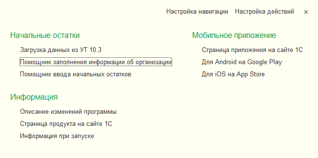
.. |image003.png| image:: media/image2.png
   :width: 3.9375in
   :height: 4.17708in
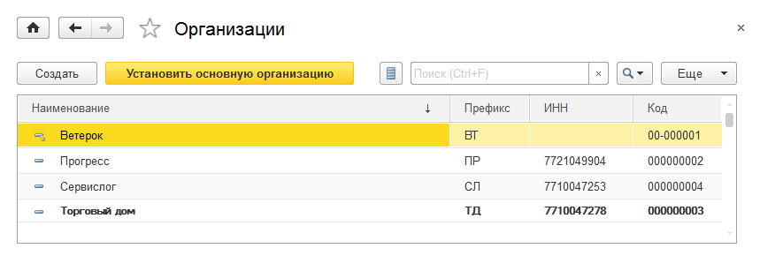
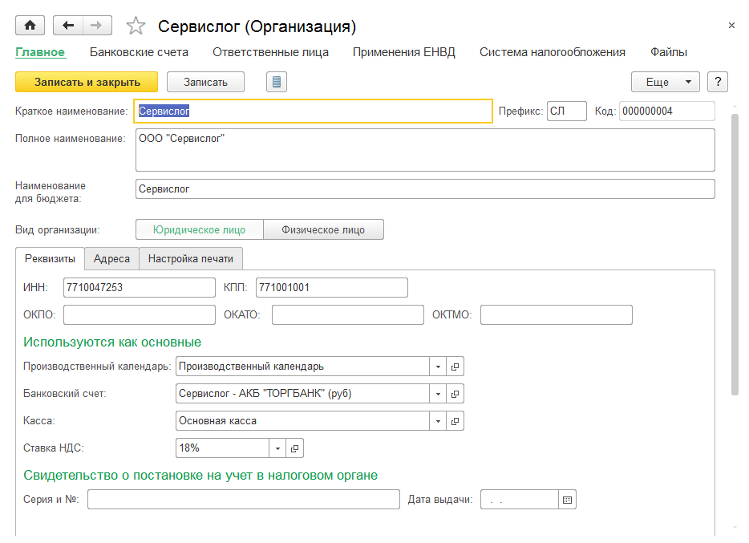
.. |image009.png| image:: media/image5.png
   :width: 3.9375in
   :height: 3.85417in
.. |image011.png| image:: media/image6.png
   :width: 3.9375in
   :height: 2.9375in
.. |image013.png| image:: media/image7.png
   :width: 0.125in
.. |image015.png| image:: media/image8.png
.. |image015.png| image:: media/image8.png
   :width: 3.9375in
   :height: 2.32292in
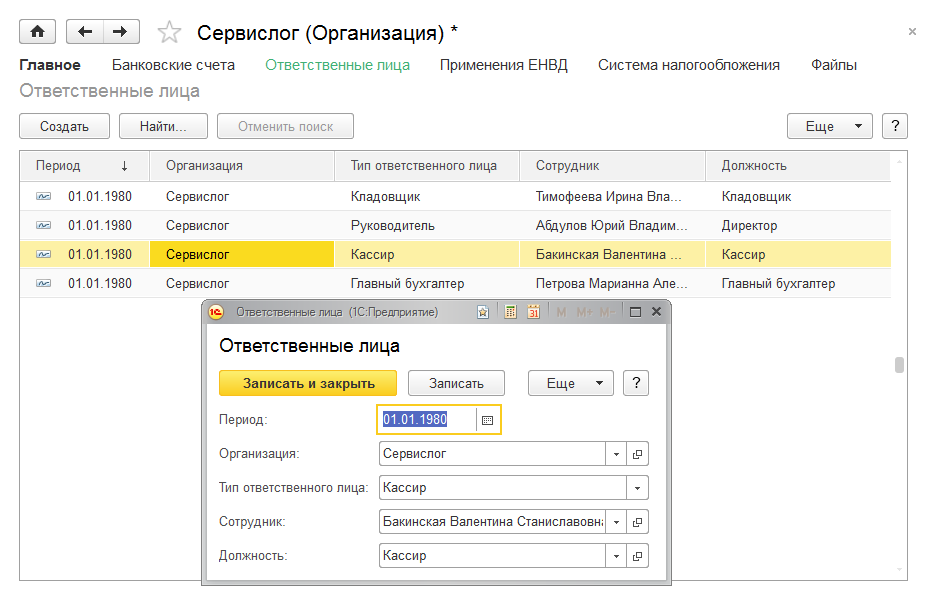
.. |image019.png| image:: media/image10.png
   :width: 3.9375in
   :height: 3.30208in
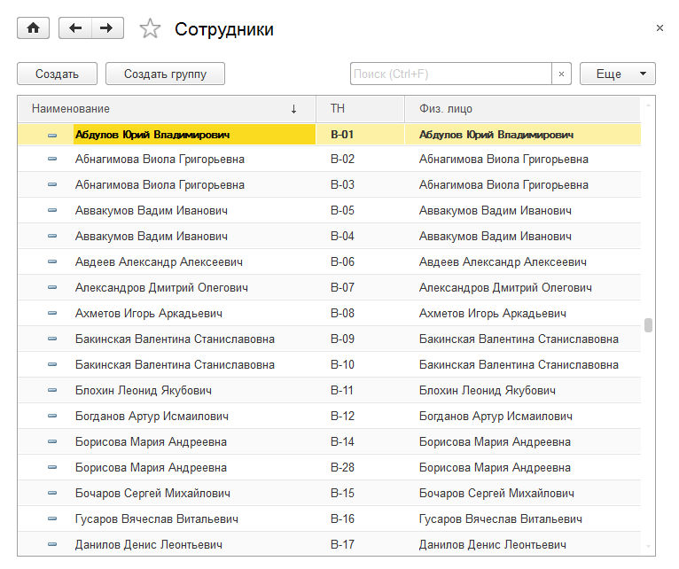
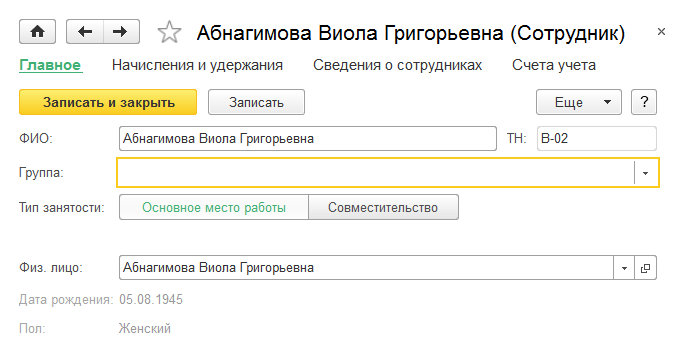
.. |image025.png| image:: media/image13.png
   :width: 3.9375in
   :height: 3.20833in
.. |image027.png| image:: media/image14.png
   :width: 3.9375in
   :height: 3.86458in
.. |image030.png| image:: media/image15.png
   :width: 3.9375in
   :height: 3.01042in
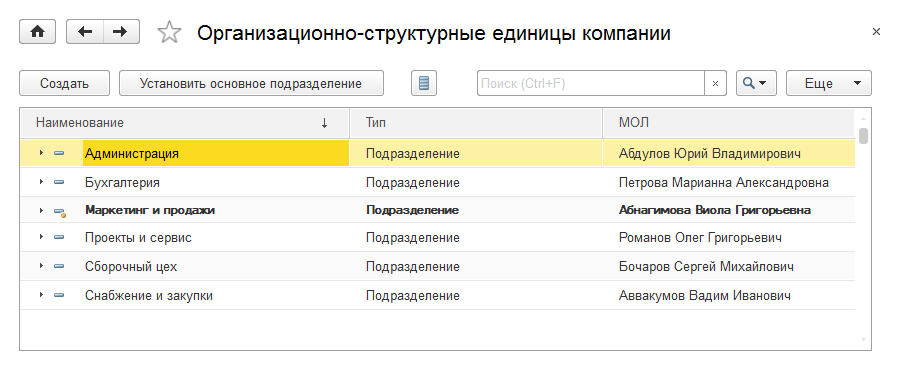
.. |image038.png| image:: media/image17.png
   :width: 3.9375in
   :height: 1.64583in
.. |image040.png| image:: media/image18.png
   :width: 3.9375in
   :height: 2.53125in
.. |image042.png| image:: media/image19.png
   :width: 3.9375in
   :height: 2.66667in
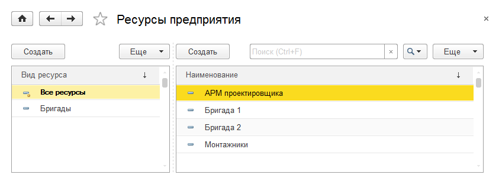
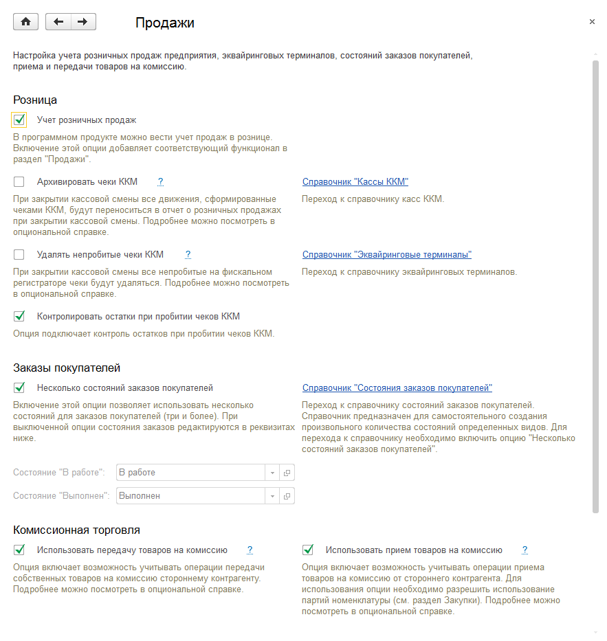
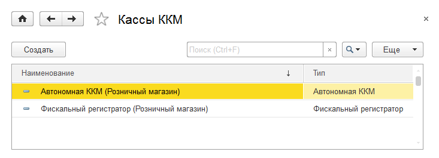
.. |image052.png| image:: media/image23.png
   :width: 3.9375in
   :height: 1.25in
.. |image054.png| image:: media/image24.png
   :width: 3.9375in
   :height: 4.41667in
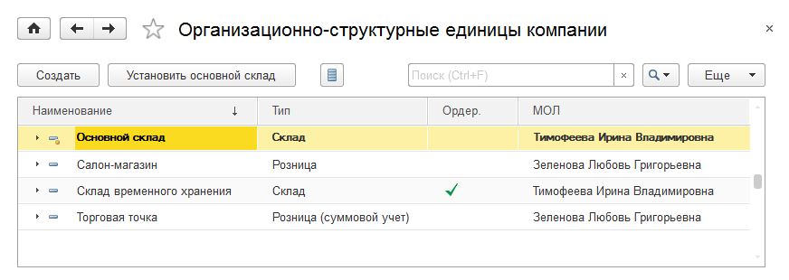
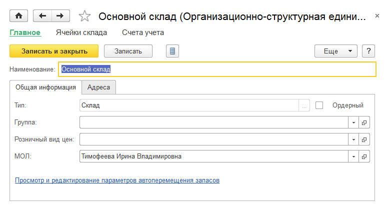
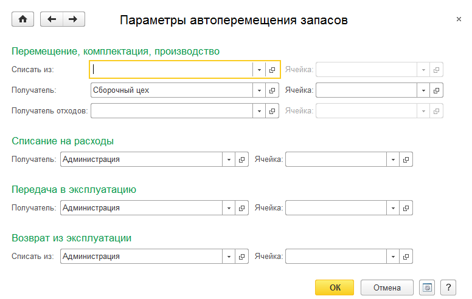
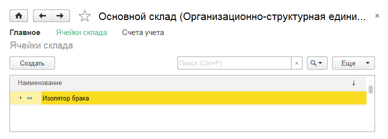
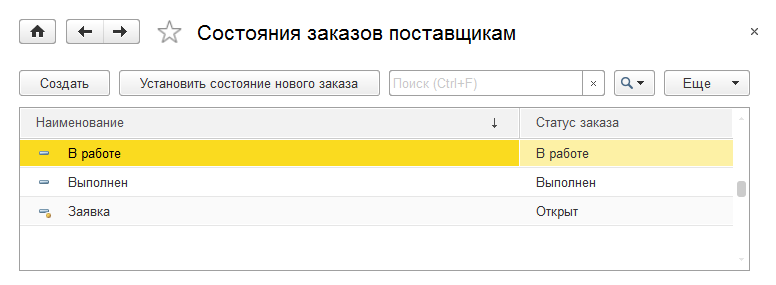
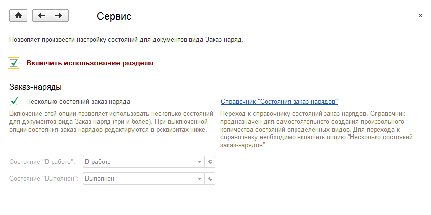
.. |image068.png| image:: media/image31.png
   :width: 3.9375in
   :height: 2.71875in
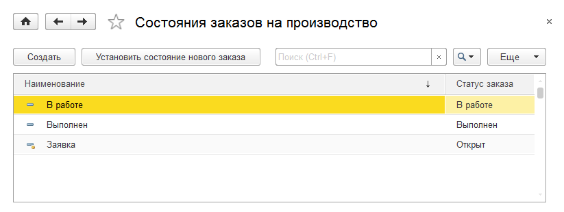
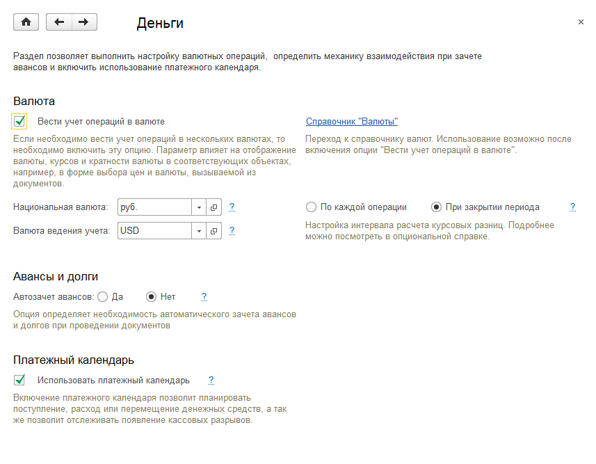
.. |image074.png| image:: media/image34.png
   :width: 3.9375in
   :height: 1.39583in
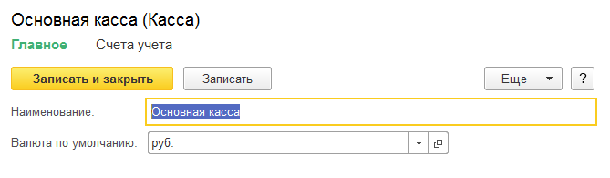
.. |image078.png| image:: media/image36.png
   :width: 3.9375in
   :height: 2.58333in
.. |image080.png| image:: media/image37.png
   :width: 3.66667in
   :height: 3.75in
.. |image082.png| image:: media/image38.png
   :width: 3.9375in
   :height: 3.83333in
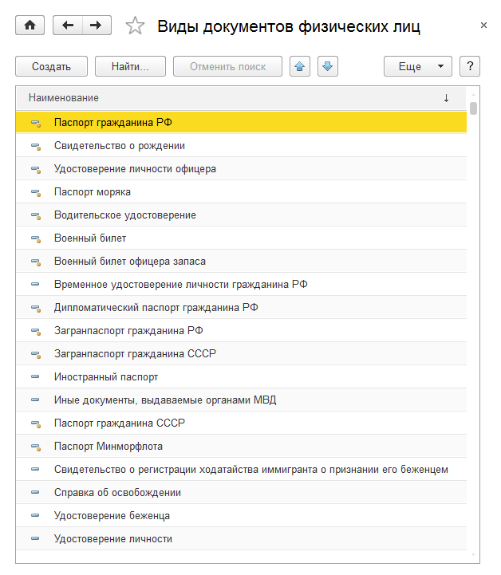
