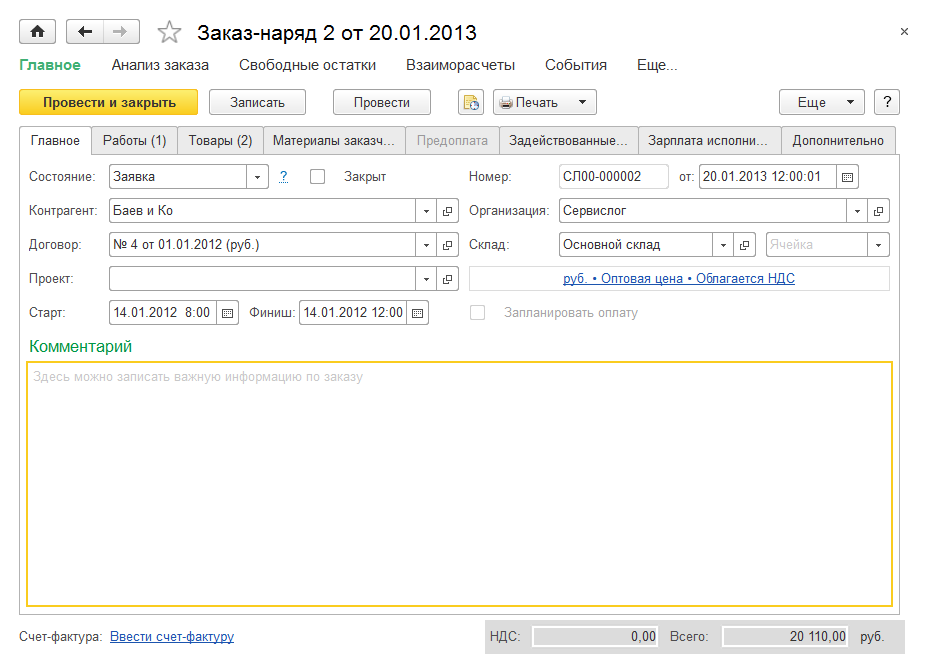
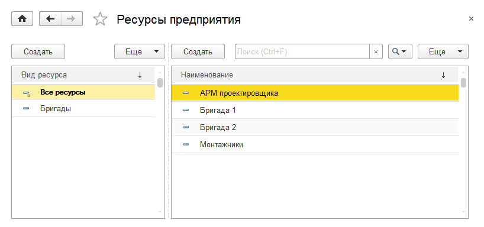
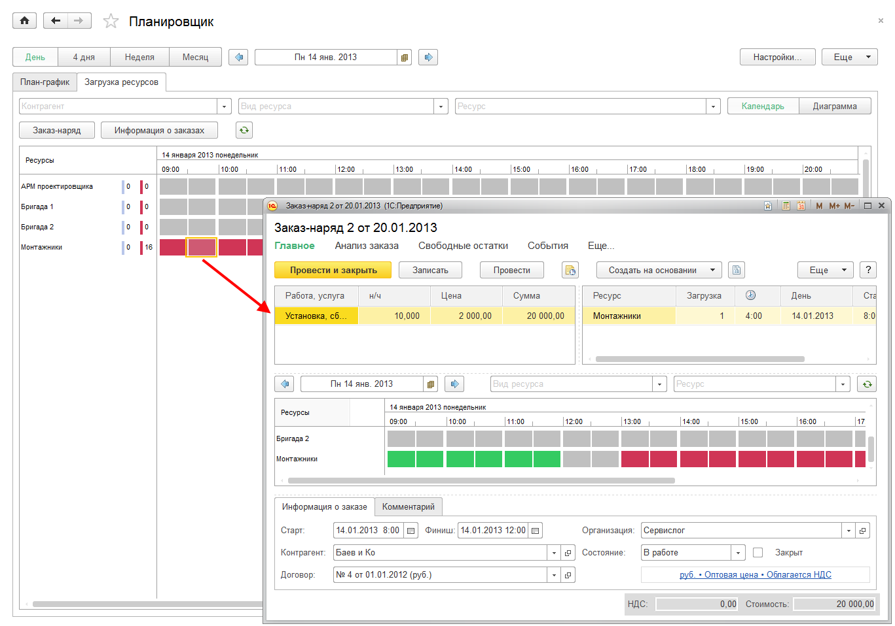
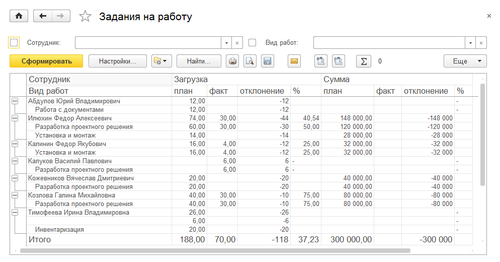
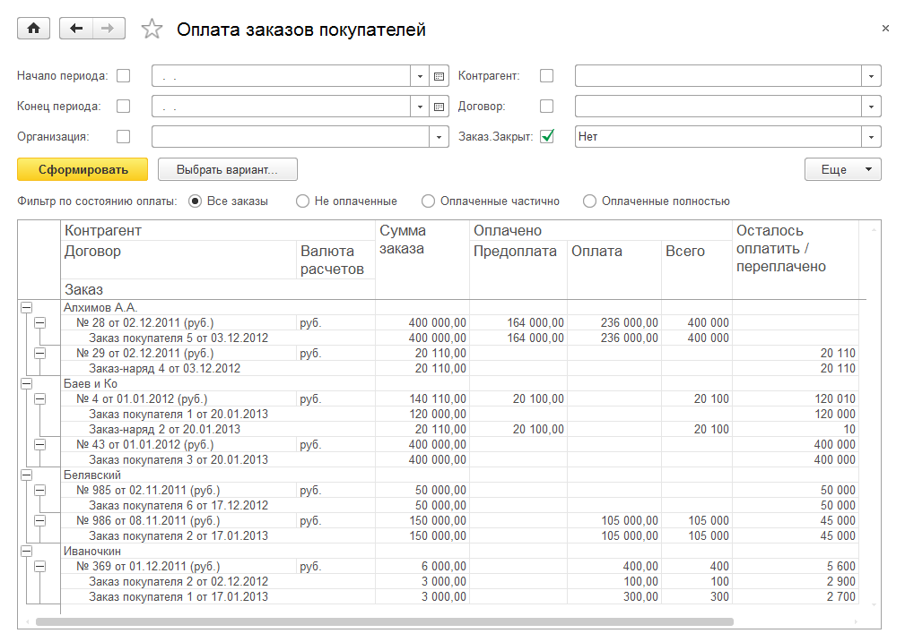
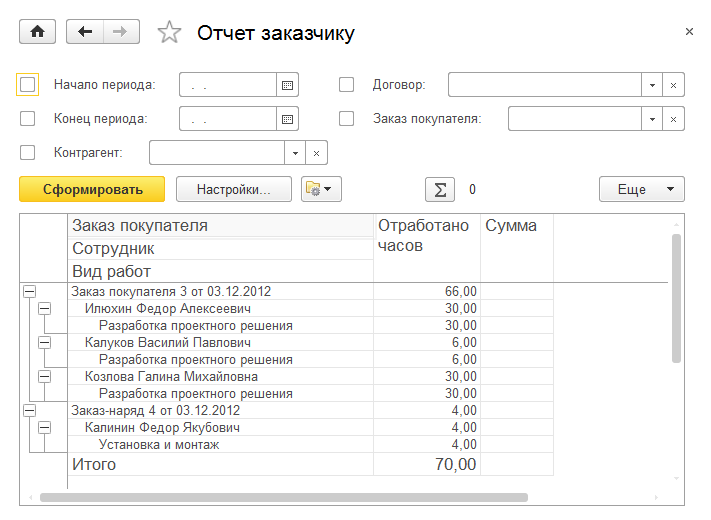

Сервис
======

В прикладном решении «1C:SimpleERP» автоматизировано отражение
хозяйственных операций, связанных с оказанием сервисных услуг. Для
работы с подсистемой **Сервис** необходимо перейти в соответствующий
раздел.

Планирование работ
------------------

Заказ-наряд
~~~~~~~~~~~

**Заказ-наряд** – это документ, сочетающий в себе функции заказа
покупателя, счета на оплату, акта выполненных работ и расходной
накладной для сферы сервисных услуг со списанием на него прямых
материальных, трудовых затрат.

С помощью заказов-нарядов рекомендуется отражать операции планирования и
учета сервисных работ и услуг, таких как парикмахерские услуги, ремонт
обуви, ремонт одежды, автомойка, и других работ и услуг, для которых
характерен короткий производственный цикл.

|image393.png|

Список заказов-нарядов содержит информацию о выполнении заказа-наряда,
состоянии заказа-наряда, проценте оплаты по заказу-наряду.

Информация о выполнении заказа представлена в виде отображения строк
заказов.

Строка **серого** цвета означает, что заказ является заявкой, то есть
еще не принят в работу. Соответственно, строка **зеленого** цвета
означает, что заказ выполнен, **синего** – заказ находится в работе,
**зачеркнутая** строка – заказ закрыт.

Степень отгрузки и оплаты обозначается с помощью круговых диаграмм.

С помощью заказа-наряда работы (услуги) и заказываются, и реализуются.
При этом на них могут быть отнесены материальные и трудовые (только по
работам) затраты. Вместе с работами (услугами) с помощью заказа-наряда
могут быть реализованы сопутствующие товары – запчасти, расходные
материалы. В заказе-наряде можно указать и материалы заказчика,
использованные при выполнении работ (для информации). Также в документе
можно указать ресурсы предприятия, задействованные для выполнения
данного заказа. Задействованные ресурсы указываются на соответствующей
закладке. Планирование ресурсов является опциональным и настраивается в
настройках учета **Предприятие** раздела **Настройки**.

|image395.png|

Учет материальных и трудовых затрат возможен только для номенклатурных
позиций с типом **Работа**. Для номенклатурных позиций с типом
**Услуга** учет производственных затрат не осуществляется.

Также в заказе-наряде можно отразить перечень материальных ценностей,
принятых от заказчика для выполнения заказа. Указанные сведения носят
информационный характер и не отражаются в регистрах по учету запасов.

|image397.png|

Списание материальных затрат на заказ-наряд и начисление зарплаты
осуществляются для выполненного и закрытого наряда на дату финиша.
Планирование потребности в материалах и товарах осуществляется на дату
старта заказа. Планируемые сроки начала и окончания работ по
заказу-наряду указываются на вкладке **Главное**.

Заказ-наряд может считаться фактически выполненным только после того,
как для него будет установлено состояние со статусом **Выполнен**. При
этом на дату выполнения будут совершены фактические движения – списание
со склада, реализация товаров и т. д. Для закрытия заказа-наряда не
требуется оформления расходных накладных и актов выполненных работ,
которыми закрывается обычный заказ покупателя.

.. _ресурсы-предприятия-1:

Ресурсы предприятия
~~~~~~~~~~~~~~~~~~~

Справочник **Ресурсы предприятия** предназначен для хранения информации
о ресурсах предприятия, используемых для выполнения заказов-нарядов и
заказов на производство.

Справочник доступен по одноименной гиперссылке на панелях управления
разделов **Сервис** и **Производство** в том случае, если в настройках
**Предприятие** раздела **Настройки** установлен флажок **Планировать
загрузку ресурсов предприятия**.

|image399.png|

Ресурс может принадлежать к одному или нескольким видам ресурсов. Каждый
ресурс всегда принадлежит специальному виду ресурсов – **Все ресурсы**.

|image401.png|

Ресурс может быть связан с сотрудником, бригадой или ни с чем не связан.

Для ресурса задается *мощность* – значение доступности ресурса на
интервале времени. По умолчанию мощность равна 1. Это значит, что если
запланировать работу этого ресурса на определенном интервале, то он
будет полностью занят на данном интервале.

Для ресурса задается график работы. График работы может быть назначен
ресурсу из имеющихся **Графиков работы** (см. стр. **Error! Bookmark not
defined.**). В случае наличия отклонений от графика работы отклонения
вводятся в карточке ресурса.

План-график работ, услуг
~~~~~~~~~~~~~~~~~~~~~~~~

**План-график** формируется по заказам-нарядам и позволяет
проанализировать календарный план выполнения работ и оказания услуг на
заданный период (день, неделю, месяц).

|image403.png|

Параметры отображения устанавливаются в форме настроек планировщика,
вызываемой по нажатию кнопки **Настройки** в правой части командной
панели.

Загрузка ресурсов предприятия
~~~~~~~~~~~~~~~~~~~~~~~~~~~~~

В режиме **Загрузка ресурсов** пользователь может оперативно ответить на
вопрос о занятости конкретного ресурса и запланировать его загрузку. Для
этого нужно вызвать специальную форму документа **Заказ-наряд**, дважды
щелкнув мышью в календаре на строке с нужным временем в поле выбранного
ресурса.

|image405.png|

Планирование работ с использованием заказов
~~~~~~~~~~~~~~~~~~~~~~~~~~~~~~~~~~~~~~~~~~~

Можно запланировать выполнение работ, оказание услуг на закладке
**План-график** или **Загрузка ресурсов** с помощью документов
**Заказ-наряд**.

Нужно установить статус заказа **В работе** и на закладке **Главное**
указать плановые даты начала и окончания работ в полях **Старт** и
**Финиш**.

|image407.png|

При установке флажка **Запланировать оплату** в форме документа
появляется закладка **Платежный календарь**, где можно запланировать
оплату по заказу (указать планируемые даты оплат, процент, который
должен быть выплачен не позднее указанной даты, и т. д.).

|image409.png|

После выполнения работ нужно установить заказу статус **Выполнен**,
зачесть предоплату и ввести на основании заказа-наряда поступление в
кассу.

Отчеты раздела «Сервис»
-----------------------

Все отчеты раздела **Сервис** расположены на отдельной панели,
вызываемой командой **Отчеты по сервису**.

|image411.png|

Задания на работу
~~~~~~~~~~~~~~~~~

По умолчанию отчет не отображается. Доступ к нему имеется из списка
**Отчеты**, который открывается по кнопке **Еще** – команда **Все
отчеты**.

Отчет предназначен для проведения план-фактного анализа по видам работ.
Для внешних заданий в отчете отображаются заказы контрагентов.

|image413.png|

.. _выполнение-заказов-покупателей-1:

Выполнение заказов покупателей
~~~~~~~~~~~~~~~~~~~~~~~~~~~~~~

Отчет позволяет проанализировать состав и ход выполнения `заказов
покупателей <v8mnghelp://help/topics/v8config/v8cfgHelp/mdobject/id9133d1ee-54e6-4556-8f42-a94010c0b021/038b5c85-fb1c-4082-9c4c-e69f8928bf3a>`__.

|image415.png|

.. _оплата-заказов-1:

Оплата заказов
~~~~~~~~~~~~~~

Отчет позволяет проанализировать выполнение `заказов
покупателей <v8mnghelp://help/topics/v8config/v8cfgHelp/mdobject/id9133d1ee-54e6-4556-8f42-a94010c0b021/038b5c85-fb1c-4082-9c4c-e69f8928bf3a>`__
в части оплаты.

|image417.png|

Отчет заказчику
~~~~~~~~~~~~~~~

Отчет отображает информацию о работах, выполненных под заказ-наряд или
под заказ покупателя.

|image419.png|

Глава 6

.. _производство-1:

.. |image393.png| image:: media/image214.png
   :width: 3.9375in
   :height: 2.07292in

.. |image397.png| image:: media/image216.png
   :width: 3.9375in
   :height: 2.57292in

.. |image401.png| image:: media/image218.png
   :width: 3.9375in
   :height: 2.91667in
.. |image403.png| image:: media/image219.png
   :width: 3.94792in
   :height: 1.58333in

.. |image411.png| image:: media/image223.png
   :width: 3.9375in
   :height: 2.82292in

.. |image415.png| image:: media/image225.png
   :width: 3.9375in
   :height: 3.34375in

