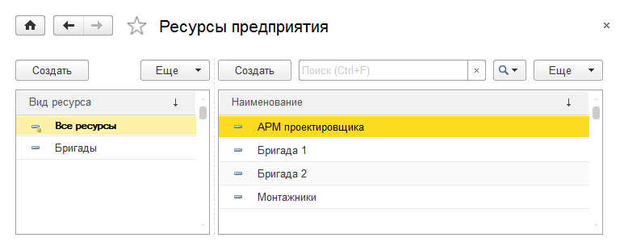
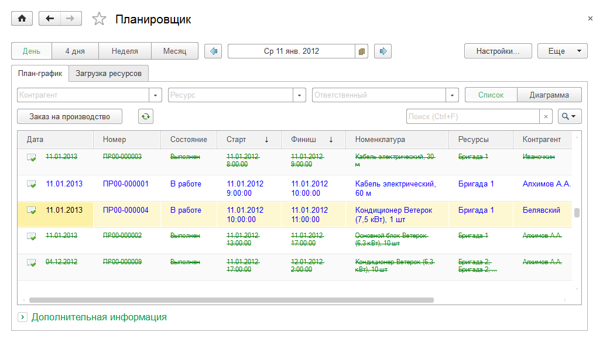
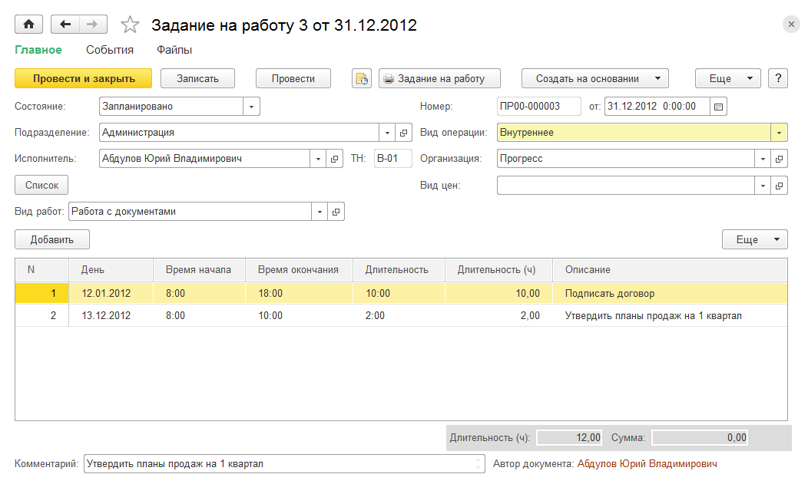
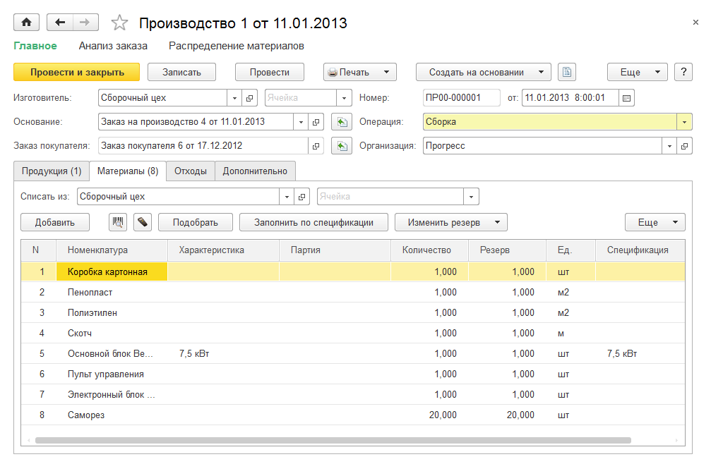
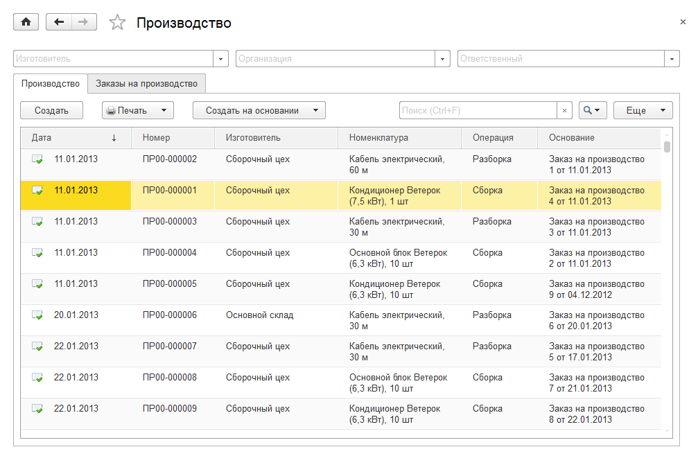
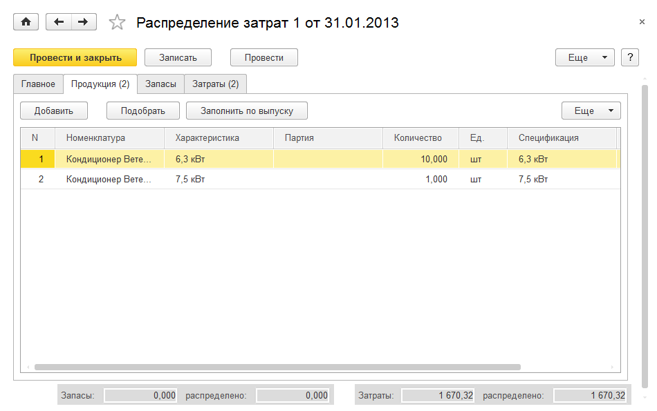
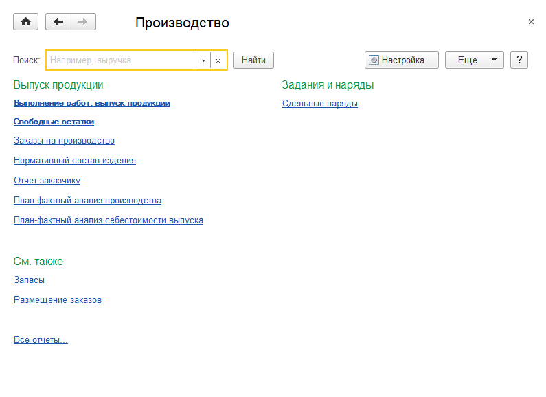
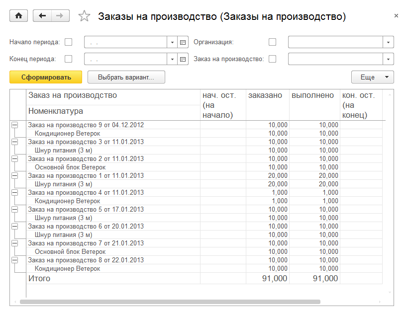

Производство
============

Раздел **Производство** предназначен для планирования и учета выполнения
работ, оказания услуг, производства. Общий журнал документов
производства доступен с помощью гиперссылок панели навигации
**Документы** **по производству**.

Если на панели навигации раздела **Производство** не имеется гиперссылки
**Документы по производству**, ее необходимо добавить. Для этого нужно
воспользоваться гиперссылкой **Настройка навигации**. Появится форма
**Настройка панели навигации**. Ссылку **Документы на производство**
нужно переместить из левой части формы (объекты, которые можно добавить
на панель навигации) в правую часть (объекты, которые отражены на панели
навигации) с помощью кнопки **Добавить >**.

|image421.png|

Состав продукции и технология ее выпуска
----------------------------------------

Для управления данными о составе продукции, работ и технологии ее
выпуска служит механизм спецификаций. Спецификации задаются для каждого
вида продукции и отражают разные способы ее изготовления. Спецификации
хранятся в одноименном справочнике, подчиненном справочнику
**Номенклатура** и доступном из карточки товара с типом **Запас** или
**Работа**.

|image423.png|

Форма элемента справочника **Спецификации** включает две закладки –
**Состав** (для ввода списка материалов и полуфабрикатов, служащих
сырьем для изготовления продукции, или для ввода продукции, получаемой в
результате разборки, разделки) и **Операции** (для ввода списка
технологических операций, которые нужно будет выполнить для получения
требуемой продукции). Закладка **Состав** заполняется номенклатурой с
типом **Запас** или **Расход**. В колонке **Доля стоимости** указывается
доля стоимости исходной номенклатуры, приходящаяся на получаемую в
результате разборки, разделки продукцию.

|image425.png|

Закладка **Операции** заполняется номенклатурой с типом **Операции**.

|image427.png|

В колонке **Количество продукции** указывается количество номенклатуры,
на которое составлены нормы расхода, указанные в операциях данной
спецификации.

Планирование производственной деятельности
------------------------------------------

Заказы на производство
~~~~~~~~~~~~~~~~~~~~~~

*Заказ на производство* – это заказ производственному подразделению или
складу на сборку (изготовление) или разборку (разделку) определенной
продукции, полуфабриката или материала. Для оформления заказа на
производство предназначен одноименный документ.

Дополнительно в целях формирования внутреннего графика работ и оказания
услуг заказ на производство может быть введен и для работ и услуг. Для
работ и услуг заказ на производство формирует график выпуска и
регистрирует потребность в материалах.

Заказ на производство обычно вводится ответственным за планирование
производственной деятельности фирмы для подразделения, в котором будет
выпущена готовая продукция или полуфабрикат. Регистрируемые заказы на
производство могут являться источниками обеспечения потребностей по
заказам покупателей. Причем потребности, образованные новыми заказами
покупателей, могут быть размещены в уже открытых заказах на
производство.

С помощью документа **Заказ на производство** можно оформить
производство (разборку, разделку) продукции. По заказам на производство
рассчитывается потребность в материалах и комплектующих.

Документы **Заказ на производство** хранятся в журнале, вызываемом по
команде панели навигации **Заказы на производство** (группа
**Производство**). Кроме того, заказ на производство может быть введен
на основании документа **Заказ покупателя** или другого заказа на
производство.

|image429.png|

При оформлении документа **Заказ на производство**:

* в шапке документа определяются плановые даты начала и окончания
выполнения;

* на вкладке **Продукция** – сведения о конечном продукте (в случае
разборки – исходном сырье), его количестве, характеристике,
спецификации;

* на вкладке **Материалы** – информация о комплектующих (при разборке –
выходном продукте). Для комплектующих и для исходного сырья определяется
требуемое количество и количество, которое должно быть зарезервировано
(колонка **В резерв**). Также для некоторых комплектующих может быть
указана спецификация (если комплектующая также является продуктом
производства).

В документе можно указать ресурсы предприятия, которые планируется
использовать для выполнения данного заказа. Задействованные ресурсы
указываются на соответствующей закладке. Планирование ресурсов является
опциональным и настраивается в настройках **Производство** раздела
**Настройки**.

Если заказ на производство создается на основании заказа покупателя или
другого заказа на производство, то документ-основание можно указать в
поле **Заказ покупателя** или **Основание** и по кнопке  справа от
реквизита автоматически заполнить поля документа.

Автоматическое заполнение можно выполнить и по спецификации выпускаемой
продукции, воспользовавшись кнопкой **Заполнить по спецификации**,
расположенной на вкладке **Материалы**.

.. _ресурсы-предприятия-2:

Ресурсы предприятия
~~~~~~~~~~~~~~~~~~~

Справочник доступен по одноименной гиперссылке на панелях управления
разделов **Сервис** и **Производство** в том случае, если в настройках
**Предприятие** раздела **Настройки** установлен флажок **Планировать
загрузку ресурсов предприятия**.

Справочник **Ресурсы предприятия** предназначен для хранения информации
о ресурсах предприятия, используемых для выполнения заказов-нарядов и
заказов на производство.

|image433.png|

Ресурс может принадлежать к одному или нескольким видам ресурсов. Каждый
ресурс всегда принадлежит специальному виду ресурсов – **Все ресурсы**.

|image435.png|

Ресурс может быть связан с сотрудником, бригадой или ни с чем не связан.

Для ресурса задается *мощность* – значение доступности ресурса на
интервале времени. По умолчанию мощность равна 1. Это значит, что если
запланировать работу этого ресурса на определенном интервале, то он
будет полностью занят на данном интервале.

Для ресурса задается график работы. График работы может быть назначен
ресурсу из имеющихся графиков работы (см. стр. **Error! Bookmark not
defined.**). В случае наличия отклонений от графика работы отклонения
вводятся в карточке ресурса.

План-график производства
~~~~~~~~~~~~~~~~~~~~~~~~

План-график формируется по заказам на производство и позволяет
проанализировать календарный план выпуска продукции и полуфабрикатов на
заданный период (день, неделю, месяц).

|image437.png|

Параметры отображения устанавливаются в форме настроек планировщика,
вызываемого по нажатию кнопки **Настройки** в правой части командной
панели.

.. _загрузка-ресурсов-предприятия-1:

Загрузка ресурсов предприятия
~~~~~~~~~~~~~~~~~~~~~~~~~~~~~

В режиме **Загрузка ресурсов** пользователь может оперативно ответить на
вопрос о занятости конкретного ресурса и запланировать его загрузку. Для
этого, например, можно вызвать специальную форму документа **Заказ на
производство**, дважды щелкнув мышью в календаре на строке с нужным
временем в поле выбранного ресурса.

|image439.png|

Планирование производства с использованием заказов
~~~~~~~~~~~~~~~~~~~~~~~~~~~~~~~~~~~~~~~~~~~~~~~~~~

Выполняется планирование производства продукции на закладке
**План-график** или **Загрузка ресурсов**. Для этого нужно:

* открыть из списка соответствующий заказ на производство;

* установить статус заказа **В работе**;

* указать плановые даты начала и окончания работ в полях **Старт** и
**Финиш**.

|image441.png|

Планирование работ сотрудников
------------------------------

Для планирования работ сотрудников в системе служат два механизма:

* сдельные наряды,

* планирование рабочего времени по заданиям на работу.

Информация о работе по нарядам и заданиям может быть использована:

* при расчете заработной платы,

* для оценки эффективности работы и проведения план-фактного анализа
персонала.

Бригады
~~~~~~~

Сотрудники, коллективно выполняющие определенную производственную
задачу, могут быть объединены в *бригады*. Формирование бригад и
хранение их списка осуществляются с помощью справочника **Бригады**,
доступного по одноименной команде на панели навигации в группе
**Справочники**.

|image443.png|

В форме элемента справочника задается наименование бригады и ее состав –
сотрудники, выбираемые из одноименного справочника.

Сдельный наряд на выполненные работы
~~~~~~~~~~~~~~~~~~~~~~~~~~~~~~~~~~~~

Для планирования выполнения бригадой или отдельным сотрудником той или
иной технологической операции предназначен документ **Сдельный наряд**.
Сдельные наряды используются для выдачи заданий на выполнение
технологических операций производственного цикла исполнителям со
сдельной оплатой труда. По выданным нарядам может быть сформирован
аналитический отчет.

Журнал документов **Сдельные наряды** доступен по одноименной команде на
панели навигации раздела **Производство** в группе **Задания и наряды**.

|image445.png|

Документ содержит сведения о подрядных работах и исполнителях, которым
поручено выполнение этих работ. В качестве исполнителя может выступать
как отдельный сотрудник, так и бригада. В последнем случае в форме
документа появляется дополнительная закладка **Состав бригады**.
Табличное поле закладки заполняется списком сотрудников, составляющих
указанную бригаду. Заполнение можно произвести автоматически по данным
справочника **Бригады**, нажав кнопку **Заполнить состав бригады**.

|image447.png|

При установке флажка **Закрыт** документ начисляет заработную плату
исполнителям на дату закрытия.

.. _задания-на-работу-1:

Задания на работу
~~~~~~~~~~~~~~~~~

Документ **Задание на работу** предназначен для планирования загрузки
сотрудников. По заданиям на работу может быть сформирован отчет по
планированию и выполнению заданий.

Для регистрации фактической выработки может быть введен документ **Учет
времени**.

В форме документа для задания указывается вид операции – внешнее,
внутреннее. Обязателен для заполнения реквизит **Сотрудник**, в котором
указывается исполнитель задания, и **Подразделение**. Состав других
реквизитов зависит от выбранного вида операции.

Задание может включать в себя произвольное количество строк табличного
поля, доступного при установке кнопки **Список** в нажатое состояние.

Внешнее задание
^^^^^^^^^^^^^^^

Под внешним заданием подразумевается задание, связанное со
взаимодействием компании и контрагентов. В документе с видом операции
**Внешнее** заполняется реквизит **Вид работ** (значение реквизита
является элементом справочника **Номенклатура** с типом **Вид работ**) и
группа реквизитов **Заказчик**, **Работа, услуга**, где указываются
данные о заказе, связанном с необходимостью выполнения задания, и работе
(услуге), которая должна быть выполнена (оказана) в рамках данного
заказа.

|image449.png|

В группе реквизитов **Планирование** определяются параметры самого
задания, включая планируемое время выполнения. Некоторые параметры,
например цена, описание, могут быть заполнены автоматически в
соответствии с данными, определенными для задания в справочнике
**Номенклатура**.

Внутреннее задание
^^^^^^^^^^^^^^^^^^

Форма документа **Задание на работу** с видом операции **Внутреннее** не
содержит группы реквизитов **Заказчик, работа (услуга)**. В остальном
документ заполняется так же, как и для внешнего задания.

|image451.png|

.. _календарь-сотрудника-1:

Календарь сотрудника
^^^^^^^^^^^^^^^^^^^^

Посмотреть задания на работу, выданные сотруднику, а также запланировать
новые можно в календаре сотрудника (см. стр. **Error! Bookmark not
defined.**).

Учет времени
~~~~~~~~~~~~

Документ **Учет времени** предназначен для регистрации факта выполнения
работ по документу **Задание на работу** или фиксации выработки.

|image453.png|

Документ содержит информацию о времени, потраченном сотрудником на
выполнение выданных заданий в течение рабочей недели. Для внешних
заданий в табличном поле указывается заказчик – контрагент, для которого
выполняется работа, заказ или договор, а также работа (услуга), которая
должна быть выполнена (оказана) в рамках заказа.

В полях **Расценка** и **Всего часов** указывается цена за единицу
работы или стоимость нормо-часа для вида работ и автоматически
рассчитанное суммарное количество часов, потраченных сотрудником на ее
выполнение.

Учет выпуска продукции
----------------------

Заказ на производство считается выполненным, если выпущена вся готовая
продукция (полуфабрикат), указанная в заказе. Факт выпуска продукции по
заказу регистрируется с помощью документа **Производство**, который
вводится на основании документа **Заказ на производство**.

|image455.png|

В документе **Производство** указываются сведения о произведенной
(разделанной) продукции и комплектующих, использованных для выпуска.
Указывать их для каждого выпуска (но не разделки) необязательно.
Распределение материалов на выпуск можно осуществить позже документом
**Распределение затрат**, например, сразу за день или смену. Если
документ создается на основании заказа на производство, то его можно
заполнить автоматически по нажатию кнопки
|image431.png| справа
от реквизита **Основание**.

Автоматическое заполнение можно произвести и по спецификации выпущенной
(разделанной) продукции, воспользовавшись кнопкой **Заполнить по
спецификации**, расположенной на вкладке **Материалы**.

В документе **Производство** предусмотрены реквизиты для указания
структурной единицы – изготовителя продукции (склада или подразделения);
места хранения материалов, использованных для изготовления продукции;
места хранения готовой продукции и возвратных отходов, полученных на
выходе производственной операции.

Список документов позволяет отражать факт выпуска продукции, в том числе
и по открытым заказам на производство.

|image457.png|

Документы можно оформить как по одному, так и по нескольким выделенным
заказам на производство.

В списке можно проанализировать состояние выделенных заказов на
производство.

Можно использовать «простую» и «сложную» схемы отражения выпуска
продукции – без отражения отдельных операций перемещения материалов со
склада в производство и передачи готовой продукции на склад и с
использованием отдельных операций перемещения материалов, готовой
продукции и отходов соответственно.

«Сложная» схема отражения выпуска продукции
~~~~~~~~~~~~~~~~~~~~~~~~~~~~~~~~~~~~~~~~~~~

Если в качестве места хранения материалов и готовой продукции указать
подразделение-изготовитель, то для оформления выпуска продукции
необходимо будет предварительно передать материалы в это подразделение
документом **Перемещение запасов**. После отражения выпуска продукции
она будет помещена в подразделение-изготовитель. Для ее последующей
передачи на склад готовой продукции необходимо будет оформить отдельный
документ **Перемещение запасов**. Кроме того, потребуется отдельно
оформить перемещение возвратных отходов.

«Простая» схема отражения выпуска продукции
~~~~~~~~~~~~~~~~~~~~~~~~~~~~~~~~~~~~~~~~~~~

Если в качестве места хранения материалов указать склад или какую-либо
другую структурную единицу, отличную от подразделения-изготовителя, то
при отражении выпуска материалы будут автоматически (самим документом
**Производство**) переданы в подразделение-изготовитель и отнесены на
себестоимость выпускаемой продукции. Аналогично, если указать
структурную единицу – получателя продукции, отличную от изготовителя,
произведенная продукция будет автоматически перемещена получателю
готовой продукции.

Например, пусть оформлен заказ покупателя, и все комплектующие,
необходимые для его выполнения, поступили на основной склад предприятия
в соответствующую ячейку.

|image459.png|

Операция сборки продукции (например, кондиционера) отражается документом
**Производство** с видом операции **Сборка**. В документе в реквизитах
**Списать из** и **Ячейка** на вкладке **Материалы** указываются склад и
ячейка, откуда списываются комплектующие; в полях **Изготовитель** и
**Ячейка** в шапке документа указываются подразделение и ячейка, куда
комплектующие перемещаются для сборки, и, наконец, в реквизитах
**Получатель** и **Ячейка (получатель)** на вкладке **Продукция**
указываются склад и ячейка поступления готового продукта.

Перечисленные выше реквизиты могут быть заполнены автоматически.
Значения, подставляемые в документ **Производство** по умолчанию, можно
задать в справочнике **Организационно-структурные единицы компании** для
любого склада или подразделения по ссылке **Просмотр и редактирование
параметров автоперемещения запасов**. Справочник доступен по гиперссылке
**Подразделения** на панели **Нормативно-справочная информация** раздела
**Предприятие**.

|image461.png|

В настройках указываются склады-получатели и целевые ячейки для
поступления запасов.

Распределение материальных и нематериальных затрат
--------------------------------------------------

Документ **Распределение затрат** предназначен для отражения в учете
распределения прямых материальных и нематериальных затрат по сборке,
разборке запасов и выполнению работ за указанный период, например, за
смену или неделю. На закладке **Главное** указываются организация,
подразделение и начало периода, за который распределяются расходы.
Окончание периода равно дате документа.

Закладка «Продукция»
~~~~~~~~~~~~~~~~~~~~

В табличном поле закладки **Продукция** указываются сведения о
выпущенной продукции, выполненных работах. Данные могут быть введены
автоматически по нажатию кнопки **Заполнить по выпуску**.

|image463.png|

Закладка «Запасы»
~~~~~~~~~~~~~~~~~

В верхнем табличном поле закладки **Запасы** указывается информация о
товарах и материалах, затраченных на выпуск продукции и выполнение
работ. Поле может быть заполнено автоматически с помощью команд меню
**Заполнить – По нормативам** или **По остаткам**.

|image465.png|

Табличное поле **Распределение запасов** содержит информацию об
отнесении материальных затрат на выпуск продукции (работ), указанной на
закладке **Продукция**, и может быть заполнено автоматически с помощью
команд меню **Распределить – По нормативам** или **По количеству**.

Закладка «Затраты»
~~~~~~~~~~~~~~~~~~

Закладка **Затраты** содержит одноименное табличное поле, где
указывается информация о затратах, возникших в результате выпуска
продукции, выполнения работы. Оно может быть заполнено автоматически по
нажатию кнопки **Заполнить по остаткам**.

|image467.png|

Табличное поле **Распределение затрат** содержит информацию об отнесении
затрат на выпуск продукции (работ), зависящую от содержимого верхнего
табличного поля закладки. Распределить затраты на стоимость продукции
можно автоматически по нажатию кнопки **Распределить по количеству**.

Итоги распределения отражаются в правой нижней части формы в виде
заполненных реквизитов, не доступных для редактирования.

Переработка давальческого сырья
-------------------------------

Включается возможность отражения операций по приему запасов сторонних
контрагентов на переработку путем установки флажка **Использовать
переработку давальческого сырья** в настройках **Производство** раздела
**Настройки**. Предварительно необходимо разрешить использование партий
номенклатуры путем установки флажка **Учет запасов в разрезе партий** в
настройках закупки раздела **Настройки**. В системе предусмотрены
следующие возможности, связанные с переработкой сырья и материалов:

1. Передача собственного сырья в переработку:

+ возможность передачи собственного сырья и материалов в переработку;

+ регистрация отчетов переработчика об использованных материалах,
произведенной продукции и стоимости услуг по переработке.

2. Прием и переработка давальческого сырья:

+ прием сырья и материалов в переработку;

+ производство продукции из давальческого сырья;

+ отчет давальцу об использованных материалах, произведенной продукции и
оказании услуг по переработке давальческого сырья.

Все операции, связанные с изготовлением продукции из давальческого
сырья, отражаются в системе документами с указанием заказа на
переработку, а также партии сырья и материалов, принятых в переработку.
Для оформления такого заказа необходимо:

* создать запись о давальце в справочнике **Контрагенты**;

* создать договор для ведения взаиморасчетов по услугам переработки;

* оформить документ **Заказ покупателя** с видом операции **Заказ на
переработку**.

Отчет о переработке
~~~~~~~~~~~~~~~~~~~

Документ **Отчет о переработке** предназначен для отчета перед
давальцем, передавшим в переработку сырье и материалы.

Документ содержит информацию о продукции и полуфабрикатах, произведенных
из давальческого сырья и передаваемых давальцу, сырье и материалах,
использованных для ее изготовления, и отходах, возникших в процессе
переработки. Данные размещены в табличных полях закладок **Продукция**,
**Материалы** и **Отходы** соответственно.

На закладке **Продукция** для продукции и полуфабрикатов, полученных в
результате переработки, указывается, сколько из них зарезервировано.
Также для каждого продукта или полуфабриката устанавливается цена,
скидка и спецификация, по которой он изготавливался.

|image469.png|

В табличном поле закладки **Материалы** указывается информация о
затраченных материалах и сырье, принятых в переработку. Поскольку
давальческие материалы не являются нашей собственностью, необходимо
указать партии материалов со статусом **Давальческое сырье**.

|image471.png|

Закладка **Отходы** предназначена для ввода списка отходов,
образовавшихся в процессе переработки. Для отходов указываются те же
данные, что и для материалов, за исключением цен. Возвращаемые отходы не
являются нашими запасами, поэтому при образовании отходов давальческого
сырья и их возврате необходимо указывать партию запасов со статусом
**Давальческое сырье**. Стоимость образованных отходов равна нулю.

|image473.png|

Отчеты раздела «Производство»
-----------------------------

Данные раздела **Производство** анализируются с помощью отчетов,
вызываемых командами панели отчетов раздела.

|image475.png|

Выполнение работ, выпуск продукции
~~~~~~~~~~~~~~~~~~~~~~~~~~~~~~~~~~

Отчет по фактическому выполнению работ, оказанию услуг и выпуску
продукции предоставляет информацию о количестве выпущенной продукции,
выполненных работ, оказанных услуг за определенный период. В отчете
отображается список выпущенной номенклатуры с указанием документов
**Производство**, созданных на его основании и фиксирующих факт выпуска
продукции, а также **Актов выполненных работ** и **Заказов-нарядов**,
фиксирующих факт выполнения и сдачи работ заказчику.

|image477.png|

.. _заказы-на-производство-1:

Заказы на производство
~~~~~~~~~~~~~~~~~~~~~~

Отчет предназначен для анализа заказов, поступивших производственным
подразделениям предприятия в течение заданного периода времени. Заказы
группируются по подразделениям. Для каждого заказа указывается
перечисленная в нем номенклатура и обороты по ней: начальный и конечный
остаток, приход и расход.

|image479.png|

Нормативный состав изделия
~~~~~~~~~~~~~~~~~~~~~~~~~~

С помощью отчета можно получить наглядное представление о составе и
технологии изготовления продукции по данным спецификации.

|image481.png|

В отчете отображается перечень комплектующих, необходимых для выпуска
выбранного продукта, с указанием их количества. Те комплектующие,
которые также должны быть произведены в соответствии с данными своих
спецификаций, в отчете выделены другим цветом.

В нижней части отчета отображается перечень технологических операций,
необходимых для производства таких комплектующих и самого продукта, и
указано нормативное время (в часах), которое должно быть затрачено на
каждую из этих операций.

Дополнительно в отчете осуществляется расчет стоимости указанного
количества изделий по указанному виду цен на указанную дату.

План-фактный анализ производства
~~~~~~~~~~~~~~~~~~~~~~~~~~~~~~~~

Отчет содержит данные о планируемом и фактическом выпуске продукции,
выполнении работ, оказании услуг за указанный период.

|image483.png|

План-фактный анализ себестоимости выпуска
~~~~~~~~~~~~~~~~~~~~~~~~~~~~~~~~~~~~~~~~~

С помощью отчета можно проанализировать соотношение фактического и
планируемого количества и стоимости затрат на выпуск продукции,
выполнения работ, оказания услуг.

Сдельные наряды
~~~~~~~~~~~~~~~

Отчет предназначен для проведения план-фактного анализа технологических
операций, выполняемых сотрудниками в рамках сдельных нарядов. Данные
группируются по исполнителям.

|image485.png|

Глава 7

.. _деньги-1:

.. |image421.png| image:: media/image228.png
   :width: 4.0625in
   :height: 2.14583in

.. |image429.png| image:: media/image232.png
   :width: 3.9375in
   :height: 2.625in

.. |image435.png| image:: media/image234.png
   :width: 4.33333in
   :height: 3.09375in

.. |image439.png| image:: media/image236.png
   :width: 4.33333in
   :height: 3.26042in

.. |image443.png| image:: media/image238.png
   :width: 4.33333in
   :height: 2.57292in

.. |image449.png| image:: media/image241.png
   :width: 4.33333in
   :height: 2.59375in

.. |image453.png| image:: media/image243.png
   :width: 4.33333in
   :height: 1.71875in

.. |image431.png| image:: media/image245.png
   :width: 0.14583in
   :height: 0.125in

.. |image465.png| image:: media/image250.png
   :width: 4.33333in
   :height: 2.96875in
.. |image467.png| image:: media/image251.png
   :width: 4.33333in
   :height: 2.38542in
.. |image469.png| image:: media/image252.png
   :width: 4.33333in
   :height: 2.44792in
.. |image471.png| image:: media/image253.png
   :width: 4.33333in
   :height: 1.26042in
.. |image473.png| image:: media/image254.png
   :width: 4.33333in
   :height: 1.26042in

.. |image481.png| image:: media/image258.png
   :width: 4.33333in
   :height: 3.45833in
.. |image483.png| image:: media/image259.png
   :width: 4.32292in
   :height: 2.96875in
.. |image485.png| image:: media/image260.png
   :width: 4.33333in
   :height: 2.32292in
