Деньги
======

Раздел **Деньги** предназначен для учета и управления денежными
средствами. Общие журналы документов раздела доступны с помощью
гиперссылок панели навигации **Документы** **по кассе** и **Документы по
банку**.

|image487.png|

.. _валюты-1:

Валюты
------

Прикладное решение позволяет регистрировать движение денежных средств в
разных валютах. Список валют должен быть предварительно внесен в
справочник **Валюты**, доступный по гиперссылке панели навигации раздела
**Деньги**. Гиперссылка находится в группе **Справочники**.
Предварительно нужно установить флажок **Вести учет операций в валюте**
в настройках **Деньги** раздела **Настройки**.

|image489.png|

|image491.png|

Курсы валют
~~~~~~~~~~~

Для пересчета валют используются данные о курсах валют.

Если ваш компьютер подключен к сети Интернет, то курсы валют можно
обновлять автоматически. В формах валют, курсы которых должны
обновляться таким способом, необходимо установить переключатель группы
реквизитов **Курс валюты** на вкладке **Основные сведения** в положение
**Загружается из Интернета**.

Перед обновлением необходимо заполнить форму списка валют теми валютами,
курс которых нужно обновить: для этого можно воспользоваться кнопкой
**Загрузить курсы валют…** Валюты, курс которых на данный момент не
нуждается в обновлении, удаляются из списка вручную.

Для загрузки курсов в форме списка валют следует уточнить список валют,
установить период, за который нужно ввести новые курсы, и нажать кнопку
**Загрузить**.

|image495.png|

Банки
-----

Перечень банков, в которых имеются расчетные счета, как у самого
торгового предприятия, так и у контрагентов, хранится в одноименном
справочнике, доступном по гиперссылке панели навигации **Справочники**
раздела **Предприятие**.

|image497.png|

Информация о новом банке вводится с помощью формы элемента справочника.
В ней содержится наименование банка, код банка, корреспондентский счет,
а также данные о местонахождении банка, телефоны для связи с банковскими
сотрудниками, индекс и почтовый адрес. Справочник имеет многоуровневую
структуру.

Статьи движения денежных средств
--------------------------------

Справочник предназначен для организации аналитического учета денежных
средств, анализа поступивших денежных средств и произведенных выплат в
разрезе направлений движения. Доступ к справочнику можно получить по
гиперссылке панели навигации раздела **Деньги** (группа
**Справочники**). Содержит пять предопределенных элементов –
**Отрицательная курсовая разница**, **Положительная курсовая разница**,
**Оплата от покупателей**, **Оплата поставщикам** и **Прочее**.

|image499.png|

Пользователь может добавить свои статьи денежных средств по поступлению
и расходу денежных средств, например **Получение ссуды**, **Получение
кредита**, **Покупка канцелярских принадлежностей** и т. д. В дальнейшем
эти статьи указываются в платежных документах.

Статьи движения денежных средств, указанные в документах, дают
пользователю возможность детализировать движение денежных средств в
отчетах до уровня направлений.

Учет операций с денежными средствами ведется в разрезе статей движения
денежных средств. Список статей открывается по одноименной гиперссылке
панели навигации.

Места хранения наличных денежных средств (кассы) должны быть
зарегистрированы в справочнике **Кассы**.

Поступления денежных средств и выплаты из кассы регистрируются
документами **Поступление в кассу** и **Расход из кассы**.

Поступление в кассу
-------------------

Документом **Поступление в кассу** отражаются следующие виды операций
(оплат):

* **От покупателя**,

* **От поставщика**,

* **От подотчетника**,

* **Розничная выручка**,

* **Розничная выручка (суммовой учет)**,

* **Покупка валюты**,

* **Прочее**.

Вид операции указывается в одноименном поле и влияет на состав других
реквизитов формы. 

Сумма платежа с указанием валюты отображается в виде надписи в нижней
части формы.

От покупателя
~~~~~~~~~~~~~

При выборе вида операции **От покупателя** в форме документа указывается
покупатель – контрагент, от которого поступают денежные средства,
договор с ним, статья движения денежных средств и сведения о сумме
оплаты. Если документ создавался на основании другого документа, то
ссылка на него будет отображаться в поле **Основание** (например,
основанием может быть **Расходная накладная** или **Акт выполненных
работ**).

Если оплата от покупателя является авансом, следует установить флажок в
колонке **Аванс**. В противном случае нужно обязательно указать
документ, по которому поступает платеж.

Над табличным полем документа с видом операции **От покупателя**
предусмотрена кнопка **Подобрать**. По нажатию этой кнопки вызывается
форма подбора долгов покупателей.

|image501.png|

Примечание

Состав реквизитов документов **Поступление в кассу** с видом операции
**От поставщика** и **Расход из кассы** с видом операции **Поставщику**
полностью аналогичен, за исключением кнопки вызова формы подбора долгов.

От подотчетника
~~~~~~~~~~~~~~~

При выборе вида операции **От подотчетника** в форме документа
дополнительно указывается подотчетное лицо – сотрудник, которому ранее
были выданы под отчет денежные средства, и документ их выдачи. В данной
форме не предусмотрено табличного поля для ввода нескольких оплат.

|image503.png|

.. _прочее-1:

Прочее
~~~~~~

При выборе вида операции **Прочее** в форме документа появляются
реквизиты:

* на вкладке **Расшифровка платежа** реквизит **Корреспонденция** – счет
отнесения платежа;

* на вкладке **Планирование** реквизит **Документ планирования** –
выбирается из списка документов **Перемещение денег (план)** или
**Поступление денег (план)**.

|image505.png|

Расход из кассы
---------------

Для регистрации выплат наличных денежных средств предназначен документ
**Расход из кассы**. Документом отражаются следующие виды операций
(выплат):

* **Поставщику**,

* **Покупателю**,

* **Подотчетнику**,

* **Зарплата по ведомости**,

* **Зарплата сотруднику**,

* **Перемещение в кассу ККМ**,

* **Прочее**,

* **Налоги**.

Вид операции указывается в одноименном поле и влияет на состав других
реквизитов формы.

Сумма выплаты с указанием валюты отображается в виде надписи в нижней
части формы.

Поставщику
~~~~~~~~~~

При выборе вида операции **Поставщику** в форме документа указывается
поставщик – контрагент, которому выплачиваются денежные средства, статья
движения денежных средств и сведения о сумме оплаты. В табличном поле
можно указать договор с поставщиком и оплачиваемый заказ. Если документ
создавался на основании другого документа, то ссылка на него будет
отображаться в поле **Основание** (например, основанием может быть
**Приходная накладная**).

|image507.png|

Табличное поле аналогично табличному полю документа **Приход в кассу** с
видом операции **От покупателя**.

Если выплата поставщику является авансом, следует установить флажок в
колонке **Аванс**. В противном случае нужно обязательно указать
документ, по которому поступает платеж.

Над табличным полем документа с видом операции **Поставщику**
предусмотрена кнопка **Подобрать**. По нажатию этой кнопки вызывается
форма подбора долгов поставщикам.

|image509.png|

Покупателю
~~~~~~~~~~

При выборе вида операции **Покупателю** в форме документа следует
указать покупателя, которому возвращаются денежные средства. Табличное
поле аналогично полю документа **Поступление в кассу** с видом операции
**От покупателя**, за исключением кнопки **Подобрать**.

Подотчетнику
~~~~~~~~~~~~

При выборе вида операции **Подотчетнику** в форме документа указывается
сотрудник, которому выдаются под отчет денежные средства, и, в случае
выдачи сумм, ранее перерасходованных сотрудником по авансовому отчету,
соответствующий авансовый отчет. В данной форме не предусмотрено
табличного поля для ввода нескольких выплат.

|image511.png|

Зарплата по ведомости
~~~~~~~~~~~~~~~~~~~~~

При выборе вида операции **Зарплата по ведомости** в форме документа
отобразится табличное поле, где нужно указать сведения о платежных
ведомостях и сумме выплаты по каждой ведомости.

|image513.png|

Зарплата сотруднику
~~~~~~~~~~~~~~~~~~~

При выборе вида операции **Зарплата сотруднику** в форме документа
отобразится поле, где нужно указать сотрудника и сумму выплаты.

Перемещение в кассу ККМ
~~~~~~~~~~~~~~~~~~~~~~~

При выборе вида операции **Перемещение в кассу ККМ** в форме документа
отобразятся поля, в которых нужно указать кассу ККМ и перемещаемую
сумму.

.. _прочее-2:

Прочее
~~~~~~

При выборе вида операции **Прочее** в форме документа отображаются
реквизиты: **Корреспонденция** – счет отнесения платежа и **Документ
планирования** – выбирается из списка документов **Перемещение денег
(план)** или **Поступление денег (план)**.

|image515.png|

Налоги
~~~~~~

При выборе вида операции **Налоги** в форме документа необходимо
заполнить реквизит **Вид налога**. Значение реквизита выбирается из
одноименного справочника.

|image517.png|

Документы по кассе
~~~~~~~~~~~~~~~~~~

Журнал **Документы по кассе** содержит документы учета наличных денежных
средств.

|image519.png|

Перемещение денежных средств
----------------------------

Для перемещения денежных средств предназначен документ **Перемещение
денег**.

Основное его назначение – перемещение денег между кассами. Тем не менее,
возможно перемещение и между банковскими счетами, между кассами и
банковскими счетами.

|image521.png|

Безналичные денежные средства
-----------------------------

Банковские счета, на которых хранятся безналичные денежные средства
компании, должны быть зарегистрированы в одноименном справочнике.

Движения безналичных денежных средств регистрируются документами,
объединенными в журнал **Документы по банку**.

Поступление на счет
~~~~~~~~~~~~~~~~~~~

Для регистрации поступления денежных средств на расчетные счета
организации предназначен документ **Поступление на счет**. Вид операции,
указанный в документе, влияет на состав его реквизитов. Для документа
**Поступление на счет** предусмотрены те же самые виды операций, что и
для документа **Поступление в кассу**, за исключением розничной выручки.

|image523.png|

Расход со счета
~~~~~~~~~~~~~~~

Для регистрации любого списания безналичных денежных средств
предназначен документ **Расход со счета**. Вид операции, указанный в
документе, влияет на состав его реквизитов. Для документа **Расход со
счета** предусмотрены те же самые виды операций, что и для документа
**Расход из кассы**.

|image529.png|

Авансовый отчет
~~~~~~~~~~~~~~~

Документ **Авансовый отчет** предназначен для отражения в учете операций
по расходованию подотчетным лицом выданных ему наличных или безналичных
денежных средств.

|image531.png|

Форма документа содержит закладки, предназначенные для ввода сведений о
выданных авансах, запасах, услугах и оплатах.

Закладка **Выданные авансы** содержит табличное поле, где указывается
перечень документов выдачи денежных средств (**Расход из кассы** или
**Расход со счета**). Для каждого документа указывается его сумма.

Закладка **Запасы** предназначена для ввода списка запасов
(номенклатуры), приобретенных подотчетником на выданные средства и
приходуемых на предприятии, с указанием количества и стоимости каждой
номенклатурной позиции.

|image533.png|

На закладке **Услуги** указываются также дополнительные расходы,
понесенные подотчетником, например, оплата курьерской доставки сторонним
контрагентом.

|image535.png|

На закладке **Оплаты** указываются данные о выплаченных подотчетником
поставщикам денежных средствах.

Документы по банку
~~~~~~~~~~~~~~~~~~

Журнал **Документы по банку** содержит документы учета безналичных
денежных средств.

|image537.png|

Платежный календарь
-------------------

Платежный календарь представляет собой совокупность заявок на
расходование денежных средств и планируемых денежных поступлений. При
его составлении автоматически проверяется выполнимость – достаточность
запасов денежных средств в местах их хранения.

Календарь строится по заказам покупателей, заказам поставщикам, счетам
на оплату и счетам от поставщиков для тех заказов, в которых установлен
флажок **Запланировать оплату**, а также по трем видам плановых
документов: **Заявки на расход денег**, **Поступление денег (план)** и
**Перемещение денег (план)**. Документы доступны по гиперссылкам панели
навигации в группе **Планирование денег**.

Заявка на расход денег
~~~~~~~~~~~~~~~~~~~~~~

Документ **Заявка на расход денег** предназначен для планирования
расходования денежных средств.

|image539.png|

В документе указывается сумма и статья движения денежных средств, по
которой планируется расход. Путем установки переключателя выбирается
способ оплаты. В зависимости от положения переключателя заполняется
реквизит **Касса** или **Банковский счет** для наличной и безналичной
оплаты соответственно. При выборе положения **Не определено** документ
не проведется до тех пор, пока не будет выбран один из двух других
способов оплаты.

Документ характеризуется также статусом **Утвержден** либо **Не
утвержден**. Выбор статуса осуществляется путем установки переключателя.

На основании документа **Заявка на расход денег** может быть введен
фактический платеж по документу **Расход со счета** или **Расход из
кассы**.

Поступление денег (план)
~~~~~~~~~~~~~~~~~~~~~~~~

Документ **Поступление денег (план)** предназначен для планирования
поступления денежных средств.

|image541.png|

Документ заполняется аналогично документу **Расход денег (план)**. На
основании документа **Поступление денег (план)** может быть введен
фактический платеж по документу **Поступление на счет** или
**Поступление в кассу**.

Перемещение денег (план)
~~~~~~~~~~~~~~~~~~~~~~~~

Документ **Перемещение денег (план)** предназначен для планирования
перемещения денежных средств.

|image543.png|

Документ заполняется аналогично документам **Расход денег (план)** и
**Поступление денег (план)** с той разницей, что для данного документа
вместо способа оплаты указывается тип перемещаемых денежных средств для
их источника и получателя. Возможно перемещение безналичных денежных
средств с расчетного счета организации в кассу, где они будут приняты в
виде наличных, и наоборот.

Документы планирования денег
~~~~~~~~~~~~~~~~~~~~~~~~~~~~

Журнал **Документы планирования денег** содержит документы оперативного
планирования денежных средств.

|image545.png|

Отчеты раздела «Деньги»
-----------------------

Данные раздела **Деньги** анализируются с помощью отчетов, вызываемых
командами панели отчетов раздела.

|image547.png|

Денежные средства
~~~~~~~~~~~~~~~~~

В отчете **Денежные средства** отображаются движения денежных средств –
как наличных, так и безналичных. Данный отчет можно открыть по
одноименной гиперссылке панели действий.

|image549.png|

Отчет может быть сформирован в двух вариантах: **Ведомость** и
**Остатки**. В режиме **Ведомость** в отчете можно отобразить движения
всех денежных средств с детализацией по кассам и банковским счетам за
выбранный период. В режиме **Остатки** из отчета исключаются сведения о
приходах и расходах и выводятся только суммы остатков денежных средств
на счетах и в кассах организации на указанную дату.

Прогноз по денежным средствам
~~~~~~~~~~~~~~~~~~~~~~~~~~~~~

В отчет выводятся сведения о плановых движениях денежных средств на
заданный период для выбранной организации. Отчет формируется на
основании данных документов **Бюджет**.

|image551.png|

Отчет может быть сформирован в четырех вариантах: **Основной**, **В
валюте**, **План-фактный анализ** и **План-фактный анализ (вал.)**. При
выборе вариантов **Основной** и **В валюте** в отчет выводятся данные
обо всех плановых движениях денежных средств в валюте управленческого
учета и в валюте. План-фактный анализ позволяет вывести сведения о
плановых и фактических движениях, а также абсолютную величину и процент
отклонения также в валюте управленческого учета и в валюте.

|image553.png|

Расчеты с подотчетниками
~~~~~~~~~~~~~~~~~~~~~~~~

Отчет по денежным средствам отображает состояние и изменение
задолженностей в течение выбранного периода времени, возникающих при
расчетах с подотчетными лицами. Задолженность изменяется документами
**Авансовый отчет** (см. стр. **Error! Bookmark not defined.**) и
документами денежных расчетов.

|image555.png|

Отчет позволяет группировать задолженности по сотрудникам и валютам.
Предусмотрены два режима формирования отчета: **Ведомость** и
**Остатки**. При выборе режима **Остатки** из отчета будут исключены
сведения о выдаче и возврате денежных средств и отобразятся только
задолженности на выбранную дату.

Глава 8 

.. _зарплата-1:

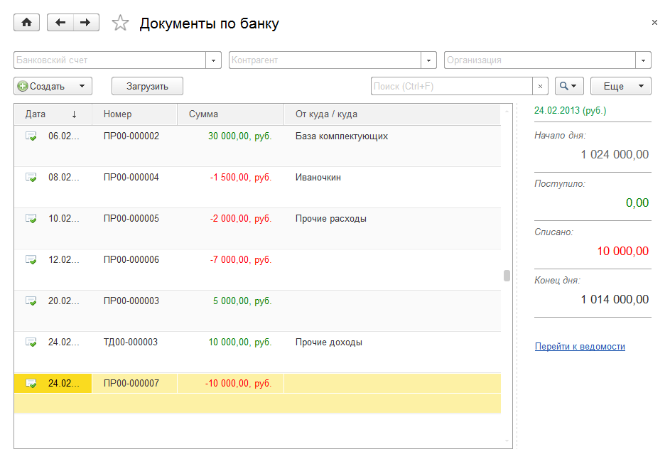
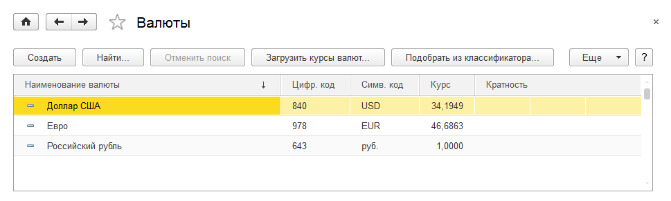
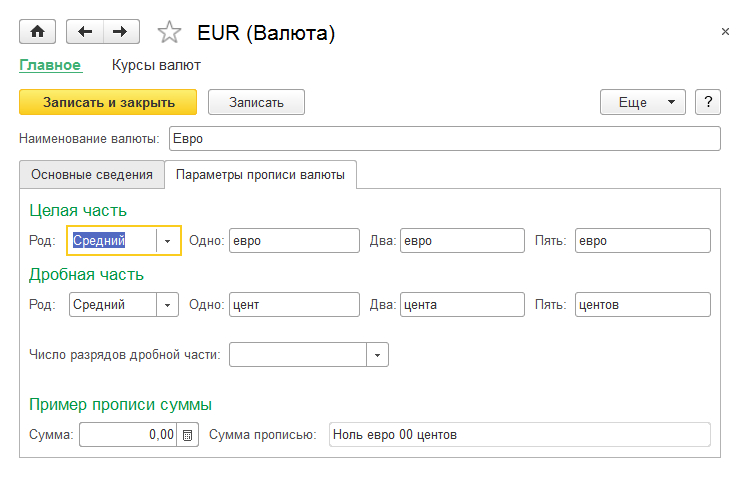
.. |image495.png| image:: media/image264.png
   :width: 4.33333in
   :height: 1.19792in
.. |image497.png| image:: media/image265.png
   :width: 4.33333in
   :height: 2.75in

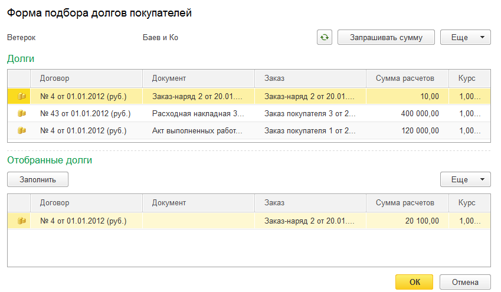
.. |image503.png| image:: media/image268.png
   :width: 4.33333in
   :height: 2.65625in
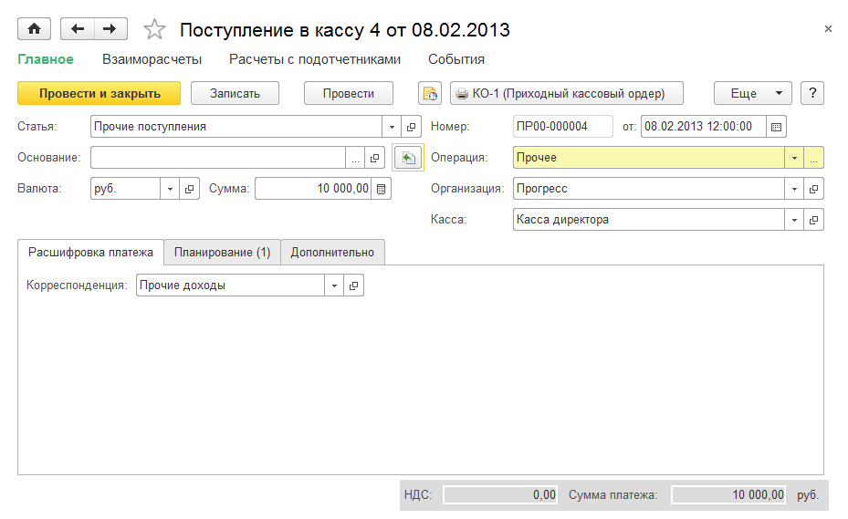
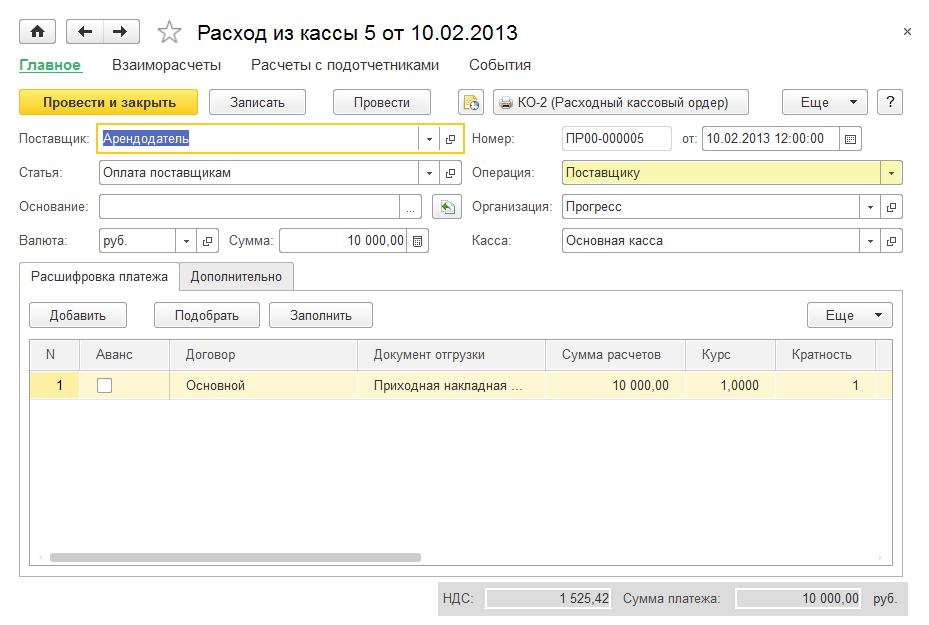
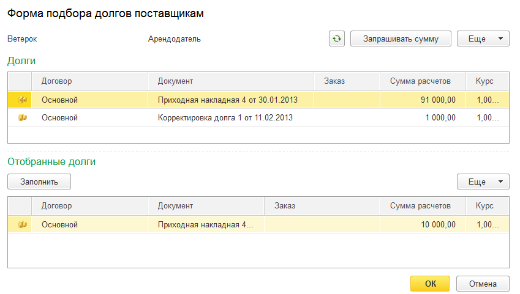
.. |image511.png| image:: media/image272.png
   :width: 4.33333in
   :height: 2.90625in
.. |image513.png| image:: media/image273.png
   :width: 4.33333in
   :height: 2.90625in
.. |image515.png| image:: media/image274.png
   :width: 4.33333in
   :height: 2.90625in
.. |image517.png| image:: media/image275.png
   :width: 4.33333in
   :height: 2.90625in
.. |image519.png| image:: media/image276.png
   :width: 4.33333in
   :height: 2.90625in
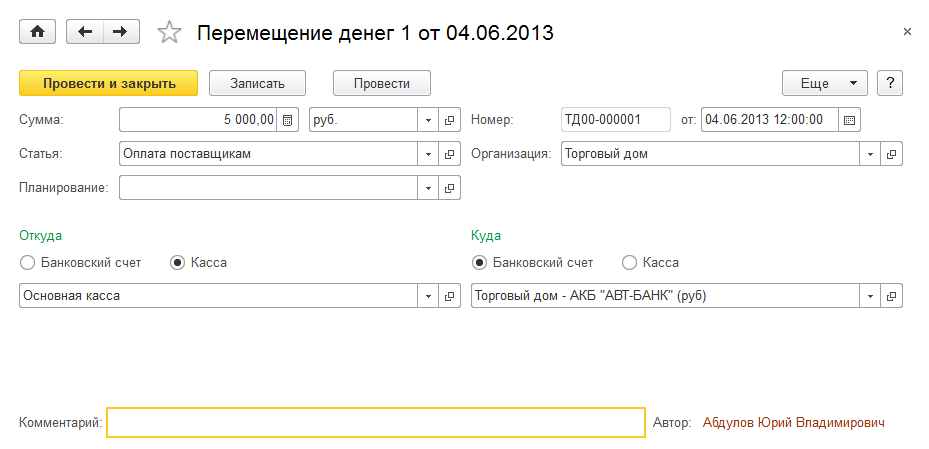
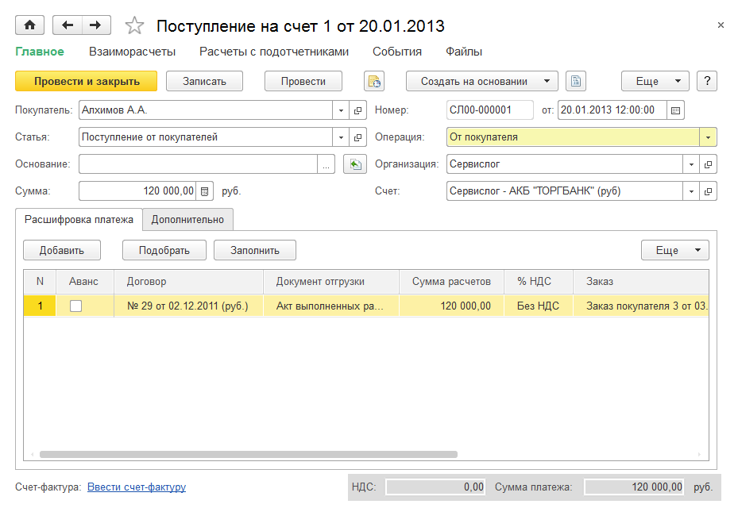
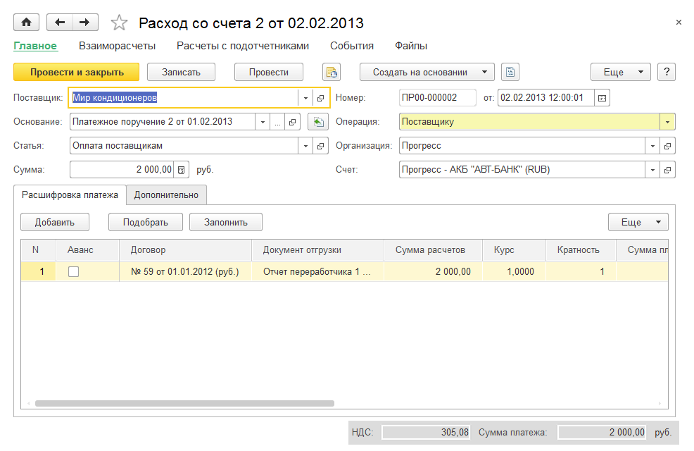
.. |image531.png| image:: media/image280.png
   :width: 4.33333in
   :height: 2.8125in
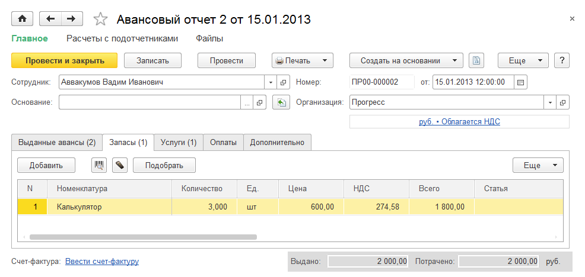
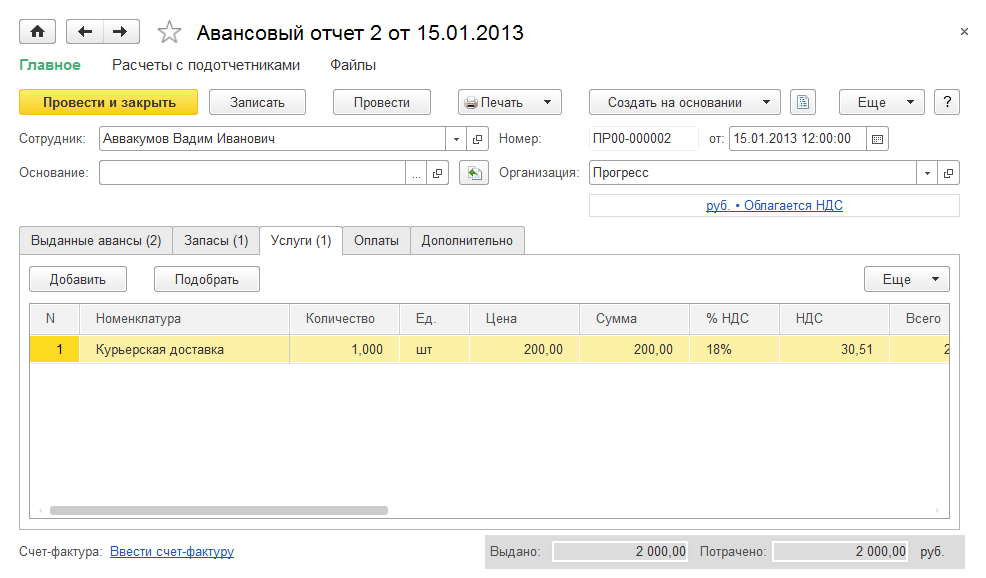
.. |image537.png| image:: media/image283.png
   :width: 4.33333in
   :height: 2.54167in
.. |image539.png| image:: media/image284.png
   :width: 4.33333in
   :height: 2.0625in
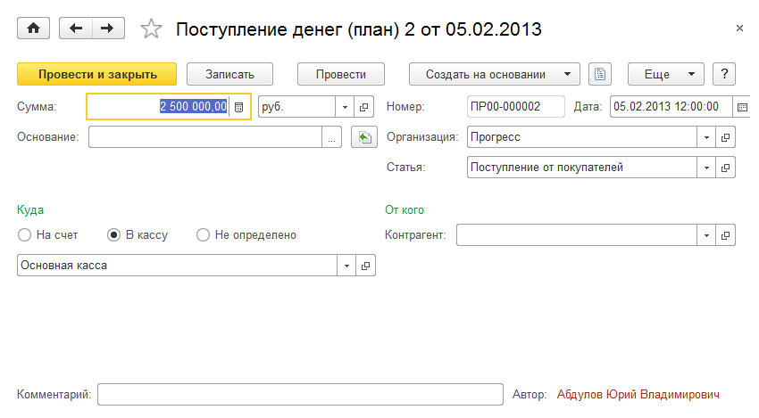
.. |image543.png| image:: media/image286.png
   :width: 4.33333in
   :height: 2.38542in
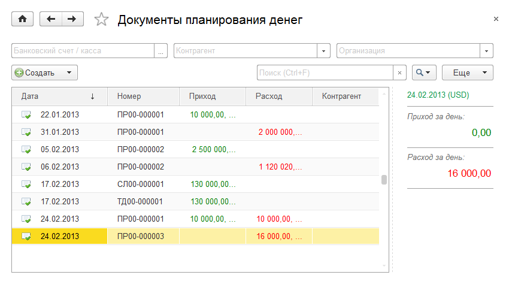
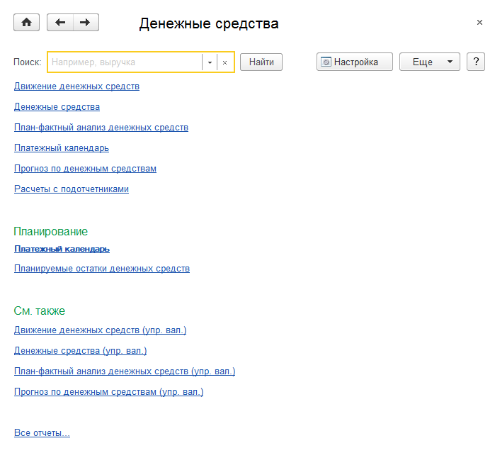
.. |image549.png| image:: media/image289.png
   :width: 4.33333in
   :height: 3.41667in
.. |image551.png| image:: media/image290.png
   :width: 4.33333in
   :height: 2.38542in
.. |image553.png| image:: media/image291.png
   :width: 4.33333in
   :height: 2.38542in
.. |image555.png| image:: media/image292.png
   :width: 4.33333in
   :height: 1.98958in
