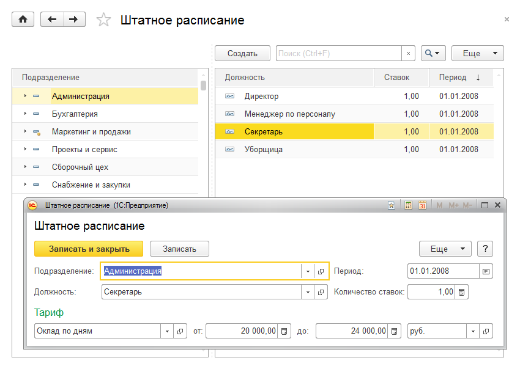
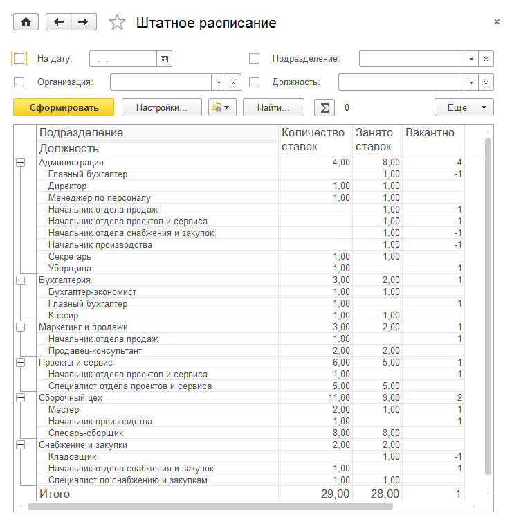
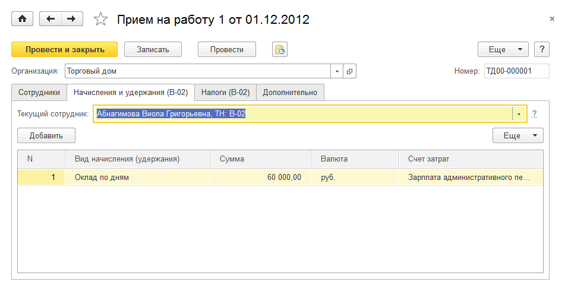
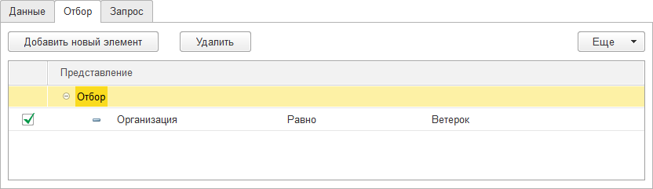
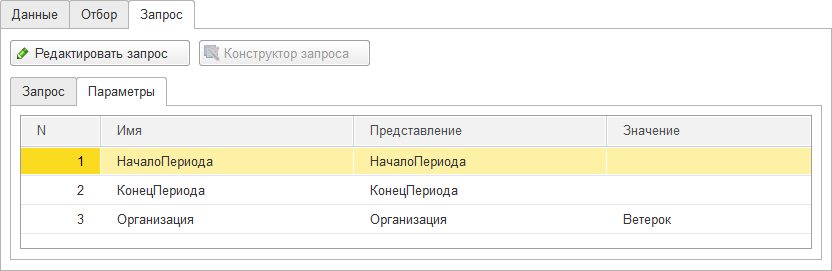
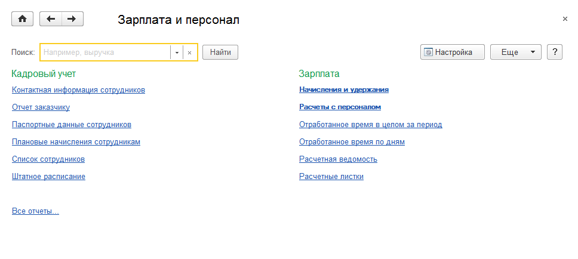
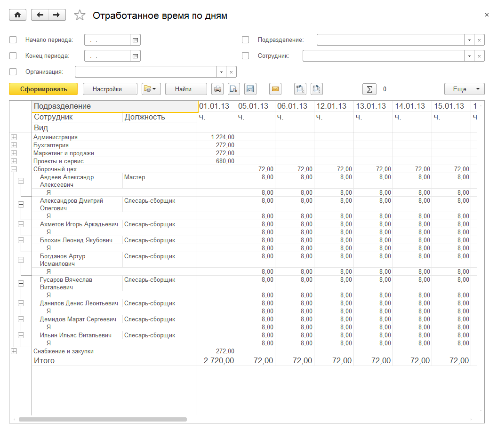

Зарплата
========

В прикладном решении в рамках раздела **Зарплата** реализован простой
механизм кадрового учета и начисления заработной платы.

В рамках кадрового учета регистрируется прием, кадровое перемещение и
увольнение сотрудников, штатное расписание, графики работы, табельный
учет рабочего времени.

Автоматизировано начисление заработной платы, как при повременной, так и
при сдельной системе оплаты труда.

В прикладном решении не предусмотрены налоговые расчеты, налоговая
отчетность и отчетность в фонды, но имеется возможность отражения сумм
начисленного налога на доходы. Для использования данной функциональности
необходимо установить флажок **Вести учет налога на доходы** в
настройках **Зарплата** раздела **Настройки**.

Сведения о сотрудниках, не связанные с исполнением трудовых
обязанностей, отображаются в справочнике **Физические лица**.

Сведения, используемые для описания условий работы, хранятся в
справочниках **Должности**, **Виды начислений и удержаний** и в регистре
сведений **Штатное расписание**. Также в прикладном решении используются
графики работы.

Виды начислений и удержаний
---------------------------

В справочнике **Виды начислений и удержаний** хранится перечень видов
начислений и удержаний, используемых на предприятии. Справочник доступен
по одноименной гиперссылке панели навигации в группе **См. также**.

|image557.png|

Для каждого элемента справочника путем установки переключателя
выбирается тип: **Начисление**, **Удержание** или **Налог**. Для
начислений и удержаний указывается счет затрат. По пиктограмме
|image559.png| вызывается
окно редактирования формулы расчета, в котором определяется формула
расчета начисления/удержания.

|image561.png|

В формулу могут входить элементы справочника **Параметры расчетов**,
числа (разделитель дробной части «**.** »), функции.

Для налога указывается вид налога из справочника **Виды налогов**.
Формула расчета не задается – сумма начисленного налога указывается
вручную, в документе **Начисление зарплаты**, закладка **Налоги на
доходы**.

Штатное расписание
------------------

Регистр сведений **Штатное расписание** доступен по одноименной
гиперссылке панели навигации. Использование штатного расписания является
опциональным и включается с помощью флажка **Вести штатное расписание**
в настройках **Зарплата** раздела **Настройки**.

|image563.png|

Форма состоит из двух частей: левая содержит дерево структурных
подразделений организации, указанной в расположенном сверху поле списка,
а правая – список должностей, соответствующих выбранному подразделению.
Для каждой должности, используемой на предприятии, в штатном расписании
указывается:

* количество ставок,

* вид начисления или удержания,

* диапазон оплаты труда и валюта.

Сводные сведения о штатном расписании и о вакансиях отображаются в
отчете **Штатное расписание**. Отчет доступен по одноименной гиперссылке
на панели отчетов раздела.

|image565.png|

Учет движения кадров
--------------------

Должностные обязанности конкретных физических лиц, а также условия
оплаты труда регистрируются документами **Прием на работу** и **Кадровое
перемещение**.

Прием на работу
~~~~~~~~~~~~~~~

Документом **Прием на работу** регистрируется прием сотрудников на
работу, а также необходимость расчета для этих сотрудников начислений и
удержаний.

|image567.png|

В шапке документа указывается организация-работодатель, на закладке
**Сотрудники** – список сотрудников из справочника **Сотрудники**.
Каждому новому сотруднику при занесении его в справочник автоматически
присваивается уникальный табельный номер, который будет отображаться в
колонке **ТН**. Кроме того, для каждого сотрудника указывается
подразделение, должность, количество занимаемых ставок и график работы.
Путем установки переключателя определяется также тип занятости: основное
место работы или совместительство (если использование совместительства
разрешено соответствующей опцией **Использовать совместительство** в
настройках **Зарплата** раздела **Настройки**).

|image569.png|

На вкладке **Начисления и удержания** отображаются начисления и
удержания выбранного на предыдущей вкладке сотрудника с указанием
плановой суммы и валюты, а также счета затрат.

Физические лица, работающие по совместительству, могут быть приняты на
работу неограниченное число раз. Для этого необходимо завести для них в
справочнике **Сотрудники** несколько элементов.

Кадровое перемещение
~~~~~~~~~~~~~~~~~~~~

После приема сотрудников на работу все изменения условий оплаты труда и
кадровые перестановки регистрируются документами **Кадровое
перемещение**. Перед заполнением нового документа в нем задается вид
операции: **Изменение условий оплаты** или **Перемещение** **и изменение
условий оплаты** соответственно.

|image571.png|

На вкладке **Сотрудники** перечисляются сотрудники и новые условия
работы для них.

|image573.png|

На вкладке **Начисления и удержания** отображается список начислений и
удержаний выбранного на предыдущей вкладке сотрудника.

Увольнение
~~~~~~~~~~

Увольнение сотрудников регистрируется документами **Увольнение**.

|image575.png|

В табличное поле формы документа следует внести список увольняемых
сотрудников и указать для каждого из них дату и причину увольнения.
Начиная с указанной даты, для уволенного сотрудника будут прекращены
автоматические начисления и удержания.

Расчет и начисление заработной платы
------------------------------------

Ниже представлена схема взаимодействия документов, участвующих в
процедуре расчета и начисления заработной платы.

|image577.png|

Для видов начислений с повременной системой оплаты труда необходимо
учитывать отработанное время сотрудников. Для этой цели используется
документ **Табель учета рабочего времени**.

Для видов начислений со сдельной системой оплаты труда необходимо
учитывать выработку. Для этого используются документы **Сдельный наряд**
и **Заказ-наряд**. По ним же производится начисление сдельной оплаты.

По данным табеля учета рабочего времени можно автоматически заполнить
документ **Начисление зарплаты сотрудникам**. Затем, чтобы подготовить
денежные выплаты, заполняется документ **Платежная ведомость**, на
основании которого могут быть зарегистрированы денежные выплаты
сотрудникам путем ввода документа **Расход денежных средств из кассы**.

Табель
~~~~~~

Документы **Табель** предназначены для ввода информации об использовании
рабочего времени. Список документов находится в журнале **Табели**,
доступном по одноименной гиперссылке панели навигации.

|image579.png|

В документе необходимо указать подразделение и период регистрации (дата,
относящаяся к месяцу, на который вводится табель). Также путем установки
переключателя в одно из двух положений (**По дням** или **За период**)
нужно определить способ ввода данных – по дням или за период в целом.

В табличное поле документа вносится список сотрудников подразделения, а
для каждого сотрудника – сведения об отработанном времени. Документ
можно заполнить автоматически по нажатию кнопки **Заполнить**.

Если переключатель способа ввода данных установлен в положение **За
период**, то в табеле будет указано общее количество часов с тем или
иным видом использованного времени за весь указанный период. Для каждого
сотрудника можно указать до шести видов использованного времени. Виды
использованного времени хранятся в одноименном классификаторе.

При выборе способа **Ввод данных по дням** данные о затратах рабочего
времени вводятся ежедневно. За один день можно указать не более трех
видов использованного времени. Время указывается в часах.

Начисление зарплаты сотрудникам
~~~~~~~~~~~~~~~~~~~~~~~~~~~~~~~

Документ **Начисление зарплаты сотрудникам** предназначен для начисления
оплаты труда (в конце месяца) и отнесения ее на затраты.

|image581.png|

В документе указывается период регистрации – дата месяца, за который
начисляется оплата труда, организация и подразделение. Табличное поле
заполняется списком сотрудников с указанием должности, вида и размера
начисления, оплачиваемого периода работы. Также для каждой строки
табличного поля указывается счет отнесения затрат, может быть указано
направление деятельности и заказ покупателя, с которым связано данное
начисление или удержание.

Ввести данные можно автоматически с помощью кнопки командной панели
**Заполнить**. Расчет выплачиваемой (удерживаемой) суммы также
производится автоматически по нажатию кнопки **Рассчитать**. Параметры
расчетов хранятся в одноименном справочнике, доступном по команде
**Параметры** **расчетов** панели навигации в группе **Справочники**.

На закладке **Налоги на доходы** можно указать суммы удерживаемого с
сотрудников налога на доходы. Расчет сумм налогов в программе не
производится.

Для подготовки к выплате зарплаты сотрудников предназначен документ
**Платежная ведомость**. В табличное поле документа вносится список
сотрудников, для каждого из которых указывается начисленная сумма.

Факт выплаты зарплаты регистрируется документом **Расход из кассы** (см.
стр. **Error! Bookmark not defined.**), в котором следует задать вид
операции **Зарплата**. Предусмотрена возможность выплаты зарплаты по
безналичному расчету.

Параметры расчетов
~~~~~~~~~~~~~~~~~~

Справочник **Параметры расчетов** предназначен для хранения правил
выборки данных, которые будут использоваться при расчете заработной
платы.

|image583.png|

Каждый элемент справочника фактически содержит шаблон запроса для
получения определенного значения из базы данных. Запрос может быть
составлен двумя способами. Если установлен флажок **Произвольный
запрос**, то для редактирования доступны текст и параметры запроса, в
толстом клиенте доступен конструктор запроса. Если флажок не установлен,
то необходимо указать источник данных, периоды отбора, показатель
(один), установить отборы данных. В этом случае запрос составится
автоматически. Если установлен флажок **Задавать значение при расчете
зарплаты**, то элемент не требует настройки; значение параметра
необходимо будет задать перед расчетом в документе **Начисление
зарплаты**.

На закладке **Данные** указывается период выборки данных и отмечается
показатель.

На закладке **Отбор** накладываются отборы на выборку данных.

|image585.png|

На закладке **Запрос** можно просмотреть результат настройки параметра
расчетов и при необходимости отредактировать его. Редактирование запроса
доступно при нажатой кнопке **Редактировать запрос**.

|image587.png|

В толстом клиенте можно воспользоваться конструктором запроса по кнопке
**Конструктор запроса**:

* **Запрос** – текст запроса;

* **Параметры** – параметры запроса:

+ **Имя параметра** – подставляется из текста запроса, не содержит
пробелов;

+ **Представление параметра** – отображается в документе **Начисление
зарплаты**;

+ **Значение параметра**.

Параметры запроса могут быть заданы на дополнительной закладке
**Параметры**.

|image589.png|

Значения параметров запроса могут заполняться несколькими способами:

* Могут быть заданы фиксированные значения параметров запроса на
закладке **Отборы** или, если установлен флажок **Произвольный запрос**,
на закладке **Параметры**.

* Значения параметров запроса подставляются автоматически из документа
**Начисление зарплаты**. К таким параметрам относятся: **Организация**,
**Валюта**, **Подразделение**, **СтруктурнаяЕдиница**,
**ПериодРегистрации**, **МоментВремени**, **НачалоПериода**,
**КонецПериода**, **Сотрудник**, **ТипЗанятости**, **ТабельныйНомер**,
**ТабНомер**, **Исполнитель**, **ФизЛицо**, **ФизическоеЛицо**,
**Должность**, **ВидНачисленияУдержания**, **ЗаказПокупателя**,
**Заказ**, **Проект**, **СчетЗатрат**, **НаправлениеДеятельности**,
**Размер**, **ОтработаноДней**, **ОтработаноЧасов**.

Необходимо заполнить следующие реквизиты:

* **Идентификатор** – представление параметра расчетов в формуле;

* **Источник выборки данных**;

* **Задавать значение при расчете зарплаты** – если значение параметра
будет вводиться непосредственно при расчете зарплаты;

* **Произвольный запрос**. Флажок устанавливается, если запрос и
параметры запроса будут редактироваться вручную.

Также элемент справочника можно заполнить по шаблону. Для этого
необходимо нажать кнопку **Заполнить по шаблону** и выбрать один из
вариантов:

* норма дней,

* норма часов,

* отработано дней,

* отработано часов,

* отработано часов по заданиям,

* тарифная ставка,

* фиксированная сумма.

После выбора варианта элемент справочника будет настроен в соответствии
с выбранным шаблоном. Далее элемент можно дополнить своими настройками.

Следует учитывать, что количество параметров, значение которых задается
при расчете заработной платы, в формуле может быть не более трех. В это
количество не входят параметры **ТарифнаяСтавка**, **ОтработаноДней**,
**ОтработаноЧасов**.

Графики работы
~~~~~~~~~~~~~~

Справочник **Графики работы** содержит перечень всех графиков работы
предприятия, назначаемых сотрудникам. Графики работы создаются на
основании производственного календаря. Их можно использовать как для
предприятия в целом, так и для его подразделений (например, график
работы склада).

|image591.png|

Для графика работы указываются наименование, период, способ заполнения,
а также шаблон заполнения графика.

Платежная ведомость
~~~~~~~~~~~~~~~~~~~

Документ предназначен для формирования печатной формы платежной
ведомости по выплате заработной платы (аванса) сотрудникам организации.

|image593.png|

Документ может быть заполнен автоматически с помощью кнопки командной
панели **Заполнить по остаткам**.

Отчеты раздела «Зарплата»
-------------------------

Данные раздела **Зарплата** анализируются с помощью отчетов, вызываемых
командами панели отчетов раздела.

|image595.png|

Список сотрудников
~~~~~~~~~~~~~~~~~~

Отчет предназначен для отображения кадровой информации, информации о
плановых начислениях сотрудников, паспортных данных и контактной
информации физических лиц. Для этого используются соответствующие режимы
**Список сотрудников**, **Плановые начисления**, **Паспортные данные**,
**Контактная информация**.

|image597.png|

Начисления и удержания
~~~~~~~~~~~~~~~~~~~~~~

В отчете отражаются данные по начислениям и удержаниям сотрудников с
детализацией до вида начисления/удержания. Данные группируются по
подразделениям.

|image599.png|

Расчеты с персоналом
~~~~~~~~~~~~~~~~~~~~

Отчет отображает состояние задолженности по заработной плате сотрудникам
в течение выбранного периода времени.

|image601.png|

Отработанное время
~~~~~~~~~~~~~~~~~~

В отчете отображаются сводные данные по учету рабочего времени на
основании документов **Табель**. Отчет может быть сформирован в двух
режимах: **По дням** и **В целом**.

В режиме **По дням** в отчете отображаются сведения о ежедневных
затратах рабочего времени за указанный период. Данные группируются по
подразделениям.

|image603.png|

В режиме **В целом за период** в отчет выводятся данные о суммарных
затратах рабочего времени с детализацией до вида рабочего времени на
определенную дату. Данные группируются по сотрудникам и подразделениям.

|image605.png|

Глава 9 

.. _предприятие-1:

.. |image557.png| image:: media/image293.png
   :width: 3.88542in
   :height: 1.89583in
.. |image559.png| image:: media/image294.png
   :width: 0.13542in
   :height: 0.11458in
.. |image561.png| image:: media/image295.png
   :width: 3.10417in
   :height: 2.44792in

.. |image567.png| image:: media/image298.png
   :width: 4.33333in
   :height: 2.55208in

.. |image571.png| image:: media/image300.png
   :width: 4.33333in
   :height: 2.20833in
.. |image573.png| image:: media/image301.png
   :width: 4.33333in
   :height: 2.20833in
.. |image575.png| image:: media/image302.png
   :width: 4.33333in
   :height: 2.02083in

.. |image579.png| image:: media/image304.png
   :width: 4.33333in
   :height: 2.92708in
.. |image581.png| image:: media/image305.png
   :width: 4.33333in
   :height: 2.70833in
.. |image583.png| image:: media/image306.png
   :width: 4.33333in
   :height: 3.23958in

.. |image587.png| image:: media/image308.png
   :width: 4.33333in
   :height: 1.40625in

.. |image591.png| image:: media/image310.png
   :width: 4.33333in
   :height: 3.28125in
.. |image593.png| image:: media/image311.png
   :width: 4.33333in
   :height: 2.32292in

.. |image597.png| image:: media/image313.png
   :width: 4.33333in
   :height: 3.76042in
.. |image599.png| image:: media/image314.png
   :width: 4.32292in
   :height: 4.36458in
.. |image601.png| image:: media/image315.png
   :width: 4.33333in
   :height: 4.57292in

.. |image605.png| image:: media/image317.png
   :width: 4.33333in
   :height: 4.28125in
