Предприятие
===========

Прикладное решение «1C:SimpleERP» предназначено для ведения
*управленческого учета*. Бухгалтерский и налоговый учет в системе не
поддерживается.

Записи управленческого учета формируются автоматически при проведении
документов. Для хранения записей управленческого учета предназначены:

* регистры накопления – по основным разделам учета;

* регистр бухгалтерии **Управленческий** – для формирования
управленческих проводок и управленческого баланса.

Примечание

Записи регистра бухгалтерии **Управленческий** будем называть
*проводками управленческого учета* или коротко *проводками*.

Проведение документов
---------------------

При проведении документа выполняются следующие действия:

* по алгоритмам, заложенным в прикладном решении, формируются записи
(движения) регистров накопления;

* на основании правил формирования проводок по записям регистров
накопления в бухгалтерском регистре **Управленческий** формируются
проводки.

|image607.png|

Данные регистров накопления и регистра бухгалтерии используются при
автоматическом заполнении отчетов.

Непосредственный ввод проводок
------------------------------

В прикладном решении проводка формируется автоматически при проведении
документа, однако возможна и ручная корректировка проводок. Для этого
предназначен документ **Операция**. Документ используется для отражения
хозяйственных операций, не автоматизированных другими документами; в
противном случае его использование не рекомендуется. Счета выбираются из
**Плана счетов управленческого учета**.

|image609.png|

В шапке документа указывается организация из одноименного справочника. В
табличное поле вводятся записи проводок.

План счетов
-----------

План счетов управленческого счета доступен в группе **«Предприятие»** на
Панели Навигации по гиперссылке «План счетов».

|image611.png|

План счетов автоматически заполняется при первом запуске новой
информационной базы счетами и субсчетами и основан на плане счетов по
РСБУ. В дальнейшем пользователь может изменять состав плана счетов и
вводить новые счета и субсчета, устанавливая в форме счета его вид
(**Активный**, **Пассивный** или **Активный/Пассивный**), тип, признак
ведения валютного учета, способ распределения.

Для служебного счета и групп счетов указывается специальный тип счета
**Группа счетов**.

Документ «Сверка взаиморасчетов»
--------------------------------

Документ **Сверка взаиморасчетов** предназначен для контроля и
регистрации сверки взаиморасчетов. Доступен по гиперссылке **Сверки
взаиморасчетов** на панели навигации раздела **Предприятие**.
Участниками сверки взаиморасчетов являются организация торгового
предприятия и контрагент (юридическое или физическое лицо партнера).
Сверка взаиморасчетов производится в несколько этапов, по каждому из
которых в документе регистрируется определенный статус документа сверки:
создана, на сверке, сверена.

|image613.png|

**Создана** – создается сверка взаиморасчетов. Документ может быть
создан вручную или с помощью помощника создания сверки (пакетный ввод
документов). Документ печатается и передается контрагенту.

**На сверке** – документ передан контрагенту. Контрагент сверяет данные,
присланные организацией, со своими данными. Информация о расхождениях по
задолженностям взаиморасчетов заполняется на странице **Сведения от
контрагента**.

**Сверена** – участники взаиморасчетов согласовали взаимные претензии по
взаиморасчетам и подписали документ.

Документ может быть оформлен по инициативе контрагента. В этом случае
создается новый документ, в котором в соответствии с присланной печатной
формой акта сверки регистрируется информация о задолженности
контрагента. Для документа устанавливается статус «**На сверке»**.
Используя отчеты, можно сравнить информацию о задолженности по данным
контрагента с нашими данными. Можно также распечатать подробную
информацию с указанием перечня документов, по которым возникла
задолженность, как по нашим данным, так и по данным контрагента. Для
этих целей используется соответствующая печатная форма.

Корректировка долга
-------------------

Документ предназначен для проведения взаимозачетов и переуступок долга с
контрагентами.

|image615.png|

В зависимости от установленного вида операции с помощью данного
документа могут быть зафиксированы:

* **Взаимозачет**,

* **Переуступка долга покупателя**,

* **Переуступка долга поставщику**,

* **Корректировка долга покупателя**,

* **Корректировка долга поставщику**.

Операция **Взаимозачет** предназначена для оформления взаимозачета с
контрагентом.

Если необходимо оформить операцию переуступки долга покупателя, то
устанавливается вид операции **Переуступка долга покупателя**.

В случае оформления операции переуступки долга поставщику
устанавливается вид операции **Переуступка долга поставщику**.

Закладка **Реквизиты получателя** становится доступной для заполнения
для видов операции **Переуступка долга покупателя** и **Переуступка
долга поставщику**.

Для операций по корректировке долга необходимо заполнять реквизит
**Корреспонденция** – счет отнесения корректировки.

Прочие затраты (расходы)
------------------------

Документ **Прочие затраты (расходы)** предназначен для отражения в учете
нематериальных расходов, образующихся в результате хозяйственной
деятельности предприятия. С помощью данного документа можно оприходовать
нематериальные затраты для последующего распределения.

|image617.png|

В документе указывается собственная организация, подразделение и
корреспондирующий счет с типом **Прочие доходы**, **Прочие оборотные
активы**, **Кредиты и займы**, **Долгосрочные обязательства** для
определения источника расходов. В табличном поле указывается счет учета
и заказ покупателя, на которые относятся расходы, и направление
деятельности, в рамках которого они понесены.

Учет налогов
------------

В прикладном решении не предусмотрены средства для расчета налогов. В
частности, НДС при поступлении товаров и услуг включается в их
стоимость, а при реализации не начисляется. Для регистрации в
управленческом учете сумм налогов организации, рассчитанных вне
прикладного решения, предназначен документ **Начисление налогов**.
Документ доступен по одноименной гиперссылке панели навигации в группе
**Финансовые операции**.

|image619.png|

В документе указывается тип операции **Начисление** или **Возмещение**.
В табличное поле вносится список налогов из справочника **Виды
налогов**. Для каждого налога указывается начисленная сумма. В колонке
**Счет затрат** следует указать счет, на который относятся начисленные
суммы налогов.

Уплата налога в бюджет отображается документами **Расход из кассы** или
**Расход со счета** с видом операции **Налоги**.

Начисления и уплаты налогов отображаются в отчете **Расчеты по
налогам**.

|image621.png|

Закрытие месяца
---------------

Для выполнения регламентных операций завершения периода в управленческом
учете предназначена обработка **Закрытие месяца**, доступная по
гиперссылке панели навигации в группе **Финансовые операции**.

|image623.png|

Данная обработка автоматически выполняет следующие регламентные
операции:

* **Начисление амортизации**,

* **Расчет прямых затрат**,

* **Распределение затрат**,

* **Расчет фактической себестоимости**,

* **Расчет себестоимости в рознице (суммовой учет)**,

* **Расчет курсовых разниц**,

* **Расчет финансового результата**.

Для корректного выполнения автоматических расчетов необходимо, чтобы
предварительно были введены все данные, относящиеся к закрываемому
месяцу.

Для операции **Закрытие месяца** добавлен механизм, позволяющий выявлять
и исправлять в автоматическом режиме ошибки и неточности, допущенные в
ходе ведения учета.

Контроль правильности учета выполняется для разделов: расчеты с
поставщиками, расчеты с покупателями, курсовые разницы, номенклатура без
спецификации, анализ закупочных цен, контроль организаций и договоров в
документах, статьи движения денежных средств.

Переход к помощнику осуществляется из формы закрытия месяца по кнопке
**Предварительный анализ**.

|image625.png|

.. _имущество-1:

Имущество
---------

В подразделе **Имущество** доступны данные по учету внеоборотных
активов, к которым относятся основные средства (ОС) и нематериальные
активы (НМА). Раздел доступен только в том случае, если в настройках
параметров учетной политики установлен флажок **Использовать учет
имущества**.

Сведения об имуществе
~~~~~~~~~~~~~~~~~~~~~

Сведения об имуществе предприятия хранятся в справочнике **Имущество**.

|image627.png|

В справочнике отображаются основные сведения об имуществе: инвентарный
номер, начальная стоимость, начисленная амортизация, остаточная
стоимость и состояние.

В форме списка можно произвести быстрый отбор имущества по указанному
состоянию, а также организации, посмотреть информацию о последнем
периоде, в котором начислялась амортизация, и при необходимости
произвести очередной расчет амортизации имущества.

Из формы списка также можно быстро оформить все доступные операции с
имуществом или перейти в журнал учета документов по имуществу.

|image629.png|

С помощью гиперссылок панели навигации, расположенной в форме элемента
справочника, можно получить доступ к дополнительной информации о текущем
активе: его параметрах и состоянии.

|image631.png|

Для имущества задается его тип (**Основное средство** или
**Нематериальный актив**), способ амортизации (**Пропорционально объему
продукции** или **Линейный**), начальная стоимость, единица измерения.
По гиперссылке **Еще…** задаются счета учета и амортизации.

Действия с имуществом, начиная с регистрации нового актива,
регистрируются документами, объединенными в журнал **Документы по
имуществу** в подразделе **Имущество**.

|image633.png|

Регистрация нового актива
~~~~~~~~~~~~~~~~~~~~~~~~~

Для регистрации нового объекта имущества нужно последовательно выполнить
два шага:

* зарегистрировать поступление нового объекта номенклатуры,

* объект номенклатуры принять к учету в качестве имущества.

Поступление нового объекта номенклатуры регистрируется документом
**Приходная накладная**.

|image635.png|

Чтобы зарегистрировать объект номенклатуры в качестве имущества, нужно
ввести документ **Принятие к учету**.

|image637.png|

На вкладке документа **Данные об объекте вложений** указываются сведения
об объекте номенклатуры: его наименовании, количестве, характеристиках,
сумме. В табличное поле на вкладке **Имущество** вводятся сведения о
связанном с данным объектом имуществе, включая информацию об объеме
продукции, которая должна быть выпущена для полной выработки актива,
сроках использования, структурном подразделении, принимающем актив, и
направлении деятельности. Объем продукции задается только для тех
активов, для которых в одноименном справочнике задан способ амортизации
**Пропорционально объему продукции**.

При проведении документа его данные сохраняются в специальных регистрах
сведений и становятся доступны для просмотра из формы элемента
справочника **Имущество**.

Изменение параметров
~~~~~~~~~~~~~~~~~~~~

Параметры имущества, указанные при его постановке на учет, в дальнейшем
можно менять. Для регистрации таких изменений предназначен документ
**Изменение параметров**.

|image639.png|

В табличном поле формы документа указывается список активов и новые
значения изменяемых параметров.

Амортизация
~~~~~~~~~~~

Амортизация имущества начисляется автоматически согласно сведениям,
указанным в документах **Принятие к учету имущества** и **Изменение
параметров**. Для этого в конце месяца следует ввести документ
**Амортизация имущества**.

|image641.png|

Для актива со способом начисления амортизации **Пропорционально объему
продукции** до автоматического начисления следует вручную указать объем
выработки. Для ввода сведений о выработке активов предназначен документ
**Выработка имущества**. В табличное поле формы документа следует внести
перечень активов, указав объем выработки в колонке **Количество**.

|image643.png|

Выбытие имущества
~~~~~~~~~~~~~~~~~

В прикладном решении поддерживаются два способа снятия имущества с
учета:

* продажа – регистрируется документом **Продажа имущества**;

* списание в связи с моральным или физическим износом – регистрируется
документом **Списание имущества**.

Продажа имущества
^^^^^^^^^^^^^^^^^

Документ **Продажа имущества** предназначен для регистрации факта
реализации имущества стороннему контрагенту.

|image645.png|

Документ автоматически доначисляет амортизацию за месяц, в котором
осуществляется продажа. В колонке **Амортизация всего** указывается
сумма амортизации за весь период эксплуатации, а в колонке
**Амортизация** **за тек. месяц** – рассчитанная сумма амортизации за
текущий месяц. В остальном документ аналогичен документу **Реализация
товаров**.

Списание имущества
^^^^^^^^^^^^^^^^^^

Документ **Списание имущества** предназначен для регистрации факта
списания основных средств и нематериальных активов. Перед списанием
документ автоматически доначисляет амортизацию за текущий месяц.

|image647.png|

В шапке документа, в поле **Корреспонденция** следует указать счет
учета, на который будет отнесена остаточная стоимость имущества.

В табличном поле **Имущество** перечисляются списываемые активы и
указываются их параметры, такие как **Начальная стоимость**,
**Остаточная стоимость** и **Амортизация** (за весь период эксплуатации
и за последний месяц).

Бюджетирование
--------------

Для регистрации плановых финансовых показателей работы компании
предназначен документ **Бюджет**, доступный по гиперссылке панели
навигации в группе **Планирование**.

С помощью данного документа можно зарегистрировать в системе бюджет
прямых производственных затрат, бюджет косвенных затрат, бюджет доходов
и расходов, бюджет движения денежных средств, а также прочие плановые
операции.

Планирование происходит по суммовым показателям.

В документе указывается собственная организация, для которой формируется
бюджет, период планирования (значение выбирается из одноименного
справочника и определяет периодичность, начало и окончание бюджета).

При вводе данных в колонке **Дата планирования** табличных полей
документа автоматически устанавливается дата, соответствующая началу
подпериода планирования.

Планирование движения денежных средств осуществляется в разрезе статей
движения денежных средств; планирование доходов и расходов – в разрезе
направлений деятельности.

При проведении документа бюджет косвенных затрат автоматически
закрывается на затраты незавершенного производства, на счет, указанный в
счете косвенных затрат как счет закрытия.

Прямые производственные затраты закрываются на счет учета продукции,
полуфабрикатов и работ в незавершенном производстве, указанный как счет
закрытия у счета учета прямых производственных затрат. Счет учета
продукции, полуфабрикатов и работ закрывается на счет учета запасов,
указанный в счете учета продукции, полуфабрикатов и работ как счет
закрытия.

Доходы и расходы закрываются на счет учета прибылей и убытков, указанный
в направлении деятельности. Закрытие происходит аналогично механизму
закрытия счетов учета доходов и расходов в документе **Закрытие
месяца**.

Начальные остатки
~~~~~~~~~~~~~~~~~

На закладке **Начальные остатки** указываются суммы остатков на счетах
организации на дату начала планового периода.

|image649.png|

Затраты
~~~~~~~

Закладка **Затраты** предназначена для хранения информации о прямых и
косвенных затратах организации за определенный период.

|image651.png|

.. _денежные-средства-1:

Денежные средства
~~~~~~~~~~~~~~~~~

На закладке **Денежные средства** хранятся данные бюджетов движения
денежных средств за определенный период.

|image653.png|

Доходы и расходы
~~~~~~~~~~~~~~~~

Закладка **Доходы и расходы** предназначена для хранения бюджетов
доходов и расходов за определенный период для конкретного подразделения
собственной организации. В табличных полях указывается счет учета, а
также направление деятельности и заказ покупателя, на который относится
доход или расход.

|image655.png|

Операции
~~~~~~~~

Закладка предназначена для хранения сведений о прочих бюджетных
операциях.

|image657.png|

Отчетность раздела «Предприятие»
--------------------------------

В разделе **Предприятие** доступны отчеты, использующие данные регистров
накопления, а также регистр бухгалтерии **Управленческий**, который
содержит записи управленческого учета в целом (см. схему в начале
главы). Регистр бухгалтерии используется для построения отчета
**Оборотно-сальдовая ведомость**.

Отчеты доступны на панели отчетов раздела, открывающейся по
соответствующей гиперссылке панели навигации раздела.

|image659.png|

Нераспределенные затраты
~~~~~~~~~~~~~~~~~~~~~~~~

Отчет предоставляет информацию о прямых и косвенных производственных
затратах предприятия. Данные представлены в разрезе подразделений с
детализацией по заказам покупателей.

|image661.png|

Отчет может быть сформирован в двух режимах – **Ведомость** и
**Остатки**. В режиме **Остатки** данные о поступлениях и затратах
денежных средств не отображаются.

|image663.png|

Оборотно-сальдовая ведомость
~~~~~~~~~~~~~~~~~~~~~~~~~~~~

Отчет **Оборотно-сальдовая ведомость** отображает сводные данные
управленческого учета.

|image665.png|

Отчет формируется в виде таблицы, в каждой строке которой отражается
информация, относящаяся к определенному счету управленческого учета.
Счета упорядочены в порядке возрастания номеров. Для каждого счета
отражены суммы остатков на начало и конец периода отчета (дебетового и
кредитового) и суммы оборотов по дебету и кредиту.

Перед формированием отчета на панели настроек следует указать период, а
также период планирования (для формирования отчета по плановым данным).
По умолчанию период планирования устанавливается **Фактический**. Отчет
может быть сформирован для предприятия в целом или для конкретной
организации.

Выработка имущества
~~~~~~~~~~~~~~~~~~~

Сводные сведения о выработке имущества за выбранный период времени
отображаются в отчете **Выработка имущества**.

|image667.png|

Планы продаж
~~~~~~~~~~~~

В отчете **Планы продаж** отображаются данные о планируемых продажах
номенклатуры, сгруппированные по подразделениям. Для каждой
номенклатуры, планируемой к продаже, в отчет выведено ее количество и
сумма, а также подведен итог по каждому отдельному подразделению и по
всем подразделениям в целом.

|image669.png|

Глава 10 

.. _анализ-1:

.. |image607.png| image:: media/image318.png
   :width: 3.29167in
   :height: 2.01042in
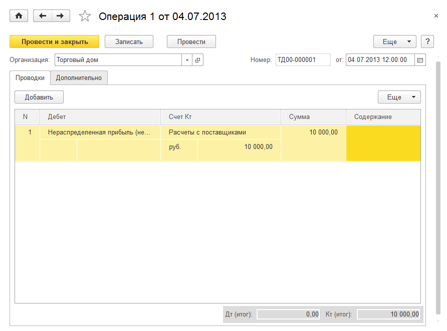
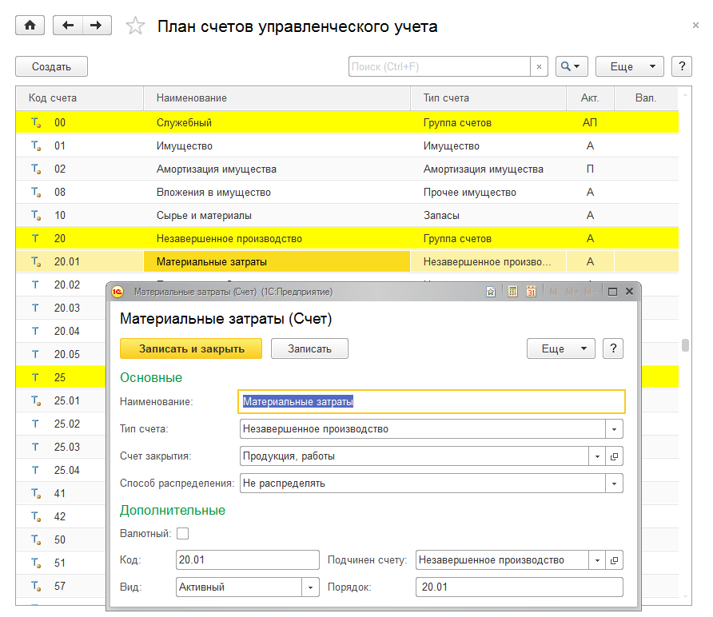
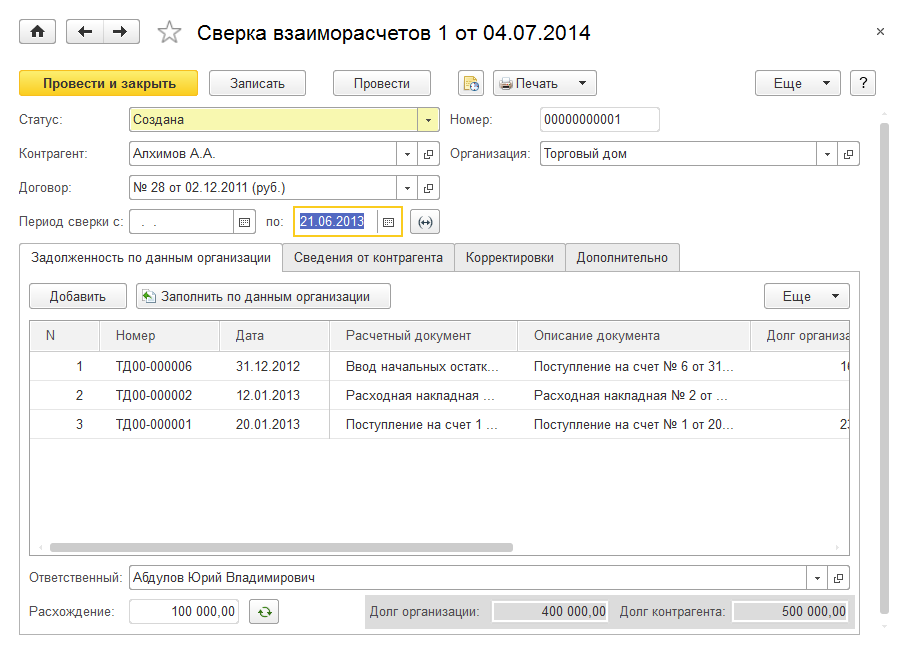
.. |image615.png| image:: media/image322.png
   :width: 4.33333in
   :height: 2.76042in
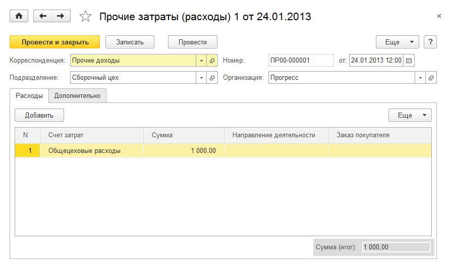
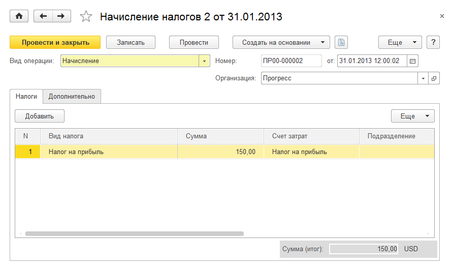
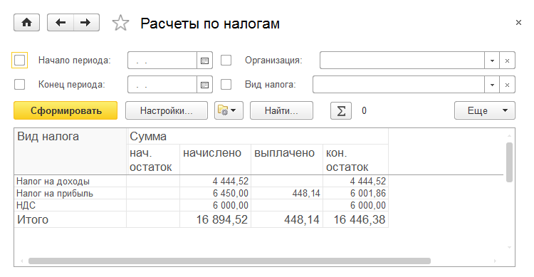
.. |image623.png| image:: media/image326.png
   :width: 4.21875in
   :height: 3.08333in
.. |image625.png| image:: media/image327.png
   :width: 4.32292in
   :height: 3.35417in
.. |image627.png| image:: media/image328.png
   :width: 4.33333in
   :height: 2.02083in
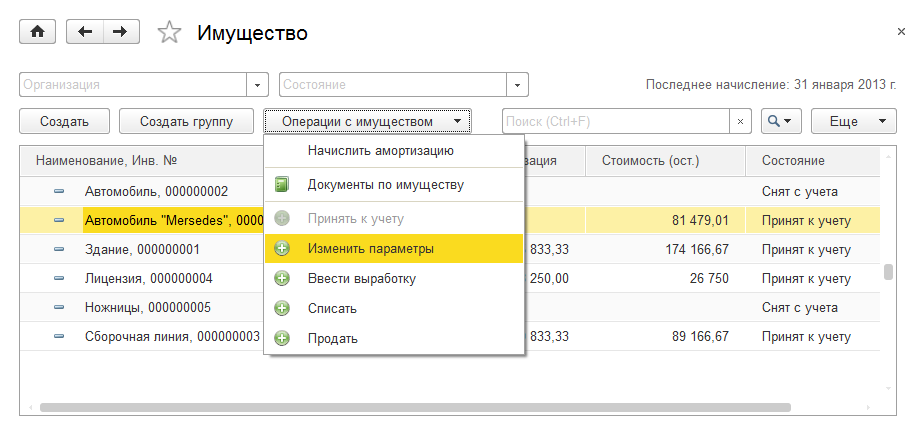
.. |image631.png| image:: media/image330.png
   :width: 3.85417in
   :height: 2.14583in
.. |image633.png| image:: media/image331.png
   :width: 3.85417in
   :height: 2.51042in
.. |image635.png| image:: media/image332.png
   :width: 4.33333in
   :height: 3.27083in
.. |image637.png| image:: media/image333.png
   :width: 4.33333in
   :height: 2.21875in
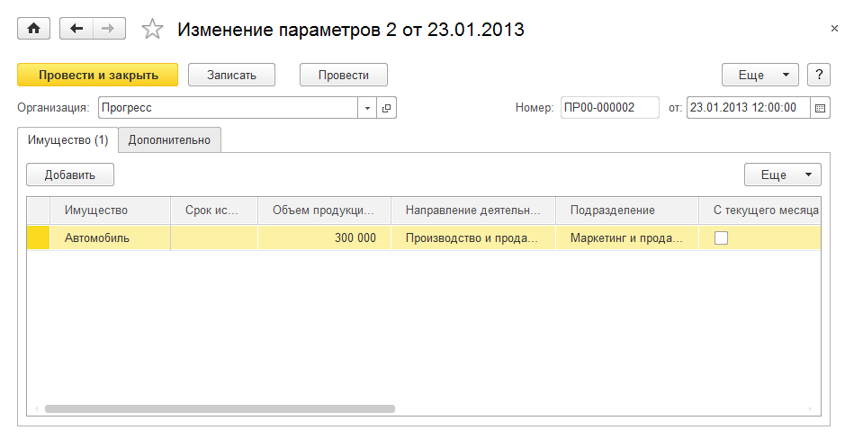
.. |image641.png| image:: media/image335.png
   :width: 4.33333in
   :height: 1.29167in
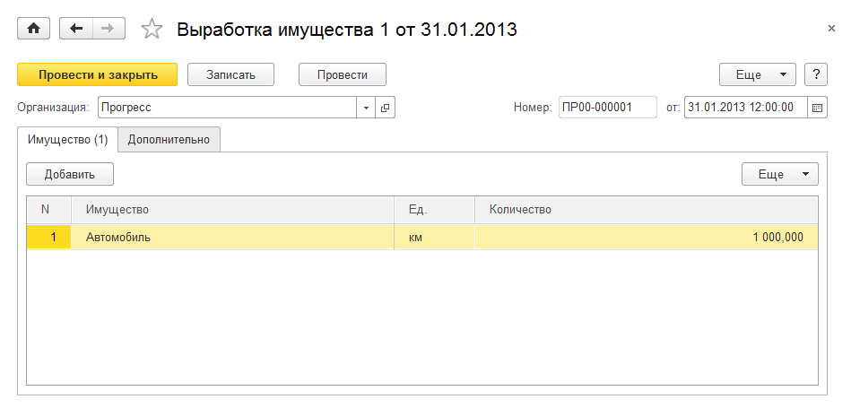
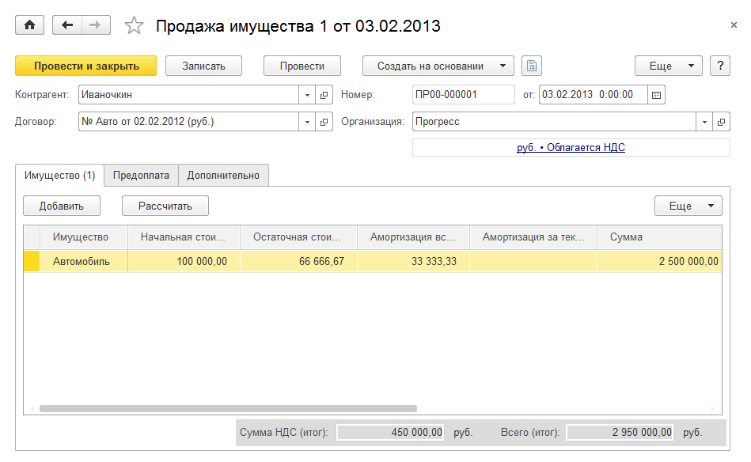
.. |image647.png| image:: media/image338.png
   :width: 4.33333in
   :height: 2.22917in
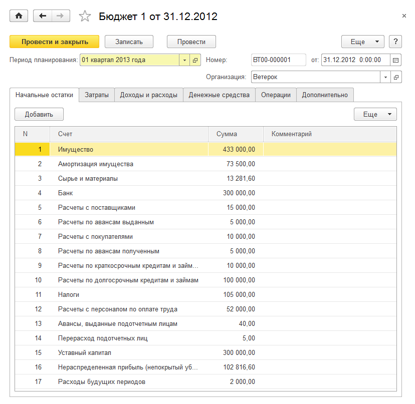
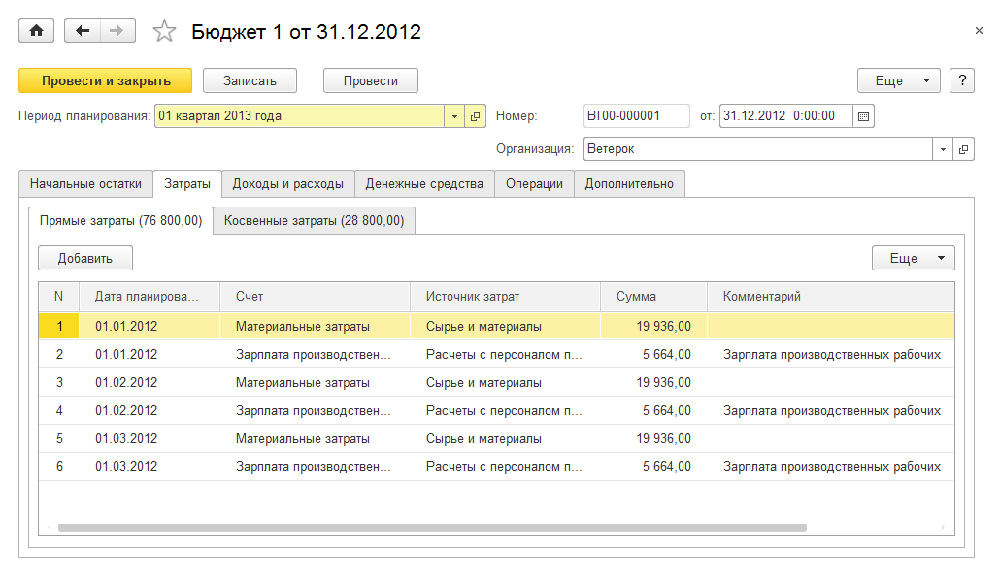
.. |image653.png| image:: media/image341.png
   :width: 4.33333in
   :height: 2.47917in
.. |image655.png| image:: media/image342.png
   :width: 4.33333in
   :height: 2.30208in
.. |image657.png| image:: media/image343.png
   :width: 4.33333in
   :height: 2.85417in
.. |image659.png| image:: media/image344.png
   :width: 4.09375in
   :height: 3.36458in
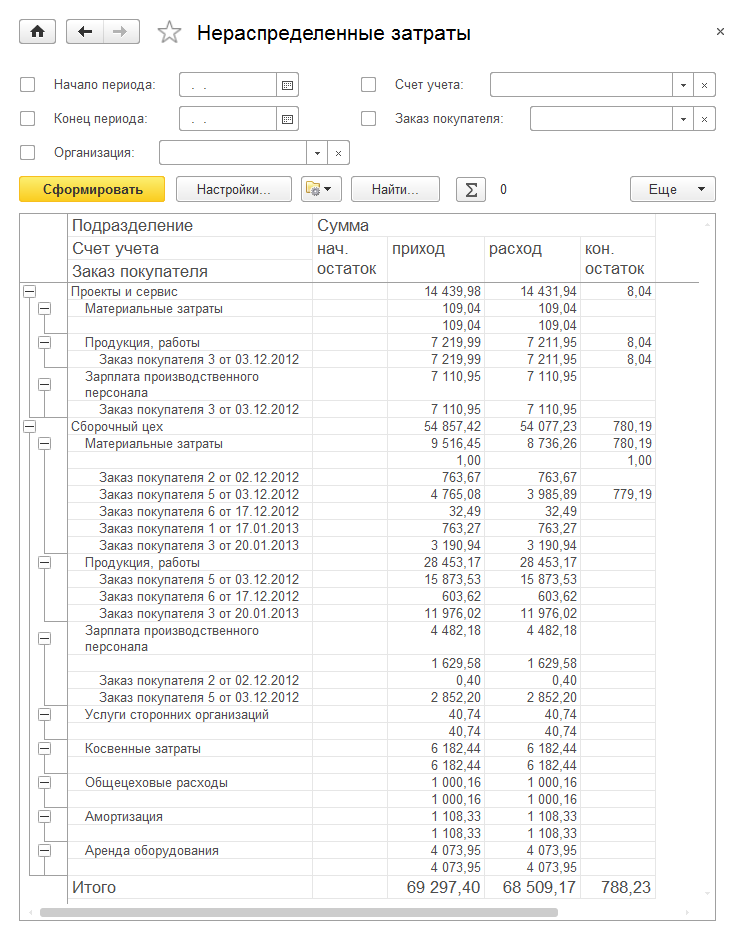
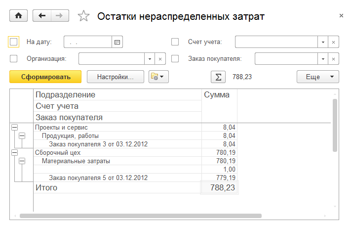
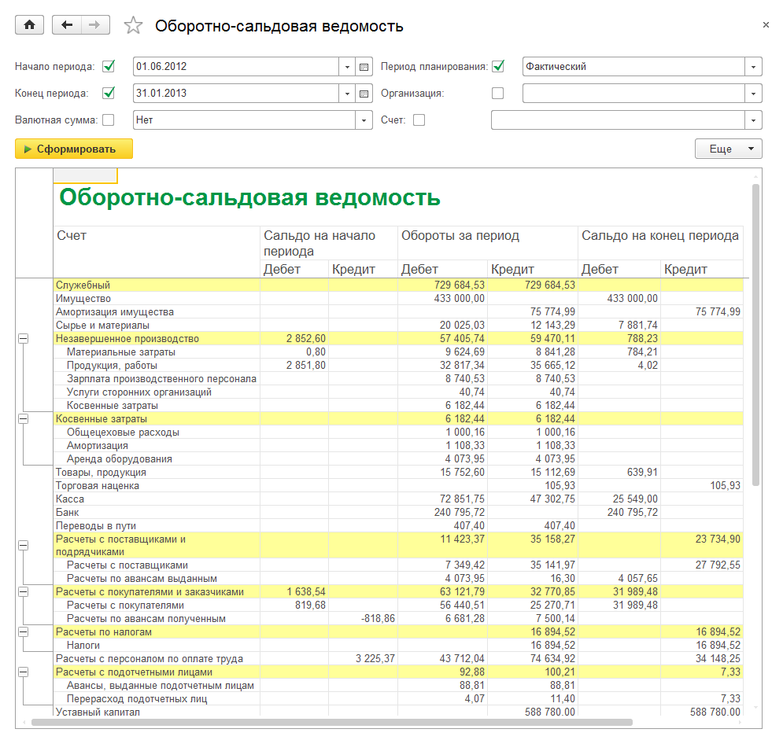
.. |image667.png| image:: media/image348.png
   :width: 3.76042in
   :height: 2.15625in
.. |image669.png| image:: media/image349.png
   :width: 4.29167in
   :height: 3.25in
