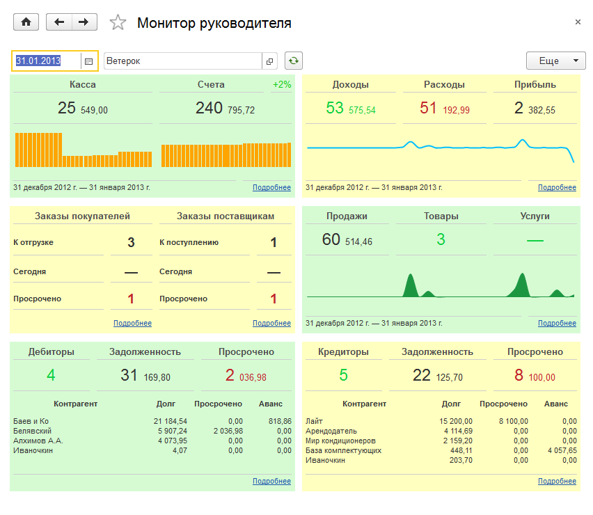
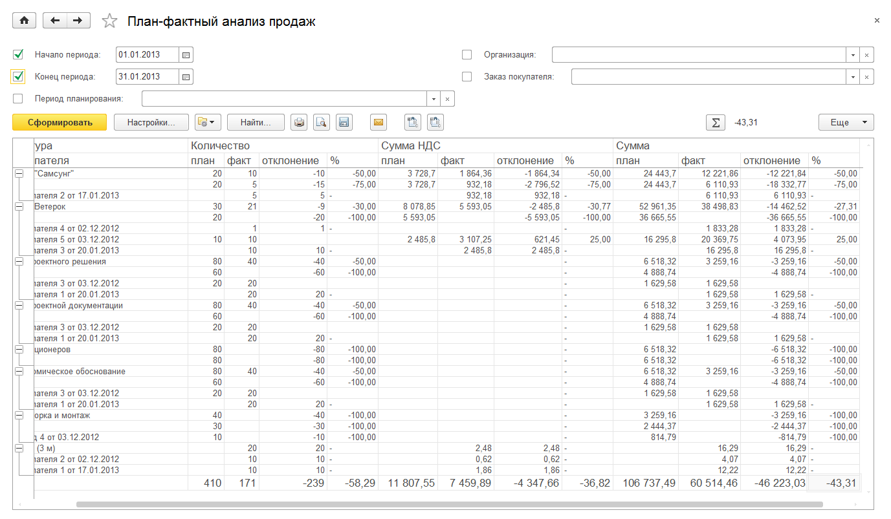
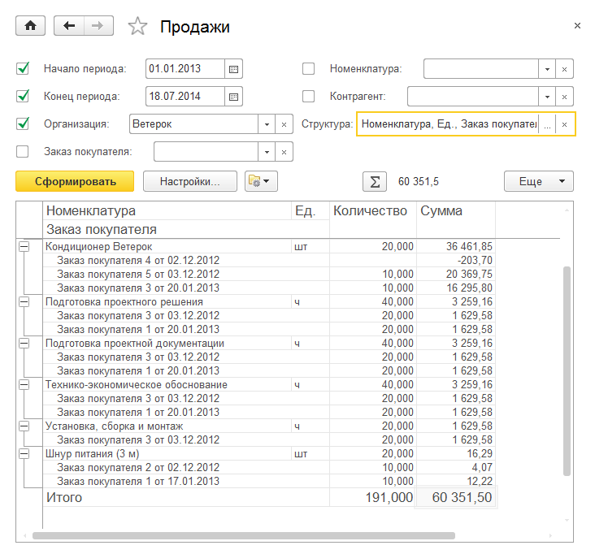
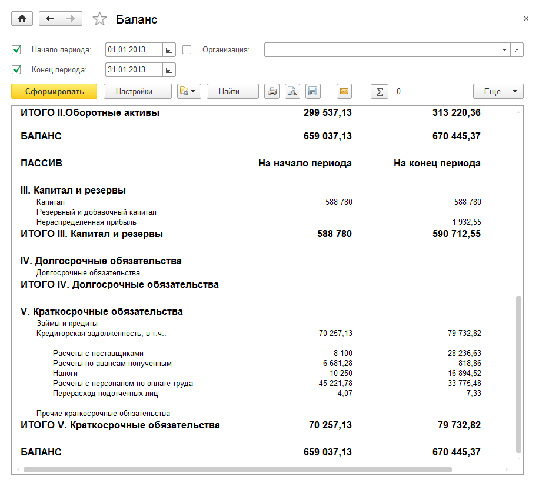
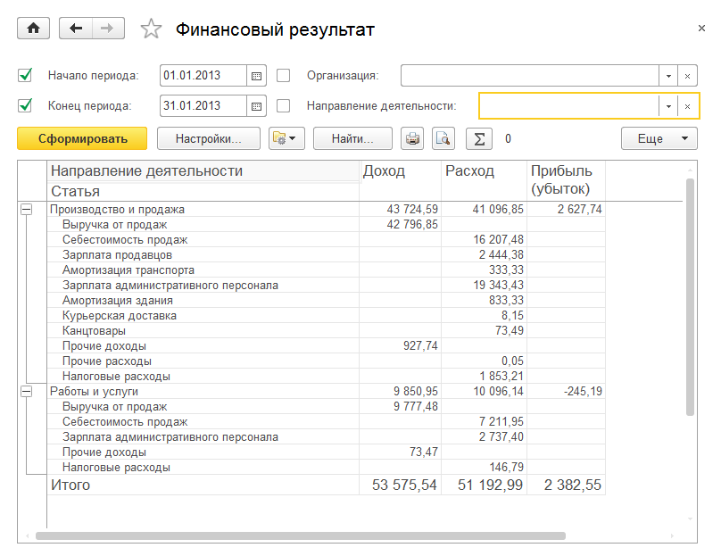
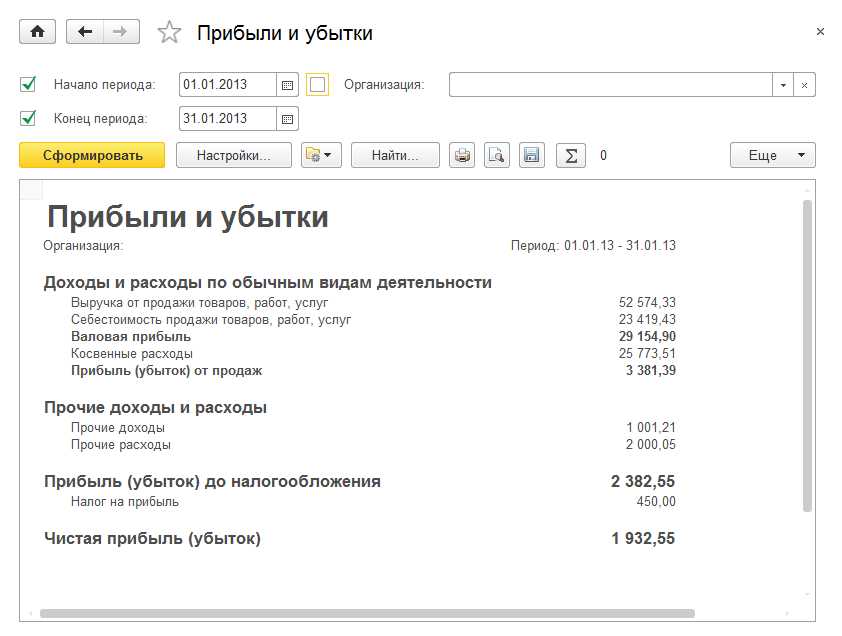
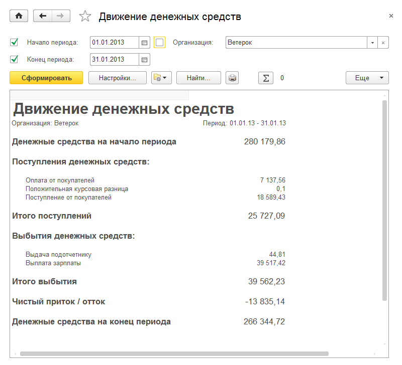
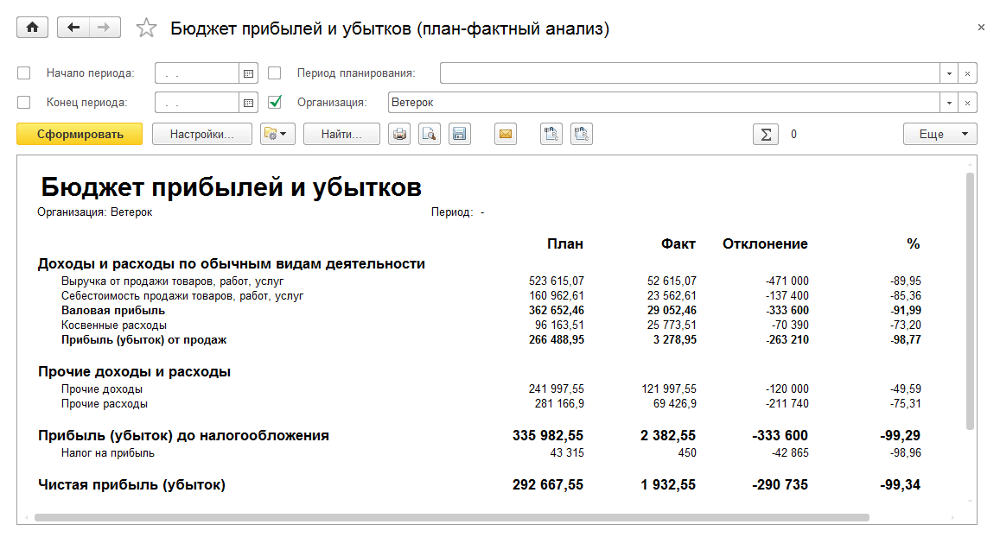
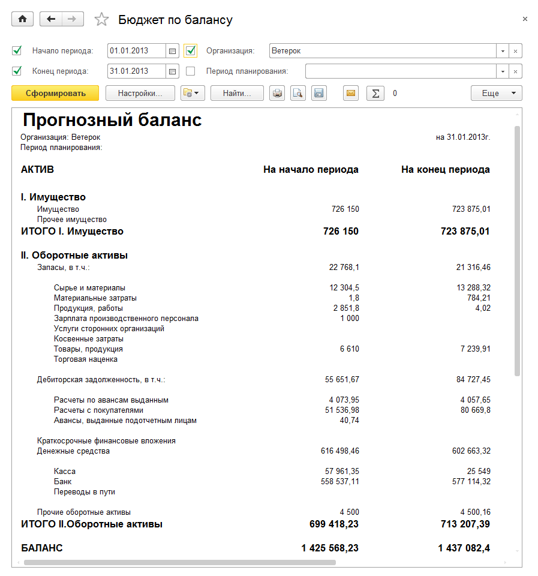

Анализ
======

Раздел предназначен для контроля деятельности компании со стороны
руководства. Включает в себя средства анализа и оценки ситуации на
предприятии, такие как **Монитор руководителя** и **Общие показатели**,
**Денежные средства**, **Расчеты с покупателями**, **Расчеты с
поставщиками**.

Монитор руководителя
--------------------

Монитор руководителя доступен по одноименной гиперссылке панели
навигации и включает в себя перечисленные ниже элементы.

.. _денежные-средства-2:

Денежные средства
~~~~~~~~~~~~~~~~~

Форма показывает остатки денежных средств на конец указанного дня по
всем кассам и расчетным счетам предприятия. Диаграммы отображают
динамику изменений остатков за последний месяц. По кнопке **Подробнее**
можно перейти к отчету **Ведомость денежных средств**.

.. _доходы-и-расходы-1:

Доходы и расходы
~~~~~~~~~~~~~~~~

В форме показана общая сумма полученных доходов, понесенных расходов и
результирующая прибыль (убыток) за последний месяц. Диаграмма отображает
динамику изменения прибыли (убытка) по дням за последний месяц. По
кнопке **Подробнее** можно перейти к отчету **Ведомость доходов и
расходов**.

Заказы
~~~~~~

Форма показывает количество незакрытых заказов покупателей и заказов
поставщикам, в том числе на дату указанного дня, и количество
просроченных. По кнопкам **Подробнее** можно перейти к отчетам **Анализ
заказов покупателей** и **Заказы поставщикам**.

.. _продажи-2:

Продажи
~~~~~~~

В форме представлена информация о сумме продаж компании и количестве
наименований товаров и услуг, проданных за последний месяц. Диаграмма
отображает динамику продаж по дням за месяц. По кнопке **Подробнее**
можно перейти к отчету **Ведомость продаж**.

Дебиторы
~~~~~~~~

**Дебиторы** – список контрагентов, имеющих задолженность перед
компанией. В шапке указано общее количество дебиторов и общий размер
задолженности, в том числе просроченной. Пять дебиторов с наибольшей
задолженностью представлены отдельным списком. В колонке **Аванс**
указана полученная предоплата, не отнесенная на документы заказов. По
кнопке **Подробнее** можно перейти к отчету **Расчеты с покупателями**.

Кредиторы
~~~~~~~~~

**Кредиторы** – список контрагентов, перед которыми имеется
задолженность у компании. В шапке указано общее количество кредиторов и
общий размер задолженности, в том числе просроченной. Пять кредиторов с
наибольшей задолженностью представлены отдельным списком. В колонке
**Аванс** указана выданная предоплата, не отнесенная на документы
заказов. По кнопке **Подробнее** можно перейти к отчету **Расчеты с
поставщиками**.

|image671.png|

Используя поля выбора на командной панели, руководитель имеет
возможность вывести такие списки на любую дату и по любой организации.
Он может также изменить по своему вкусу взаимное расположение списков и
полей монитора, а также запретить вывод лишних показателей, используя
форму настройки, вызываемую по команде меню **Еще – Изменить форму…**

Общие показатели
----------------

Форма **Общие показатели** доступна по одноименной гиперссылке панели
навигации раздела **Анализ**.

На форме представлены диаграммы и значения пяти показателей:
**Выручка**, **Себестоимость**, **Валовая прибыль**, **Расход** и
**Прибыль** помесячно за последний год.

На форме есть возможность вывести информацию на любую дату и по любой
организации. Также можно изменить взаимное расположение виджетов или
запретить вывод лишних показателей, используя форму настройки,
вызываемую по команде меню **Все действия – Изменить форму**.

|image673.png|

.. _денежные-средства-3:

Денежные средства
-----------------

Форма **Денежные средства** доступна по одноименной гиперссылке панели
навигации раздела **Анализ** и включает в себя перечисленные ниже
элементы.

Остатки денежных средств
~~~~~~~~~~~~~~~~~~~~~~~~

Виджет показывает остатки денежных средств на конец указанного дня по
всем кассам и расчетным счетам предприятия. Диаграмма отображает
динамику изменений остатков за период в зависимости от заданного
интервала. По кнопке **Подробнее** можно перейти к отчету **Ведомость
денежных средств**.

Поступление денежных средств
~~~~~~~~~~~~~~~~~~~~~~~~~~~~

В форме показана сумма поступлений денежных средств в разрезе статей
движения денежных средств. Диаграмма отображает динамику изменения
поступлений за период в зависимости от заданного интервала. По кнопке
**Подробнее** можно перейти к отчету **Движение денежных средств**.

Расход денежных средств
~~~~~~~~~~~~~~~~~~~~~~~

В форме показана сумма расходов денежных средств в разрезе статей
движения денежных средств. Диаграмма отображает динамику изменения
расходов за период в зависимости от заданного интервала. По кнопке
**Подробнее** можно перейти к отчету **Движение денежных средств**.

В зависимости от заданного интервала изменяется анализируемый период:

* при интервалах **День** или **Неделя** анализируется последний месяц;

* при интервалах **Месяц** или **Квартал** анализируется последний год.

В форме есть возможность вывести информацию на любую дату с заданной
периодичностью и по любой организации. Также можно изменить взаимное
расположение виджетов или запретить вывод лишних показателей, используя
форму настройки, вызываемую по команде меню **Все действия – Изменить
форму**.

|image675.png|

Расчеты с покупателями
----------------------

Форма **Расчеты с покупателями** доступна по одноименной гиперссылке
панели навигации раздела **Анализ** и включает в себя перечисленные ниже
элементы.

.. _дебиторы-1:

Дебиторы
~~~~~~~~

Форма отражает общий размер задолженности контрагентов перед компанией и
размер авансов, не отнесенных на документы заказов. С помощью диаграммы
можно оценить также процентное соотношение долга каждого контрагента и
общей суммы задолженности контрагентов в целом. Диаграмма строится на
указанную дату. По кнопке **Подробнее** можно перейти к отчету
**Ведомость расчетов с покупателями**.

.. _дебиторская-задолженность-по-срокам-1:

Дебиторская задолженность по срокам
~~~~~~~~~~~~~~~~~~~~~~~~~~~~~~~~~~~

С помощью формы можно получить представление о сроках задолженности
контрагентов и о том, какой процент в ее общей сумме составляют давние
(более месяца) и относительно новые задолженности, возникшие за
последнюю неделю или месяц до указанной даты. По кнопке **Подробнее**
можно перейти к отчету **Дебиторская задолженность по срокам (упр.
вал.)**.

Динамика задолженности и дебиторы с просрочкой
~~~~~~~~~~~~~~~~~~~~~~~~~~~~~~~~~~~~~~~~~~~~~~

Диаграмма отображает динамику изменения задолженности по дням за
последний месяц. В форме **Дебиторы с просрочкой** отражаются сведения о
дебиторской задолженности, которая на указанную дату будет являться
просроченной. По кнопке **Подробнее** можно перейти к отчету
**Дебиторская задолженность по срокам (упр. вал.)**.

В форме есть возможность вывести информацию на любую дату и по любой
организации. Также можно изменить взаимное расположение виджетов или
запретить вывод лишних показателей, используя форму настройки,
вызываемую по команде меню **Все действия – Изменить форму**.

|image677.png|

.. _расчеты-с-поставщиками-1:

Расчеты с поставщиками
----------------------

Форма **Расчеты с поставщиками** доступна по одноименной гиперссылке
панели навигации раздела **Анализ** и включает в себя перечисленные ниже
элементы.

.. _кредиторы-1:

Кредиторы
~~~~~~~~~

Форма отражает общий размер задолженности компании перед контрагентами и
размер авансов, не отнесенных на документы заказов. С помощью диаграммы
можно оценить также процентное соотношение долга перед каждым
контрагентом и общей суммы задолженности перед контрагентами в целом.
Диаграмма строится на указанную дату. По кнопке **Подробнее** можно
перейти к отчету **Ведомость расчетов с поставщиками**.

.. _кредиторская-задолженность-по-срокам-1:

Кредиторская задолженность по срокам
~~~~~~~~~~~~~~~~~~~~~~~~~~~~~~~~~~~~

С помощью формы можно получить представление о сроках задолженности
перед контрагентами и о том, какой процент в ее общей сумме составляют
давние (более месяца) и относительно новые задолженности, возникшие за
последнюю неделю или месяц до указанной даты. По кнопке **Подробнее**
можно перейти к отчету **Кредиторская задолженность по срокам (упр.
вал.)**.

Динамика задолженности и кредиторы с просрочкой
~~~~~~~~~~~~~~~~~~~~~~~~~~~~~~~~~~~~~~~~~~~~~~~

Диаграмма отображает динамику изменения задолженности по дням за
последний месяц. В форме **Кредиторы с просрочкой** отражаются сведения
о кредиторской задолженности, которая на указанную дату будет являться
просроченной. По кнопке **Подробнее** можно перейти к отчету
**Кредиторская задолженность по срокам (упр. вал.)**.

В форме есть возможность вывести информацию на любую дату и по любой
организации. Также можно изменить взаимное расположение окон или
запретить вывод лишних показателей, используя форму настройки,
вызываемую по команде меню **Все действия – Изменить форму**.

|image679.png|

Отчеты раздела «Анализ»
-----------------------

В разделе **Анализ** доступны отчеты, использующие данные регистров
накопления, а также регистр бухгалтерии **Управленческий**, который
содержит записи управленческого учета в целом. Регистр бухгалтерии
используется для построения отчетов **Баланс**, **Прибыли и убытки**,
**Бюджет по балансу**, **Бюджет прибылей и убытков** и
**Оборотно-сальдовая ведомость**.

|image681.png|

План-фактный анализ продаж
~~~~~~~~~~~~~~~~~~~~~~~~~~

С помощью отчета **План-фактный анализ продаж** можно проанализировать
соотношение планируемых и фактических продаж.

|image683.png|

В отчете отражается разница между количеством и суммой планируемого к
продаже и проданного товара с указанием величины процентного отклонения,
которое эта разница составляет по сравнению с плановыми данными.

Себестоимость
~~~~~~~~~~~~~

Отчет содержит данные о себестоимости выпущенной продукции, работ и
услуг с расшифровкой понесенных при этом затрат.

|image685.png|

.. _продажи-3:

Продажи
~~~~~~~

Отчет **Продажи** отображает сведения о проданных позициях номенклатуры
в количественном и суммовом выражении за определенный период времени.

|image687.png|

В отчете предусмотрена группировка по заказам.

Вариант отчета **Валовая прибыль** предназначен для анализа валовой
прибыли от продаж за период.

|image689.png|

Товары в ценах номенклатуры
~~~~~~~~~~~~~~~~~~~~~~~~~~~

Отчет предназначен для анализа потенциального объема запасов на складах
в количественном и стоимостном выражении.

|image691.png|

Баланс
~~~~~~

В отчет выводится управленческий баланс на заданный период для выбранной
организации.

|image693.png|

Финансовый результат
~~~~~~~~~~~~~~~~~~~~

Отчет содержит данные о финансовых результатах работы организации,
рассчитанные в процедуре закрытия месяца. Данные отчета сгруппированы по
направлениям деятельности.

|image695.png|

Финансовый результат (прогноз)
~~~~~~~~~~~~~~~~~~~~~~~~~~~~~~

В отчет выводятся сведения о прогнозе финансового результата на заданный
период для выбранной организации. Отчет формируется на основании данных
документов **Бюджет**.

|image697.png|

Отчет может формироваться в режимах **Основной** и **План-фактный
анализ**.

|image699.png|

Прибыли и убытки
~~~~~~~~~~~~~~~~

В отчет выводится информация о прибылях и убытках организации за
указанный период.

|image701.png|

Данные отчета сгруппированы по обычным и прочим видам деятельности. В
нижней части отчета выводится информация о доходах и расходах до
налогообложения и чистая прибыль (убыток).

Движение денежных средств
~~~~~~~~~~~~~~~~~~~~~~~~~

В отчете отображается сводная информация о движениях денежных средств
организации за указанный период: денежные средства на начало и конец
периода, поступления и выбытия, сгруппированные по статьям движения
денежных средств, а также суммарный приток (отток) денежных средств.

|image703.png|

Доходы и расходы кассовым методом
~~~~~~~~~~~~~~~~~~~~~~~~~~~~~~~~~

Отчет содержит данные о доходах и расходах организации, рассчитанные
кассовым методом (по оплате), и доступен при условии, что в настройках
учетной политики установлен флажок **Использовать кассовый метод учета
доходов и расходов**.

|image705.png|

Данные отчета сгруппированы по направлениям деятельности.

.. _доходы-и-расходы-2:

Доходы и расходы
~~~~~~~~~~~~~~~~

Отчет содержит данные о доходах и расходах организации, рассчитанные
методом начислений (по отгрузке).

|image707.png|

Данные отчета сгруппированы по направлениям деятельности.

Бюджет движения денежных средств
~~~~~~~~~~~~~~~~~~~~~~~~~~~~~~~~

В отчет выводятся сведения о бюджете движения денежных средств на
заданный период для выбранной организации. Отчет формируется на
основании данных документов **Бюджет движения денежных средств**.

|image709.png|

Отчет может быть сформирован в двух вариантах: **Основной** и
**План-фактный анализ**. При выборе варианта **Основной** в отчет
выводятся данные обо всех поступлениях и выбытиях денежных средств.
План-фактный анализ позволяет вывести сведения о плановых и фактических
поступлениях и выбытиях, а также абсолютную величину и процент
отклонения.

|image711.png|

Бюджет прибылей и убытков
~~~~~~~~~~~~~~~~~~~~~~~~~

В отчет выводятся сведения о бюджете прибылей и убытков на заданный
период для выбранной организации. Отчет формируется на основании данных
документов **Бюджет**.

|image713.png|

Отчет может быть сформирован в двух вариантах: **Основной** и
**План-фактный анализ**. При выборе варианта **Основной** в отчет
выводятся данные обо всех доходах и расходах, а также итоговой прибыли
(убытке) с учетом налогообложения. План-фактный анализ позволяет вывести
сведения о плановых и фактических доходах и расходах, плановой и
фактической прибыли (убытке) с учетом налогообложения, а также
абсолютную величину и процент отклонения.

|image715.png|

Прогнозный баланс
~~~~~~~~~~~~~~~~~

В отчет выводятся данные прогнозного баланса на заданный период для
выбранной организации.

|image717.png|

Отчет может быть сформирован в двух вариантах: **Основной** и
**План-фактный анализ**. При выборе варианта **План-фактный анализ** в
отчет выводятся данные планового и фактического прогнозного баланса, а
также абсолютная величина и процент отклонения.

|image719.png|

Глава 11

.. |image673.png| image:: media/image351.png
   :width: 4.33333in
   :height: 3.86458in
.. |image675.png| image:: media/image352.png
   :width: 4.33333in
   :height: 4.33333in

.. |image681.png| image:: media/image355.png
   :width: 4.33333in
   :height: 3.21875in

.. |image685.png| image:: media/image357.png
   :width: 3.9375in
   :height: 3.21875in

.. |image689.png| image:: media/image359.png
   :width: 3.9375in
   :height: 3.125in
.. |image691.png| image:: media/image360.png
   :width: 4.33333in
   :height: 3.39583in

.. |image697.png| image:: media/image363.png
   :width: 4.27083in
   :height: 2.83333in
.. |image699.png| image:: media/image364.png
   :width: 4.33333in
   :height: 2.11458in

.. |image707.png| image:: media/image368.png
   :width: 4.32292in
   :height: 3.45833in

.. |image713.png| image:: media/image371.png
   :width: 4.33333in
   :height: 3.36458in

.. |image719.png| image:: media/image374.png
   :width: 4.25in
   :height: 3.05208in
