Настройки
=========

.. _настройка-учета-1:

Настройка учета
---------------

Настройка учета рассмотрена в разделе первоначальной настройки системы.

Настройка приложения
--------------------

Поддержка и обслуживание
~~~~~~~~~~~~~~~~~~~~~~~~

На панели **Поддержка и обслуживание**, доступной по одноименной
гиперссылке на панели навигации раздела **Настройки**, возможно:

* фиксировать различные события, происходящие в определенный момент
времени;

* просматривать список пользователей, работающих в программе в текущий
момент времени;

* устанавливать и снимать запреты работы пользователей с программой;

* окончательно удалять объекты программы, которым ранее была присвоена
пометка на удаление;

* выполнять обновления версии программы;

* оценивать производительность программы по методике APDEX;

* настраивать, выполнять и отслеживать состояния регламентных и фоновых
заданий;

* устанавливать запрет изменения данных прошлых периодов пользователей
программы;

* управлять итогами регистров накопления и бухгалтерии;

* поддерживать индекс полнотекстового поиска в актуальном состоянии;

* выполнять резервное копирование программы и восстановление данных из
резервных копий программы.

Журнал регистрации
^^^^^^^^^^^^^^^^^^

Все действия пользователей регистрируются в специальном журнале
регистрации, который можно вызвать по команде панели действий **Журнал
регистрации**.

Данная возможность позволяет выяснить, кто, когда и что делал с данными
информационной базы.

Просмотр списка активных пользователей
^^^^^^^^^^^^^^^^^^^^^^^^^^^^^^^^^^^^^^

Активные пользователи – это пользователи, которые работают с
информационной базой в настоящий момент. В списке, вызываемом по
гиперссылке панели действий, отображаются не только пользователи,
работающие с информационной базой при помощи приложений **Тонкий
клиент**, **Веб-клиент** или **Конфигуратор**, но и пользователи,
работающие через **COM-соединение**, **WS-соединение** и т. п.

|image721.png|

Для анализа работы конкретного пользователя можно перейти к списку
активных пользователей по одноименной гиперссылке на панели **Поддержка
и обслуживание** раздела **Настройки**.

Блокировка работы пользователей
^^^^^^^^^^^^^^^^^^^^^^^^^^^^^^^

Блокировка соединений может использоваться администратором прикладного
решения в том случае, если для выполнения каких-либо административных
действий необходимо, чтобы пользователи прекратили работу с программой.
При этом пользователям будет отправлено соответствующее сообщение.

Обработка вызывается командой панели действий. С ее помощью можно
запретить установку соединения пользователей с информационной базой и
завершить работу всех активных пользователей (включая пользователя,
инициировавшего блокировку).

Эта возможность полезна, например, когда для выполнения административных
действий требуется, чтобы текущие пользователи завершили свои сеансы
работы и в то же время новые пользователи не могли подключиться к
информационной базе.

Обработка позволяет установить/снять блокировку соединений с
информационной базой в режиме «**1C:Enterprise»** на указанный период
времени.

|image723.png|

При наступлении времени начала блокировки будет завершена работа
пользователей, подключенных к информационной базе, и выполнена попытка
запуска нового сеанса.

Для снятия блокировки соединений до истечения срока блокировки нужно
выполнить следующие действия:

1. Войти в информационную базу, используя параметр запуска /UC с тем же
кодом разрешения доступа, который был указан при установке
блокировки.

2. Запустить данную обработку, указав в качестве действия блокировки
**Снять блокировку соединений**.

3. Нажать кнопку **Выполнить**.

Параметры сервисной обработки
^^^^^^^^^^^^^^^^^^^^^^^^^^^^^

В форме обработки можно указать:

* признак установки/снятия блокировки;

* период (время) начала действия и окончания действия блокировки;

* текст сообщения, выдаваемого пользователям при предупреждении о
планируемой блокировке соединений;

* код разрешения – произвольная строка, используя которую в качестве
параметра запуска /UC, в дальнейшем можно будет войти в информационную
базу, несмотря на установленную блокировку.

Действия по завершении работы при установке блокировки соединений с информационной базой
^^^^^^^^^^^^^^^^^^^^^^^^^^^^^^^^^^^^^^^^^^^^^^^^^^^^^^^^^^^^^^^^^^^^^^^^^^^^^^^^^^^^^^^^

За 5 минут до начала действия обработки всем подключенным пользователям
выдаются предупреждения о планируемом времени начала блокировки
соединений и заданный текст сообщения блокировки.

При наступлении времени блокировки будет выполнена попытка завершения
сеансов работы всех пользователей, подключенных к информационной базе, с
выдачей соответствующих запросов о сохранении данных и завершении
работы. Новое подключение к информационной базе, начиная с этого момента
и до окончания действия блокировки, будет возможно только в том случае,
если параметру командной строки /UC или параметру строки соединения UC
соответствует код разрешения, указанный для действующей блокировки.

Через 1 минуту после начала блокировки сеансы всех пользователей,
подключенных к информационной базе, будут завершены. При этом будут
выполнены стандартные действия при завершении работы – запрос на
завершение (если для пользователя установлен режим подтверждения
закрытия), отключение торгового оборудования и т. д.

По истечении 2 минут после начала блокировки сеансы всех пользователей,
подключенных к информационной базе, будут завершены безусловно.

Обновление версии программы
^^^^^^^^^^^^^^^^^^^^^^^^^^^

Механизм обновления Решения предназначен для автоматического обновления
информационной базы в режиме **«1C:Enterpris»** «по требованию» или в
указанное время в будущем.

Для обновления Решения можно воспользоваться командой **Поиск и
установка обновлений** раздела **Поддержка и обслуживания**. Помощник
обновления Решения позволяет провести обновление из произвольного файла
в локальном или сетевом каталоге.

Примечание

Данный способ обновления Решения не стоит использовать, если в включена
возможность изменения объектов метаданных. В таких ситуациях
рекомендуется осуществлять обновление при помощи Конфигуратора.
Подробнее об этом читайте в книге «1C:Enterprise. Руководство
разработчика».

Обновление Решения
^^^^^^^^^^^^^^^^^^

Обновление Решения через Интернет включает несколько шагов:

* получение информации о наличии обновлений конфигурации,

* получение обновлений конфигурации,

* обновление конфигурации.

Возможности по обновлению Решения различаются для файлового и
клиент-серверного режимов работы программы. В файловом режиме работы
программы имеется возможность выполнить обновление немедленно.

Перед началом обновления Решения рекомендуется создавать резервную копию
информационной базы. Способ автоматического создания резервной копии
можно выбрать в зависимости от режима работы программы. В файловом
режиме работы для настройки параметров создания резервной копии нужно
перейти по гиперссылке **Резервное копирование**. Создавать резервную
копию можно и другими средствами, например, путем копирования файла
информационной базы. В клиент-серверном режиме работы предлагается при
необходимости самостоятельно создать резервную копию средствами
SQL-сервера.

Прежде чем продолжить обновление конфигурации, необходимо выполнить
следующие действия:

* сохранить несохраненные данные или закрыть формы их редактирования;

* если открыт конфигуратор, то необходимо его закрыть;

* если с информационной базой работают другие пользователи, предупредить
их о необходимости временно прекратить работу;

* если к информационной базе подключены другие программы в режиме
внешнего соединения, необходимо завершить их работу.

Если все указанные условия выполнены, после нажатия кнопки **Готово**
программа автоматически создаст резервную копию информационной базы при
условии, что предусмотрено создание резервной копии, и обновит
конфигурацию. Если информационная база развернута в клиент-серверном
режиме, то на время создания резервной копии и обновления Решения
устанавливается блокировка соединений. В клиент-серверном режиме также
будут автоматически отключены все незавершенные соединения.

Процесс обновления Решения может занять продолжительное время, в
зависимости от производительности компьютера и объема информационной
базы. При работе в клиент-серверном режиме обновление Решения можно
отложить, например, на ночь. Система проведет обновление точно в
указанную дату и время, питание компьютера должно быть включено. При
этом можно настроить отправку отчета об обновлении на указанный адрес
электронной почты.

После завершения обновления Решения программа будет запущена
автоматически, при этом, возможно, потребуется повторно указать имя
пользователя и пароль для входа в систему. После этого программа будет
готова к дальнейшей работе.

В случае возникновения нештатных ситуаций при обновлении рекомендуется
обращаться к системному администратору. Для диагностики нештатных
ситуаций можно воспользоваться **Журналом регистрации** (раздел
**Поддержка и обслуживание** – команда **Журнал регистрации**). В
журнале регистрируются записи о произведенных операциях и возникших
ошибках (тип события **Обновление информационной базы**).

Обновление Решения из произвольного файла
^^^^^^^^^^^^^^^^^^^^^^^^^^^^^^^^^^^^^^^^^

Если в локальном или сетевом каталоге уже имеется файл обновления, то
его можно указать, выбрав режим обновления Решения из файла. В качестве
файла может быть указан cfu-файл обновления или cf-файл поставки.

Если файл обновления ранее уже был загружен в основную конфигурацию тем
или иным способом и его необходимо всего лишь применить к информационной
базе, то нужно указать вариант **Файл обновления не требуется, так как
он уже загружен в основную конфигурацию**. После нажатия кнопки
**Далее** программа предложит провести обновление.

Удаление помеченных объектов
^^^^^^^^^^^^^^^^^^^^^^^^^^^^

Специальная обработка **Удаление помеченных объектов** позволяет
проверить, можно ли удалить объекты без ущерба для оставшихся данных.
Например, если в связи с увольнением сотрудника вы решите удалить
соответствующий элемент справочника **Физические лица**, обработка
проверит, не использовались ли данные этого сотрудника в каких-либо
документах или отчетах, хранящихся в информационной базе. Если такие
документы или отчеты будут обнаружены, вам будет отказано в удалении
элемента справочника.

Примечание

Обработка **Удаление помеченных объектов** проверяет все объекты
информационной базы, помеченные на удаление: элементы справочников,
заполненные отчеты, документы. Для экономии вашего времени целесообразно
запускать эту обработку только тогда, когда наберется достаточно большое
количество помеченных на удаление объектов.

Для запуска обработки нужно перейти на панель **Поддержка и
обслуживание** по одноименной ссылке в разделе **Настройки** и выбрать
команду **Удаление помеченных объектов**. В открывшемся окне установить
переключатель в нужное положение: автоматическое или выборочное удаление
объектов.

|image727.png|

Затем нажать кнопку **Удалить** в режиме автоматического и **Далее >** в
режиме ручного удаления. В первом случае будет произведено
автоматическое удаление помеченных объектов, после чего система
отобразит результаты. В случае выбора ручного варианта по нажатию кнопки
**Далее >** система выдаст диалоговое окно со списком объектов, которые
могут быть удалены. Объекты, которые необходимо удалить, следует
отметить флажками. После этого нужно нажать кнопку **Удалить**.

По завершении процедуры удаления система выведет список объектов,
удалить которые не удалось, а также объектов, ссылающихся на них и
препятствующих удалению.

После ручного устранения ссылок на эти объекты процедуру удаления можно
повторить.

Даты запрета изменения данных
^^^^^^^^^^^^^^^^^^^^^^^^^^^^^

Иногда при работе с информационной базой требуется установить запрет
редактирования каких-либо данных в ней до определенной даты.

Для решения подобных задач система позволяет устанавливать дату запрета
изменения данных. Установка даты запрета изменений данных и различные
настройки, связанные с ней, выполняются в форме, которая открывается
соответствующей командой панели **Поддержка и обслуживание** раздела
**Настройки**.

|image729.png|

Дату запрета изменений можно устанавливать как для всех пользователей
системы, так и для конкретного пользователя или группы пользователей.
Кроме этого, система позволяет задавать различные способы указания даты
запрета изменений (подробнее см. далее). Если дата запрета изменения
данных установлена, то при попытке пользователя внести изменения в
информационную базу до даты изменения данных пользователю выводится
сообщение о невозможности изменения данных. Рассмотрим различные
варианты настройки даты запрета изменений более детально.

Установка даты запрета изменений в разрезе пользователей
^^^^^^^^^^^^^^^^^^^^^^^^^^^^^^^^^^^^^^^^^^^^^^^^^^^^^^^^

Если дату запрета изменений необходимо установить для всех пользователей
системы, то в поле **Установка даты запрета** необходимо выбрать
значение **Для всех пользователей**. При этом в форме станут доступны
поля **Способ указания даты** **запрета** (подробнее см. далее) и поле
**Дата запрета**.

|image731.png|

Если дата запрета не установлена, то ограничения не действуют. При
установке даты запрета можно задавать не только произвольную дату, но и
относительную. Доступны следующие значения относительных дат:

* **Конец прошлого года**,

* **Конец прошлого квартала,**

* **Конец прошлого месяца**,

* **Конец прошлой недели**,

* **Предыдущий день**.

Для относительных дат (кроме значения **Предыдущий день**) в форме можно
задать количество дней отсрочки до установки даты запрета, в течение
которых изменение данных все еще будет разрешено.

Если установлена относительная дата, то для того чтобы дата запрета
изменения в будущем изменялась по заданным правилам автоматически, в
системе используется регламентное задание **Пересчет текущих значений
относительных дат запрета изменения**. Если по каким-либо причинам
использование регламентных заданий невозможно, то перерасчет текущих
значений относительных дат запрета можно выполнять командой
**Пересчитать**. При этом команду нужно выполнять периодически в
соответствии с установленной относительной датой. Например, если
установлено значение **Предыдущий день**, то команду нужно выполнять
ежедневно; если установлено значение **Конец прошлого месяца**, то
команду нужно выполнять ежемесячно.

|image733.png|

Существуют ситуации, когда разным пользователям необходимо устанавливать
разные значения даты запрета изменения. Например, установка даты запрета
изменений может потребоваться всем пользователям системы, кроме
администраторов. В таких случаях в поле **Установка даты запрета**
необходимо выбрать значение **По пользователям**. При этом в форме будет
доступен список, в который можно добавлять (соответствующими командами)
пользователей системы (группы пользователей) и настраивать для каждого
из них свое значение даты запрета изменений.

|image735.png|

В списке по умолчанию всегда присутствует элемент **<Для всех
пользователей>**. Элемент нельзя удалить или изменить. Настройки даты
запрета изменений, выполненные для этого элемента, будут использоваться
для всех пользователей, кроме тех, которые содержатся в списке.
Например, на приведенном выше рисунке настройки даты запрета,
выполненные для элемента **<Для всех пользователей>**, будут действовать
для всех пользователей, кроме пользователя **Петрова Марианна
Александровна**.

Для того чтобы выполнить настройку даты запрета изменения, необходимо
выделить в списке нужного пользователя (группу пользователей) или
элемент **<Для всех пользователей>**, а сами настройки выполнить ниже в
полях **Способ указания даты** **запрета** и **Дата запрета**.

Способы указания даты запрета изменений
^^^^^^^^^^^^^^^^^^^^^^^^^^^^^^^^^^^^^^^

Кроме установки даты запрета изменений по пользователям, система
позволяет задавать способ указания даты запрета изменений – **По
объектам** или **Общая дата**. Способ задается в форме настройки даты
запрета изменений, в поле **Способ указания даты запрета**.

**Общая дата** – при этом способе одна дата запрета задается для всех
элементов данных информационной базы.

|image737.png|

В списке по умолчанию всегда присутствует элемент **<Общая дата>**.
Значение даты запрета изменений для этого элемента будет использоваться
для всех разделов по умолчанию, кроме тех, которые уже содержатся в
списке. Если в поле **Установка даты запрета** указано **Для всех
пользователей**, то удалить элемент **<Общая дата>** и разделы нельзя.
Если в поле **Установка даты запрета** указано **По пользователям**, то
удалить элемент **<Общая дата>** и разделы можно.

**По объектам** – даты запрета задаются в разрезе объектов программы.
Для каждого объекта устанавливается своя дата запрета изменений.
Объекты, в разрезе которых можно устанавливать дату запрета изменений, –
**Организации**. При этом в форме будет доступен список, в который можно
добавлять объекты (соответствующей командой) и указывать для каждого
объекта свое значение даты запрета изменений. Также как и в предыдущем
способе, в списке содержится элемент **<Общая дата>** для аналогичных
целей.

Отчеты по настройкам даты запрета изменений
^^^^^^^^^^^^^^^^^^^^^^^^^^^^^^^^^^^^^^^^^^^

Если в поле **Установка даты запрета** выбрано значение **По
пользователям**, то в форме настройки даты запрета изменения данных
доступна команда **Отчеты**. В отчетах возможна группировка данных по
разделам/объектам (**Отчет по объектам**) или по пользователям (**Даты
запрета по пользователям**).

В отчеты попадает информация по установленным датам запрета изменений
для пользователей в разрезе разделов и объектов.

Резервное копирование информационной базы
^^^^^^^^^^^^^^^^^^^^^^^^^^^^^^^^^^^^^^^^^

Администратору системы необходимо регулярно выполнять резервное
копирование с целью уменьшения риска потери данных информационной базы.
Частота создания резервных копий зависит от интенсивности ввода новых
данных в информационную базу.

Система позволяет создавать резервные копии информационной базы в режиме
«**1C:Enterprise»**. Резервное копирование может выполняться как в
автоматическом режиме, так и в ручном. Для автоматического режима
предварительно необходимо выполнить настройки. В любой момент можно
восстановить данные информационной базы из созданной ранее резервной
копии.

Использование данного функционала предусмотрено только для файлового
варианта работы. В случае клиент-серверного варианта для создания
резервных копий рекомендуется использовать средства СУБД. Более
подробную информацию об этом можно найти в книге «1C:Enterprise.
Клиент-серверный вариант. Руководство администратора».

Для работы с резервными копиями у администратора системы должна быть
установлена роль **Полные права**.

Настройка автоматического резервного копирования
^^^^^^^^^^^^^^^^^^^^^^^^^^^^^^^^^^^^^^^^^^^^^^^^

После первоначального запуска информационной базы, через день работы
система откроет сообщение, где предложит настроить резервное копирование
информационной базы. Если перейти по гиперссылке сообщения, то откроется
помощник **Настройка резервного копирования**. Если сообщение будет
проигнорировано администратором, то открыть помощник настройки
резервного копирования можно в помощнике **Резервное копирование
информационной базы**. Помощник **Резервное копирование** открывается
одноименной командой на панели **Поддержка и обслуживание** раздела
**Настройки**.

|image739.png|

На первой странице помощника можно выполнить следующие действия:

* Если у администратора на текущий момент нет возможности выполнить
настройки резервного копирования, то переключателем, выбрав пункт
**Напомнить мне о необходимости настройки резервного копирования
позднее**, можно указать период, через который система откроет сообщение
с напоминанием. Нажав кнопку **Готово**, можно завершить работу
помощника.

* Если резервное копирование будет осуществляться сторонними средствами,
например, средствами СУБД при клиент-серверном варианте работы, то
флажок **Выполнять автоматическое резервное копирование** нужно снять.

Установив флажок **Выполнять автоматическое резервное копирование**,
нужно задать способ резервного копирования: по расписанию или при
завершении работы системы.

Если выбран пункт **Регулярно по расписанию**, то становится доступной
гиперссылка установки расписания. По ней открывается форма
**Расписание**. Здесь можно выбрать одно из четырех расписаний,
настроенных по умолчанию.

На закладке **Общие** указываются дата начала и завершения задания и
режим повтора.

На закладке **Дневное** указывается дневное расписание задания:

* астрономическое время начала и время окончания задания;

* астрономическое время завершения задания, после которого выполнение
задания не требуется;

* интервал повторения задания;

* размер паузы между повторами;

* продолжительность выполнения.

Допускается указание произвольного сочетания условий.

На закладке **Недельное** указывается недельное расписание задания.

Устанавливаются флажки по тем дням недели, в которых задание будет
выполняться. Если требуется повторять задание, необходимо указать
интервал повтора в неделях. Например, задание выполняется через 2
недели, значение повтора – 2.

На закладке **Месячное** указывается месячное расписание задания.

Устанавливаются флажки по тем месяцам, в которых задание будет
выполняться. При необходимости можно указать конкретный день (месяца или
недели) выполнения с начала месяца/недели или конца.

Если выбран пункт **При завершении работы**, то при каждом выходе из
системы администратору будет предлагаться выполнить резервное
копирование информационной базы. Если в информационной базе одновременно
работают два и более администратора с ролью **Полные права**, то
предложение о резервном копировании будет выдано последнему
администратору, который выходит из системы.

На этой же странице помощника необходимо указать каталог, куда будут
сохраняться резервные копии информационной базы. Для того чтобы со
временем не возникало переполнения дискового пространства из-за большого
количества старых резервных копий, в помощнике можно установить флажок
**Хранить резервные копии** и задать либо число резервных копий, либо
период, за который они будут храниться (например, за последний месяц).

Процедура резервного копирования
^^^^^^^^^^^^^^^^^^^^^^^^^^^^^^^^

При наступлении времени выполнения резервного копирования система
установит блокировку информационной базы и завершит работу всех
пользователей. При этом будет открыта форма, в которой по гиперссылке
**Активные пользователи** можно открыть список подключений к
информационной базе.

Если система не сможет завершить работу всех пользователей, то примерно
через 5 минут она предложит выполнить резервное копирование при
подключенных к информационной базе пользователях. С предложением системы
можно согласиться, если администратор уверен в том, что подключенные
пользователи не вводят данные в информационной базе (например, если
пользователи в конце рабочего дня забыли выйти из системы). В противном
случае необходимо завершить сеансы пользователей на их рабочих местах.

После завершения работы всех пользователей система выполнит резервное
копирование.

После окончания резервного копирования система будет запущена снова.
Откроется форма с информацией о выполненной процедуре резервного
копирования.

Создание резервных копий вручную
^^^^^^^^^^^^^^^^^^^^^^^^^^^^^^^^

Рекомендуется создавать резервные копии перед любой операцией в
информационной базе, которая может необратимо изменить большие объемы
данных, например, перед групповым изменением реквизитов объектов
системы. В этих случаях можно выполнить резервное копирование в ручном
режиме.

Для этого используется помощник **Резервное копирование**. Помощник
открывается одноименной гиперссылкой на панели **Поддержка и
обслуживание**, в разделе **Настройки**.

В верхней части страницы помощника выводится информация о том, когда
последний раз выполнялось резервное копирование. В поле **Выберите
каталог для сохранения резервной копии** нужно указать папку, в которую
сохранится резервная копия.

Восстановление данных из резервной копии
^^^^^^^^^^^^^^^^^^^^^^^^^^^^^^^^^^^^^^^^

В любой момент можно восстановить данные информационной базы из
созданной ранее резервной копии. Все данные в восстановленной
информационной базе будут актуальны на момент создания копии. Данные,
введенные в информационную базу после создания резервной копии, будут
отсутствовать в восстановленной информационной базе.

Для восстановления данных из резервной копии используется помощник
**Восстановление из резервной копии**. Помощник открывается одноименной
командой на панели **Поддержка и обслуживание** в разделе **Настройки**.

В помощнике необходимо указать путь к файлу с резервной копией. После
этого система установит блокировку информационной базы, завершит работу
всех пользователей и восстановит данные информационной базы из указанной
резервной копии. После восстановления система будет перезапущена.

Описание изменений системы
^^^^^^^^^^^^^^^^^^^^^^^^^^

По гиперссылке панели действий **Описание изменений системы** на экран
выводится окно со списком версий Решения и кратким описанием
особенностей каждой из них.

Общие настройки
~~~~~~~~~~~~~~~

Общие настройки осуществляются с помощью диалога панели, вызываемой по
одноименной гиперссылке панели навигации раздела **Настройки**.

В поле **Заголовок программы** задается текст заголовка, который будет
отображаться в главном окне программы.

С помощью установки флажков разрешается использование следующих
механизмов:

* классификация контактной информации контрагентов;

* версионирование объектов;

* добавление реквизитов и сведений объектам программы;

* контроль остатков при проведении и отмене проведения документов.

Виды контактной информации
^^^^^^^^^^^^^^^^^^^^^^^^^^

При заполнении справочников **Контрагенты**, **Пользователи**,
**Физические лица** и **Организации** требуется указать контактную
информацию для связи с контрагентом, пользователем, физическим лицом и
организацией соответственно. Состав контактной информации для каждого из
этих справочников определяется содержимым справочника **Виды контактной
информации**. Справочник доступен по одноименной гиперссылке панели
**Общие настройки** в разделе **Настройки**.

|image741.png|

Справочник содержит предопределенные элементы, разбитые на группы в
зависимости от назначения. Каждая группа содержит виды контактной
информации, предназначенные для заполнения одного из указанных выше
справочников.

Версионирование объектов
^^^^^^^^^^^^^^^^^^^^^^^^

Механизм версионирования объектов предназначен для учета истории
изменений объектов (кто, когда и что изменил). Также он позволяет
получать отчеты по версиям или по конкретной версии объекта.
Версионируемыми объектами могут быть справочники или документы
конфигурации.

Настройка версионирования объектов осуществляется в соответствующем
регистре сведений – **Версионируемые объекты**, доступном из панели
**Общие настройки** раздела **Настройки**.

Для каждого настраиваемого объекта (документа, справочника) необходимо
выбрать из выпадающего списка по кнопке **Установить вариант
версионирования** нужный вариант версионирования:

* **Не версионировать** – не создавать версии при записи изменений
справочника или документа;

* **Версионировать при записи** – создавать версии при каждой записи
изменений справочника или документа;

* **Версионировать при проведении** – создавать версии документа после
его первого проведения при каждом изменении;

* **По умолчанию** – установить рекомендуемые настройки (для
справочников – не версионировать, для документов – версионировать при
проведении).

|image743.png|

Версионирование большого количества объектов может привести к увеличению
объема хранимой в программе информации из-за хранения их версий, что
может существенно замедлить работу программы.

Контролировать количество и объем хранимых версий поможет отчет, который
открывается по одноименной гиперссылке.

Удаление устаревших версий можно выполнять вручную по кнопке
**Очистить** или в автоматическом режиме.

Чтобы удалять версии в автоматическом режиме, нужно установить флажок
**Автоматически удалять устаревшие версии**. Настройка расписания, в
соответствии с которым выполняется удаление устаревших версий,
выполняется в форме **Расписание**, которая открывается по гиперссылке
**Настроить расписание**.

На закладке **Общие** указываются дата начала и завершения задания и
режим повтора.

На закладке **Дневное** указывается дневное расписание задания:

* астрономическое время начала и время окончания задания;

* астрономическое время завершения задания, после которого выполнение
задания не требуется;

* интервал повторения задания;

* размер паузы между повторами;

* продолжительность выполнения.

Допускается указание произвольного сочетания условий.

На закладке **Недельное** указывается недельное расписание задания.

Устанавливаются флажки по тем дням недели, в которых задание будет
выполняться. Если требуется повторять задание, необходимо указать
интервал повтора в неделях. Например, задание выполняется через 2
недели, значение повтора – 2.

На закладке **Месячное** указывается месячное расписание задания.

Устанавливаются флажки по тем месяцам, в которых задание будет
выполняться. При необходимости можно указать конкретный день (месяца или
недели) выполнения с начала месяца/недели или конца.

Наборы дополнительных реквизитов и сведений
^^^^^^^^^^^^^^^^^^^^^^^^^^^^^^^^^^^^^^^^^^^

Элементам ряда справочников можно задавать дополнительные реквизиты и
сведения, которые в дальнейшем можно использовать при построении
отчетов. В отличие от характеристик номенклатуры, по свойствам не
ведется количественный учет, они служат только для отбора и группировки
данных в отчетах.

Способ хранения дополнительного свойства в программе и место размещения
в окне объекта программы зависят от типа свойства:

* Дополнительные реквизиты – хранятся в самом объекте (в специальной
табличной части). Дополнительные реквизиты создаются для реализации
таких свойств, которые являются неотъемлемой частью объекта, вводятся
при его редактировании и доступны для редактирования тем же
пользователям, которым доступен и сам объект со свойствами.

* Дополнительные сведения – предназначены для хранения сведений об
объекте, которые не являются неотъемлемой частью объекта. Дополнительные
сведения, как правило, доступны для просмотра и/или редактирования
пользователям, которые не имеют доступа к самому объекту. Дополнительные
сведения редактируются в отдельной форме, которую можно открыть из формы
объекта.

Дополнительные реквизиты и сведения
^^^^^^^^^^^^^^^^^^^^^^^^^^^^^^^^^^^

Для того чтобы использовать дополнительные реквизиты и сведения,
необходимо установить флажок **Дополнительные реквизиты и сведения** в
разделе **Настройки – Общие настройки**. После этого становятся
доступными соответствующие команды.

Работа с дополнительными реквизитами осуществляется в списке, который
открывается по командам **Дополнительные реквизиты** и **Дополнительные
сведения** соответственно в разделе **Настройки – Общие настройки**.

Список наборов дополнительных реквизитов и сведений можно также открыть
из объектов программы, для которых они настроены:

* для реквизитов – по команде **Еще – Изменить состав дополнительных
реквизитов**;

* для сведений – по команде **Еще – Дополнительные сведения**.

Список **Дополнительные реквизиты (сведения)** представляет собой
таблицу из двух частей:

* В левой части располагаются наборы дополнительных реквизитов и
сведений, назначенных справочникам или документам, которые показаны в
виде групп. Если в справочнике имеются группы, то наборы дополнительных
реквизитов (сведений) соответствуют группам справочника.

* В правой части в виде таблицы располагается список дополнительных
реквизитов (сведений), входящих в выделенный набор. Жирным шрифтом в
списке дополнительных реквизитов отражаются реквизиты, обязательные для
заполнения. В таблице выводятся сведения:

+ **Дополнительный реквизит (сведение)** – включает перечень
наименований дополнительных реквизитов (сведений);

+ **Тип значения** – указывается тип дополнительных реквизитов
(сведений) и количество значений.

Справочник содержит предопределенные наборы дополнительных реквизитов и
сведений объектов Решения – справочников **Контрагенты**,
**Номенклатура**, **Организации** и т. д. Для каждого набора
определяется состав свойств и типы значений.

|image745.png|

Один из предопределенных элементов справочника является группой, которая
содержит наборы свойств для элементов справочника **Характеристики
номенклатуры**. Каждый набор, входящий в эту группу, соответствует
элементам справочника **Номенклатурные группы**.

С помощью формы элемента можно задать соответствующему справочнику набор
дополнительных реквизитов, выбрав их из списка.

Назначение нового дополнительного реквизита (сведения) справочнику или документу
^^^^^^^^^^^^^^^^^^^^^^^^^^^^^^^^^^^^^^^^^^^^^^^^^^^^^^^^^^^^^^^^^^^^^^^^^^^^^^^^

Имеется основной вариант создания нового реквизита (сведения) и по
образцу. Чтобы создать новый реквизит (сведение), используя основной
вариант, нужно выделить объект, для которого создается новое свойство, и
нажать кнопку **Добавить**. В открывшейся форме заполнить необходимые
поля.

При создании реквизита (сведения) по образцу, нужно выполнить
предварительную настройку – установить флажок **Реквизиты и сведения с
общим списком значений** на панели **Общие настройки** раздела
**Настройки**. В этом случае появится возможность при нажатии кнопки
**Добавить** выбрать команду **По образцу…**

В результате можно будет выбрать дополнительный реквизит (сведение) из
`списка <v8mnghelp://help/topics/v8config/v8cfgHelp/mdobject/id98422d20-9a71-40e4-966e-6958d44eaefb/038b5c85-fb1c-4082-9c4c-e69f8928bf3a>`__
уже существующих в программе. Тип и все значения выбранного в качестве
образца дополнительного реквизита (сведения) будут скопированы в новый
элемент.

Добавление общих дополнительных реквизитов (сведений)
^^^^^^^^^^^^^^^^^^^^^^^^^^^^^^^^^^^^^^^^^^^^^^^^^^^^^

Общий реквизит входит в несколько наборов. Этот вариант подходит для тех
случаев, когда общим должен быть не только список значений, но и сам
реквизит. В списках и отчетах по элементам различных справочников и
документов общие реквизиты группируются и выводятся как один реквизит в
одной колонке или поле. Например, с помощью общего реквизита **Цвет**
можно отобрать всю желтую одежду и обувь.

Для того чтобы использовать эту возможность, необходимо установить
флажок **Общие реквизиты и сведения** в разделе **Настройки – Общие
настройки**.

При нажатии кнопки **Добавить** появится возможность выбрать из
выпадающего списка команду **Общий** (**Общее**).

Можно выбрать из списка уже существующий общий дополнительный реквизит
(сведение) или, если в
`списке <v8mnghelp://help/topics/v8config/v8cfgHelp/mdobject/id98422d20-9a71-40e4-966e-6958d44eaefb/038b5c85-fb1c-4082-9c4c-e69f8928bf3a>`__
нет нужного реквизита, создать новый по кнопке **Создать**.

Особенности удаления дополнительных реквизитов (сведений)
^^^^^^^^^^^^^^^^^^^^^^^^^^^^^^^^^^^^^^^^^^^^^^^^^^^^^^^^^

Для того чтобы удалить общий дополнительный реквизит (сведение),
необходимо удалить его из всех наборов, в который входил данный
реквизит. Возможно, для окончательного удаления придется очистить
дополнительные реквизиты от значений.

При пометке на удаление свойства в наборе значения свойства сохраняются
в объектах до тех пор, пока не будут очищены. При этом свойство,
помеченное на удаление в наборе, будет отображаться в окне объекта или
окне дополнительных сведений особым образом.

При необходимости можно снять пометку удаления.

Пример назначения и использования дополнительных реквизитов и сведений
^^^^^^^^^^^^^^^^^^^^^^^^^^^^^^^^^^^^^^^^^^^^^^^^^^^^^^^^^^^^^^^^^^^^^^

Пусть компания занимается продажей каких-либо промышленных товаров от
разных производителей. При этом для некоторых моделей существует широкий
ассортимент дизайнерских решений, а другие предполагают только один
вариант дизайна. Руководство с помощью отчетов хочет проанализировать
спрос на товар в зависимости от производителя и количества вариантов
дизайна, предусмотренных для конкретной модели.

Пусть информация о производителе товара должна храниться в самой
карточке номенклатуры, а сведения о вариантах дизайна – в отдельной
форме.

Для создания реквизита **Производитель** нужно:

1. Перейти в раздел **Настройки – Общие настройки** и с помощью
гиперссылки **Дополнительные реквизиты** открыть список **Наборы
дополнительных реквизитов и сведений**.

2. Выбрать набор **Номенклатура** и добавить в список соответствующих
ему реквизитов дополнительный реквизит **Производитель**.

8. На вкладке **Главная** выбрать тип значения реквизита. В данном
случае – **Дополнительное значение**. Поддерживаются следующие типы
значений:

+ **Булево**,

+ **Дата**,

+ **Строка**,

+ **Число**,

+ **Валюта**,

+ **Дополнительное значение**,

+ **Дополнительное значение (иерархия)**,

+ **Контрагент**,

+ **Пользователь**,

+ **Физическое лицо**.

В табличной части формы нужно указать значения, которые может принимать
реквизит **Производитель**.

|image747.png|

Для создания сведения **Вариантов дизайна** нужно:

1. Перейти в раздел **Настройки – Общие настройки** и с помощью
гиперссылки **Дополнительные сведения** открыть список **Наборы
дополнительных реквизитов и сведений**.

2. Выбрать набор **Номенклатура** и добавить в список соответствующих
ему сведений дополнительное сведение **Вариантов дизайна**.

3. На вкладке **Главное** в поле **Тип значения** выбрать **Число**.
Список значений создавать не нужно, так как они представляют собой
простые числовые значения.

После создания реквизита и сведения нужно обратиться к справочнику
**Номенклатура**, для которого они создавались, и открыть карточку
какого-либо товара.

В карточке товара появилась новая закладка **Дополнительные реквизиты**,
содержащая поле выбора **Производитель**. В нем можно указать одно из
значений, введенных нами ранее в справочник **Значения свойств
объектов**.

|image749.png|

При выборе гиперссылки **Дополнительные сведения** из списка команд
**Еще – Карточки товара** вызывается окно со списком дополнительных
сведений о товаре. В списке будет отображаться вновь созданное
дополнительное сведение **Вариантов дизайна** с пустой колонкой
**Значение**. В колонке следует указать число, соответствующее
количеству дизайнерских решений, предусмотренных производителем для
данной модели товара.

Нужно ввести несовпадающие значения дополнительного реквизита и сведения
еще для нескольких элементов справочника **Номенклатура** и построить
отчет (например, **Анализ заказов покупателей**), включив дополнительные
свойства в список его показателей, установив отбор по дополнительному
сведению (например, пусть вариантов дизайна для товара будет больше чем
один). Также можно задать для дополнительных сведений иерархию.

|image751.png|

Сохранив настройки, создать новый заказ покупателя с использованием
товаров, для которых указаны значения дополнительного реквизита и
свойства, и сформировать отчет с отбором по этому заказу.

|image753.png|

В отчет попали только товары, для которых значение дополнительного
сведения **Вариантов дизайна** равно 3 и 6, то есть больше 1. Товары,
для которых значение дополнительного сведения было задано равным
единице, в отчет не попадут.

Настройки пользователей и прав
~~~~~~~~~~~~~~~~~~~~~~~~~~~~~~

Регистрация пользователя
^^^^^^^^^^^^^^^^^^^^^^^^

Когда с программой работают разные пользователи, можно обязать каждого
из них идентифицировать себя при запуске программы. Для этого их нужно
зарегистрировать в справочнике **Пользователи**.

Подобная регистрация предоставляет следующие возможности:

* каждому пользователю можно задать собственные персональные настройки,

* можно контролировать действия пользователей.

Форма списка справочника **Пользователи** доступна с помощью одноименной
команды панели **Настройки пользователей и прав** в разделе
**Настройки**. Форма элемента справочника имеет следующий вид.

|image755.png|

Для регистрации нового пользователя информационной базы необходимо
сделать следующее:

* открыть форму списка справочника **Пользователи** и создать в нем
новый элемент по кнопке **Создать**;

* в форме элемента справочника **Пользователи** обязательно заполнить
поле **Полное имя**, которое будет отображаться в программе в различных
списках и отчетах программы;

* разрешить доступ к информационной базе установкой соответствующего
флажка;

* задать персональные настройки (роли) нового пользователя и нажать
кнопку **Записать и закрыть**.

Примечание

Пользователь, которого вы зарегистрировали, должен записать или
запомнить свой пароль – его необходимо указывать при каждом запуске
программы.

Пароль можно не задавать, оставив поле **Пароль** пустым.

Если в форме пользователя снять флажок **Показывать в списке выбора**,
то данный пользователь не будет отображаться в списке выбора
пользователей в окне аутентификации. Таким приемом можно «засекретить»
от других пользователей факт наличия данного пользователя.

Прикладное решение предоставляет возможность использовать аутентификацию
Windows – универсальную возможность программ системы «1C:Enterprise».
При аутентификации Windows предполагается, что за каждым пользователем
закреплен свой компьютер и вход в сеть Windows возможен только с
указанием пароля.

Аутентификация пользователя
^^^^^^^^^^^^^^^^^^^^^^^^^^^

Если в списке пользователей базы данных зарегистрирован хотя бы один
пользователь, то при каждом запуске программы будет требоваться
*аутентификация* (то есть идентификация) пользователя. Программа будет
выводить окно аутентификации, где пользователь должен указать имя (путем
выбора из списка пользователей базы данных) и пароль, соответствующий
выбранному имени.

|image757.png|

Подсказка

Если при регистрации пользователя базы данных был снят флажок
**Показывать в списке выбора**, то имя такого пользователя придется
набрать вручную на клавиатуре (выбрать его из списка нельзя).

Параметры аутентификации пользователя, включая пароль, можно изменить в
элементе справочника **Пользователи** на закладке **Свойства**.

Права
^^^^^

В прикладном решении предусмотрена возможность для каждого пользователя
настроить права доступа, позволяющие ограничить его работу только
нужными разделами учета.

Права доступа сгруппированы по профилям пользователей. Для настройки
прав пользователя необходимо в форме списка или элемента справочника
**Пользователи** воспользоваться гиперссылкой **Права доступа** и
выполнить настройки.

|image759.png|

Ограничение доступа к разделам конфигурации
^^^^^^^^^^^^^^^^^^^^^^^^^^^^^^^^^^^^^^^^^^^

Доступ пользователя к разделам Решения настраивается в карточке
пользователя. Форма открывается в разделе **Настройки** по гиперссылке
**Настройки пользователей и прав** из списка **Пользователи**. В списке
**Профили пользователя**, вызываемом по гиперссылке **Права доступа** на
панели навигации формы, необходимо с помощью флажков отметить те
профили, которые требуются для работы пользователя в программе. При
выборе профиля справа появляется описание доступных пользователю
действий по работе с программой. Одному пользователю можно назначить
несколько профилей.

Ограничение доступа по группам контрагентов
^^^^^^^^^^^^^^^^^^^^^^^^^^^^^^^^^^^^^^^^^^^

Данная возможность позволяет ограничивать доступ менеджеров по продажам
только к «своим» контрагентам. При этом те контрагенты и связанные с
ними документы, которые относятся к другим менеджерам, доступны не
будут.

|image761.png|

Для включения данного функционала необходимо на панели **Настройки
пользователей и прав**, которую можно открыть из раздела **Настройки**,
установить флажки **Ограничивать доступ на уровне записей**, **Группы
доступа контрагентов** и создать необходимые группы.

|image763.png|

После этого в формах контрагентов появится поле **Группа доступа**,
которое является обязательным для заполнения.

|image765.png|

Для автоматического заполнения группы доступа сразу у нескольких
контрагентов предназначена форма **Изменение выделенных элементов**.
Форма открывается с помощью гиперссылки **Изменить выделенные** из
выпадающего списка команд (кнопка **Еще**).

|image767.png|

После того как контрагенты будут распределены, нужно для каждого
пользователя определить группы доступа, с которыми ему предстоит
работать.

Ограничение по группам доступа действует для профилей **Продажи**,
**Деньги** и **Возвраты от покупателей (дополнительно)**. В случае
назначения пользователю больше одного из указанных профилей ограничение
по группам контрагентов нужно будет выполнить в каждом.

Ограничение доступа к кассам
^^^^^^^^^^^^^^^^^^^^^^^^^^^^

Данная возможность действует для профиля **Деньги** и позволяет
ограничить доступ к документам и отчетам только по тем кассам, которые
определены в настройках пользователя.

|image769.png|

Для ее включения необходимо установить опцию **Ограничивать доступ на
уровне записей** на панели **Настройки пользователей и прав** и указать
нужные кассы в настройках пользователя.

Запрет редактирования цен в документах продажи
^^^^^^^^^^^^^^^^^^^^^^^^^^^^^^^^^^^^^^^^^^^^^^

Возможность запрещать изменение цен и скидок в документах продажи, из
прайс-листа, в карточках номенклатуры для менеджеров выполняется снятием
флажка **Разрешать редактирование цен в документах** в настройках
пользователя.

Данная возможность доступна для профиля **Продажи**.

Запрет редактирования номенклатуры
^^^^^^^^^^^^^^^^^^^^^^^^^^^^^^^^^^

Опция позволяет запрещать для профиля **Продажи** создавать и
редактировать номенклатуры и связанные с ней справочники, такие как
характеристики номенклатуры. Настройка данной опции заключается в снятии
флажка **Разрешить редактирование номенклатуры** в настройках
дополнительных прав.

Настройки пользователя
^^^^^^^^^^^^^^^^^^^^^^

Для каждого пользователя можно задать настройки по умолчанию для
автоматической подстановки во все справочники и документы, с которыми
будет работать данный пользователь. Форма настроек доступна из карточки
пользователя по гиперссылке панели навигации **Настройки пользователя**.

|image771.png|

Каждому пользователю базы данных можно поставить в соответствие
несколько сотрудников, которым будет разрешено использовать для работы
учетную запись данного пользователя. Список таких сотрудников также
доступен из карточки пользователя по гиперссылке **Сотрудники
пользователя**.

Печатные формы, отчеты и обработки
~~~~~~~~~~~~~~~~~~~~~~~~~~~~~~~~~~

На панели с помощью средств программы выполняются настройки печатных
форм, вариантов отчетов, рассылок отчетов, дополнительных отчетов и
обработок.

Органайзер
~~~~~~~~~~

На панели выполняется настройка электронной почты, заметок, напоминаний
и бизнес-процессов.

Электронная почта
^^^^^^^^^^^^^^^^^

Настройка системной учетной записи выполняется по одноименной
гиперссылке. Большинство параметров проставляются программой по
умолчанию в зависимости от настроек почтовых серверов учетной записи
электронной почты.

Для системных `учетных
записей <v8mnghelp://help/topics/v8config/v8cfgHelp/mdobject/id6b2340d7-687f-43a3-8eb8-8ddb86712466/038b5c85-fb1c-4082-9c4c-e69f8928bf3a>`__
рекомендуется запомнить пароль, для того чтобы программа могла рассылать
сообщения от такой учетной записи без участия пользователя. Тем не менее
решение о хранении паролей в информационной базе принимается в каждом
случае индивидуально.

Учетные записи электронной почты
^^^^^^^^^^^^^^^^^^^^^^^^^^^^^^^^

Учетные записи электронной почты хранятся в одноименном справочнике,
доступ к которому имеется на панели **Органайзер** раздела
**Настройки**.

В списке выводится:

* **Наименование** учетной записи;

* **Имя пользователя** – указывается имя отправителя писем, оно может
отличаться от имени
`пользователя <v8mnghelp://help/topics/v8config/v8cfgHelp/mdobject/idcb92dc2e-6053-4233-a408-4464514b1257/038b5c85-fb1c-4082-9c4c-e69f8928bf3a>`__
в программе;

* **Адрес электронной почты** учетной записи в формате
`пользователь@почтовыйсервер <mailto:пользователь@почтовыйсервер>`__.

Для учетных записей, получение и отправка с которых выполняются
автоматически без участия пользователя, должен быть обязательно введен
пароль. Также для корректной работы программы обязательно должна быть
настроена системная учетная запись электронной почты.

Программа поставляется с предопределенной учетной записью – системной
учетной записью электронной почты. Она используется по умолчанию для
рассылки различных уведомлений из программы, например, для
автоматической отправки сообщений администратору по завершении
обновления программы.

Инструменты администратора
~~~~~~~~~~~~~~~~~~~~~~~~~~

Панель предоставляет доступ к инструментам, необходимым для
администрирования информационной базы:

* переход к формам выгрузки и загрузки данных;

* групповое перепроведение документов;

* поиск и удаление дублей;

* управление заданиями;

* прочее.

Регламентные и фоновые задания
^^^^^^^^^^^^^^^^^^^^^^^^^^^^^^

Консоль предназначена для изменения регламентных заданий и контроля их
выполнения.

*Простой контроль* включает в себя анализ колонок **Состояние** и **Дата
окончания**, а также содержимого поля **Сообщения пользователю** с
описанием ошибки.

|image774.png|

*Детальный контроль* представляет собой анализ списка фоновых заданий на
закладке **Фоновые задания**.

|image776.png|

Детальный контроль производится с помощью отбора фоновых заданий по
интересующему регламентному заданию и анализа реквизитов фоновых
заданий. Следует учитывать, что сведения о выполнении регламентного
задания получаются выборкой части сведений о выполнении последнего
фонового задания.

Примечание

Отбор фоновых заданий производится только по нажатию кнопки
**Обновить**.

Поиск и удаление дублей
^^^^^^^^^^^^^^^^^^^^^^^

Данная функция позволяет:

* найти в информационной базе все дублирующие элементы;

* произвести в документах замену всех ссылок на дубли ссылками на
выбранный «правильный» элемент;

* пометить на удаление дублирующиеся элементы в списке.

|image778.png|

По кнопке **Удалить дубли** все дублирующие элементы в документах
заменяются на выбранный оригинал.

Настройки синхронизации данных 
~~~~~~~~~~~~~~~~~~~~~~~~~~~~~~~

Перед использованием функционала необходимо установить флажок
(константу) **Синхронизация данных** и префикс информационной базы.

|image780.png|

Настройка обмена производится в форме **Синхронизация данных**. Форма
открывается командой **Настройка синхронизации данных** на панели
навигации раздела **Настройки**.

Из выпадающего списка по кнопке **Настроить синхронизацию данных**
выбирается конфигурация, с которой будет производиться обмен данными.

Создание нового обмена данными выполняется в два этапа. На первом этапе
в первой информационной базе осуществляются настройки обмена данными. В
конце этапа первая информационная база формирует файл, в который
записываются выполненные настройки. На втором этапе этот файл необходимо
загрузить во вторую информационную базу. Такой подход позволяет
использовать единые настройки обмена для всех информационных баз,
участвующих в нем.

При создании обмена по правилам конвертации между разными конфигурациями
следует руководствоваться следующим правилом выбора первой
информационной базы, с которой начинается создание обмена данными: если
настраивается обмен данными между двумя информационными базами, то в
качестве первой следует выбирать базу с наименьшим наполнением данных
относительно двух баз.

При создании нового обмена данными в первой информационной базе
необходимо настроить следующие параметры обмена:

* способ обмена данными с заданием настроек транспорта: каталог,
электронная почта или FTP. Осуществляется проверка работоспособности
выбранного способа обмена;

* ограничения миграции данных между парой обменивающихся информационных
баз. Используются фильтры по организациям, складам, подразделениям;

* значения по умолчанию для использования при загрузке данных;

* префикс информационной базы, если он не был задан ранее.

Настройки первого этапа сохраняются в файл для использования на втором
этапе.

На заключительном шаге первого этапа настройки обмена будет предложено
начать обмен – выполнить первую выгрузку данных.

В начале второго этапа следует выбрать файл с настройками и продолжить
создание обмена во второй информационной базе.

По завершении настройки будет предложено продолжить обмен данными,
осуществив загрузку и выгрузку во второй базе.

Обмен с сайтом
^^^^^^^^^^^^^^

Решение «1C:SimpleERP» позволяет выполнять обмен с сайтами
(интернет-магазинами), поддерживающими обмен по стандарту CommerceML.

Из Решения на сайт выгружается информация по товарам и услугам:
номенклатура, характеристики, дополнительные реквизиты и сведения,
изображения, виды цен, цены, остатки, а также незакрытые заказы
покупателей, ранее загруженные с сайта.

Вместе с заказами выгружается информация о состоянии заказов, которое
может определяться автоматически в момент выгрузки (заказ считается
оплаченным или отгруженным, если оплата или отгрузка по нему выполнены
полностью) или устанавливаться вручную.

С сайта в конфигурацию загружается информация по заказам покупателей.
Контрагенты и номенклатура, полученные с сайта, идентифицируются в
соответствующих справочниках. Ненайденные объекты создаются.
Идентификация контрагентов выполняется в соответствии с установленным
способом поиска. Возможен поиск по наименованию или по TIN, а также
подстановка в загружаемые заказы предустановленного контрагента.
Идентификация номенклатуры производится по уникальному идентификатору.

Обмен с сайтом может выполняться интерактивно или автоматически (по
заданному расписанию) и использовать различные каналы связи: Интернет
или сетевой каталог.

Использование функционала обмена с сайтами включает два этапа:

* настройка обмена с сайтом (выполняется администратором);

* выполнение обмена с сайтом (осуществляется опытным пользователем).

Настройка обмена с сайтом
^^^^^^^^^^^^^^^^^^^^^^^^^

Настройку обмена с сайтом выполняет пользователь с административными
правами.

Перед использованием функционала необходимо установить флажок рядом с
командой **Использовать обмен с сайтами** на панели **Настройки
синхронизации данных** раздела **Настройки**.

Настройка обмена производится в форме **Узлы обмена с сайтами**, которая
открывается по гиперссылке **Настройте обмен с сайтами**.

|image782.png|

Создание нового обмена с сайтом выполняется при помощи **Помощника по
созданию обмена данными с web-сайтом**, который открывается по команде
**Создать** формы **Узлы обмена с сайтами**.

При создании нового обмена с сайтом необходимо настроить следующие
параметры обмена:

* Режим обмена данными: **Выгрузка товаров**, если требуется выгрузка
номенклатуры на сайт, и **Обмен заказами**, если необходима загрузка
заказов покупателей с сайта.

* Настройки подключения к сайту. Обмен с сайтом возможен через Интернет
или с использованием каталогов на диске.

|image784.png|

* Настройки для выгрузки номенклатуры, если установлен режим **Выгрузка
товаров**. Указываются виды цен, определяющие цены, выгружаемые на сайт,
фильтр по группам номенклатуры, а также фильтры, позволяющие наложить
дополнительные ограничения. Если необходимо передавать на сайт
изображения, присоединенные к номенклатуре, следует установить флажок
**Выгружать изображения номенклатуры**.

|image786.png|

* Настройки для обмена заказами, если установлен режим **Обмен
заказами**. Указывается **Способ загрузки контрагентов** с сайта и
группы, в которые будут загружены номенклатура и контрагенты,
отсутствующие в информационной базе. Способ загрузки контрагентов
определяет способ поиска контрагентов в информационной базе при загрузке
заказов с сайта. В качестве способа загрузки контрагентов может быть
выбрано одно из следующих значений: **Поиск по наименованию**, **Поиск
по TIN** и **Не создавать**. Если указан способ **Не создавать**, в поле
**Контрагент для подстановки в заказы** следует указать контрагента,
который будет подставляться в загружаемые заказы покупателей.

На заключительном шаге настройки обмена можно задать настройки для
автоматического обмена данными. Для этого необходимо установить флажок
**Использовать автоматический обмен данными** и настроить расписание
обмена. Если установлен флажок **Выполнить обмен с web-сайтом при
нажатии на кнопку Готово**, по завершении настройки будет произведен
запуск обмена с сайтом.

Выполнение обмена с сайтом
^^^^^^^^^^^^^^^^^^^^^^^^^^

Обмен осуществляет пользователь с установленной ролью **Выполнение
обменов данными с сайтами**.

Обмен производится в форме **Узлы обмена с сайтами**. Форма открывается
командой **Настройте обмен с сайтами** панели **Настройка синхронизации
данных** раздела **Настройки**.

В форме **Узлы обмена с сайтами** отображается наименование обмена,
информация по датам выполненных загрузок и выгрузок, а также по датам
успешных загрузок и выгрузок (для наглядности успешные загрузки/выгрузки
отмечаются зеленой пиктограммой, неуспешные – красной).

Обмен выполняется в следующей последовательности: сначала выполняется
выгрузка номенклатуры, а затем загрузка и выгрузка заказов покупателей.

Запуск обмена может быть произведен интерактивно, командой **Выполнить
обмен** или **Выполнить полный обмен данными**, или автоматически, если
включен режим автоматического обмена с сайтом и задано расписание.
Команды выбираются из выпадающего списка команд по кнопке
**Синхронизация данных**.

Команды **Выполнить обмен** и **Выполнить полный обмен данными** влияют
на объем выгружаемых данных. По команде **Выполнить обмен** выгружаются
изменения, произошедшие с момента последней удачной выгрузки,
соответствующие условиям выгрузки. По команде **Выполнить полный обмен
данными** выгружаются все данные, соответствующие условиям выгрузки.

Решение позволяет осуществлять мониторинг событий, возникающих в
процессе обмена с сайтами. События, возникающие в процессе загрузки и
выгрузки, записываются в журнал регистрации. Журнал регистрации с
отбором по событиям обмена можно открыть командами **События загрузки
данных**, **События выгрузки данных**. Более подробную информацию о
работе с журналами регистрации можно посмотреть во встроенной справочной
системе.

Для того чтобы посмотреть информацию об изменениях в информационной
базе, которые будут выгружены на сайт в следующем сеансе обмена,
необходимо воспользоваться командой **Показать зарегистрированные
изменения**. После выполнения команды будет открыта форма, показывающая
объекты, участвующие в обмене с сайтом, и зарегистрированные для них
изменения. Любую регистрацию изменений объекта можно удалить из списка.
Для этого необходимо в поле объекта нажать кнопку очистки.

Настройки работы с файлами
~~~~~~~~~~~~~~~~~~~~~~~~~~

На данной панели в форме диалога:

* выбирается способ хранения файлов в информационной базе – в томах или
на дисках;

* выполняются настройки подключения к томам хранения файлов на файловом
сервере;

* устанавливается максимально допустимый размер файлов, загружаемых в
программу;

* разрешается использование электронных цифровых подписей и выполняется
настройка криптографии.

Подключаемое оборудование
~~~~~~~~~~~~~~~~~~~~~~~~~

Данные о внешних устройствах, размещенных на рабочих местах
пользователей, хранятся в справочнике **Подключаемое оборудование**, к
которому имеется доступ по одноименной ссылке из раздела **Настройки**.

|image790.png|

Для установки нового устройства следует нажать кнопку **Создать**. В
открывшейся форме указываются:

* **Тип оборудования**. В прикладном решении поддерживаются следующие
типы внешнего оборудования:

+ сканеры штрихкода;

+ фискальные регистраторы;

+ терминалы сбора данных;

+ дисплеи покупателя;

+ считыватели магнитных карт;

+ электронные весы;

+ эквайринговые терминалы;

+ весы с печатью этикеток;

+ ККМ Offline;

* **Драйвер оборудования** – выбирается из списка, состав которого
определяется составом установленных ранее компонентов системы управления
внешним оборудованием;

* **Рабочее место** – условное наименование рабочего места,
автоматизируемое с помощью подключаемого устройства, по умолчанию
включает в себя имя компьютера и пользователя. Значение выбирается из
справочника **Рабочие места**.

|image792.png|

По завершении установки и настройки подключенные устройства отобразятся
в списке. Используя флажки **Все типы оборудования**, **Все рабочие
места** и **Группировать по рабочему месту**, можно отобразить все
подключенные устройства и сгруппировать их по рабочим местам, а также
вывести список устройств только указанного типа и только для заданного
рабочего места.

|image794.png|

С помощью команд меню **Управление рабочими местами** можно вызвать
формы для просмотра и редактирования списка рабочих мест, а также
подключить новое устройство к определенному рабочему месту.

|image796.png|

При этом в форме создания нового внешнего оборудования реквизит
**Рабочее место** будет заполнен и недоступен для редактирования.

Персональные настройки
----------------------

Персональные настройки программы выполняются на панели **Настройки**,
группа **Персональные настройки**.

Здесь можно отредактировать информацию о текущем пользователе сеанса,
установить расширение для работы с файлами в веб-клиенте, обновить
параметры системы, а также настроить параметры доступа к Интернету при
использовании прокси-сервера.

|image798.png|

На панели **Интерфейс работы с файлами** осуществляется персональная
настройка параметров работы с файлами.

|image800.png|

На закладке **Печать** – параметры печати и работы с макетами печатных
форм.

|image802.png|

Интерфейс работы с файлами
~~~~~~~~~~~~~~~~~~~~~~~~~~

В прикладном решении предусмотрена возможность работы с файлами по
принципу программы «1С:Документооборот 8».

С помощью гиперссылки **Файлы** пользователь получает доступ к хранилищу
файлов.

|image804.png|

В левой части формы расположено дерево каталогов, в которых размещены
файлы. С помощью команд меню **Создать** можно добавлять новые каталоги
и размещать в них новые файлы.

В правой части формы отображаются файлы выбранного каталога. Для каждого
файла указывается его название, описание, номер версии. Если в данный
момент файл открыт кем-то из пользователей, то кнопка **Редактирует**
становится неактивной.

Файл можно вызвать на редактирование с помощью кнопки панели управления
**Редактировать** и на просмотр с помощью кнопки **Просмотреть**.

Описание файла и его название можно изменить с помощью карточки файла.
Вызов карточки осуществляется при помощи кнопки **Открыть карточку** в
форме **Редактируемые файлы**, которая открывается по гиперссылке
**Список «Редактируемые файлы»**.

Дополнительные отчеты и обработки
---------------------------------

Механизм **Дополнительные отчеты и обработки** предназначен для
подключения и использования дополнительных (внешних) отчетов и обработок
к информационной базе в режиме «**1C:Enterprise»**.

В зависимости от назначения дополнительные отчеты и обработки бывают
глобальными, если используются в целом для конфигурации, либо
назначаемыми, если используются с конкретными типами объектов
информационной базы. Назначаемые обработки делятся по своей
функциональности на четыре типа: для заполнения объекта, печатные формы,
для создания на основании и отчеты.

Добавленные дополнительные отчеты и обработки доступны для использования
по соответствующим командам раздела **Настройки**.

Разработка и внедрение дополнительных отчетов и обработок осуществляются
специалистом.

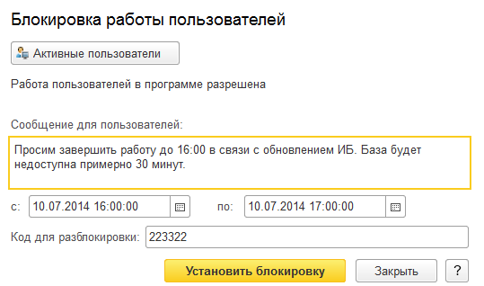
.. |image727.png| image:: media/image377.png
   :width: 3.875in
   :height: 1.6875in
.. |image729.png| image:: media/image378.png
   :width: 3.21875in
   :height: 1.55208in

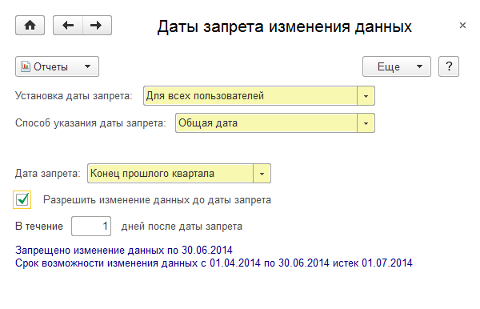

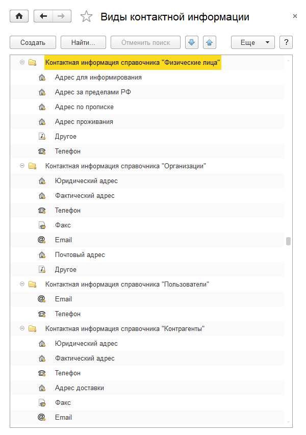
.. |image743.png| image:: media/image385.png
   :width: 3.40625in
   :height: 4.83333in

.. |image751.png| image:: media/image389.png
   :width: 4.33333in
   :height: 1.90625in

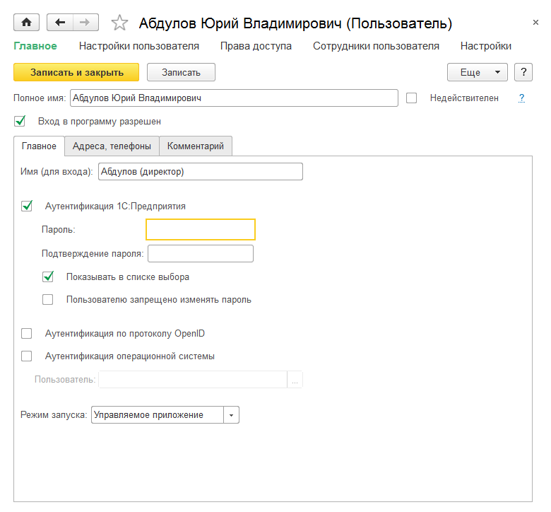
.. |image757.png| image:: media/image392.png
   :width: 2.8125in
   :height: 1.11458in
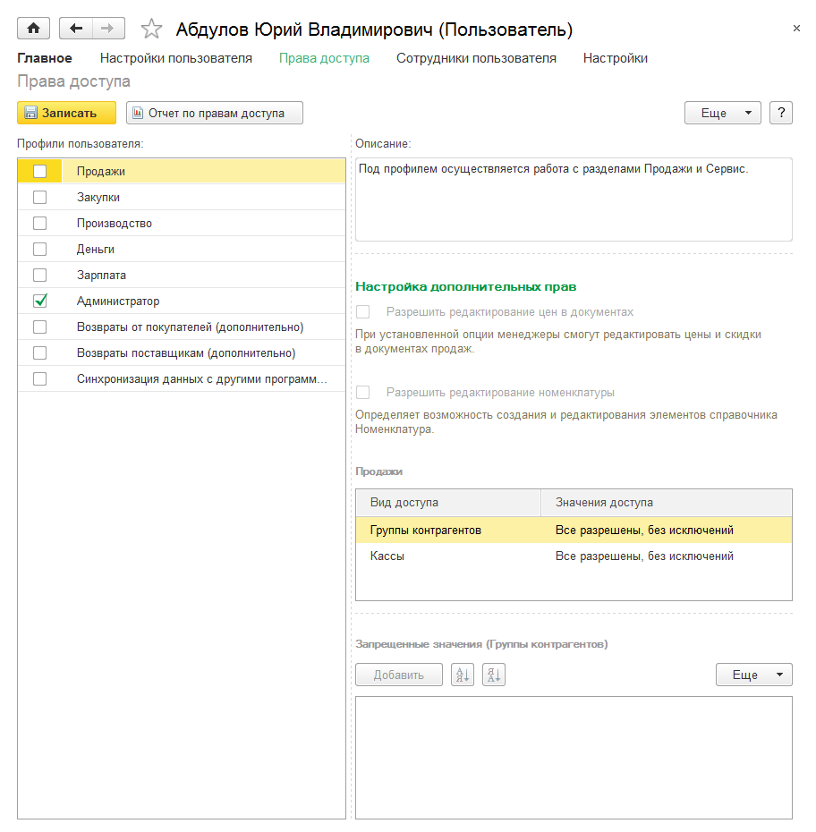

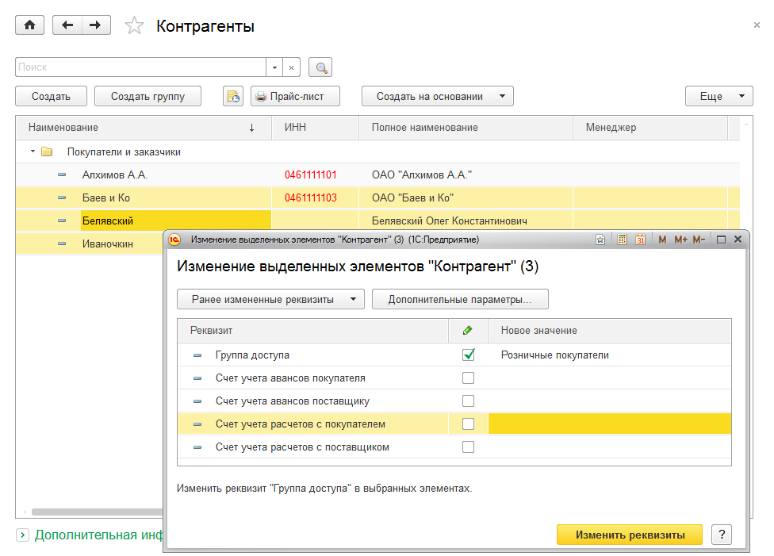

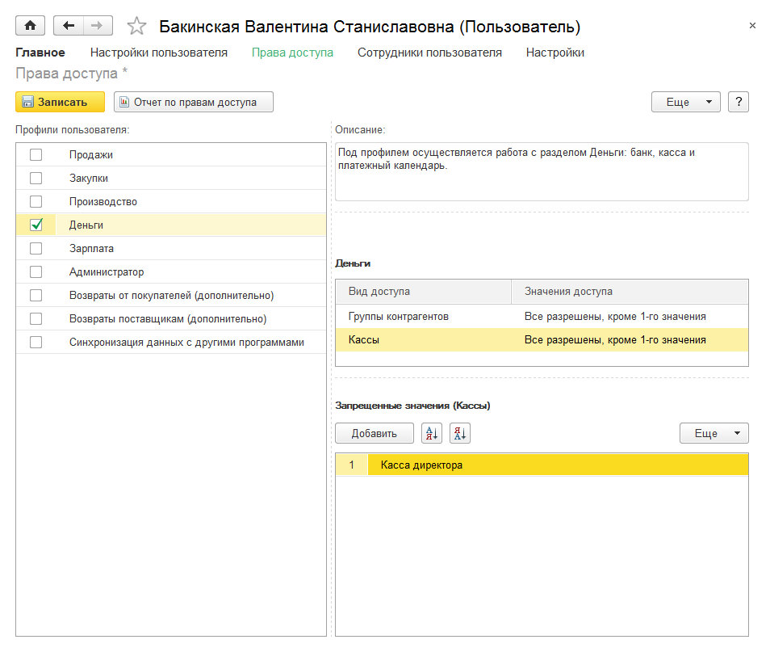
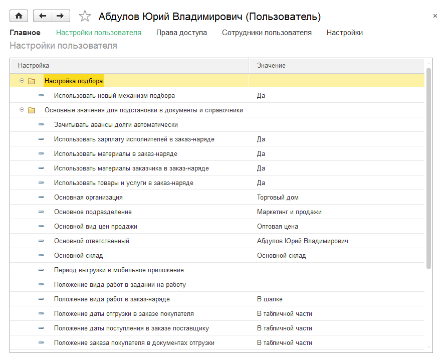
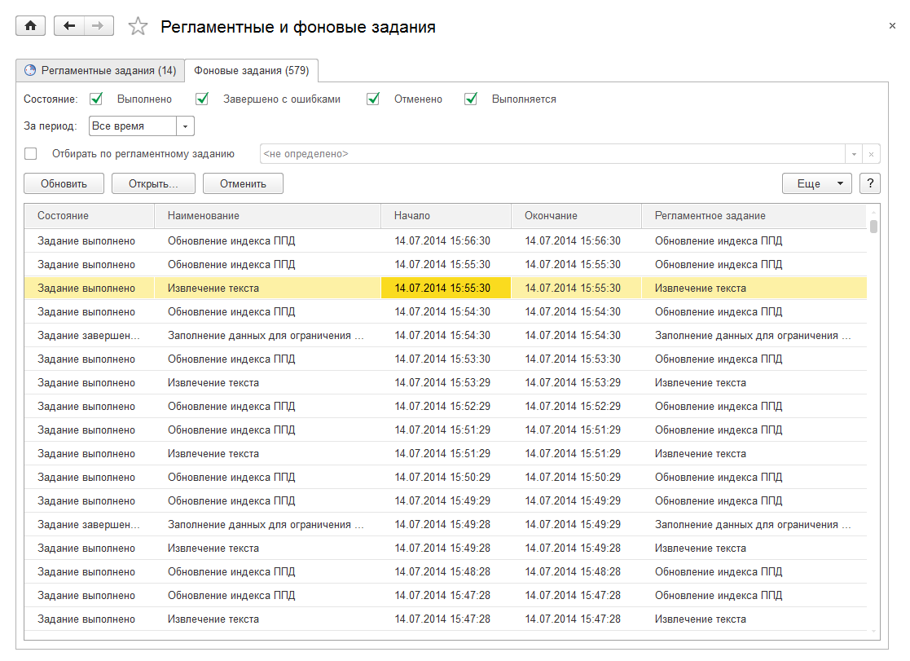
.. |image776.png| image:: media/image401.png
   :width: 4.33333in
   :height: 2.83333in
.. |image778.png| image:: media/image402.png
   :width: 4.33333in
   :height: 2.67708in
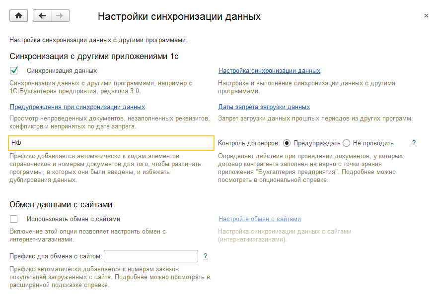
.. |image782.png| image:: media/image404.png
   :width: 4.33333in
   :height: 2.875in
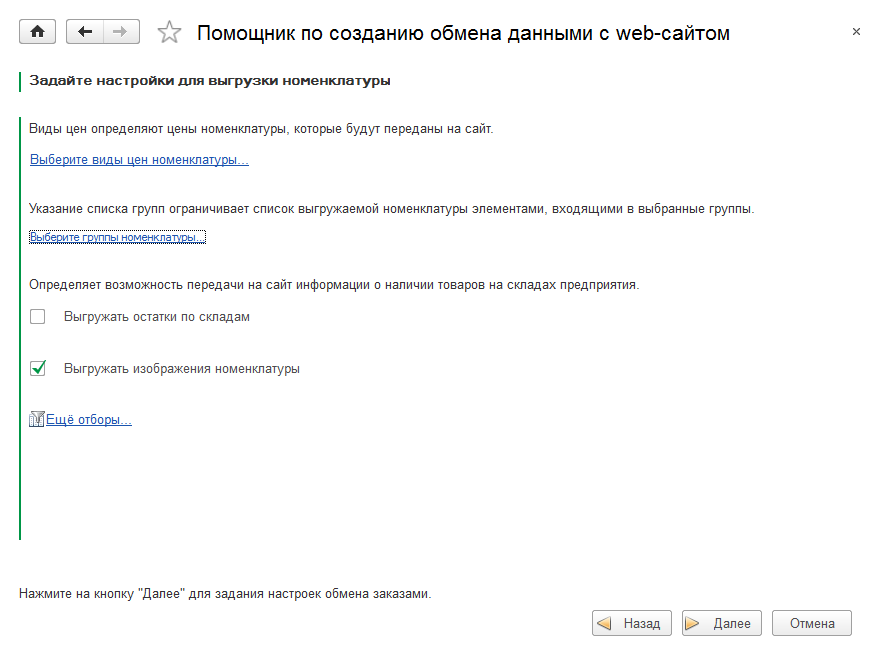
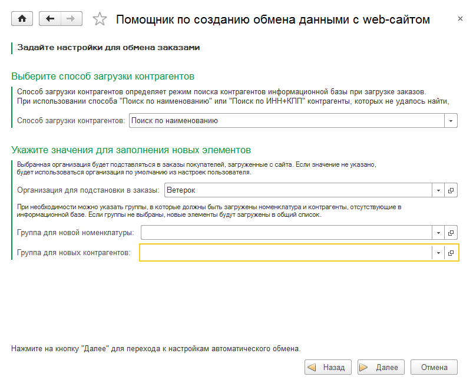
.. |image790.png| image:: media/image407.png
   :width: 4.33333in
   :height: 3.17708in
.. |image792.png| image:: media/image408.png
   :width: 3.96875in
   :height: 1.8125in
.. |image794.png| image:: media/image409.png
   :width: 3.80208in
   :height: 1.19792in
.. |image796.png| image:: media/image410.png
   :width: 3.15625in
   :height: 1.71875in
.. |image798.png| image:: media/image411.png
   :width: 4.33333in
   :height: 2.94792in
.. |image800.png| image:: media/image412.png
   :width: 4.13542in
   :height: 4.02083in
.. |image802.png| image:: media/image413.png
   :width: 4.32292in
   :height: 1.39583in
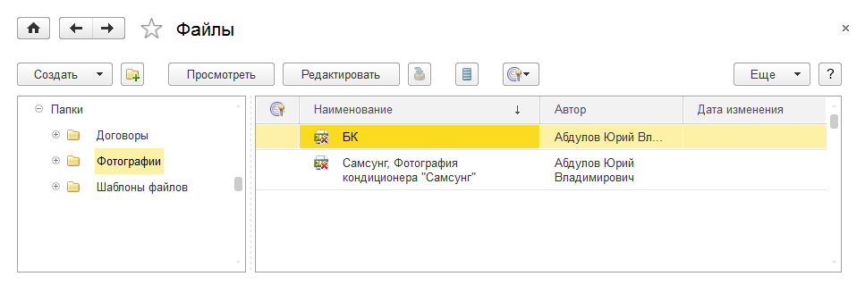
