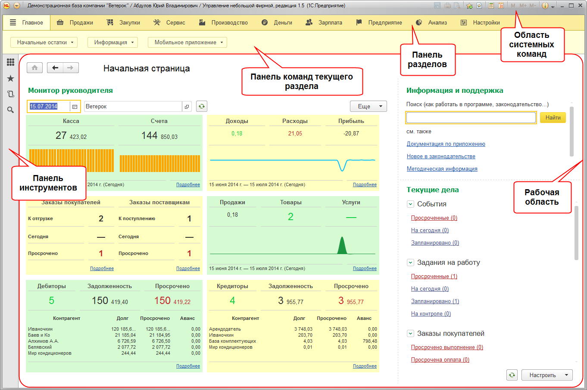
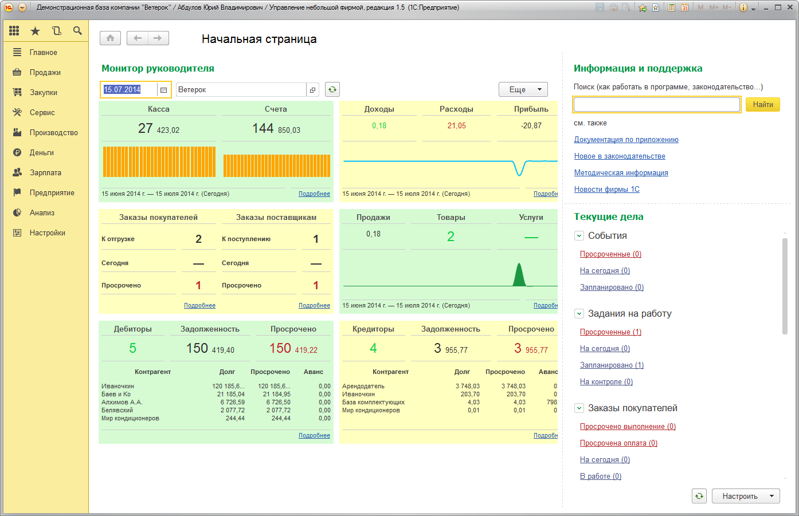
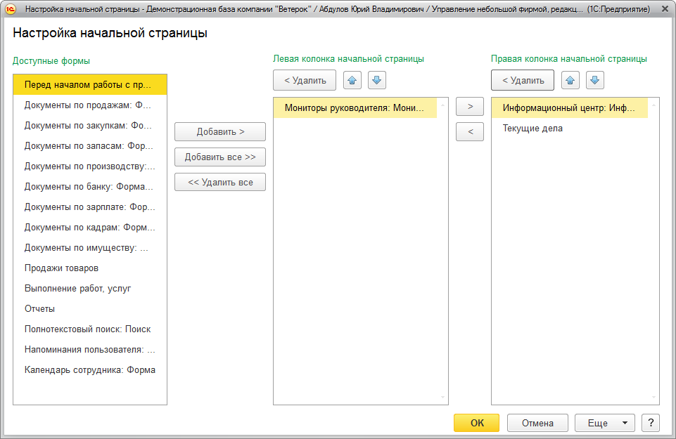
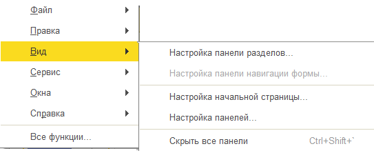
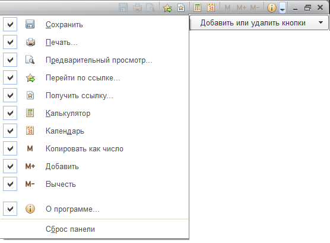
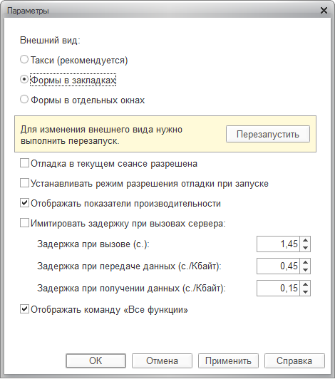
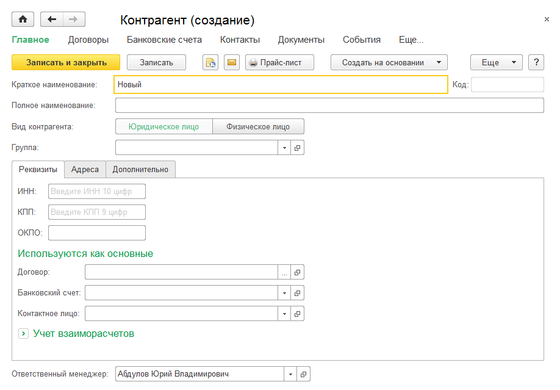
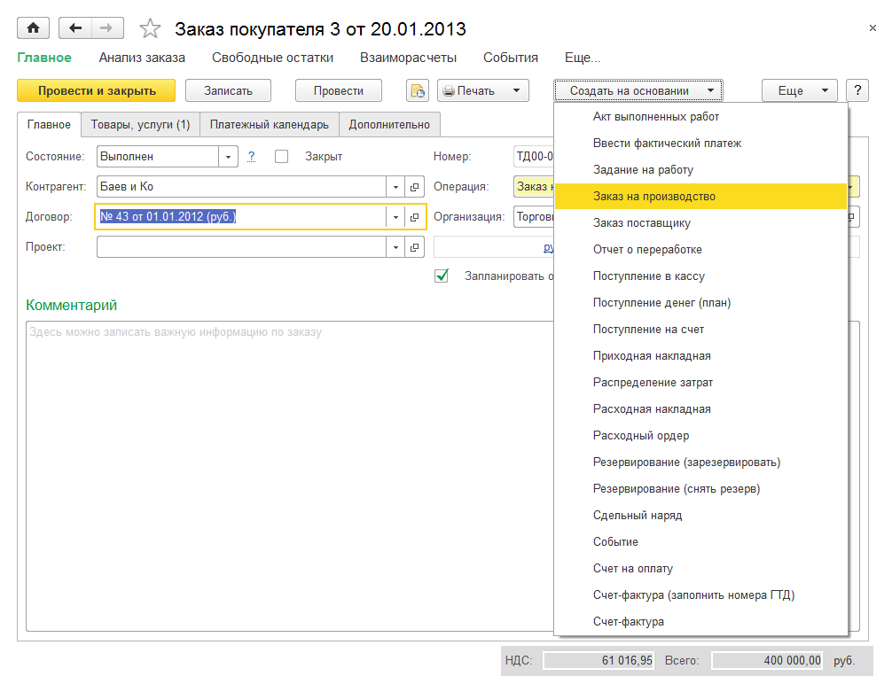
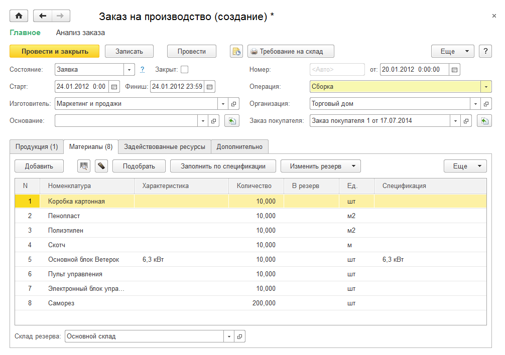
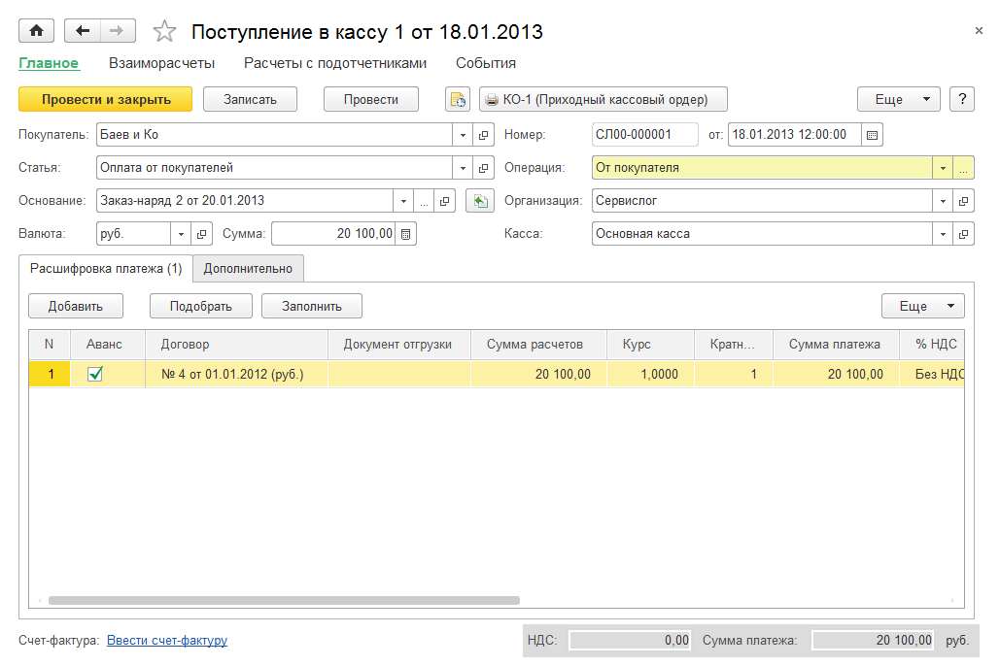

Приложение
==========

Интерфейс программы
-------------------

Программа имеет интерфейс «ТАКСИ», отличительные особенности которого:

* крупный шрифт;

* максимизация рабочего пространства на мониторах с различным
разрешением;

* современный дизайн интерфейса;

* комфортность работы пользователей в течение длительного времени;

* удобство навигации за счет использования вспомогательных панелей:
«Инструменты», «Избранное», «История» и «Полнотекстовый поиск»;

* понятность и удобство поиска в списках, управление поиском;

* возможность самостоятельно конструировать свое рабочее пространство.

Основное окно приложения предназначено для навигации по приложению,
вызова различных команд, для работы с конкретными объектами
информационной базы (например, с документами или элементами списков). Во
вспомогательных окнах открываются системные функции, такие как
календарь, калькулятор и т. д.

Чтобы открыть ту или иную форму, следует найти в интерфейсе нужную
команду (открытие списка, ввода документа и т. д.) и выполнить ее
(выбрать с помощью мыши или клавиши **Enter**).

|image806.png|

Окно устроено таким образом, что позволяет достаточно легко
ориентироваться в программе, перемещаться между различными областями,
переключаться между открытыми формами и окнами.

Существует возможность изменять размеры основного окна с помощью мыши.

Конструирование рабочего пространства
~~~~~~~~~~~~~~~~~~~~~~~~~~~~~~~~~~~~~

Интерфейс «ТАКСИ» позволяет самостоятельно конструировать свое рабочее
пространство, располагая панели в разных областях экрана. Чтобы открыть
схему **Настройка панелей**, нужно нажать кнопку **Главное меню**
|image808.png|,
которая находится в верхнем левом углу экрана, и выбрать **Вид –
Настройка панелей**.

|image810.png|

Положение панелей меняется путем перетаскивания их мышкой по областям
экрана.

В нижней (серой) части окна находятся панели, которые на данный момент
не отображаются в окне программы, но могут быть добавлены в интерфейс.

В верхней части окна серыми пунктирными рамками отображены области, в
которые можно перетащить панели.

Чтобы добавить панель в интерфейс, нужно перетащить ее мышью в область
доступных. Если в требуемой области уже отображается другая панель, то
новая панель будет отображаться рядом с отображаемой. С помощью мыши
можно изменять область отображения уже отображаемых панелей.

Чтобы убрать панель из интерфейса, нужно перетащить ее с помощью мыши из
области отображаемых панелей в область неиспользуемых. Чтобы вернуть
расположение панелей по умолчанию, нажать кнопку **Стандартные**.

Для просмотра результата изменения расположения панелей нажать кнопку
**Применить**.

Для завершения редактирования отображения панелей следует нажать кнопку
**ОК**.

Начальная страница
~~~~~~~~~~~~~~~~~~

Работа пользователя с программой начинается с начальной страницы, на
которой расположена форма **Перед началом работы с программой**. После
заполнения данных об организации и ввода начальных остатков меняется
состав форм начальной страницы, который зависит от профиля пользователя.
Например, для пользователя с полными правами на начальной странице
отображается форма **Монитор руководителя** и список текущих дел.

|image812.png|

Для переключения между формами начальной страницы используется клавиша
**F6**.

Система позволяет устанавливать состав форм, которые отображаются на
начальной странице. При этом можно управлять только теми формами,
которые расположены на начальной странице.

Для перехода к диалогу настройки начальной страницы в главном меню нужно
выбрать команду **Вид – Настройка начальной страницы**.

Настройка производится в диалоге, состоящем из трех списков: **Доступные
формы** и группы колонок **Левая колонка**, **Правая колонка**. В списке
**Доступные формы** отображаются формы, не используемые ни в левой, ни в
правой колонке.

|image814.png|

Формы можно перетаскивать из одного списка в другой с помощью кнопок
**Добавить >**, **Добавить все >>**, перемещать между колонками с
помощью кнопок **>** и **<**. Чтобы удалить форму из колонки (поместить
ее обратно в список доступных форм), нужно выбрать ее в списке и нажать
кнопку **< Удалить** или дважды щелкнуть по названию формы в списке.
Чтобы удалить все формы с начальной страницы, нажать кнопку **<< Удалить
все**. Также можно изменять порядок форм в колонках с помощью кнопок
|image816.png|.
Формы выводятся на начальной странице в том же порядке, который
установлен в настройках.

В процессе настройки можно отменить изменения, сделанные как в данном
сеансе работы, так и ранее, и вернуться к настройкам, заданным в
конфигурации. Для этого в меню **Еще** имеется команда **Установить
стандартные настройки**. Эта команда не вызывает немедленного изменения
командного интерфейса. После ее выполнения настройку можно продолжить.
Применение настроек происходит по нажатию кнопки **OK**.

Настройка отображения панелей
~~~~~~~~~~~~~~~~~~~~~~~~~~~~~

Чтобы настроить или спрятать панели, нужно использовать соответствующие
команды главного меню **Вид**.

|image818.png|

Данное подменю позволяет управлять видимостью панелей и содержимым
панели разделов, панелей навигации формы и начальной страницы. Это дает
возможность увеличить место под формы и уменьшить вероятность появления
полос прокрутки. Чтобы спрятать все панели, используется команда
главного меню **Вид – Скрыть все панели** или сочетание клавиш **Ctrl +
Shift + `**.

Панель разделов
~~~~~~~~~~~~~~~

При настройке панели разделов пользователь устанавливает список команд
перехода к разделам.

Диалог настройки панели разделов открывается командой главного меню
**Вид – Настройка панели разделов...**

|image820.png|

Чтобы добавить раздел на панель, нужно выбрать его в списке доступных
разделов и нажать кнопку **Добавить >**. В диалоге настройки
поддерживается перемещение элементов списка с помощью мыши и выбор
нескольких строк.

Чтобы добавить на панель все доступные разделы, нужно нажать кнопку
**Добавить все >>**. Также можно перемещать разделы между списками
двойным нажатием левой кнопки мыши по разделу в списке.

Чтобы удалить команды из панели, следует использовать кнопки **Удалить**
и **Удалить все**.

Последовательность разделов на панели регулируется с помощью кнопок
командной панели списка.

Для любого раздела можно настроить представление. Для этого нужно
выбрать пункт и установить требуемый способ отображения в списке
**Показывать**: **Картинка**, **Текст**, **Картинка и текст**.

Чтобы применить выбранные настройки и закрыть форму, нужно нажать кнопку
**OK**. При этом происходит сохранение настроек в информационной базе.

В процессе настройки можно отменить изменения, сделанные как в данном
сеансе работы, так и ранее, и вернуться к настройкам, заданным в
конфигурации. Для этого нужно выбрать пункт **Еще – Установить
стандартные настройки**. Исполнение этой команды не вызывает
немедленного изменения командного интерфейса. После ее выполнения можно
продолжить настройку.

Область системных команд основного и вспомогательного окна
~~~~~~~~~~~~~~~~~~~~~~~~~~~~~~~~~~~~~~~~~~~~~~~~~~~~~~~~~~

Чтобы добавить или удалить кнопки на стандартной командной панели
основного или вспомогательного окна, следует нажать кнопку
|image822.png| (**Другие
кнопки**) в правом верхнем углу экрана, в появившемся меню навести
курсор мыши на пункт **Добавить или удалить кнопки** и в отобразившемся
меню установить или снять пометку напротив названия команды.

|image824.png|

Команда, для которой пометка установлена, отобразится в области
системных команд окна. Команда, для которой пометка снята, скроется из
области. Для возврата панели первоначального вида используется пункт
**Сброс панели**.

Настройка формы
~~~~~~~~~~~~~~~

При работе в программе доступна пользовательская настройка формы. Окно
редактора формы открывается при вызове команды **Еще – Изменить форму**
на командной панели формы.

|image826.png|

В левой части окна в виде дерева отображается структура элементов формы.
В правой части – список свойств выбранного элемента формы.

Содержание и внешний вид формы определяются набором составляющих форму
элементов нескольких видов.

* группы (нескольких видов),

* таблицы,

* поля (нескольких видов),

* кнопки.

Эти элементы обладают свойствами, влияющими на способ их отображения в
форме. Иерархическая организация элементов определяет их взаимное
расположение в форме.

Можно изменять состав, взаимное расположение, группировку и свойства
элементов.

Чтобы изменить положение элементов в иерархии, следует использовать
кнопки **Вверх** и **Вниз** или перетащить элемент на нужное место с
помощью мыши.

Для каждого элемента свойства настраиваются в свойствах элемента формы.
Описание каждого свойства отображается в нижней части панели при выборе
свойства.

Для изменения видимости элементов на форме (скрыть или показать)
используются флажки напротив элементов. Следует отметить, что нельзя
управлять видимостью корневого элемента **Форма** и кнопки настройки
формы. Также не может быть изменена видимость командной панели, на
которой расположена кнопка **Изменить форму...**

Чтобы добавить группу на форму, нужно выбрать в дереве структуры
корневой элемент **Форма** и нажать кнопку **Добавить группу**. В
свойствах группы установить требуемый вид (**Обычная группа**,
**Страницы**, **Командная панель**).

Для некоторых полей может быть доступна кнопка **Добавить поля**. Это
означает, что у данных, отображаемых в поле/колонке, есть реквизиты,
которые также могут быть отображены в поле/колонке. Для того чтобы
добавить на форму реквизиты полей, следует выбрать элемент формы, нажать
кнопку **Добавить поля** и в появившемся окне выбрать требуемые
реквизиты.

Применение настроек происходит при выходе из редактора настройки с
помощью кнопки **OK** или по команде **Применить**. При этом настройки
сохраняются в информационной базе, чтобы впоследствии их можно было
применить при открытии формы.

В процессе настройки можно отменить изменения, сделанные как в данном
сеансе работы, так и ранее, и вернуться к настройкам формы, заданным в
конфигурации. Для этого используется команда **Установить стандартные
настройки** меню **Еще**. Эта команда не вызывает немедленного изменения
формы. После ее выполнения настройку можно продолжить. Применение
настроек происходит только при нажатии кнопки **OK** или **Применить**.

Системные параметры
~~~~~~~~~~~~~~~~~~~

Диалог установки системных параметров предназначен для выбора внешнего
вида программы и настройки режимов отладки разработчиком или
администратором.

Для вызова диалога настройки параметров системы «1C:Enterprise»
используется команда главного меню **Сервис – Параметры**.

|image828.png|

В диалоге возможна настройка следующих параметров:

* **Внешний вид** – чтобы параметр вступил в силу, требуется
перезапуск программы. Использование данного параметра зависит от
настроек программы. Доступны следующие варианты:

+ **Такси (рекомендуется)** – доступность данного внешнего вида
зависит от настроек программы;

+ **Формы в закладках** – подробнее о данном режиме открытия форм см.
книгу «1C:Enterprise. Руководство пользователя»;

+ **Формы в отдельных окнах** – подробнее о данном режиме открытия
форм см. книгу «1C:Enterprise. Руководство пользователя»;

* **Отладка в текущем сеансе разрешена** – если флажок установлен, то
в исполняемом экземпляре «1С:Предприятия» разрешена отладка;

* **Устанавливать режим разрешения отладки при запуске** – если флажок
установлен, то отладка будет разрешена при последующем запуске
экземпляров приложения;

* **Отображать показатели производительности** – если установлен
флажок, то в отдельном специальном окне, которое по умолчанию
расположено в левом нижнем углу экрана, будут отображаться показатели
производительности;

* **Имитировать задержку при вызовах сервера** – данный параметр
используется для проверки работы Решения в условиях соединения по
медленным каналам;

* **Отображать команду "Все функции"** – если данный флажок
установлен, то в меню добавляется команда **Все функции**, с помощью
которой возможно выполнение различных действий. В список включены все
объекты Решения независимо от того, включены ли они в интерфейс системы
или нет. Данная настройка доступна, если пользователь имеет право на
использование режима **Все функции**.

Подробнее о влиянии значений системных параметров см. в книге
«1C:Enterprise. Руководство разработчика».

Управление окнами
~~~~~~~~~~~~~~~~~

В процессе работы помимо основного окна может быть открыто несколько
вспомогательных. Платформа предоставляет механизм управления окнами и
перехода между ними.

Для вызова диалога управления окнами нужно выбрать пункт **Окна – Все
окна** главного меню. В диалоге отображается список окон, открытых к
настоящему моменту.

Чтобы перейти к требуемому окну, нужно выбрать его в списке и нажать
кнопку **Перейти**. Диалог окна закроется автоматически.

Чтобы закрыть несколько окон, следует выбрать их с помощью мыши,
удерживая клавишу **Shift**, и нажать кнопку **Закрыть окна**. Основное
окно не может быть закрыто с помощью этого диалога.

Также для переключения между окнами одного сеанса используются сочетания
клавиш **Ctrl + Tab, Ctrl + Shift + Tab, Ctrl + Shift + F6**. Для
перехода к следующему активному окну следует нажать клавиши **Ctrl +
Tab** или **Ctrl + F6**, для перехода к предыдущему окну – **Ctrl +
Shift + Tab** или **Ctrl + Shift + F6**. При этом учитываются открытые
модальные и блокирующие окна – окно, перекрытое блокирующим окном,
активировано не будет.

Окна текстовых и табличных документов
~~~~~~~~~~~~~~~~~~~~~~~~~~~~~~~~~~~~~

Система «1C:Enterprise» помимо различных форм, предназначенных для
учетных целей, предоставляет возможность работы с текстовыми и
табличными документами (отчеты и созданные пользователем табличные
документы). Для этих типов окон становятся доступными пункты меню,
предоставляющие дополнительный сервис при просмотре и редактировании.

Восстановление положения окна
~~~~~~~~~~~~~~~~~~~~~~~~~~~~~

Положение, размер и состояние окна можно изменять. При закрытии
последние параметры отображения сохраняются, и при повторном открытии
окно открывается с последними значениями параметров показа.

Для восстановления первоначального положения, размера и состояния окна
следует в главном меню выбрать пункт **Окна – Восстановить положение
окна**. При этом запомненные значения параметров показа сбрасываются и
восстанавливаются первоначальные, какие были при первом открытии.

Пример основного бизнес-процесса
--------------------------------

Рассмотрим пример основного бизнес-процесса с использованием данных
демонстрационной базы.

Пусть компания «Ветерок» занимается сборкой, продажей и монтажом
кондиционеров. Сведения о товарах и услугах заранее введены в
информационную базу.

В компанию обращается новый клиент с желанием заказать кондиционер с
установкой и монтажом.

Регистрация нового клиента
~~~~~~~~~~~~~~~~~~~~~~~~~~

Для регистрации нового клиента нужно перейти в раздел программы
**Продажи** и на панели действий нажать гиперссылку **Контрагент**. В
результате откроется форма ввода сведений о клиенте.

|image830.png|

Если клиент является физическим лицом, то для него достаточно ввести имя
или фамилию в поле **Наименование**.

Регистрация заказа покупателя и договора
~~~~~~~~~~~~~~~~~~~~~~~~~~~~~~~~~~~~~~~~

Переходим к оформлению заказа покупателя. Этот документ удобно
сформировать непосредственно из карточки контрагента сразу после
регистрации.

|image832.png|

В новом документе необходимо указать договор и заполнить в нем поля
сроков оплаты.

|image834.png|

Регистрация выпуска кондиционера
~~~~~~~~~~~~~~~~~~~~~~~~~~~~~~~~

Далее пользователь должен выбрать источник обеспечения потребностей по
заказу клиента. В программе доступны следующие источники: заказ на
производство на складе или в подразделении предприятия, заказ
поставщику, остатки на складе. В нашем случае заказ придется разделить
на две части, поскольку в его выполнении участвуют разные подразделения
(собирает кондиционер одно подразделение, а монтирует другое).

Документ **Заказ на производство** можно сформировать на основе
документа **Заказ покупателя** с видом операции **Заказ на продажу**.
Новый документ адресуется подразделению **Сборочный цех**.

|image836.png|

|image838.png|

Факт сборки кондиционера регистрируется документом **Производство**,
который можно сформировать на основании документа **Заказ на
производство**.

Для перемещения выпущенного кондиционера из цеха на склад, откуда он
будет отгружен заказчику, можно либо ввести документ **Перемещение
запасов** (на основании документа **Производство**), указав в поле
**Получатель** место хранения – склад, куда перемещается кондиционер,
либо указать целевые склады и склады-источники непосредственно в форме
документа **Производство**.

|image841.png|

Счет на оплату
~~~~~~~~~~~~~~

На основании заказа покупателю может быть создан документ **Счет на
оплату**.

|image843.png|

Регистрация выполнения монтажа
~~~~~~~~~~~~~~~~~~~~~~~~~~~~~~

Факт монтажа кондиционера и приемки работы клиентом может
регистрироваться документом **Акт выполненных работ** либо
**Заказ-наряд**.

Акт выполненных работ может быть создан либо на основании обычного
заказа покупателя (в этом случае в него автоматически будут перенесены
все заказанные покупателем работы и услуги, не относящиеся к сборке
кондиционера, включая установку и монтаж), либо на основании документа
**Счет на оплату**.

|image845.png|

Документ **Заказ-наряд** вводится независимо и выполняет несколько
функций сразу: заказа покупателя, счета на оплату, акта выполненных
работ и расходной накладной для сферы сервисных услуг со списанием на
него прямых материальных, трудовых затрат.

|image847.png|

Получение оплаты
~~~~~~~~~~~~~~~~

Факт оплаты услуг наличными денежными средствами регистрируется
документом **Поступление в кассу**, создаваемым на основании документа
**Акт выполненных работ** либо **Заказ покупателя** с видом операции
**Заказ-наряд**. Табличное поле формы документа, отображающее детали
платежа, может быть заполнено методом подбора.

|image849.png|

Факт оплаты услуг безналичными денежными средствами регистрируется
документом **Поступление на счет**. Он может быть введен на основании
заказа покупателя, счета, выставленного покупателю, или акта выполненных
работ.

|image851.png|

Использование отчетов
~~~~~~~~~~~~~~~~~~~~~

На всех этапах прохождения бизнес-процесса можно прибегать к помощи
отчетов. Так, информация, содержащаяся в табличных полях документов
**Заказ покупателя**, отображается в отчете **Расчеты с покупателями**.

Сводные данные по выполнению работ и производству продукции отображаются
в отчете **Выпуск продукции**.

.. |image816.png| image:: media/image420.png
   :width: 0.25in
   :height: 0.125in

.. |image820.png| image:: media/image422.png
   :width: 4.25in
   :height: 2.98958in

.. |image826.png| image:: media/image425.png
   :width: 4.22917in
   :height: 3.80208in

.. |image843.png| image:: media/image433.png
   :width: 4.33333in
   :height: 2.44792in

.. |image851.png| image:: media/image437.png
   :width: 4.33333in
   :height: 2.88542in
