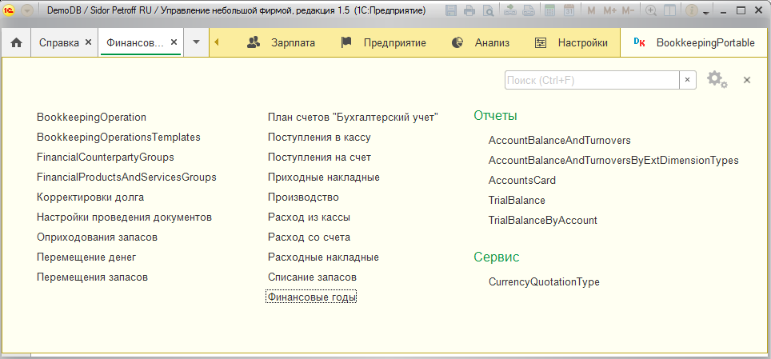
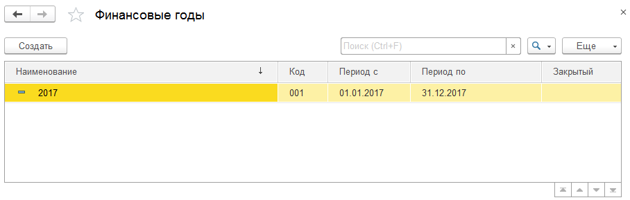
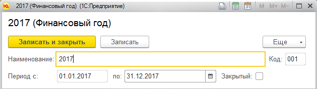
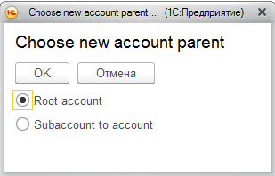
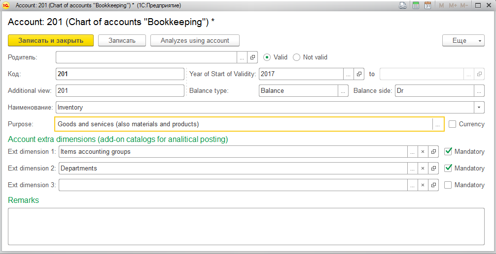
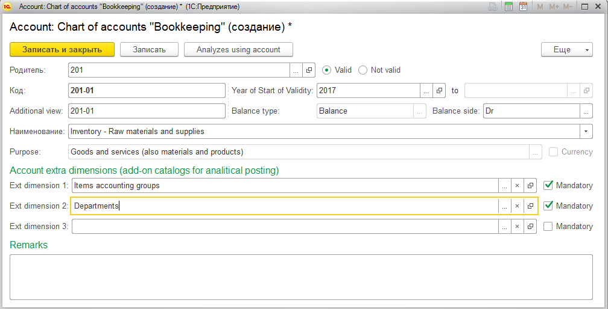
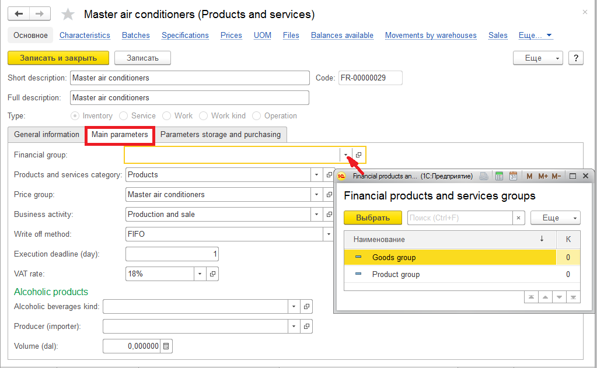
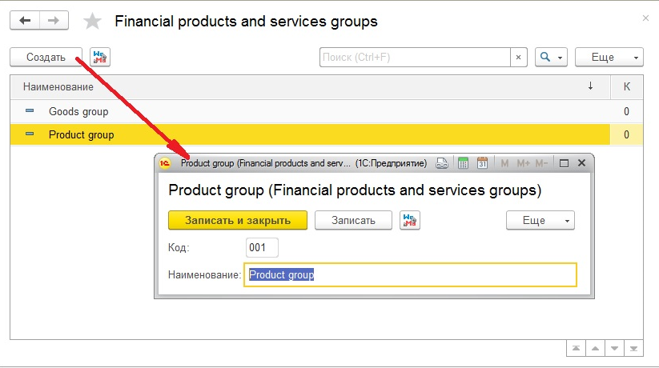
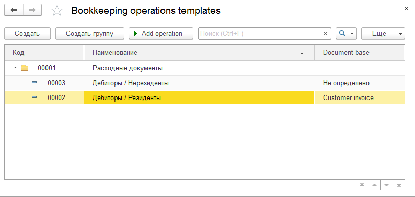
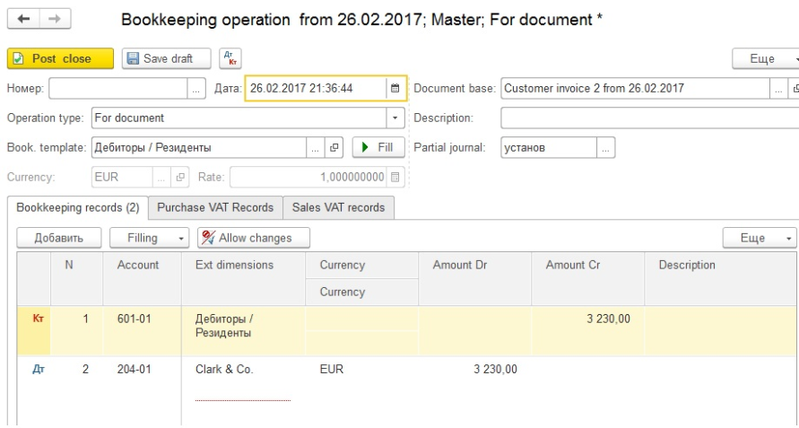

Финансовый блок
===============

Для перехода к финансовому разделу, на панели разделов нажимаем
Bookkeeping portable.

|image437|

Первоначально, для работы в финансовом разделе, необходимо заполнить
План счетов «Бухгалтерский учет», а также справочник Финансовые года.

Справочник финансовые года
--------------------------

Справочник финансовые года предназначен для ввода информации о
финансовом годе. Переход к справочнику осуществляется нажатием кнопки
«Финансовые года» на панели навигации в разделе Bookkeeping portable.

|image438|

Добавление нового элемента справочника происходит по кнопке Создать.

|image439|

В появившемся окне необходимо заполнить Наименование, а также период
действия данного финансового года, который может быть произвольным:
полугодие, год, 18 месяцев и пр. Период финансового года зависит от
внутренней политики предприятия, а также от особенностей
законодательства. Поле код присваивается программой автоматически при
записи.

В случае, если финансовый год является закрытым периодом, проставляется
флаг Закрытый.

.. _план-счетов-1:

План счетов
-----------

Для перехода к плану счетов, на панели разделов нажимаем Bookkeeping
portable, затем Chart of accounts «Bookkeeping». Справочник План счетов
является периодическим: в поле «Year validity» указываем финансовый год,
для которого будет актуален данный набор счетов.

Ввод нового элемента справочника План счетов происходит при
использовании кнопки «Создать». На первом этапе необходимо указать
является ли вводимое значение счетом или субсчетом.

|image440|

Важно! При создании счетов и субсчетов необходимо выполнять следующие
условия:

1. Счета первого уровня должны иметь одинаковое количество символов;

2. Счета второго уровня (субсчета) должны иметь одинаковое количество
символов. При этом количество символов второго уровня может быть
отличен от количества символов первого уровня;

3. Счета второго уровня (субсчета) должны иметь первое субконто равное
субконто счета Родителя.

Для примера введем счет 201 «Inventory» из международного плана счетов:

|image441|

Введем субсчет 201.01 «Inventory - Raw materials and supplies»:

|image442|

При вводе нового элемента справочника План счетов указываем, что
вводимый элемент является субсчетом. В появившемся окне заполняем
следующую информацию:

1. **Родитель** - указываем счет, к которому относится вводимый элемент
(в нашем примере это 201 «Inventory»);

2. **Код** - указываем номер субсчета: 201-01;

3. **Наименование** – наименование счета;

4. в поле **Year of Start of Validity** указываем период действия
данного счета, причем если счет действительный и используется в
программе, то начало периода указывается первый введенный финансовый
год (с которого начинается работа в программе), а конец периода
действия счета будет неактивным. Ввести период, с которого счет
больше не будет использован в программе, можно при установке
радиоточки **No valid**;

5. **Balance type** указывает на признак счета/субсчета: балансовый,
забалансовый или результативный (управленческий). Суммы по
результативным счетам закрываются в конце года и на их основании
строится Отчет о прибылях и убытках;

6. в поле **Balance side** выбираем каким является счет/субсчет:
активным (Dr), пассивным (Cr) или активно-пассивным (Dr/Cr);

7. в поле **Purpose** указываем назначение вводимого счета/субсчета.
Выбранное значение данного поля влияет на набор аналитик (субконто),
которые можно присвоить для вводимого счета/субсчета;

8. флаг **Currency** устанавливается в случае, если счет валютный;

9. поля **Ext dimension 1, Ext dimension 2, Ext dimension 3** –
аналитика счета / субсчета. Таким образом, в программе для счета /
субсчета можно указать три субконто.

Справочник Контрагенты
----------------------

Рассмотрим заполнение справочника Контрагенты для дальнейшего
использования в финансовом блоке.

В карточке Контрагента на вкладке Additionally необходимо указать
бухгалтерскую группу. Бухгалтерские группы позволяют присваивать группе
контрагентов определенный набор счетов, которые будут в последствии
использоваться в бухгалтерских проводках.

|image443|

Для добавления новой бухгалтерской группы, необходимо создать новый
элемент в справочнике Financial counterparty groups:

|image444|

В поле наименование указывается наименование бухгалтерской группы
контрагентов. Записываем введенный элемент и нажимаем на пиктограмму
|image445| для указания набора бухгалтерских счетов:

|image446|

Данные бухгалтерских счетов вводятся в справочник Bookkeeping Settings
Common Form (Общие параметры списка счетов). Данный справочник является
периодическим, благодаря чему можно настраивать список счетов на
определенную дату.

Заполнение справочника следующее:

-  period – дата, с которй начинает действовать данный список счетов;

-  Ac. «Ac. Payable» - счет кредиторской задолженности (задолженности
перед поставщиком);

-  Ac. «Prepayment for customer» - счет полученного аванса от
покупателя;

-  Ac. «Prepayment for supplier» - счет выданного аванса поставщику;

-  Ac. «Ac. receivable» - счет дебиторской задолженности (задолженности
покупателя).

Для заполнения бухгалтерской группы Резиденты / Дебиторы (из
вышеприведенного примера) достаточно заполнить счет дебиторской
задолженности и счет полученных авансов от покупателя. Можно
настроить данный список таким образом, что в одной бухгалтерской
группе будут заполнены счета дебиторской и кредиторской задолженности
одновременно, но в проводки программа будет использовать счета
расчетов в зависимости от того, что указано в шаблоне типовой
операции.

|image447|

Справочник Номенклатура
-----------------------

В справочнике Номенклатура необходимо, так же как и в справочнике
Контрагенты, внести информацию о бухгалтерской группе.

В карточке Номенклатуры на вкладке Main parameters необходимо указать
бухгалтерскую группу в поле «Financial group». Бухгалтерские группы
позволяют присваивать группе элементов номенклатуры определенный набор
счетов, которые будут впоследствии использоваться в бухгалтерских
проводках:

|image448|

Список бухгалтерских групп хранится в справочнике Financial products and
services groups.

Для добавления нового элемента справочника, нажимаем на кнопку «Создать»
на панели инструментов:

|image449|

Заполнение элемента справочника следующее:

-  Код – присваивается программой автоматически, но может быть изменен
при необходимости;

-  Наименование – заполняется наименование бухгалтерской группы товаров
и услуг.

После записи элемента справочника, необходимо присвоить список счетов
для данной бухгалтерской группы. Для этого, на панели инструментов
нажимаем на кнопку |image450|.

Данные бухгалтерских счетов записываются в справочник Bookkeeping
Settings Common Form («Общие параметры списка счетов»). Справочник
является периодическим, благодаря чему можно настраивать список
счетов на определенную дату.

|image451|

Заполнение справочника следующее:

-  period – дата, с которй начинает действовать данный список счетов;

-  Ac. «Cost of goods» - счет учета товарно-материальных ценностей;

-  Ac. «Sales amount» - счет доходов от продаж;

-  Ac. «Sales costs» - счет затрат (себестоимости).

Шаблон типовых операций
-----------------------

Шаблон типовых операций представляет собой бухгалтерские проводки,
специфичные для определенной операции. Список шаблонов типовых операций
находится в разделе Bookkeeping portable. Данный справочник является
иерархическим, т.е. можно создавать группы и подгруппы для типовых
операций. К примеру, группа Расходные документы может быть разделена на
подгруппы: Дебиторы / Резиденты, Дебиторы / Нерезиденты и пр.

|image452|

Рассмотрим заполнение реквизитов шаблона типовой операции.

На вкладке «General» указываются основные реквизиты типовой операции:

|image453|

-  Наименование – указывается наименование шаблона бухгалтерской
операции;

-  Document base – документ основания, который выбирается из выпадающего
списка документов;

-  Set filter - позволяет устанавливать фильтр для выделения из списка
документов только тех, в которых присутствует реквизит, по которому
создается фильтр:

|image454|

К примеру, фильтр по Подразделению: будут отбираться документы
Customer invoice, в которых подразделение равно значению Main
department;

-  Description for bookkeeping operation - текстовое поле, в котором
отражается краткое описание бухгалтерской операции;

-  Group records – установка флага позволяет группировать проводки, т.е.
при наличии в одном документе одинаковых позиций, участвующих в
бухгалтерской проводке, программа объединяет. К примеру, в документе
указаны несколько номенклатурных позиций, которые входят в одну
группу, а в бухгалтерской проводке аналитика ведется по группам. В
таком случае, данные позиции в бухгалтерской проводке объединяться в
одну;

-  Don’t generate zero records – при установке данного флага записи с
нулевой суммой не формируются;

-  Lock/Unlock template – устанавливает блокировку бухгалтерской
проводки в случае, если данный шаблон больше не будет использоваться
в документах.

На вкладке Bookkeeping records отражаются бухгалтерские проводки,
присущие для данной бухгалтерской операции:

|image455|

Бухгалтерские проводки формируются на основании различных данных: на
основании данных документа, табличных частей или регистров, по
которым делается запись того документа, который выбран в качестве
основания в поле Document base.

Для добавления основания необходимо воспользоваться кнопкой
|image456|, а для удаления - |image457|.

После ввода хотя бы одного элемента, на основании которого будет
создана бухгалтерская запись, становится доступной кнопка |image458|,
с помощью которой можно создавать необходимое количество проводок,
присущие одной бухгалтерской типовой операции.

В поле Account отражается счет учета (выбирается из справочника
Bookkeeping Settings Common Form: элементов списка бухгалтерских
групп Номенклатуры или Контрагентов), а в полях Extra dimension –
аналитика выбранного счета.

В поле Amount Dr указываем какое значение будет попадать в сумму по
дебету, а в поле Amount Cr –какое значение будет попадать в
кредитовую сумму. В поле Description можно ввести стандартную фразу,
которая будет кратко описывать данную проводку. В Поле Conditions
можно указать условия, при которых будет срабатывать данная
бухгалтерская запись.

Автоматический расчет курсовых разниц при формировании проводки
возможен при установке флага Use in exchange rate difference
calculations.

На вкладке Purchase VAT Records – отражается шаблон проводок для
отражения НДС при покупках (принимаемый к зачету), а на вкладке Sales
VAT Records – проводки по НДС от продаж (к уплате в бюджет).

На вкладке Exchange rate differences – отражается счет и аналитика
курсовых разниц.

Формирование бухгалтерских проводок
-----------------------------------

После процедуры создания шаблона типовых операций, можно приступить к
формированию бухгалтерских проводок. Для этого необходимо в журнале
документов, для которого формируется бухгалтерская запись, выделить
необходимый элемент и нажать на кнопку |image459|. Если для данного
документа ранее не было создана бухгалтерская проводка, программа выдаст
соответствующее сообщение и предложит пользователю создать ее.

|image460|

Бухгалтерская проводка автоматически будет создана на основании данных
документа:

|image461|

Групповое проведение документов
-------------------------------

Для групповой обработки документов и автоматического создания
бухгалтерских проводок, предназначена обработка Bookkeeping posting
settings, которая находится в разделе Bookkeeping portable. При запуске
данной обработки, выводится список документов (определяемых
пользователем самостоятельно), с указанием признака: сформированы ли
бухгалтерские проводки или нет, а также для ввода шаблона бухгалтерских
операций в случае их отсутствия.

.. |image443| image:: media/image444.png
   :width: 3.79225in
   :height: 1.87762in
.. |image444| image:: media/image445.png
   :width: 3.72025in
   :height: 1.20314in

.. |image446| image:: media/image447.png
   :width: 3.73117in
   :height: 1.87676in
.. |image447| image:: media/image448.png
   :width: 3.89307in
   :height: 2.01566in

.. |image451| image:: media/image451.png
   :width: 4.05208in
   :height: 1.94792in

.. |image453| image:: media/image453.png
   :width: 4.05208in
   :height: 1.74792in
.. |image454| image:: media/image454.png
   :width: 3.69408in
   :height: 1.85783in
.. |image455| image:: media/image455.png
   :width: 4.05625in
   :height: 1.79167in
.. |image456| image:: media/image456.png
   :width: 0.26944in
   :height: 0.25208in
.. |image457| image:: media/image457.png
   :width: 0.27847in
   :height: 0.25208in
.. |image458| image:: media/image458.png
   :width: 1.04375in
   :height: 0.24375in
.. |image459| image:: media/image459.png
   :width: 0.30417in
   :height: 0.30417in
.. |image460| image:: media/image460.png
   :width: 4.04028in
   :height: 1.74375in

