**1C:Enterprise**

Решение «1C:SimpleERP»

**Редакция 1.0.0.1**

Описание

 

 

 

 

 

 

 

ЕВРОПА

Фирма «1С»

2017

**ПРАВО ТИРАЖИРОВАНИЯ ПРОГРАММНЫХ СРЕДСТВ И ДОКУМЕНТАЦИИ ПРИНАДЛЕЖИТ
ФИРМЕ «1С»**

Приобретая систему «1C:Enterprise», вы тем самым даете согласие не
допускать копирования программ и документации без письменного разрешения
фирмы «1С».

© ООО «1С», 2017

Фирма «1С», Москва, 123056, а/я 64.

Отдел продаж: Селезневская ул., 21,

телефон: +7 (495) 737-92-57,

факс: +7 (495) 681-44-07.

E-mail: int@1c.com

URL: `www.1c-dn.com <http://www.1c-dn.com>`__

Группа разработки программ – Aghabekyan Karen («Risecompany», Armenia),
Akulov Pavlo («1C-Poland», Poland), Aripov Nikita («1C», Russia),
Asarowski Dimitri («Edv-Lotse», Germany), Baydikov Igor («Marco»,
Azerbaidjan), Bugaevsky Timofey («1C», Russia), Gabdrakhmanov Ildar
(«1C», Vietnam), Ientts Vladyslav («1C-Poland», Poland), Jascin Olga
(«1Attimo», Italy), Kiselyov Ilya («ELMI», Latvia), Kondratyev Alexey
(«1C», Vietnam), Koriakovskaia Anna («AnaSoft», Dubai), Kovalev Sergey
(«1C-Germany», Germany), Lavrov Maxim («1C-Poland», Poland), Nikolaev
Nikolay («ACNC», Estonia), Osypenko Serhii (Lithuania), Paraschiv Rares
(«1C-Romania», Romania), Pintov Vasily (Russia), Polikarpov Sergei
(«1C», Russia), Ponomarenko Eugene (Ukraine), Popov Nikita
(«Risecompany», Russia), Ryabko Vitaly (Hungary), Sargsyan Sevak
(«Risecompany», Armenia), Serb Adelin («1C-Romania», Romania),
Shcherbakov Dmitry (Ukraine), Shihov Ilya («Risecompany», Russia),
Shilkin Nick («Raycon», Russia), Snitkovski Alexei («1C-Romania»,
Romania), Sosna Yevhen (Ukraine), Stupakovski Maxim («Program
Solutions», Moldova), Suschevici Sergei («1C-Account Timbal», Moldova),
Tarabanov Roman (Russia), Teravainen Andrei («ELMI», Latvia), Timbal
Evghenii («1C-Account Timbal», Moldova), Tomsa Dan («Previa», UK),
Zakirov Alexey («1C», Vietnam)

Переводы – Baydikov Igor («Marco», Azerbaidjan), Bugaevsky Timofey
(«1C», Russia), Jascin Olga («1Attimo», Italy), Khafizova Evgeniya
(«Risecompany», Russia), Koriakovskaia Anna («AnaSoft», Dubai), Kovalev
Sergey («1C-Germany», Germany), Paraschiv Rares («1C-Romania», Romania),
Polikarpov Sergei («1C», Russia), Popov Nikita («Risecompany», Russia),
Shilkin Nick («Raycon», Russia), Serb Adelin («1C-Romania», Romania),
Snitkovski Alexei («1C-Romania», Romania), Teravainen Andrei («ELMI»,
Latvia)

Документация – Khafizova Evgeniya («Risecompany», Russia), Nagaeva Irina
(«1C-Account Timbal», Moldova), Popov Grigori («Risecompany», Russia),
Shihov Ilya («Risecompany», Russia), Snitkovski Alexei («1C-Romania»,
Romania), Teravainen Andrei («ELMI», Latvia)

Тестирование – Koriakovskaia Anna («AnaSoft», Dubai), Nagaeva Irina
(«1C-Account Timbal», Moldova), Shilkin Nick («Raycon», Russia),
Snitkovski Alexei («1C-Romania», Romania), Stupakovski Maxim («Program
Solutions», Moldova), Teravainen Andrei («ELMI», Latvia)

Консультационная поддержка – Bugaevsky Timofey («1C», Russia), Nagaeva
Irina («1C-Account Timbal», Moldova), Polikarpov Sergei («1C», Russia),
Shihov Ilya («Risecompany», Russia), Shilkin Nick («Raycon», Russia),
Sosna Yevhen (Ukraine)

Корректура – Khafizova Evgeniya («Risecompany», Russia), Popov Grigori
(«Risecompany», Russia), Snitkovski Alexei («1C-Romania», Romania)

+---------------------+--------------------------------------+
| Наименование книги: | «1C:Enterprise».                     |
|                     |                                      |
|                     | Решение «1C:SimpleERP». Редакция 1.0 |
|                     |                                      |
|                     | Описание                             |
+=====================+======================================+
| Номер издания:      | 1.0.0.1                              |
+---------------------+--------------------------------------+
| Дата выхода:        | 2017                                 |
+---------------------+--------------------------------------+

**
**

**ЛИНИЯ КОНСУЛЬТАЦИЙ**

Право на получение консультаций по телефону и электронной почте имеют
зарегистрированные пользователи программного продукта. Для регистрации
необходимо заполнить регистрационную анкету и выслать ее в фирму «1С».
Пользователи версии ПРОФ и выше должны также заключить договор
информационно-технологического сопровождения 1С:ИТС.

Подробные сведения об условиях получения консультаций, телефон и
электронный адрес для консультаций указаны в регистрационной карточке
программного продукта.

Линия консультаций фирмы «1С» работает с 9:30 до 17:30 по московскому
времени, кроме суббот, воскресений и праздничных дней (по распорядку
московских предприятий).

Обращаясь к линии консультаций, следует находиться рядом со своим
компьютером, иметь под рукой настоящее руководство и свою половину
регистрационной анкеты. Желательно заранее уточнить типы используемого
компьютера и принтера.

Набрав телефон линии консультаций, вы должны услышать ответ дежурного
сотрудника. После этого сообщите наименование вашей организации, номер
вашего экземпляра системы (он обозначен на вашей половине
регистрационной анкеты) и, возможно, другую регистрационную информацию
по запросу сотрудника линии консультаций. Названная вами информация
будет проверена по данным, указанным в отосланной в фирму «1С» половине
регистрационной анкеты.

Отвечая на возникшие у вас вопросы, дежурный сотрудник может
воспроизвести возникшую ситуацию на своем компьютере. Он даст вам
рекомендации сразу же или после обсуждения с разработчиками. Вам не
нужно просить к телефону конкретных специалистов: мы отвечаем за работу
всего персонала. Работа линии консультаций регистрируется, поэтому при
повторных обращениях по сложным проблемам вы можете сослаться на дату и
время предыдущего разговора.

**МЫ ВСЕГДА РАДЫ ВАМ ПОМОЧЬ!**

Данная книга является руководством по работе с программным продуктом
«1C:SimpleERP», который представляет собой совокупность технологической
платформы «1C:Enterprise» и прикладного решения «1C:SimpleERP». В книге
рассмотрены возможности и порядок использования указанной конфигурации.

Кроме данной документации по программе «1C:SimpleERP», для работы с ней
могут быть полезны также и другие книги:

1. «1C:Enterprise. Руководство пользователя». Книга содержит описание
   общих приемов работы с программными продуктами системы
   «1C:Enterprise»;

2. «1C:Enterprise. Руководство администратора». В книгу входят сведения
   об установке платформы и административной настройке системы;

3. «1C:Enterprise. Руководство разработчика» (в двух частях). Книга
   содержит сведения о разработке прикладных решений в системе
   «1C:Enterprise», в том числе описание синтаксиса встроенного языка и
   языка запросов. Книга необходима для изменения Решения под
   особенности учета конкретной организации.

Введение
========

Данная книга является руководством по работе с программным продуктом
«1C:SimpleERP», который представляет собой совокупность технологической
платформы «1C:Enterprise» и прикладного решения «1C:SimpleERP».

Решение «1C:SimpleERP» является комплексным решением, охватывающим
основные задачи управления и учета на небольшом предприятии. Позволяет
организовать единую информационную систему для управления различными
аспектами его деятельности:

■ продажами, включая розничные продажи;

■ закупками;

■ сервисом;

■ производством;

■ денежными средствами;

■ зарплатой и персоналом;

■ финансами, включая имущество.

Система предназначена для ведения только управленческого учета.

Для предприятий, состоящих из нескольких юридических лиц или
индивидуальных предпринимателей (организаций), возможна настройка
ведения управленческого учета либо по всем организациям (по компании),
либо по каждой организации в отдельности.

Управленческий учет ведется по данным, зафиксированным в документах.
Факт совершения операций вводится один раз и получает в дальнейшем
отражение в различных разделах управленческого учета с формированием
управленческого баланса.

Таким образом, Решение «1C:SimpleERP» предоставляет следующие
возможности:

■ руководству предприятия и управленцам, отвечающим за развитие бизнеса,
– возможности для анализа, планирования и гибкого управления ресурсами
компании для повышения ее конкурентоспособности;

■ руководителям подразделений, менеджерам и сотрудникам, непосредственно
занимающимся производственной, сбытовой, снабженческой и иной
деятельностью по обеспечению процесса производства, – инструменты,
позволяющие повысить эффективность ежедневной работы по своим
направлениям.

Ожидается, что наибольший эффект внедрение Решения «1C:SimpleERP» может
дать на малых предприятиях, занимающихся следующими направлениями
деятельности:

■ подрядные (проектные) работы,

■ оказание услуг,

■ производство продукции,

■ торговля.

Для данных предприятий характерны следующие особенности:

■ численность персонала от одного до нескольких десятков человек;

■ линейная организационная структура;

■ несложные процессы управления;

■ совмещение одним сотрудником нескольких ролей;

■ потребность в автоматизации – от одного до пятнадцати рабочих мест.

Глава 1

Функциональные возможности
==========================

Несмотря на то, что Решение «1C:SimpleERP» является комплексным, оно не
перегружено сложным функционалом, зачастую излишним.

Система имеет возможность регистрации и формирования первичных
документов хозяйственной деятельности предприятия: торгово-закупочных,
финансовых, складских, производственных. Электронные аналоги бумажных
документов позволяют в понятной форме регистрировать хозяйственные
операции в системе.

Для предприятий может вестись сквозной управленческий учет по всем
организациям, входящим в компанию, или по отдельной организации.

Аналитические отчеты, имеющиеся в прикладном решении, позволяют
пользователям получать информацию по всем разрезам учета.

Пользователь может самостоятельно задавать (настраивать) уровень
детализации, параметры группировки и критерии отбора данных в отчетах в
соответствии со спецификой решаемых задач, а также формировать
собственные варианты и настройки отчетов.

Ниже будут рассмотрены особенности каждого раздела программного продукта
«1C:SimpleERP».

Продажи
~~~~~~~

«1C:SimpleERP» поддерживает ведение товарного ассортимента, цен и скидок
предприятия, планирование продаж, а также работу с покупателями и
заказчиками.

В программе автоматизированы операции с товарным ассортиментом:

■ регистрация и хранение номенклатуры (товаров и услуг) предприятия;

■ регистрация и хранение различных видов цен номенклатуры, печать
прайс-листа;

■ регистрация видов скидок и наценок;

■ установка и изменение цены, расчет цены по базовому виду цен, ценам
номенклатуры или ценам контрагента, округление.

В программе поддерживается:

■ хранение способа расчета цены (базовый вид цен и процент наценки),
поддержка динамических и расчетных цен;

■ хранение формата для вида цен номенклатуры, используемого при выводе
цены в прайс-лист;

■ хранение информации о пользователе, изменившем цену номенклатуры.

Планы продаж могут формироваться в натуральном и стоимостном выражении и
составляться по предприятию в целом или по отдельным подразделениям.

Для анализа эффективности продаж формируется план-фактный анализ продаж
по отдельным подразделениям, номенклатурным группам и товарам.

Подготовка продаж и работа с клиентами в программе осуществляются
следующими операциями:

■ регистрация и хранение контактной информации клиентов;

■ регистрация и хранение списка контактных лиц контрагентов и их
контактной информации;

■ регистрация событий при взаимодействии с покупателями и заказчиками –
входящие и исходящие звонки, письма, встречи и прочее;

■ регистрация договоров с покупателями;

■ регистрация заказов покупателей (заказ фактически является
спецификацией к договору, в котором отражены виды товаров, работ, сроки
поставки/выполнения, а также стоимость);

■ регистрация заказов-нарядов (заказ-наряд является одновременно
документом планирования выполнения работ и оказания услуг, а также
фактическим документом, подтверждающим факт выполнения работ, оказания
услуг, продажи товаров, учета материальных и трудовых затрат);

■ объединение заказов покупателей в проекты;

■ формирование графика отгрузки товаров, выполнения работ, оказания
услуг;

■ обеспечение потребности в товарах, работах, услугах, образуемой
заказами покупателей путем резервирования свободных остатков товаров на
складах, размещения в заказах поставщикам и/или заказах на производство;

■ отслеживание обеспечения заказа покупателя товарами, продукцией,
работами и услугами.

В программе поддерживаются следующие схемы продаж:

■ продажи со склада и под заказ;

■ отгрузка в кредит или по предоплате;

■ реализация товаров, принятых на комиссию;

■ передача товаров на реализацию комиссионеру.

Документальное оформление продаж продукции, работ и услуг осуществляется
товарными накладными или актами выполненных работ, а также в
заказах-нарядах. На основании документов продажи формируются
счета-фактуры.

Розничные продажи
^^^^^^^^^^^^^^^^^

Оптовые торговые компании часто имеют автоматизированные и
неавтоматизированные розничные точки продаж. Розничные точки могут
располагаться удаленно (на территории рынка, торгового комплекса и т.д.)
или находиться непосредственно на территории офиса компании.

В торговых точках может вестись количественно-суммовой или суммовой
учет. Для количественно-суммового учета используются:

■ учетные системы центрального офиса (в случаях, когда магазин
расположен на территории компании или имеет удаленный доступ в режиме
Online);

■ тетрадь, в которую продавцы периодически вручную вносят записи о
продажах.

В случаях, когда у организации нет специальных средств автоматизации,
позволяющих вести количественно-суммовой учет товаров, или нет
возможности периодически проводить инвентаризацию, в торговой точке
ведется суммовой учет.

Подсистема позволяет автоматизировать работу в торговых точках следующих
видов:

■ точки розничной продажи в офисе оптовой компании с фискальным
регистратором (ККМ Online);

■ торговые точки с автономной ККМ (учет в «тетради», учет с
периодической инвентаризацией);

■ торговые точки с суммовым учетом.

В рамках подсистемы предусмотрена возможность получения необходимой
отчетности:

■ по документам поступления/перемещения – накладные в розничных ценах;

■ отчет по движениям и остаткам товара в розничных ценах;

■ отчет по продажам в розничных ценах;

■ печать этикеток и ценников.

Закупки
~~~~~~~

«1C:SimpleERP» обеспечивает поддержку процесса управления запасами
предприятия.

Службе снабжения оперативно предоставляется информация для определения и
обеспечения внутренних и внешних потребностей в товарах и услугах. В
частности, служба информируется о наличии необеспеченных потребностей в
товарно-материальных запасах, работах и услугах; фактических закупках;
открытых заказах поставщикам и заказах на производство.

Обеспечение потребностей осуществляется резервированием товаров в
свободном остатке в местах хранения, а также размещением в заказах
поставщикам и в заказах на производство.

Для обеспечения процесса закупок товаров, услуг и работы с поставщиками
автоматизированы операции:

■ регистрация поставщиков и контактной информации;

■ хранение цен поставщиков и конкурентов, печать прайс-листа
контрагента;

■ хранение вида цен, вида скидки, вида цен контрагента по договору;

■ хранение информации о пользователе, изменившем цену номенклатуры
контрагента;

■ регистрация и хранение списка контактных лиц контрагентов и их
контактной информации;

■ регистрация событий при взаимодействии с поставщиками и подрядчиками –
входящие и исходящие звонки, письма, встречи и прочее;

■ оформление заказов поставщикам и контроль их исполнения;

■ формирование графика поставок;

■ расчет потребностей в запасах, определение дефицита запасов,
формирование рекомендаций на пополнение запасов путем формирования
заказов на производство или заказов поставщикам.

Поступление товарно-материальных запасов на предприятие может отражаться
по различным схемам:

■ поступление за плату от контрагента,

■ приобретение подотчетным лицом,

■ прием на реализацию от комиссионера,

■ получение давальческого сырья и материалов в переработку.

Поддерживается функция регистрации поступления дополнительных расходов
на приобретение товарно-материальных запасов.

Для ведения учета запасов предприятия на множестве складов предусмотрены
следующие возможности:

■ раздельный учет запасов – собственных товаров, материалов, продукции,
а также товаров, принятых и переданных на комиссию, и материалов,
принятых и переданных в переработку;

■ учет произвольных характеристик номенклатуры (цвет, размер и т. д.), а
также партий запасов;

■ учет в разрезе ячеек мест хранения (зоны, стеллажи, полки и т. п.);

■ перемещение запасов (между местами хранения, выдача в эксплуатацию и
возврат из эксплуатации, списание на внутренние нужды);

■ резервирование запасов (учет запасов и затрат в разрезе заказов
покупателей);

■ учет запасов в разрезе ГТД;

■ использование ордерной схемы учета запасов (приходные складские
ордера, расходные складские ордера);

■ печать этикеток и ценников.

Поддерживаются функции инвентаризации запасов и отражения результатов
инвентаризации – оприходование и списание запасов.

Сервис
~~~~~~

«1C:SimpleERP» поддерживает возможность продажи работ, которые
подразумевают списание материалов и учет затрат на оплату труда. Факт
оказания услуг регистрируется с помощью документа заказ-наряд, который
является одновременно документом планирования выполнения работ и
оказания услуг, а также фактическим документом, подтверждающим факт
выполнения работ, оказания услуг, продажи товаров, учета материальных и
трудовых затрат.

Заказ-наряд поддерживает возможность планирования ресурсов предприятия,
которую можно осуществить с помощью АРМ «Планировщик».

Производство
~~~~~~~~~~~~

«1C:SimpleERP» поддерживает управление процессами производства
продукции, выполнения работ, оказания услуг.

Управление данными о составе и технологии выполняемых работ и
производимой продукции осуществляется с помощью спецификаций.

План-график производства продукции формируется заказами на производство;
план-график выполнения работ, оказания услуг – заказами на производство
и заказами-нарядами.

Планирование загрузки ресурсов предприятия осуществляется заказами на
производство и заказами-нарядами.

Регистрируемые заказы на производство имеют следующие особенности:

■ могут являться источниками обеспечения потребностей по заказам
покупателей;

■ по заказам на производство рассчитывается потребность в материалах и
комплектующих;

■ в открытых заказах на производство могут быть размещены потребности,
образованные новыми заказами покупателей.

«1C:SimpleERP» позволяет регистрировать факт изготовления продукции.
Выпуск может быть оформлен как в производственном подразделении, так и
на складе (например, фасовка, сборка комплектов). Продукция числится за
выпустившей ее структурной единицей и может быть перемещена в другую
структурную единицу – например, на склад для последующей продажи или в
следующий цех по технологическому маршруту.

Факт выполнения работы (оказания услуги) и сдача ее заказчику отражаются
актом выполненных работ, а также непосредственно в заказах-нарядах.

Для планирования работ сотрудников служат две функции:

■ сдельные наряды – используется для выдачи заданий на выполнение
технологических операций производственного цикла исполнителям со
сдельной оплатой труда; наряды могут быть индивидуальными и бригадными;

■ задания на работу – используется для планирования загрузки сотрудников
в рамках внутренних или внешних проектов.

Предусматривается регистрация фактических сведений о выполнении работ по
нарядам и заданиям. Эта информация может быть использована в дальнейшем
при расчете заработной платы, а также для оценки эффективности работы и
проведения план-фактного анализа работы персонала.

Для учета затрат предприятия и расчета фактической себестоимости
поддерживаются следующие функции:

■ учет фактических затрат – ведется в необходимых разрезах в стоимостном
и натуральном измерении;

■ распределение материальных и нематериальных затрат, понесенных на
выпуск, – может быть произведено как за указанный период, так и на
основании конкретного документа выпуска;

■ регламентный расчет фактической себестоимости выпуска при закрытии
периода;

■ отчет о себестоимости выпущенной продукции и выполненных работ.

Деньги
~~~~~~

«1C:SimpleERP» позволяет вести учет денежных средств, а также
формировать оперативный платежный календарь.

Управление денежными средствами включает:

■ учет движения денежных средств в кассе и банковских счетах;

■ оформление первичных документов по банку и кассе;

■ расчеты с подотчетными лицами;

■ формирование платежного календаря;

■ интеграцию с банковскими системами.

Зарплата
~~~~~~~~

В число возможностей раздела входит кадровый учет персонала, включая
сотрудников, работающих по совместительству, учет рабочего времени
(табель), регистрация результатов автоматического расчета заработной
платы сотрудников предприятия.

Кадровый учет включает в себя следующие функции:

■ оформление приема на работу,

■ кадровое перемещение,

■ увольнение персонала.

Возможности по расчету заработной платы:

■ расчет заработной платы осуществляется в разрезе видов начислений и
удержаний;

■ формирование платежных ведомостей на выплату зарплаты и аванса
сотрудникам;

■ учет рабочего времени – используется табель учета рабочего времени,
позволяющий вести учет времени как по дням, так и сводно, за период.

В разделе предусмотрена возможность формирования аналитических отчетов
по расчетам с персоналом, начислениям и удержаниям сотрудников.

Предприятие
~~~~~~~~~~~

Данный раздел предназначен для учета операций, которые касаются
предприятия в целом: в этом разделе производится редактирование плана
счетов управленческого учета, учет имущества. Также в разделе
предусмотрены средства для начисления налогов, ввода и распределения
прочих расходов, вызов процедуры закрытия месяца для автоматического
формирования финансового результата.

Имущество
^^^^^^^^^

Решение поддерживает ведение учета имущества – основных средств и
нематериальных активов организации.

Механизм работы с имуществом позволяет:

■ вести учет имущества и рассчитывать амортизацию,

■ принимать имущество к учету, изменять его параметры,

■ продавать и списывать имущество.

Анализ
~~~~~~

В прикладном решении «1C:SimpleERP» реализована возможность ведения
управленческого учета, получения управленческого баланса, формирования и
анализа финансового результата.

Для этих целей в системе предусмотрен управленческий план счетов и
механизм формирования управленческих проводок документов.

Благодаря наличию таких отчетов, как оборотно-сальдовая ведомость,
прикладное решение позволяет получать финансовую отчетность за
произвольный период времени.

Для учета доходов и расходов может использоваться метод начисления либо
метод начисления и кассовый метод.

Аналитический учет доходов и расходов методом начисления ведется в
разрезе направлений деятельности, подразделений, заказов покупателей,
статей (счетов) доходов и расходов.

По данным управленческого учета пользователь получает возможность
формировать основные финансовые отчеты:

■ управленческий баланс,

■ отчет о прибылях и убытках,

■ отчет о движении денежных средств.

В системе существует возможность регистрации финансовых планов
(бюджетов):

■ прогнозный баланс,

■ бюджет прибылей и убытков,

■ бюджет движения денежных средств.

Показатели деятельности
^^^^^^^^^^^^^^^^^^^^^^^

Для контроля деятельности предприятия со стороны руководителя
предназначен «Монитор руководителя», где отображаются основные сводные
показатели:

■ остатки денежных средств на счетах и в кассах предприятия;

■ динамика продаж;

■ дебиторская задолженность – общая, просроченная;

■ кредиторская задолженность – общая, просроченная;

■ прибыли и убытки;

■ невыполненные обязательства перед покупателями и заказчиками по
отгрузке товаров и оказанию услуг;

■ невыполненные обязательства поставщиков и подрядчиков по поставке
товаров и оказанию услуг.

Дополнительно можно получить следующую информацию:

■ общие показатели: продажи, доходы и расходы, состояние оборотных
средств (денежных средств, запасов и дебиторской задолженности);

■ денежные средства: остатки и движение денежных средств в разрезе
статей, за период;

■ дебиторская задолженность: остатки и динамика за период, по срокам
долга;

■ кредиторская задолженность: остатки и динамика за период, по срокам
долга.

Глава 2

Настройка работы пользователя в конфигурации
============================================

При начале работы с программой необходимо заполнить данные о фирме и
ввести начальные остатки. Для этих целей рекомендуется воспользоваться
**Помощником заполнения информации об организации** и **Помощником ввода
начальных остатков**, которые позволяют быстро произвести все настройки,
минимально необходимые для того, чтобы немедленно начать работу. Доступ
к ним имеется в разделе **Главное** по одноименным гиперссылкам.

|C:UsersgpopovDocumentsТестЯзыковунф_1-5_manual_ru-v001_для_картинок_v2_nastroyka_rabotyi_polzovatelya_v_konfiguratsiiimage001.png|

Для заполнения информации об организации необходимо открыть форму
**Помощника** **заполнения информации об организации** и в ней за
несколько шагов указать нужные сведения и создать организацию.

Заполнение остатков производится при помощи **Помощника ввода начальных
остатков**, позволяющего ввести остатки для основных разделов учета. Для
остатков товаров, расчетов с поставщиками и расчетов с покупателями
помимо ручного ввода возможна загрузка из электронной таблицы (например,
Microsoft Office Excel, OpenOffice Calc и др.).

В настоящей главе процесс первоначальной настройки системы будет
рассмотрен более подробно.

Перед началом работы с прикладным решением необходимо заполнить основные
справочники и настроить работу пользователей:

■ определить список пользователей,

■ назначить пользователям роли и выбрать интерфейс,

■ установить значения реквизитов по умолчанию,

■ составить перечень ответственных лиц.

Заполнение основных классификаторов, определение списка пользователей и
назначение им ролей выполняются в разделе **Настройки**.

Настройка учета
---------------

Раздел **Настройки** содержит настройки учета по разделам:

■ **Предприятие**,

■ **Продажи**,

■ **Закупки**,

■ **Сервис**,

■ **Производство**,

■ **Деньги**,

■ **Зарплата**.

Раздел настроек «Предприятие»
~~~~~~~~~~~~~~~~~~~~~~~~~~~~~

В разделе настроек **Предприятие** содержатся настройки учета:

■ по организациям,

■ подразделениям,

■ направлениям деятельности,

■ ресурсам предприятия,

■ прочие настройки.

|C:UsersgpopovDocumentsТестЯзыковунф_1-5_manual_ru-v001_для_картинок_v2_2808238750_razdel_nastroek__predpriyatie_image003.png|

Организации
^^^^^^^^^^^

Возможность ведения учета по нескольким организациям, по компании
(организации) в целом определяется состоянием флажков по гиперссылке
**Настройка учета по организациям (компании)**:

■ если в прикладном решении планируется вести учет сразу по нескольким
организациям, должен быть установлен флажок **Вести учет в
информационной базе по нескольким организациям**;

■ если в прикладном решении планируется вести учет по компании
(объединению нескольких организаций, одна из которых будет выполнять
функции собственно компании), то необходимо установить флажок **Вести
учет по «Организации – компании»** и указать в поле выбора эту
организацию.

Перейти к карточке организации либо справочнику **Организации** можно по
гиперссылке **Справочник «Организации»**. Справочник предназначен для
описания формальной структуры предприятия, которое может состоять из
нескольких хозяйствующих субъектов, фактически принадлежащих одному и
тому же собственнику или группе собственников, действующих согласованно
в целях получения прибыли.

Организациями могут быть:

■ юридические лица,

■ физические лица.

В справочнике хранится статичная информация, идентифицирующая
организации, и дополнительные сведения, необходимые для ведения учета по
ним в единой информационной базе. Также в реквизитах справочника
хранятся статичные данные, характеризующие организацию с точки зрения
управленческого учета предприятия.

Справочник **Организации** позволяет вести неограниченный список
организаций.

|C:UsersgpopovDocumentsТестЯзыковунф_1-5_manual_ru-v001_для_картинок_v2_170891170_organizatsiiimage005.png|

Ввод информации об организации производится в диалоговом окне.

|C:UsersgpopovDocumentsТестЯзыковунф_1-5_manual_ru-v001_для_картинок_v2_170891170_organizatsiiimage007.png|

В поле **Краткое наименование** вводится краткое наименование
организации. С помощью переключателя определяется, является ли она
юридическим или физическим лицом. Выбор типа организации в дальнейшем
определяет состав тех реквизитов, которые необходимо для нее заполнить.

Для каждой организации определяется префикс документов (поле
**Префикс**), который будет использоваться при оформлении документов от
имени организации.

В поле **Полное наименование** указывается официальное наименование
организации, которое будет использоваться при печати документов,
оформленных от ее имени.

На закладке **Реквизиты** расположены реквизиты, предназначенные для
ввода классификационных кодов организации, производственный календарь,
расчетный счет, касса.

**Производственный календарь** входит в поставку программы и обновляется
по мере утверждения календаря и переносов праздников. При необходимости
можно ввести несколько производственных календарей. Рекомендуется ввести
производственный календарь в начале года на основании
общегосударственного календаря на весь год сразу. Это поможет избежать
ошибок в расчетах в течение года.

На основании производственного календаря производятся все расчеты в
программе и составляются графики работы подразделений, а также графики
работы сотрудников.

|C:UsersgpopovDocumentsТестЯзыковунф_1-5_manual_ru-v001_для_картинок_v2_170891170_organizatsiiimage009.png|

Закладка **Адреса**, содержит поля для ввода юридического и фактического
адресов, а также произвольной контактной информации. Для организации
может быть указан, например, сотовый телефон директора, телефон отдела
снабжения, телефон охраны и т. д.

|C:UsersgpopovDocumentsТестЯзыковунф_1-5_manual_ru-v001_для_картинок_v2_170891170_organizatsiiimage011.png|

На закладке **Настройка печати** имеется возможность выбрать из
присоединенных файлов логотип и факсимиле компании для использования их
в печатной форме документа **Счет на оплату**. Также логотип можно
использовать в печатной форме прайс-листа компании.

Расчетные счета организации
^^^^^^^^^^^^^^^^^^^^^^^^^^^

Информация о расчетных счетах организаций вводится в справочник
**Банковские счета**, подчиненный справочнику **Организации** и
доступный по гиперссылке из панели навигации справочника. В поле
**Банковский счет** на вкладке **Реквизиты** указывается банковский
счет, который будет использоваться для данной организации по умолчанию.
Для этого нужно нажать кнопку
|C:UsersgpopovDocumentsТестЯзыковунф_1-5_manual_ru-v001_для_картинок_v2_170891170_raschetnyie_scheta_organizatsiiimage013.png| и
выбрать действие **Показать все**. Появится диалоговое окно со списком
доступных банковских счетов, в который с помощью кнопки **Создать**
можно добавить информацию о новом банковском счете.

|C:UsersgpopovDocumentsТестЯзыковунф_1-5_manual_ru-v001_для_картинок_v2_170891170_raschetnyie_scheta_organizatsiiimage015.png|

В карточке банковского счета указывается его номер, вид (расчетный
(текущий), ссудный, депозитный или иной) и валюта. Вид счета выбирается
в соответствии с требованиями составления справок о расчетных счетах.

Реквизиты вкладки **Банк** заполняются с помощью справочника **Банки**.
Новый банк можно добавить в процессе заполнения данных счета.

При установке флажка **Платежи проводятся через корреспондентский счет,
открытый в другом банке (банке для расчетов)** становится доступной
группа реквизитов, где можно ввести информацию о корреспондирующем
банке.

На вкладке **Настройка печати** можно настроить параметры печати
платежных поручений.

На вкладке **Дополнительно** указываются дата открытия/закрытия
расчетного счета,  а также редактируются счета учета.

Ответственные лица
^^^^^^^^^^^^^^^^^^

Для организации можно определить перечень ответственных лиц для
автоматической подстановки в печатные формы документов. Для этой цели
служит регистр сведений **Ответственные лица**, подчиненный справочнику
**Организации**.

|C:UsersgpopovDocumentsТестЯзыковунф_1-5_manual_ru-v001_для_картинок_v2_170891170_otvetstvennyie_litsaimage017.png|

Регистр содержит список сотрудников, назначенных ответственными лицами
организации. Для каждого сотрудника в поле **Период** указывается дата,
с которой он назначается ответственным лицом, организация, должность. Из
выпадающего списка выбирается также тип ответственного лица. Всего
предусмотрено четыре типа ответственных лиц:

■ руководитель,

■ главный бухгалтер,

■ кассир,

■ кладовщик.

Должности
^^^^^^^^^

Значение реквизита **Должность** регистра сведений **Ответственные
лица** является элементом справочника **Должности**. В этом справочнике
хранится список названий должностей, которые могут занимать сотрудники
компании.

|C:UsersgpopovDocumentsТестЯзыковунф_1-5_manual_ru-v001_для_картинок_v2_170891170_dolzhnostiimage019.png|

Сотрудники
^^^^^^^^^^

Значение реквизита **Сотрудник** регистра сведений **Ответственные
лица** является элементом справочника **Сотрудники**. Справочник
**Сотрудники** предназначен для хранения информации о сотрудниках
организации.

|C:UsersgpopovDocumentsТестЯзыковунф_1-5_manual_ru-v001_для_картинок_v2_170891170_sotrudnikiimage021.png|

В справочнике указываются сведения, связанные с трудовой деятельностью
физического лица.

|C:UsersgpopovDocumentsТестЯзыковунф_1-5_manual_ru-v001_для_картинок_v2_170891170_sotrudnikiimage023.png|

Список физических лиц, как являющихся сотрудниками компании, так и не
являющихся, хранится в справочнике **Физические лица**, и каждому
сотруднику соответствует определенное физическое лицо. Кроме того, для
сотрудника указывается тип занятости (основное место работы или
совместительство) и счета учета расчетов по заработной плате.

Для того чтобы зарегистрировать физическое лицо в качестве сотрудника
организации, оформляется документ **Прием на работу**. Впоследствии
доступ к этому документу можно получить, воспользовавшись гиперссылкой
**Сведения о сотрудниках** панели навигации карточки сотрудника.

Физические лица
^^^^^^^^^^^^^^^

Справочник **Физические лица** предназначен для хранения таких сведений
о сотрудниках и контрагентах, которые не связаны с исполнением ими
трудовых обязанностей: например, фамилии, имени, даты рождения и т. д.
Доступ к справочнику можно получить с помощью панели навигации в разделе
**Зарплата**.

|C:UsersgpopovDocumentsТестЯзыковунф_1-5_manual_ru-v001_для_картинок_v2_170891170_fizicheskie_litsaimage025.png|

Элементы справочника можно объединять в произвольные группы и подгруппы;
количество уровней вложенности неограниченно. Предусмотрена возможность
разделения физических лиц по дополнительным признакам. На закладке
**Адреса** указываются контактные данные физического лица.

|C:UsersgpopovDocumentsТестЯзыковунф_1-5_manual_ru-v001_для_картинок_v2_170891170_fizicheskie_litsaimage027.png|

Для каждого физического лица с помощью отдельной формы вводится
информация о документах, удостоверяющих личность.

Фамилию, имя и отчество физического лица также можно ввести с помощью
отдельной формы.

|C:UsersgpopovDocumentsТестЯзыковунф_1-5_manual_ru-v001_для_картинок_v2_170891170_fizicheskie_litsaimage030.png|

Если для физического лица определены дополнительные реквизиты и/или
дополнительные сведения, то в форме появляется одноименная закладка
и/или кнопка для вызова списка дополнительных сведений. При заполнении
карточки физического лица можно помимо общих данных указать также
значения этих реквизитов и сведений.

Состав дополнительных реквизитов/дополнительных сведений и их возможные
значения определяются с помощью справочников **Дополнительные
реквизиты**, **Дополнительные сведения** при установленном флажке
**Дополнительные реквизиты и сведения** в общих настройках раздела
**Настройки**.

Подразделения
^^^^^^^^^^^^^

Если необходимо вести учет по нескольким подразделениям, то нужно
включить опцию **Учет по подразделениям** путем установки флажка.
Включение этой опции также добавляет возможность указания подразделения
в документах.

Перейти к справочнику структурных единиц для просмотра и редактирования
списка подразделений можно с помощью гиперссылки **Справочник
«Структурные единицы»**. Для каждой организации эти данные вводятся
отдельно.

|C:UsersgpopovDocumentsТестЯзыковунф_1-5_manual_ru-v001_для_картинок_v2_170891170_podrazdeleniyaimage036.png|

На вкладке **Общая информация** для каждой организационно-структурной
единицы указывается ее наименование и тип подразделения.

|C:UsersgpopovDocumentsТестЯзыковунф_1-5_manual_ru-v001_для_картинок_v2_170891170_podrazdeleniyaimage038.png|

На вкладке **Адреса** можно указать фактический адрес подразделения и
телефон.

Из формы организационно-структурной единицы по гиперссылке **Просмотр и
редактирование параметров автоперемещения запасов** вызывается
дополнительный диалог ввода и изменения параметров перемещения запасов
для подстановки в документы учета запасов по умолчанию.

|C:UsersgpopovDocumentsТестЯзыковунф_1-5_manual_ru-v001_для_картинок_v2_170891170_podrazdeleniyaimage040.png|

Направления деятельности
^^^^^^^^^^^^^^^^^^^^^^^^

Если в прикладном решении планируется ведение учета по нескольким
направлениям деятельности, необходимо установить флажок **Учет по
направлениям деятельности**.

Информация о направлениях деятельности компании хранится в справочнике,
переход к которому выполняется по гиперссылке **Справочник «Направления
деятельности»**.

|C:UsersgpopovDocumentsТестЯзыковунф_1-5_manual_ru-v001_для_картинок_v2_170891170_napravleniya_deyatelnostiimage042.png|

Элементы справочника используются в качестве аналитик учета доходов и
расходов, финансового результата.

Для направления деятельности необходимо указать счета учета, на которых
будет отражаться выручка и себестоимость продаж, а также счет прибылей
(убытков).

Ресурсы предприятия
^^^^^^^^^^^^^^^^^^^

Справочник **Ресурсы предприятия** предназначен для хранения информации
о ресурсах предприятия, используемых для выполнения заказов-нарядов и
заказов на производство. Справочник можно открыть из формы настройки
параметров учета **Предприятие** раздела **Настройки** с помощью
гиперссылки **Справочник «Ресурсы предприятия»**.

|C:UsersgpopovDocumentsТестЯзыковунф_1-5_manual_ru-v001_для_картинок_v2_170891170_resursyi_predpriyatiyaimage046.png|

Прочее
^^^^^^

В разделе **Прочее** выполняются дополнительные настройки по ведению
учета организации:

■ если в прикладном решении планируется дополнительно к методу
начисления (по отгрузке) вести учет доходов и расходов кассовым методом
(по оплате), должен быть установлен флажок **Кассовый метод учета
доходов и расходов**;

■ если в прикладном решении планируется регистрировать бюджеты
предприятия, должен быть установлен флажок **Использовать
бюджетирование**;

■ если в печатные формы необходимо добавлять артикул номенклатуры,
должен быть установлен флажок **Включать артикул номенклатуры в
содержание ПФ**.

■ если в прикладном решении планируется вести учет внеоборотных активов
и рассчитывать ежемесячную амортизацию, должен быть установлен флажок
**Использовать учет имущества**.

Раздел настроек «Продажи»
~~~~~~~~~~~~~~~~~~~~~~~~~

Раздел предназначен для настройки параметров продаж и установки настроек
для ведения учета розничных продаж и комиссионной торговли.

В разделе задается максимальный срок отсрочки платежа покупателя,
используемый для подстановки в соответствующий реквизит договора с
покупателем. С помощью флажков разрешается использование скидок и
наценок, прием и передача товара на комиссию, хранение информации о
проектах и объединение заказов покупателей в проекты.

|C:UsersgpopovDocumentsТестЯзыковунф_1-5_manual_ru-v001_для_картинок_v2_2808238750_razdel_nastroek__prodazhi_image048.png|

Розница
^^^^^^^

С помощью установки соответствующих флажков в прикладном решении можно
включить возможность ведения учета розничных продаж, архивирования и
удаления непробитых чеков ККМ при закрытии кассовой смены, контроля
остатков товаров при пробитии чеков ККМ.

Кассы ККМ
'''''''''

Справочник **Кассы ККМ** предназначен для хранения информации о кассах
ККМ организации. Справочник можно открыть из формы настройки параметров
учета с помощью гиперссылки **Справочник «Кассы ККМ»**. Справочник
становится доступен при установке флажка **Учет розничных продаж**.

|C:UsersgpopovDocumentsТестЯзыковунф_1-5_manual_ru-v001_для_картинок_v2_3179623413_kassyi_kkmimage050.png|

Эквайринговые терминалы
'''''''''''''''''''''''

Справочник **Эквайринговые терминалы** предназначен для хранения
информации об эквайринговых терминалах организации. Справочник можно
открыть из формы настройки параметров учета с помощью гиперссылки
**Справочник «Эквайринговые терминалы»**. Справочник становится доступен
при установке флажка **Учет розничных продаж**.

Заказы покупателей
^^^^^^^^^^^^^^^^^^

В программе возможен учет состояний заказов покупателей по обычной и
упрощенной схеме (рекомендуемый вариант). При использовании упрощенной
схемы возможны три состояния заказа покупателя: **В работе**,
**Выполнен** и **Отменен**, изменение которых производится командой в
заказе. Обычная схема используется, когда трех состояний недостаточно. В
этом случае нужное состояние выбирается вручную в заказе.

Для учета состояний заказов покупателей по упрощенной схеме необходимо,
не устанавливая флажок **Несколько состояний заказов покупателей**,
заполнить поля **Состояние в работе** и **Состояние выполнен**. По
умолчанию поля заполнены рекомендуемыми значениями.

При установленном флажке **Несколько состояний заказов покупателей** по
гиперссылке **Справочник «Состояния заказов покупателей»** можно открыть
справочник и заполнить информацию о состояниях заказов покупателей,
которые планируется использовать на предприятии.

|C:UsersgpopovDocumentsТестЯзыковунф_1-5_manual_ru-v001_для_картинок_v2_1420159108_zakazyi_pokupateleyimage052.png|

Раздел настроек «Закупки»
~~~~~~~~~~~~~~~~~~~~~~~~~

Раздел предназначен для настройки параметров учета закупок и запасов на
складах предприятия и в производстве.

С помощью установки флажков можно включить следующие дополнительные
возможности:

■ учет по нескольким складам,

■ учет в различных единицах измерения,

■ учет по характеристикам,

■ учет по партиям,

■ учет по ячейкам,

■ использование ордерного склада,

■ использование резервирования запасов на складах и в ожидаемых
поступлениях,

■ использование нескольких состояний заказов поставщикам,

■ прием и передача запасов на ответственное хранение,

■ передача сырья и материалов в переработку и т. д.

В разделе задается срок оплаты поставщику по умолчанию, используемый для
подстановки в соответствующий реквизит договора с поставщиком.

|C:UsersgpopovDocumentsТестЯзыковунф_1-5_manual_ru-v001_для_картинок_v2_2808238750_razdel_nastroek__zakupki_image054.png|

Склады
^^^^^^

К справочнику, содержащему сведения об организационно-структурных
единицах компании, имеется доступ из формы настройки параметров учета по
гиперссылке **Справочник «Структурные единицы»**.

|C:UsersgpopovDocumentsТестЯзыковунф_1-5_manual_ru-v001_для_картинок_v2_3421438739_skladyiimage056.png|

На вкладке **Общая информация** для каждой организационно-структурной
единицы указывается тип, розничный вид цен, материально ответственное
лицо.

|C:UsersgpopovDocumentsТестЯзыковунф_1-5_manual_ru-v001_для_картинок_v2_3421438739_skladyiimage058.png|

На вкладке **Адреса** можно указать адрес склада и его телефон.

Из формы организационно-структурной единицы по гиперссылке **Просмотр и
редактирование параметров автоперемещения запасов** вызывается
дополнительный диалог ввода и изменения параметров перемещения запасов
для подстановки в документы учета запасов по умолчанию.

|C:UsersgpopovDocumentsТестЯзыковунф_1-5_manual_ru-v001_для_картинок_v2_3421438739_skladyiimage060.png|

Каждой структурной единице можно назначить произвольное количество ячеек
склада, перейдя к форме подчиненного справочника **Ячейки склада**. Для
каждой ячейки задается наименование и разрешается неограниченное
количество уровней вложенности.

|C:UsersgpopovDocumentsТестЯзыковунф_1-5_manual_ru-v001_для_картинок_v2_3421438739_skladyiimage062.png|

Состояния заказов поставщикам
^^^^^^^^^^^^^^^^^^^^^^^^^^^^^

В программе возможен учет состояний заказов поставщикам по обычной и
упрощенной схеме (рекомендуемый вариант). При использовании упрощенной
схемы возможны три состояния заказа поставщику: **В работе**,
**Выполнен** и **Отменен**, изменение которых производится командой в
заказе. Обычная схема используется, когда трех состояний недостаточно. В
этом случае нужное состояние выбирается вручную в заказе.

Для учета состояний заказов поставщикам по упрощенной схеме необходимо,
не устанавливая флажок **Несколько состояний заказов поставщикам**,
заполнить поля **Состояние в работе** и **Состояние выполнен**. По
умолчанию поля заполнены рекомендуемыми значениями.

При установленном флажке **Использовать несколько состояний заказов
поставщикам** по гиперссылке **Справочник «Состояние заказов
поставщикам»** можно открыть одноименный справочник и заполнить
информацию о состояниях заказов поставщикам, которые планируется
использовать на предприятии.

|C:UsersgpopovDocumentsТестЯзыковунф_1-5_manual_ru-v001_для_картинок_v2_3421438739_sostoyaniya_zakazov_postavschikamimage064.png|

Раздел настроек «Сервис»
~~~~~~~~~~~~~~~~~~~~~~~~

В разделе задаются настройки учета состояний заказов-нарядов.

|C:UsersgpopovDocumentsТестЯзыковунф_1-5_manual_ru-v001_для_картинок_v2_2808238750_razdel_nastroek__servis_image066.png|

В программе возможен учет состояний заказов-нарядов по обычной и
упрощенной схеме (рекомендуемый вариант). При использовании упрощенной
схемы возможны три состояния заказа-наряда: **В работе**, **Выполнен** и
**Отменен**, изменение которых производится командой в заказе. Обычная
схема используется, когда трех состояний недостаточно. В этом случае
нужное состояние выбирается вручную в заказе.

Для учета состояний заказов-нарядов по упрощенной схеме необходимо, не
устанавливая флажок **Несколько состояний заказов-нарядов**, заполнить
поля **Состояние в работе** и **Состояние выполнен**. По умолчанию поля
заполнены рекомендуемыми значениями.

При установленном флажке **Несколько состояний заказов-нарядов** по
гиперссылке **Справочник «Состояние заказов-нарядов»** можно открыть
одноименный справочник и заполнить информацию о состояниях
заказов-нарядов, которые планируется использовать на предприятии.

Раздел настроек «Производство»
~~~~~~~~~~~~~~~~~~~~~~~~~~~~~~

Раздел содержит настройки учета производства продукции.

С помощью установки флажков можно включить следующие дополнительные
возможности:

■ использование нескольких состояний заказов на производство,

■ использование технологических операций в спецификациях и сдельных
нарядах,

■ использование переработки давальческого сырья.

|C:UsersgpopovDocumentsТестЯзыковунф_1-5_manual_ru-v001_для_картинок_v2_2808238750_razdel_nastroek__proizvodstvo_image068.png|

Состояния заказов на производство
^^^^^^^^^^^^^^^^^^^^^^^^^^^^^^^^^

В программе возможен учет состояний заказов на производство по обычной и
упрощенной схеме (рекомендуемый вариант). При использовании упрощенной
схемы возможны три состояния заказа на производство: **В работе**,
**Выполнен** и **Отменен**, изменение которых производится командой в
заказе. Обычная схема используется, когда трех состояний недостаточно. В
этом случае нужное состояние выбирается вручную в заказе.

Для учета состояний заказов на производство по упрощенной схеме
необходимо, не устанавливая флажок **Несколько состояний заказов на
производство**, заполнить поля **Состояние в работе** и **Состояние
выполнен**. По умолчанию поля заполнены рекомендуемыми значениями.

При установленном флажке **Несколько состояний заказов на производство**
по гиперссылке **Справочник «Состояния заказов на производство»** можно
открыть справочник и заполнить информацию о состояниях заказов на
производство, которые планируется использовать на предприятии.

|C:UsersgpopovDocumentsТестЯзыковунф_1-5_manual_ru-v001_для_картинок_v2_1801298459_sostoyaniya_zakazov_na_proizvodstvoimage070.png|

Раздел настроек «Деньги»
~~~~~~~~~~~~~~~~~~~~~~~~

Раздел содержит настройки учета денежных средств. С помощью установки
соответствующих флажков можно включить возможность ведения
многовалютного учета, использования платежного календаря,
автоматического зачета авансов и долгов при проведении документов.

|C:UsersgpopovDocumentsТестЯзыковунф_1-5_manual_ru-v001_для_картинок_v2_2808238750_razdel_nastroek__dengi_image072.png|

Если в прикладном решении планируется ведение учета операций в валюте,
отличной от национальной, должен быть установлен флажок **Вести учет
операций в валюте** и выбрана валюта учета.

В разделе настроек **Деньги** содержатся гиперссылки на следующие
справочники:

■ **Валюты**,

■ **Кассы**.

Валюты
^^^^^^

Справочник **Валюты** предназначен для хранения информации о валютах,
используемых на предприятии. Более подробно работа со справочником
описана в разделе «Валюты» на стр. 239.

Кассы
^^^^^

В прикладном решении предусмотрена возможность учета наличных денег в
нескольких кассах предприятия.

Справочник **Кассы** используется для идентификации мест фактического
хранения и движения денежных средств (кассовые помещения, сейфы
руководителей подразделений).

|C:UsersgpopovDocumentsТестЯзыковунф_1-5_manual_ru-v001_для_картинок_v2_2654660430_kassyiimage074.png|

Одна касса может использоваться в разных организациях, и в одной кассе
могут храниться денежные средства в разных валютах.

Подсказка

Для автоматической подстановки валюты в кассовые документы у кассы можно
указать валюту по умолчанию.

Ввод информации о новой кассе производится в диалоговом окне. Для каждой
кассы указывается ее наименование (например, **Касса директора**,
**Основная касса**), валюта хранения денежных средств в данной кассе по
умолчанию и счет учета денежных средств. Валюта выбирается из
выпадающего списка, состав которого определяется содержимым справочника
**Валюты** (см. стр. **Error! Bookmark not defined.**).

|C:UsersgpopovDocumentsТестЯзыковунф_1-5_manual_ru-v001_для_картинок_v2_2654660430_kassyiimage076.png|

При оформлении документов, сопровождающих поступление и выдачу наличных
денег (приходного и расходного кассового ордера), из справочника касс
выбирается та касса, в которую поступили или из которой были выданы
наличные деньги.

Раздел настроек «Зарплата»
~~~~~~~~~~~~~~~~~~~~~~~~~~

Раздел содержит настройки кадрового учета и расчета заработной платы. С
помощью установки соответствующих флажков в прикладном решении можно
включить возможность ведения учета внутренних совместителей, штатного
расписания, отражения налога на доходы.

|C:UsersgpopovDocumentsТестЯзыковунф_1-5_manual_ru-v001_для_картинок_v2_2808238750_razdel_nastroek__zarplata_image078.png|

.. _должности-1:

Должности
^^^^^^^^^

Справочник **Должности** предназначен для хранения списка должностей,
которые могут занимать сотрудники организации. Справочник доступен по
гиперссылке **Должности** в разделе **Зарплата**, группа **См. также**.

|C:UsersgpopovDocumentsТестЯзыковунф_1-5_manual_ru-v001_для_картинок_v2_3270027021_dolzhnostiimage080.png|

Виды рабочего времени
^^^^^^^^^^^^^^^^^^^^^

Справочник **Виды рабочего времени** предназначен для обозначения в
табеле вида использованного времени. Справочник доступен по гиперссылке
**Виды рабочего времени** в разделе **Зарплата**, группа **См. также**.

|C:UsersgpopovDocumentsТестЯзыковунф_1-5_manual_ru-v001_для_картинок_v2_3270027021_vidyi_rabochego_vremeniimage082.png|

Виды документов физических лиц
^^^^^^^^^^^^^^^^^^^^^^^^^^^^^^

Справочник **Виды документов физических лиц** предназначен для хранения
списка видов документов, удостоверяющих личность. Справочник доступен по
гиперссылке **Виды документов физических лиц** в разделе **Зарплата**,
группа **Справочники**.

|C:UsersgpopovDocumentsТестЯзыковунф_1-5_manual_ru-v001_для_картинок_v2_3270027021_vidyi_dokumentov_fizicheskikh_litsimage084.png|

Глава 3

.. _продажи-1:

Продажи
=======

В прикладном решении «1C:SimpleERP» автоматизировано отражение
хозяйственных операций, связанных с торговой деятельностью фирмы. Для
работы с подсистемой **Продажи** необходимо перейти в соответствующий
раздел.

Контрагенты
-----------

*Контрагент* – это общее понятие, куда включены поставщики и покупатели,
организации и частные лица. Справочник имеет иерархическую структуру;
все контрагенты могут быть распределены по группам классификатора
справочника, например, **Поставщики**, **Покупатели**, **Комиссионеры**.

Доступ к форме списка справочника **Контрагенты** осуществляется по
одноименной команде панели навигации в разделе **Продажи**. Ввод данных
о контрагенте осуществляется с помощью формы – карточки контрагента.

|C:UsersgpopovDocumentsТестЯзыковунф_1-5_manual_ru-v001_для_картинок_v2_1558639461_kontragentyiimage086.png|

Для каждого контрагента путем установки переключателя **Вид
контрагента** определяется тип организации (юридическое или физическое
лицо). Выбор положения переключателя влияет на состав реквизитов
карточки: для физического лица предусмотрено дополнительное поле **Физ.
лицо**. Значения этого реквизита выбираются из справочника **Физические
лица**.

По ссылке можно перейти к списку дублей.

|C:UsersgpopovDocumentsТестЯзыковунф_1-5_manual_ru-v001_для_картинок_v2_1558639461_kontragentyiimage088.png|

Из списка дублей по ссылке **Документы по контрагенту** можно
просмотреть список введенных документов по выбранному контрагенту.

В группе **Используются как основные** карточки контрагента указываются
используемые по умолчанию значения договора с контрагентом и банковского
счета.

В группе **Учет взаиморасчетов** можно выбрать одну (простой режим) или
несколько (расширенный режим) аналитик ведения взаиморасчетов с
контрагентом. От выбора зависит количество аналитики в документах,
которые нужно заполнить, чтобы получить отчеты по взаиморасчетам с
контрагентами в соответствующих разрезах.

|C:UsersgpopovDocumentsТестЯзыковунф_1-5_manual_ru-v001_для_картинок_v2_1558639461_kontragentyiimage092.png|

Для быстрого ввода адресов используется адресный классификатор. Адреса и
телефоны вводятся с использованием специального диалога.

|C:UsersgpopovDocumentsТестЯзыковунф_1-5_manual_ru-v001_для_картинок_v2_1558639461_kontragentyiimage094.png|

|C:UsersgpopovDocumentsТестЯзыковунф_1-5_manual_ru-v001_для_картинок_v2_1558639461_kontragentyiimage096.png|

Контактные лица контрагентов
----------------------------

Взаимодействие между контрагентом и предприятием может регистрироваться
в информационной базе в виде ***событий*** (например, звонков, писем,
поступающих от представителей контрагента или, наоборот, адресованных
им). Список таких представителей хранится в информационной базе в
справочнике **Контактные лица контрагентов**, подчиненном справочнику
**Контрагенты**.

|C:UsersgpopovDocumentsТестЯзыковунф_1-5_manual_ru-v001_для_картинок_v2_1558639461_kontaktnyie_litsa_kontragentovimage098.png|

Для каждого контактного лица указывается ФИО и роль. Редактирование
информации о контактных лицах контрагента производится в отдельном
диалоговом окне, открываемом из формы списка справочника **Контактные
лица**.

В реквизите **Физ. лицо** можно указать физическое лицо, соответствующее
данному контактному лицу, выбрав нужное значение из соответствующего
справочника. Таким образом, в информационной базе можно хранить полную
информацию о каждом контактном лице, включая паспортные данные.

В поле **Ответственный** можно указать сотрудника, ответственного за
ввод информации, выбрав его из справочника **Сотрудники**.

В нижней части формы указываются даты регистрации и окончания связи с
данным контактным лицом.

Для каждого контактного лица указывается его роль на закладке **Роли**.
Значение роли выбирается из одноименного справочника.

|C:UsersgpopovDocumentsТестЯзыковунф_1-5_manual_ru-v001_для_картинок_v2_1558639461_kontaktnyie_litsa_kontragentovimage100.png|

В форме контактного лица предусмотрены также закладки **Дополнительно**
(для ввода произвольного комментария сотрудника, зарегистрировавшего
контактное лицо), **Адреса** (для указания контактной информации
контрагента – E-mail, телефонного номера).

В программе имеется возможность выводить на печать контактную информацию
контрагентов.

|C:UsersgpopovDocumentsТестЯзыковунф_1-5_manual_ru-v001_для_картинок_v2_1558639461_kontaktnyie_litsa_kontragentovimage102.png|

Для печати контактной информации нужно в списке контрагентов:

■ выделить интересующих контрагентов – можно выделить как одного
контрагента, так и всю группу;

■ раскрыть группу **Дополнительная информация**;

■ нажать гиперссылку **Печать контактной информации**.

В зависимости от выбранного варианта (**Список** или **Карточка**)
контактная информация выводится либо в виде строки по каждому
контрагенту, либо в виде отдельной области.

События, такие как телефонный звонок, отправка электронного письма
контактному лицу контрагента или личная встреча с ним, регистрируются и
планируются с помощью документа **Событие**.

|C:UsersgpopovDocumentsТестЯзыковунф_1-5_manual_ru-v001_для_картинок_v2_1558639461_kontaktnyie_litsa_kontragentovimage104.png|

Каждому событию присваивается одно из трех возможных состояний –
**Запланировано**, **Завершено**, **Отменено**. Для события указываются
даты его начала и окончания – планируемого или фактического. Можно также
указать значения дополнительных реквизитов, состав которых задается
пользователем в рамках механизма дополнительных реквизитов и свойств
(см. стр. 370). На основании события можно создать следующие документы:

■ **Задание на работу**,

■ **Заказ покупателя**,

■ **Заказ-наряд**,

■ **Заказ поставщику**,

■ **Счет на оплату поставщика**,

■ **Счет на оплату**,

■ **Событие**.

Пользователь в любой момент может ознакомиться с историей взаимодействия
с выбранным контрагентом непосредственно из его карточки, выведя на
экран всю историю событий по нажатию на гиперссылку **События**.

|C:UsersgpopovDocumentsТестЯзыковунф_1-5_manual_ru-v001_для_картинок_v2_1558639461_kontaktnyie_litsa_kontragentovimage106.png|

Из карточки контрагента можно вывести на экран список всех документов,
связанных с данным контрагентом. Для этого на панели навигации
предусмотрена гиперссылка **Документы по контрагенту**.

|C:UsersgpopovDocumentsТестЯзыковунф_1-5_manual_ru-v001_для_картинок_v2_1558639461_kontaktnyie_litsa_kontragentovimage108.png|

Отправка электронных писем
--------------------------

Отправить электронное письмо контрагенту можно из карточки контрагента,
выбрав команду **Отправить e-mail** из выпадающего меню **Еще…**

|C:UsersgpopovDocumentsТестЯзыковунф_1-5_manual_ru-v001_для_картинок_v2_1558639461_otpravka_yelektronnyikh_pisemimage110.png|

Сформированный печатный документ можно отправить по электронной почте
контрагенту непосредственно из формы документа по кнопке **Отправить…**

|C:UsersgpopovDocumentsТестЯзыковунф_1-5_manual_ru-v001_для_картинок_v2_1558639461_otpravka_yelektronnyikh_pisemimage112.png|

Отправка электронного письма автоматически фиксируется в программе
созданием документа **Событие**.

|C:UsersgpopovDocumentsТестЯзыковунф_1-5_manual_ru-v001_для_картинок_v2_1558639461_otpravka_yelektronnyikh_pisemimage114.png|

Информацию об отправленных электронных письмах можно получить:

■ при работе с документом, воспользовавшись кнопкой **Событие** в меню
навигации документа;

■ в списке событий, выполнив отбор по значению **Электронное письмо**.

Календарь сотрудника
--------------------

Для управления событиями по взаимодействию с контрагентами можно
использовать **Календарь сотрудника**, вызываемый по одноименной
гиперссылке группы **См. также**. Выбрав **Календарь сотрудника**,
пользователь может проанализировать события и задания на работу,
запланированные на текущий период (день, неделю, месяц), а также
запланировать новые. Анализ запланированных событий и заданий
осуществляется на закладке **Моя повестка дня**.

|C:UsersgpopovDocumentsТестЯзыковунф_1-5_manual_ru-v001_для_картинок_v2_1558639461_kalendar_sotrudnikaimage116.png|

Для планирования событий и заданий (как по себе, так и по другим
сотрудникам) предназначено **Расписание сотрудников**.

|C:UsersgpopovDocumentsТестЯзыковунф_1-5_manual_ru-v001_для_картинок_v2_1558639461_kalendar_sotrudnikaimage118.png|

Чтобы запланировать новое событие, в форме расписания **День**
необходимо двойным щелчком мыши на шкале расписания или щелчком правой
кнопки мыши вызвать форму документа **Событие** или **Задание на
работу**.

События можно просматривать также в виде представления **Месяц**. Для
этого необходимо установить в нажатое состояние кнопку **Месяц**.

|C:UsersgpopovDocumentsТестЯзыковунф_1-5_manual_ru-v001_для_картинок_v2_1558639461_kalendar_sotrudnikaimage120.png|

Ценообразование
---------------

Прайс-лист компании
~~~~~~~~~~~~~~~~~~~

В прикладном решении предусмотрена возможность продажи товара по разным
ценам в зависимости от тех или иных условий. Для каждой цены можно
сформировать прайс-лист.

Для формирования, просмотра и настройки прайс-листа следует
воспользоваться гиперссылкой **Прайс-лист** группы **Цены**.

|C:UsersgpopovDocumentsТестЯзыковунф_1-5_manual_ru-v001_для_картинок_v2_2311648529_prays_list_kompaniiimage122.png|

Структура прайс-листа определяется видами цен, которые образуют колонки
прайс-листа, и ценовыми группами, с помощью которых можно разбить
прайс-лист на иерархические группы.

Используя реквизиты, расположенные над командной панелью, можно
сформировать прайс-лист с отбором данных по ценам, ценовым группам,
конкретным товарам.

|C:UsersgpopovDocumentsТестЯзыковунф_1-5_manual_ru-v001_для_картинок_v2_2311648529_prays_list_kompaniiimage124.png|

Кроме этого, можно воспользоваться расширенными отборами. Для этого
нужно нажать кнопку **Настройка** и задать необходимые условия.

|C:UsersgpopovDocumentsТестЯзыковунф_1-5_manual_ru-v001_для_картинок_v2_2311648529_prays_list_kompaniiimage126.png|

Добавление, удаление, установка цен номенклатуры также могут
осуществляться с помощью прайс-листа.

Виды цен
~~~~~~~~

Для задания видов цен номенклатуры в прикладном решении предусмотрен
одноименный справочник, доступный по гиперссылке **Виды цен** группы
**Цены**. Справочник содержит два предопределенных элемента – **Оптовая
цена** и **Учетная цена**. Пользователь имеет возможность редактировать
их и добавлять в справочник любые другие виды цен.

|C:UsersgpopovDocumentsТестЯзыковунф_1-5_manual_ru-v001_для_картинок_v2_2311648529_vidyi_tsenimage128.png|

Для каждого вида цены в шапке документа задается наименование, валюта,
определяется, в какую сторону будут округляться цены данного вида и
должны ли они включать в себя НДС.

На закладке **Основные данные** задается способ расчета цены:

■ вручную,

■ рассчитывается,

■ рассчитывается динамически.

Выбор значения сопровождается появлением поясняющей надписи и изменением
состава реквизитов формы.

При указании способа расчета цен **Рассчитывается** или **Рассчитывается
динамически** в форме появляется обязательный для заполнения реквизит
**Базовый вид цен**. Для расчета цены можно указать процент наценки.

|C:UsersgpopovDocumentsТестЯзыковунф_1-5_manual_ru-v001_для_картинок_v2_2311648529_vidyi_tsenimage130.png|

На закладке **Формат цен** можно задать формат для выбранного вида цен,
воспользовавшись специальным диалогом – конструктором, вызываемым по
нажатию кнопки **Изменить**.

|C:UsersgpopovDocumentsТестЯзыковунф_1-5_manual_ru-v001_для_картинок_v2_2311648529_vidyi_tsenimage132.png|

Формат используется при выводе цены в прайс-листе.

Ценовые группы
~~~~~~~~~~~~~~

Номенклатура компании может быть распределена по ценовым группам.
Значение ценовой группы можно указать в карточке номенклатуры любого
типа на закладке **Основные параметры**. Перечень ценовых групп
содержится в одноименном справочнике, вызываемом по кнопке **Ценовые
группы** формы прайс-листа.

|C:UsersgpopovDocumentsТестЯзыковунф_1-5_manual_ru-v001_для_картинок_v2_2311648529_tsenovyie_gruppyiimage134.png|

Скидки и наценки
~~~~~~~~~~~~~~~~

При оформлении продаж можно устанавливать скидки и наценки, размеры и
условия, назначения которых хранятся в справочнике **Виды скидок,
наценок**. Справочник доступен по одноименной гиперссылке группы
**Цены**.

|C:UsersgpopovDocumentsТестЯзыковунф_1-5_manual_ru-v001_для_картинок_v2_2311648529_skidki_i_natsenkiimage136.png|

Для каждого элемента справочника указывается наименование скидки и ее
процент (процент наценки указывается со знаком минус); может быть
добавлен произвольный комментарий.

Использование видов цен, скидок и наценок
~~~~~~~~~~~~~~~~~~~~~~~~~~~~~~~~~~~~~~~~~

Скидки, предоставляемые компанией клиентам, устанавливаются, например,
при регистрации продажи документом **Расходная накладная** на основании
данных, указанных в табличном поле формы документа. Список расходных
накладных доступен по гиперссылке панели навигации **Расходные
накладные** в группе **Продажи**.

|C:UsersgpopovDocumentsТестЯзыковунф_1-5_manual_ru-v001_для_картинок_v2_2311648529_ispolzovanie_vidov_tsen__skidok_i_natsenokimage138.png|

Для того чтобы назначить скидку на выбранный товар, нужно в форме
документа нажать на гиперссылку, выделенную на рисунке. В открывшейся
вспомогательной форме выбрать вид цен, из справочника **Скидки,
наценки** выбрать вид скидки, установить флажок **Перезаполнить цены** и
нажать кнопку **ОК**.

|C:UsersgpopovDocumentsТестЯзыковунф_1-5_manual_ru-v001_для_картинок_v2_2311648529_ispolzovanie_vidov_tsen__skidok_i_natsenokimage140.png|

Формирование цен
~~~~~~~~~~~~~~~~

С помощью обработки **Формирование цен**, которая вызывается из
командной панели прайс-листа, менеджер по продажам устанавливает цены на
текущую дату с учетом новых данных о ценах. Обработка может
устанавливать значения только для тех видов цен номенклатуры, для
которых установлен способ расчета **Вручную** или **Рассчитывается**.

В группе реквизитов **Шаг 3. Изменить цены** по нажатию кнопки
**Выполнить** табличное поле обработки заполняется новыми значениями цен
указанных товаров. Состав реквизитов группы зависит от выбора способа
изменения цен в поле **Заполнение цены**:

■ **По ценам**,

■ **По ценам контрагента**,

■ **По приходной накладной**,

■ **Рассчитать**,

■ **Изменить на %**,

■ **Изменить на сумму**,

■ **Округлить**,

■ **Удалить**,

■ **Снять актуальность**.

В приведенном примере с помощью обработки **Формирование цен**
устанавливаются актуальные оптовые цены для выбранной номенклатуры. Цены
изменяются по данным выбранного документа – приходной накладной.

|C:UsersgpopovDocumentsТестЯзыковунф_1-5_manual_ru-v001_для_картинок_v2_2311648529_formirovanie_tsenimage142.png|

По нажатию кнопки **Установить** группы реквизитов **Шаг 4**
производится установка цен для товаров, указанных в табличном поле
обработки и отмеченных флажками. Часть флажков перед установкой цен
пользователь может снять – тогда цены, указанные в неотмеченных строках,
не будут установлены.

Обслуживание клиентов
---------------------

В простейшем случае обслуживание клиента можно свести к факту продажи
товара или оказания услуг клиенту. Продажа товара регистрируется
документом **Расходная накладная**, а выполнение работы или оказание
услуги – документом **Акт выполненных работ**.

Основной бизнес-процесс обслуживания клиентов предусматривает следующие
этапы:

■ регистрация клиентов и их потребностей – новые клиенты регистрируются
в справочнике **Контрагенты**;

■ регистрация заказов клиентов:

○ вводится новый элемент в справочник **Договоры** **контрагентов**;

○ формируется документ **Заказ покупателя**;

■ выполнение заказа.

Заказ покупателя
~~~~~~~~~~~~~~~~

Документ **Заказ покупателя** предназначен для оформления намерений
покупателя приобрести товары, работы, услуги. Перечень заказов
покупателей содержится в журнале заказов, доступном по гиперссылке
панели навигации **Продажи – Заказы покупателей**.

|C:UsersgpopovDocumentsТестЯзыковунф_1-5_manual_ru-v001_для_картинок_v2_1417697458_zakaz_pokupatelyaimage144.png|

Список заказов содержит информацию о выполнении заказа, состоянии
заказа, о проценте оплаты по заказу.

Информация о выполнении заказа представлена в виде отображения строк
заказов.

Состояние заказа определяется по цвету шрифта строки:

■ черный цвет означает, что заказ имеет статус заявки;

■ синий – заказ в работе;

■ зеленый – выполнен;

■ зачеркнутая строка означает, что заказ закрыт.

Степень отгрузки и оплаты обозначается с помощью круговых диаграмм.

Документ **Заказ покупателя** содержит информацию о составе заказа и его
стоимости. На вкладке **Главное** указывается договор контрагента, в
рамках которого оформляется документ. Если договора как такового нет,
необходимо ввести фиктивный договор, например, **Основной договор**.

В поле **Проект** указывается проект, по которому планируется заказ
(только в том случае, если при настройках параметров учета включено
ведение учета по проектам).

|C:UsersgpopovDocumentsТестЯзыковунф_1-5_manual_ru-v001_для_картинок_v2_1417697458_zakaz_pokupatelyaimage146.png|

Для того чтобы назначить скидку на выбранный товар, нужно в форме
документа щелкнуть по гиперссылке, выделенной на рисунке.

|C:UsersgpopovDocumentsТестЯзыковунф_1-5_manual_ru-v001_для_картинок_v2_1417697458_zakaz_pokupatelyaimage148.png|

В открывшейся вспомогательной форме указать вид цен, вид скидки, выбрав
ее из справочника **Виды скидок, наценок**, установить флажок
**Перезаполнить цены** и нажать кнопку **ОК**.

Для заказа может быть задан один из двух возможных типов операции: заказ
на продажу и заказ на переработку. При регистрации заказа на переработку
можно указать перечень сырья и материалов, которые заказчик должен
предоставить организации для изготовления продукции.

В форме заказа предусмотрен реквизит **Состояние**, значение которого
выбирается из списка. Состав списка определяется содержимым справочника
**Состояния заказов покупателей**. Справочник доступен по гиперссылке
**Справочник «Состояния заказов покупателей»** в настройках учета
**Продажи** раздела **Настройки**.

|C:UsersgpopovDocumentsТестЯзыковунф_1-5_manual_ru-v001_для_картинок_v2_1417697458_zakaz_pokupatelyaimage150.png|

Пользователь может создать любые удобные для работы значения состояний.
Каждому состоянию присваивается статус: **Открыт**, **В работе** или
**Выполнен**. Значение статуса, который был установлен для выбранного
состояния заказа, определяет поведение документа. Если для заказа
указано состояние со статусом **Открыт**, например **Заявка**, то заказ
будет играть роль заявки покупателя или предварительной калькуляции без
совершения движений по регистрам.

Для выполняемого заказа устанавливается значение состояния, имеющего
статус **В работе**. При этом данные заказа отражаются в платежном
календаре, учитываются при расчете потребности в запасах. При выполнении
заказа реквизит **Состояние** устанавливается в значение **Выполнен**.

Для отмены заказа, имеющего состояние **Заявка** или **В работе**,
следует установить флажок **Закрыт**.

Для состояния заказа пользователь может задать цвет шрифта отображения
заказа с данным состоянием в списке заказов.

Для заказов, имеющих состояние **В работе** или **Выполнен,** можно
запланировать оплату на вкладке **Платежный календарь**. Пользователь
может указать планируемые даты, способ оплат и процент, который должен
быть выплачен не позднее указанной даты. Суммы оплаты (процента) и НДС
будут рассчитаны автоматически.

|C:UsersgpopovDocumentsТестЯзыковунф_1-5_manual_ru-v001_для_картинок_v2_1417697458_zakaz_pokupatelyaimage152.png|

Данные об оплате могут быть представлены в виде списка, который
позволяет запланировать оплату в несколько этапов. Для его просмотра и
редактирования необходимо установить в нажатое состояние кнопку
**Список**.

|C:UsersgpopovDocumentsТестЯзыковунф_1-5_manual_ru-v001_для_картинок_v2_1417697458_zakaz_pokupatelyaimage154.png|

Заказ покупателя можно настроить. Для этого необходимо нажать кнопку
командной панели формы **Настройка**. В открывшемся диалоге можно
определить положение даты отгрузки заказа покупателя – указывать дату
отгрузки в шапке (весь заказ на одну дату) или указывать дату отгрузки в
табличной части, для каждой строки документа.

|C:UsersgpopovDocumentsТестЯзыковунф_1-5_manual_ru-v001_для_картинок_v2_1417697458_zakaz_pokupatelyaimage156.png|

Если необходимо запомнить сделанные настройки по умолчанию для текущего
пользователя, то нужно нажать кнопку **Запомнить выбор**, после чего они
будут использоваться для подстановки в новые документы. Если это разовая
операция, то нет необходимости запоминать настройки.

Договор с покупателем
~~~~~~~~~~~~~~~~~~~~~

Если в карточке контрагента на вкладке **Для документов** в группе
**Учет взаиморасчетов** не установлен флажок **По договорам**, что
означает отсутствие аналитики по документам контрагента в разрезе
договоров, то поле **Договор** в заказе покупателя будет отсутствовать.
Если пользователем в карточке контрагента выбран вариант аналитики
документов по контрагенту в разрезе договоров, то при вводе документа
**Заказ покупателя** необходимо указать договор. Для хранения сведений о
договорах предназначен справочник **Договоры контрагентов**, подчиненный
справочнику **Контрагенты**.

|C:UsersgpopovDocumentsТестЯзыковунф_1-5_manual_ru-v001_для_картинок_v2_1417697458_dogovor_s_pokupatelemimage158.png|

Новый договор можно ввести как из карточки контрагента, так и в процессе
заполнения документа **Заказ покупателя**.

|C:UsersgpopovDocumentsТестЯзыковунф_1-5_manual_ru-v001_для_картинок_v2_1417697458_dogovor_s_pokupatelemimage160.png|

В форме элемента справочника указывается контрагент, номер и дата
заключения договора, валюта расчетов. Реквизит **Наименование**
заполняется автоматически на основании данных о номере и дате заключения
договора.

На вкладке **Ценообразование** можно указать:

■ допустимое количество дней отсрочки платежа по договору с покупателем
и поставщиком соответственно;

■ значения вида цен, скидок, наценок и цен контрагентов. При выборе
договора эти данные будут по умолчанию подставляться в документы.

На вкладке **Текст договора** можно выбрать бланк договора, на основе
которого будет сформирована печатная форма, и записать значения
представленных в списке заполняемых полей, содержащихся в выбранном
бланке.

При редактировании бланков договоров с помощью меню можно вставить в
бланк:

■ БИК и корреспондентский счет банка контрагента или своей организации;

■ паспортные данные контрагента – физического лица;

■ факсимиле и логотип организации;

■ реквизиты документа, на основании которого создается договор (номер,
дата);

■ разрыв страницы.

При создании дополнительных реквизитов у документа, на основании
которого печатается договор, эти реквизиты также можно добавить в бланк
договора.

К договору можно присоединить файлы (например, отсканированную копию
распечатанного договора). Присоединение файлов выполняется после
сохранения договора. С помощью гиперссылки **Файлы**, расположенной на
панели навигации карточки договора, нужно открыть форму **Присоединенные
файлы**, нажать в ней кнопку **Создать** и выбрать присоединяемый файл.

|C:UsersgpopovDocumentsТестЯзыковунф_1-5_manual_ru-v001_для_картинок_v2_1417697458_dogovor_s_pokupatelemimage162.png|

Перед сохранением файла его можно переименовать, снабдить примечанием,
указать автора.

При использовании электронной подписи на одноименной вкладке становятся
доступными команды для работы с ней.

Счета на оплату
~~~~~~~~~~~~~~~

После формирования заказа покупателю выставляется счет на оплату
заказанного товара. Перечень счетов на оплату, выставленных покупателям,
содержится в журнале, доступном по гиперссылке панели навигации
**Продажи – Счета на оплату**.

|C:UsersgpopovDocumentsТестЯзыковунф_1-5_manual_ru-v001_для_картинок_v2_1417697458_scheta_na_oplatuimage164.png|

Документ может формироваться на основании заказа, расходной накладной
или акта выполненных работ. Счет на оплату содержит информацию о
заказанных товарах и услугах, их количестве и цене.

|C:UsersgpopovDocumentsТестЯзыковунф_1-5_manual_ru-v001_для_картинок_v2_1417697458_scheta_na_oplatuimage166.png|

В документе **Счет на оплату**, также как и в заказе, предусмотрена
возможность планирования оплаты. Для планирования в форме документа
необходимо установить флажок **Запланировать оплату**. При этом в форме
документа появится закладка **Платежный календарь**, где пользователь
может указать планируемые даты, способ оплат и процент, который должен
быть выплачен не позднее указанной даты. Суммы оплаты (процента) и НДС
будут рассчитаны автоматически. Для отражения в платежном календаре
ожидаемого поступления денежных средств с помощью переключателя **Способ
оплаты** можно заранее определить, как будет оплачиваться счет –
наличными или безналичными средствами. Если точный способ оплаты
неизвестен, переключатель устанавливается в положение **Не определено**.

Если для оформления сделки используется и заказ покупателя, и счет на
оплату, то планирование оплаты необходимо осуществлять либо в заказе
покупателя, либо в счете на оплату или частично планировать оплату в
заказе и частично в счете, чтобы избежать дублирования плановых
поступлений денежных средств в платежном календаре.

Резервирование запасов
~~~~~~~~~~~~~~~~~~~~~~

Заказанный покупателем товар с типом **Запас** можно зарезервировать на
складе, разместить в открытом заказе поставщику или в заказе на
производство, создав на основании заказа документ **Резервирование
запасов**.

Документ доступен только в том случае, если в настройках учета
**Закупки** раздела **Настройки** установлен флажок **Использовать
резервирование запасов**.

|C:UsersgpopovDocumentsТестЯзыковунф_1-5_manual_ru-v001_для_картинок_v2_1417697458_rezervirovanie_zapasovimage168.png|

В колонках **Исходное место** и **Новое место** указываются структурные
единицы, в которых должен размещаться резервируемый товар до и после
резервирования, или документы **Заказ покупателя**, **Заказ
поставщику**, **Заказ на производство**. Например, если требуется
зарезервировать под заказ покупателя товар, имеющийся на складе или
заказанный у поставщика, то в качестве исходного размещения ничего не
указывается, а в качестве нового размещения указывается склад, заказ
поставщику или заказ на производство. Если необходимо снять с резерва
товар, который был зарезервирован ранее под заказ покупателя, то в
качестве исходного размещения указывается текущее место резерва – склад
или заказ, а колонка нового размещения остается незаполненной.

Зарезервировать запасы на складе можно и непосредственно из заказа
покупателя, указав в шапке документа склад резерва и количество
резервируемых запасов в колонке **Резерв** табличной части.

Расходная накладная
~~~~~~~~~~~~~~~~~~~

Для отражения в учете реализации товаров стороннему контрагенту
предназначен документ **Расходная накладная**.

|C:UsersgpopovDocumentsТестЯзыковунф_1-5_manual_ru-v001_для_картинок_v2_1417697458_raskhodnaya_nakladnayaimage170.png|

Документ может быть сформирован на основании документа **Заказ
покупателя** и по содержанию в основном аналогичен ему. В расходной
накладной, в отличие от заказа, отсутствует поле **Проект** и колонка
**Дата отгрузки**, но добавлен реквизит **Основание** для указания счета
на оплату или приходной накладной, на основании которой создана
расходная накладная. Если в настройках документа переключатель
**Положение заказа покупателя в документах отгрузки** установлен в
положение **В шапке (для всего документа)**, то в форме появляется
отдельный реквизит **Заказ** для указания заказа покупателя. Форма
настройки документа вызывается из списка команд по кнопке **Еще**.

На закладке **Дополнительно** можно указать подразделение-исполнителя и
сотрудника, ответственного за ввод документа.

По гиперссылке **Реквизиты печати** можно заполнить реквизиты,
используемые для печати документов, например, ответственные лица,
грузоперевозчик, грузоотправитель, марка автомобиля и прицепа и т. д.

|C:UsersgpopovDocumentsТестЯзыковунф_1-5_manual_ru-v001_для_картинок_v2_1417697458_raskhodnaya_nakladnayaimage172.png|

В свою очередь, на основании документа **Расходная накладная** можно
сформировать следующие документы:

■ **Приходная накладная** для оформления возврата (в поле **Вид
операции** автоматически будет установлено значение **Возврат от
покупателя**);

■ **Счет-фактура**;

■ **Счет-фактура** (**Заполнить номера ГТД**);

■ **Счет на оплату**;

■ **Событие**;

■ **Расходный ордер** (если используется ордерный склад);

■ **Поступление денег (план)** (если используется платежный
календарь);

■ **Поступление в кассу** (если покупатель оплачивает товар
наличными);

■ **Поступление на счет** (если оплата осуществляется по безналичному
расчету).

Список документов позволяет отражать факт отгрузки товаров и выполнения
услуг покупателям, в том числе и по находящимся в работе заказам
покупателей.

|C:UsersgpopovDocumentsТестЯзыковунф_1-5_manual_ru-v001_для_картинок_v2_1417697458_raskhodnaya_nakladnayaimage174.png|

Документы можно оформить как по одному, так и по нескольким выделенным
заказам покупателей.

В списке можно проанализировать состояние выделенных заказов
покупателей, потребностей в запасах и состояние взаиморасчетов.

Счет-фактура
~~~~~~~~~~~~

Документ **Счет-фактура** оформляется на основании заказа-наряда или
расходной накладной при реализации товаров и **Акта выполненных работ**
при реализации работ и услуг, а также при получении аванса (предоплаты)
от покупателей.

|C:UsersgpopovDocumentsТестЯзыковунф_1-5_manual_ru-v001_для_картинок_v2_1417697458_schet_fakturaimage176.png|

В документ переносятся сведения из соответствующей расходной накладной.
Номер и дата присваиваются документу автоматически при его сохранении.

В табличном поле формы документа для импортных товаров следует
дополнительно указать страну происхождения и номер ГТД. При наличии
остатков ГТД соответствующие колонки могут быть заполнены автоматически
по нажатию кнопки **Номера ГТД**.

Возврат товаров
~~~~~~~~~~~~~~~

Документ **Приходная накладная** с видом **Возврат от покупателя**
предназначен для оформления возврата номенклатурных позиций, которые
были отгружены покупателю ранее.

|C:UsersgpopovDocumentsТестЯзыковунф_1-5_manual_ru-v001_для_картинок_v2_1417697458_vozvrat_tovarovimage178.png|

Документ может быть введен на основании расходной накладной. При этом
табличное поле будет заполнено данными документа-основания.
Дополнительно в табличном поле указывается себестоимость возвращаемых
товаров.

Акт выполненных работ
~~~~~~~~~~~~~~~~~~~~~

Документ **Акт выполненных работ** предназначен для отражения в учете
реализации услуг (работ).

|C:UsersgpopovDocumentsТестЯзыковунф_1-5_manual_ru-v001_для_картинок_v2_1417697458_akt_vyipolnennyikh_rabotimage180.png|

По содержанию документ в основном аналогичен расходной накладной, однако
в табличном поле указывается только номенклатура с типом **Работа** или
**Услуга**.

Список документов позволяет отражать факт выполнения услуг покупателям,
в том числе и по находящимся в работе заказам покупателей.

|C:UsersgpopovDocumentsТестЯзыковунф_1-5_manual_ru-v001_для_картинок_v2_1417697458_akt_vyipolnennyikh_rabotimage182.png|

Документы оформляются как по одному, так и по нескольким выделенным
заказам покупателей.

В списке можно проанализировать состояние выделенных заказов
покупателей, потребностей в запасах и состояние взаиморасчетов.

Комиссионные продажи
--------------------

В прикладном решении «1C:SimpleERP» автоматизировано отражение
хозяйственных операций, связанных с приемом и передачей товаров на
комиссию. Функционал комиссионных продаж расположен в разделе
**Продажи**.

Передача товаров на комиссию
~~~~~~~~~~~~~~~~~~~~~~~~~~~~

Для оформления передачи товара нашей организацией (комитентом) на
комиссию контрагенту (комиссионеру) необходимо, чтобы в настройках
учетной политики в разделе **Продажи** был установлен флажок
**Использовать передачу товаров на комиссию**.

Передача товаров на комиссию оформляется документом **Расходная
накладная** с видом операции **Передача на комиссию**.

|C:UsersgpopovDocumentsТестЯзыковунф_1-5_manual_ru-v001_для_картинок_v2_3008668044_peredacha_tovarov_na_komissiyuimage184.png|

При проведении документа регистрируется факт передачи наших товаров
контрагенту. В табличном поле указывается перечень передаваемых товаров
и документ заказа, в рамках которого происходит передача товаров.

Отчет комиссионера
~~~~~~~~~~~~~~~~~~

Документ **Отчет комиссионера** предназначен для регистрации факта
продажи комиссионером товаров, которые были переданы ему нашей
организацией на комиссию (реализацию), и доступен по гиперссылке
**Отчеты комиссионеров** панели навигации в группе **Продажи**.

|C:UsersgpopovDocumentsТестЯзыковунф_1-5_manual_ru-v001_для_картинок_v2_3008668044_otchet_komissioneraimage186.png|

Документ **Отчет комиссионера** содержит две табличные части.

На вкладке **Запасы** указываются покупатели запасов комитента,
стоимость проданных покупателям запасов и информация о выставленном
счете-фактуре.

Вторая табличная часть **Запасы** подчиняется табличной части
**Покупатели**. Одной строке табличной части **Покупатели** могут
соответствовать несколько строк табличной части **Запасы**.

Дополнительно в табличном поле отображаются сведения о ценах и суммах
передачи и реализации – это колонки **Цена передачи**, **Сумма
передачи**, **Цена**, **Сумма** и **Всего**. Суммы НДС от суммы продажи,
передачи и вознаграждения указываются в соответствующих колонках.

Кроме того, в колонке **Заказ** указывается заказ на продажу, в рамках
которого реализован товар, принятый на комиссию, а в колонке **Сумма
вознаграждения** – сумма, удерживаемая комиссионером, рассчитанная на
закладке **Дополнительно**.

|C:UsersgpopovDocumentsТестЯзыковунф_1-5_manual_ru-v001_для_картинок_v2_3008668044_otchet_komissioneraimage188.png|

На вкладке **Дополнительно** указывается способ расчета комиссионного
вознаграждения:

■ если сумма комиссионного вознаграждения указывается индивидуально,
указывается способ расчета **Не рассчитывается**;

■ если вознаграждение рассчитывается как процент от суммы продаж,
указывается способ расчета **Процент от суммы продаж** с указанием
значения в поле **Процент комиссионного вознаграждения**;

■ если вознаграждение рассчитывается как процент от разности сумм
поступления и продажи, указывается способ **Процент от разности сумм
продажи и поступления** с указанием значения в поле **Процент
комиссионного вознаграждения**.

Зачет предоплаты выполняется на вкладке **Предоплата**. По кнопке
**Подобрать** вызывается форма **Зачет предоплаты**, табличная часть
которой заполняется сведениями по зачету авансов, полученных ранее от
комиссионера.

Прием товаров на комиссию
~~~~~~~~~~~~~~~~~~~~~~~~~

Для отражения в учете поступления товара на комиссию используется
документ **Приходная накладная**, доступ к которому имеется в разделе
**Закупки**, с видом операции **Прием на комиссию**.

|C:UsersgpopovDocumentsТестЯзыковунф_1-5_manual_ru-v001_для_картинок_v2_3008668044_priem_tovarov_na_komissiyuimage190.png|

В табличном поле для каждого товара можно указать документ заказа, в
рамках которого происходит прием. Товар, принятый на комиссию, может
быть возвращен комитенту так же, как возвращается товар, полученный от
поставщика. Для оформления возврата комиссионного товара используется
документ **Расходная накладная** с видом операции **Возврат комитенту**.

Прием и учет запасов на комиссию, в переработку, на ответственное
хранение всегда осуществляются с указанием партии поставки для отличия
собственных запасов, находящихся на балансе компании, от запасов
принятых, не находящихся на балансе. На каждый вид принимаемых запасов
может быть как одна партия с соответствующим статусом, так и несколько,
например, на каждую поставку своя партия.

Отчет комитенту о продажах
~~~~~~~~~~~~~~~~~~~~~~~~~~

Документ **Отчет комитенту** предназначен для отчета перед комитентом за
реализованные товары и расчета комиссионного вознаграждения.

В табличное поле закладки **Запасы** включены все сведения из табличного
поля приходной накладной, которой оформлялся прием товаров на комиссию.
Дополнительно в табличном поле отображаются сведения о ценах и суммах
поступления и реализации. В колонке **Заказ** указывается заказ на
продажу, в рамках которого был реализован товар, принятый на комиссию. В
колонке **Сумма вознаграждения** указывается сумма вознаграждения нашей
организации, рассчитанная с использованием данных, указанных на закладке
**Дополнительно**.

.. _возврат-товаров-1:

Возврат товаров
---------------

Реализованные, переданные на комиссию, в переработку или на
ответственное хранение товары могут быть возвращены назад. Возврат
товаров также оформляется с помощью расходных и приходных накладных с
видом операции **Возврат от покупателя** (от переработчика, от
комиссионера, с ответственного хранения).

.. _розничные-продажи-1:

Розничные продажи
-----------------

Работа с подсистемой **Розничные продажи** ведется в соответствующем
подразделе раздела **Продажи** прикладного решения. Для активизации
подсистемы необходимо в настройках учета установить флажок **Учет
розничных продаж**. После этого на панели навигации раздела появится
группа **Розничные продажи**.

Если в торговой точке используется кассовое оборудование, перед началом
работы необходимо дополнительно установить флажок **Использовать
подключаемое оборудование** в форме **Подключаемое оборудование**
раздела **Настройки**. После этого станет активной гиперссылка
**Подключаемое оборудование**, включающая в себя механизмы настроек
внешнего оборудования и рабочих мест. Подробнее о настройках
подключаемого оборудования см. стр. **Error! Bookmark not defined.**.

Для добавления в систему торговой точки с количественно-суммовым учетом
в справочнике **Организационно-структурные единицы компании** создается
новый элемент. В реквизите **Тип** выбирается значение **Розница**.
Также путем выбора из справочника **Виды цен** указывается розничный вид
цен. Доступ к справочнику осуществляется по гиперссылке **Склады**
нормативно-справочной информации раздела **Предприятие**.

|C:UsersgpopovDocumentsТестЯзыковунф_1-5_manual_ru-v001_для_картинок_v2_1558639461_roznichnyie_prodazhiimage193.png|

Перемещение запасов в розничную точку
~~~~~~~~~~~~~~~~~~~~~~~~~~~~~~~~~~~~~

На основной склад предприятия поступает запас, предназначенный для
последующего перемещения в розничную точку. Данная процедура оформляется
документом **Приходная накладная**.

|C:UsersgpopovDocumentsТестЯзыковунф_1-5_manual_ru-v001_для_картинок_v2_2072992492_peremeschenie_zapasov_v_roznichnuyu_tochkuimage195.png|

С основного склада поступивший запас перемещается в розничную точку
документом **Перемещение**. Если для товара не была установлена
розничная цена, документ не проведется. При этом пользователю будет
выдано сообщение и подсказка об ошибке.

|C:UsersgpopovDocumentsТестЯзыковунф_1-5_manual_ru-v001_для_картинок_v2_2072992492_peremeschenie_zapasov_v_roznichnuyu_tochkuimage197.png|

Для проведения документа необходимо установить для перемещаемых запасов
розничные цены. Для этого используется обработка **Прайс-лист компании**
(подробнее см. стр. 66) или **Формирование цен** (см. стр. 74).

|C:UsersgpopovDocumentsТестЯзыковунф_1-5_manual_ru-v001_для_картинок_v2_2072992492_peremeschenie_zapasov_v_roznichnuyu_tochkuimage199.png|

После установки розничных цен запас успешно перемещается в требуемую
торговую точку.

|C:UsersgpopovDocumentsТестЯзыковунф_1-5_manual_ru-v001_для_картинок_v2_2072992492_peremeschenie_zapasov_v_roznichnuyu_tochkuimage201.png|

Поступление товара в розницу
~~~~~~~~~~~~~~~~~~~~~~~~~~~~

Товар может поступить в торговую точку непосредственно от поставщика. В
этом случае поступление оформляется с помощью приходной накладной, где в
качестве принимающего склада указана розничная точка.

|C:UsersgpopovDocumentsТестЯзыковунф_1-5_manual_ru-v001_для_картинок_v2_2072992492_postuplenie_tovara_v_roznitsuimage203.png|

Как и в случае перемещения товара с основного склада, документ не будет
проведен, если для поступившего товара не установлены розничные цены.

Торговые точки с количественно-суммовым учетом
~~~~~~~~~~~~~~~~~~~~~~~~~~~~~~~~~~~~~~~~~~~~~~

При количественно-суммовом учете товары учитываются на складе и в
учетной системе торговой организации, как по количеству в натуральных
единицах, так и по стоимости в денежном выражении.

В розничной торговле применение количественно-суммового учета товаров
возможно только при использовании соответствующих средств автоматизации.
При этом учет товаров по закупочным ценам не вызывает проблем.
Производители товаров наносят на упаковку товарные ярлыки или штрихкод
на сам товар. Штрихкод несет в себе информацию о стране-изготовителе или
продавце, предприятии-изготовителе, характеристиках товара
(наименование, размеры и другие). При поступлении товаров в магазин
информация об их наименовании, отличительных признаках, количестве и
закупочной цене записывается в базу данных с помощью сканирующего
устройства. Если на товаре отсутствует штрихкод производителя, то эта
информация заносится в базу данных вручную и товару присваивается
внутренний код.

При продаже товара занесение сведений о нем в базу данных происходит
аналогичным образом. Покупатель предъявляет кассиру купленный товар со
штрихкодом, информация о товаре считывается при помощи сканера. На
контрольно-кассовом чеке пробиваются наименование, количество, цена и
стоимость проданного товара по розничным ценам. Такой чек представляет
собой аналог товарной накладной.

На основании данных о наименованиях и количестве проданного товара
формируются данные о стоимости проданного товара в закупочных ценах.

Торговая точка с фискальным регистратором, подключенным к учетной системе
^^^^^^^^^^^^^^^^^^^^^^^^^^^^^^^^^^^^^^^^^^^^^^^^^^^^^^^^^^^^^^^^^^^^^^^^^

Перед началом работы необходимо внести информацию об установленном в
торговой точке фискальном регистраторе в справочник **Кассы ККМ**,
доступный по гиперссылке в настройке параметров учета раздела
**Настройки**. С помощью кнопки **Создать** в список добавляется касса с
типом **Фискальный регистратор**.

|C:UsersgpopovDocumentsТестЯзыковунф_1-5_manual_ru-v001_для_картинок_v2_713584678_torgovaya_tochka_s_fiskalnyim_registratorom__podklyuchennyim_k_uchetnoy_sistemeimage205.png|

Также для кассы ККМ указывается структурная единица, подразделение
организации и счет учета. Если флажок **Без подключения** не
активизирован, то нужно выбрать значение реквизита **Оборудование** из
списка подключенного и настроенного оборудования. По умолчанию
наименование кассе присваивается в соответствии с шаблоном [Тип кассы]
([Структурная единица]), но может быть изменено пользователем.

Поступление товара на территорию торговой точки (например, со складов
центрального офиса или напрямую от поставщика) оформляется документами
**Перемещение запасов** и **Приходная накладная**. Журналы документов
перемещения и приходных накладных вызываются в разделе **Закупки** по
соответствующим гиперссылкам панели навигации.

Чтобы открыть смену, нужно:

■ открыть журнал **Чеки ККМ** по одноименной гиперссылке раздела
**Продажи**;

■ на панели навигации журнала выбрать кассу ККМ;

■ нажать появившуюся кнопку **Открыть смену**.

|C:UsersgpopovDocumentsТестЯзыковунф_1-5_manual_ru-v001_для_картинок_v2_713584678_torgovaya_tochka_s_fiskalnyim_registratorom__podklyuchennyim_k_uchetnoy_sistemeimage207.png|

Далее в течение смены он регистрирует в учетной системе документы **Чек
ККМ**.

|C:UsersgpopovDocumentsТестЯзыковунф_1-5_manual_ru-v001_для_картинок_v2_713584678_torgovaya_tochka_s_fiskalnyim_registratorom__podklyuchennyim_k_uchetnoy_sistemeimage209.png|

Продажа товара осуществляется с территории торговой точки (товар
расположен на полках) по ценам торговой точки с возможностью применения
оптовых скидок. Оплата товара производится наличными или платежной
картой.

Создав новый чек, кассир нажимает кнопку **Зарезервировать**. После
этого становятся доступны поля ввода оплаты в соответствии со значением,
указанным в поле **Форма оплаты**. Покупатель может оплатить товар
наличными, платежной картой или внести часть оплаты наличными, а часть –
платежной картой.

Примечание

Оплата с помощью платежной карты возможна при условии, что к рабочему
месту пользователя подключен эквайринговый терминал. Перед началом
работы информация об эквайринговом терминале заносится в одноименный
справочник.

|C:UsersgpopovDocumentsТестЯзыковунф_1-5_manual_ru-v001_для_картинок_v2_713584678_torgovaya_tochka_s_fiskalnyim_registratorom__podklyuchennyim_k_uchetnoy_sistemeimage211.png|

В табличном поле формы терминала указывается перечень платежных карт, с
которыми может работать устройство.

Сведения об оплате товара платежной картой отражаются в чеках ККМ и
документе **Отчет о розничных продажах** на закладке **Оплата платежными
картами**.

Сведения об оплате платежной картой указываются на соответствующей
закладке формы документа **Чек ККМ**.

По окончании ввода оплаты кассир нажимает кнопку **Пробить чек**.

Для регистрации возврата день в день оформляется чек на возврат
документом **Чек ККМ на возврат**. Для создания чека следует нажать
кнопку **Возврат** на командной панели журнала документов **Чеки ККМ**.

|C:UsersgpopovDocumentsТестЯзыковунф_1-5_manual_ru-v001_для_картинок_v2_713584678_torgovaya_tochka_s_fiskalnyim_registratorom__podklyuchennyim_k_uchetnoy_sistemeimage213.png|

Возврат товара, проданного в другой день, оформляется документом
**Приходная накладная** с видом операции **Возврат от покупателя**.

Покупатель при этом должен быть зарегистрирован в учетной системе в
справочниках **Контрагенты** и **Физические лица**. В соответствии с
законодательством РФ покупатель обязан предъявить паспорт или другой
документ, идентифицирующий личность. Данные предъявленного документа
заносятся в справочник **Удостоверения личности**.

В конце смены продавец-кассир снимает Z-отчет, регистрирующий факт
закрытия смены, с помощью кнопки командной панели **Закрыть смену**.

|C:UsersgpopovDocumentsТестЯзыковунф_1-5_manual_ru-v001_для_картинок_v2_713584678_torgovaya_tochka_s_fiskalnyim_registratorom__podklyuchennyim_k_uchetnoy_sistemeimage215.png|

Затем кассир сдает выручку в операционную кассу, а кассир операционной
кассы принимает ее и делает записи в журнале кассира-операциониста.
Сдача и прием выручки оформляются документом **Поступление в кассу** с
видом операции **Розничная выручка**.

Для внесения денег в кассу ККМ используется кнопка командной панели
**Внесение денег**. Вносимая сумма указывается в диалоговом окне.

Выемка денег из кассы ККМ осуществляется по нажатию кнопки **Выемка
денег**. Обе кнопки предназначены только для управления фискальным
регистратором.

Торговая точка с автономной ККМ
^^^^^^^^^^^^^^^^^^^^^^^^^^^^^^^

Порядок подготовки к работе с ККМ Offline полностью аналогичен
предыдущему случаю с той разницей, что при вводе данных в справочник
**Кассы ККМ** в реквизите **Тип кассы** указывается значение
**Автономная ККМ**.

В течение смены продавец-кассир работает непосредственно с автономной
ККМ и не создает в учетной системе никаких записей. По окончании рабочей
смены он снимает с ККМ Z-отчет, делает записи в журнале кассира и
заполняет вручную отчет о розничных продажах (по записям в тетради или
по результатам инвентаризации).

В документе **Отчет о розничных продажах**, на закладке **Оплата
платежными картами** отражаются сведения об оплате товара платежной
картой.

Просмотр и редактирование отчетов о розничных продажах осуществляются с
помощью одноименного журнала, вызываемого по гиперссылке панели
навигации. В журнале возможен отбор данных по статусу смены и запуск
процедуры архивирования чеков ККМ по нажатию кнопки **Заархивировать
чеки ККМ**.

Учет в «тетради»
''''''''''''''''

В течение смены кассир-продавец регистрирует продажи в «тетради».
Выручка принимается в учетную систему документом **Поступление в
кассу**.

|C:UsersgpopovDocumentsТестЯзыковунф_1-5_manual_ru-v001_для_картинок_v2_3502864441_uchet_v__tetradi_image217.png|

Продажи оформляются документом **Отчет о розничных продажах** на
основании записей в «тетради».

Учет с периодической инвентаризацией
''''''''''''''''''''''''''''''''''''

Как и в предыдущем случае, выручка принимается в учетную систему
документом **Поступление в кассу**. Продажи оформляются документом
**Отчет о розничных продажах** на основании данных инвентаризации,
проведенной в торговой точке (уменьшения количества товаров в результате
состоявшихся продаж).

|C:UsersgpopovDocumentsТестЯзыковунф_1-5_manual_ru-v001_для_картинок_v2_3502864441_uchet_s_periodicheskoy_inventarizatsieyimage219.png|

Торговые точки с суммовым учетом
~~~~~~~~~~~~~~~~~~~~~~~~~~~~~~~~

Суммовой учет предполагает учет поступления и выбытия товаров только в
денежном выражении. В розничной торговле при суммовом учете товаров в
качестве учетных цен используют, как правило, продажные цены.

Учет движения товаров в торговой точке с суммовым учетом происходит
следующим образом:

■ При поступлении товаров на склад магазина количество поступившего
товара регистрируется в карточке или журнале учета товаров. Отпуск
товаров в отделы производится по заборным листам. При этом в карточках
или журналах делаются соответствующие записи о выбытии товара со склада.
Таким образом, на уровне склада организуется количественный учет.

■ В учетной системе поступление товаров отражается в стоимостном
выражении (в продажных ценах) в виде записей на счетах учета товаров.

■ Списание товаров в учетной системе производят на основании чеков ККМ,
в которых пробивается дневная выручка, то есть стоимость проданного
товара в продажных (розничных) ценах.

Расчет себестоимости производится прямо пропорционально торговой выручке
(по среднему) и одновременно с проведением документа **Поступление в
кассу** с видом операции **Розничная выручка (суммовой учет)**.

Для добавления в систему торговой точки с суммовым учетом в справочнике
**Организационно-структурные единицы компании** создается новый элемент.
На вкладке **Общая информация** в реквизите **Тип** выбирается значение
**Розница (суммовой учет)** и розничный вид цен из справочника **Виды
цен**. Счет учета в рознице, счет учета наценки определяются на вкладке
**Дополнительно**.

|C:UsersgpopovDocumentsТестЯзыковунф_1-5_manual_ru-v001_для_картинок_v2_2072992492_torgovyie_tochki_s_summovyim_uchetomimage221.png|

В начале работы товары передаются с оптового склада в торговую точку с
суммовым учетом. Для этого в учетной системе оформляется документ
**Перемещение запасов**.

|C:UsersgpopovDocumentsТестЯзыковунф_1-5_manual_ru-v001_для_картинок_v2_2072992492_torgovyie_tochki_s_summovyim_uchetomimage223.png|

В результате производится списание товаров с оптового склада и
возникновение остатка денег в торговой точке в продажных (розничных)
ценах и ценах себестоимости.

Для возврата товаров из торговой точки на склад также используется
документ **Перемещение запасов**.

Изменение продажных (розничных) цен в торговой точке осуществляется с
помощью документа **Переоценка запасов в рознице (суммовой учет)**. При
этом в табличном поле **Запасы** регистрируется фактическое количество
товара в торговой точке, новая и старая розничные цены.

|C:UsersgpopovDocumentsТестЯзыковунф_1-5_manual_ru-v001_для_картинок_v2_2072992492_torgovyie_tochki_s_summovyim_uchetomimage225.png|

Документ **Инвентаризация запасов** в данном случае используется только
для подготовки бланка с ценами (товары в магазине пересчитываются,
вычисляется их стоимость и сравнивается с учетной).

Возможны два случая установки новых цен:

■ при поступлении новой партии (в этом случае разница в ценах между
остатком непроданных товаров предыдущей партии составит прибыль/убыток
продавца);

■ при проведении переоценки фактического остатка товаров в торговой
точке (в этом случае возможно намеренное занижение/завышение
фактического количества товаров с целью получения прибыли).

Списание остатка товаров в торговой точке в продажных ценах и приход
наличных денег в кассу компании осуществляются с помощью документа
**Поступление в кассу**.

Панели управления внешним оборудованием
~~~~~~~~~~~~~~~~~~~~~~~~~~~~~~~~~~~~~~~

В прикладном решении предусмотрены удобные панели управления некоторыми
видами внешних устройств, например, эквайринговым терминалом и
фискальным регистратором. Вызов панелей осуществляется из командной
панели журнала чеков ККМ.

На панели **Управление эквайринговым терминалом** расположены две группы
кнопок – **Основные операции** и **Дополнительные операции**.

|C:UsersgpopovDocumentsТестЯзыковунф_1-5_manual_ru-v001_для_картинок_v2_2072992492_paneli_upravleniya_vneshnim_oborudovaniemimage227.png|

С помощью кнопок панели кассир может производить различные операции,
связанные с оплатой товара по платежной карте. Результат (напечатанный
чек) по окончании операции отображается в правой части панели.

Панель управления фискальным регистратором содержит всего две кнопки, по
нажатию которых можно вывести на печать отчеты фискального регистратора
с гашением и без.

|C:UsersgpopovDocumentsТестЯзыковунф_1-5_manual_ru-v001_для_картинок_v2_2072992492_paneli_upravleniya_vneshnim_oborudovaniemimage229.png|

Отчеты раздела «Продажи»
------------------------

Прикладное решение содержит ряд отчетов, позволяющих анализировать
эффективность торговой деятельности. Все отчеты раздела **Продажи**
расположены на отдельной панели, вызываемой командой **Отчеты по
продажам**. Панель отчетов раздела содержит в себе команды открытия
вариантов отчетов раздела, распределенных по подсистемам.

|C:UsersgpopovDocumentsТестЯзыковунф_1-5_manual_ru-v001_для_картинок_v2_1558639461_otchetyi_razdela__prodazhi_image231.png|

Команда панели **Все отчеты…** открывает форму выбора и настройки панели
отчетов. В левой части формы расположено дерево разделов и групп
командного интерфейса. При перемещении по узлам дерева список отчетов в
колонке **Наименование** автоматически фильтруется по выбранному
разделу.

Если список вариантов отчетов большой, то с помощью поиска можно быстро
найти нужный вариант отчета. Для этого в поле **Поиск** нужно набрать
искомое значение и нажать кнопку **Найти**. Поиск проводится в
выделенном разделе (группе).

Отчеты можно искать по слову (части слова), также возможен поиск по
нескольким словам. Поиск осуществляется:

■ в наименованиях отчета,

■ описаниях варианта отчета,

■ представлениях полей варианта отчета,

■ представлениях параметров и отборов варианта отчета,

■ наименованиях пользовательских настроек варианта отчета,

■ наименованиях разделов и групп программы и панели отчетов.

В поле **Автор** можно выбрать автора варианта отчета из списка.

|C:UsersgpopovDocumentsТестЯзыковунф_1-5_manual_ru-v001_для_картинок_v2_1558639461_otchetyi_razdela__prodazhi_image233.png|

Форма настройки позволяет сформировать любой отчет из дерева, а также
определить, какие из отчетов будут доступны для быстрого выбора, т. е.
размещены непосредственно на панели отчетов.

Выполнение заказов покупателей
~~~~~~~~~~~~~~~~~~~~~~~~~~~~~~

Отчет **Выполнение** **заказов покупателей** позволяет проанализировать
состав и ход выполнения заказов покупателей.

|C:UsersgpopovDocumentsТестЯзыковунф_1-5_manual_ru-v001_для_картинок_v2_585350365_vyipolnenie_zakazov_pokupateleyimage235.png|

Отчет сгруппирован по заказам. Для каждого заказа рассчитывается
недостающее (не обеспеченное источниками) количество позиций
номенклатуры. Таким образом, с помощью отчета можно определить
потребность в закупке или изготовлении той или иной позиции
номенклатуры, необходимой для выполнения заказа.

Потребность в номенклатуре может быть удовлетворена следующими
способами:

■ резервированием на складе,

■ размещением в заказе поставщику,

■ размещением в заказе на производство.

Факт резервирования и размещения регистрируется документами,
сформированными на основании документа **Заказ покупателя**. Количество
позиций, зарезервированных на складе, также отображается в отчете.

Свободные остатки
~~~~~~~~~~~~~~~~~

Отчет **Свободные остатки** позволяет получить информацию о свободных
остатках товаров по складам. Дополнительно отчет отображает сводные
данные об остатках, резервах и свободных остатках товаров по предприятию
в целом.

|C:UsersgpopovDocumentsТестЯзыковунф_1-5_manual_ru-v001_для_картинок_v2_585350365_svobodnyie_ostatkiimage237.png|

Оплата заказов покупателей
~~~~~~~~~~~~~~~~~~~~~~~~~~

С помощью отдельного отчета можно проанализировать оплату по заказам
покупателей.

|C:UsersgpopovDocumentsТестЯзыковунф_1-5_manual_ru-v001_для_картинок_v2_585350365_oplata_zakazov_pokupateleyimage239.png|

Данные отчета группируются по контрагентам, организациям и договорам.

Оплата счетов
~~~~~~~~~~~~~

В отчет выводятся сведения об оплате контрагентами выставленных счетов.

|C:UsersgpopovDocumentsТестЯзыковунф_1-5_manual_ru-v001_для_картинок_v2_585350365_oplata_schetovimage241.png|

Данные отчета группируются по покупателям и договорам.

Дебиторская задолженность по срокам
~~~~~~~~~~~~~~~~~~~~~~~~~~~~~~~~~~~

Отчет **Дебиторская задолженность по срокам** отображает суммы
задолженностей контрагентов перед компанией с указанием сроков
задолженности – менее недели, 1–2 недели, 2 недели – месяц, 1–2 месяца,
более двух месяцев.

Дополнительно отчет выводит информацию об общей сумме задолженности,
сумме просроченной задолженности и о количестве дней просрочки. При этом
просроченная задолженность и количество дней просрочки рассчитываются с
учетом срока оплаты от покупателя, указанного в договоре контрагента или
в настройках параметров, если срок оплаты в договоре не задан.

|C:UsersgpopovDocumentsТестЯзыковунф_1-5_manual_ru-v001_для_картинок_v2_585350365_debitorskaya_zadolzhennost_po_srokamimage243.png|

Отчет формируется на определенную дату или на текущую, если дата не
задана.

Отгрузка и оплата по заказам покупателей
~~~~~~~~~~~~~~~~~~~~~~~~~~~~~~~~~~~~~~~~

Отчет предназначен для анализа состояния заказов покупателей в части
оплаты и отгрузки.

По каждому заказу выводится сумма запланированной оплаты (сумма заказа),
сумма, оплаченная по заказу, и сумма, которую необходимо погасить, чтобы
полностью оплатить заказ.

В части отгрузки по заказу выводится количество товаров к отгрузке,
отгруженное, зарезервированное и количество, которое осталось отгрузить
по заказу.

|C:UsersgpopovDocumentsТестЯзыковунф_1-5_manual_ru-v001_для_картинок_v2_585350365_otgruzka_i_oplata_po_zakazam_pokupateleyimage245.png|

Взаиморасчеты
~~~~~~~~~~~~~

Отчет **Взаиморасчеты** отображает состояние и динамику взаиморасчетов с
контрагентами (покупателями, поставщиками и др.) за выбранный период
времени.

|C:UsersgpopovDocumentsТестЯзыковунф_1-5_manual_ru-v001_для_картинок_v2_585350365_vzaimoraschetyiimage247.png|

Сведения отображаются с группировкой по контрагентам, договорам и
заказам. Для данного отчета предусмотрены три режима – **Ведомость по
взаиморасчетам**, **Ведомость по взаиморасчетам в валюте (кратко)** и
**Остатки по взаиморасчетам**. В режиме **Остатки по взаиморасчетам** в
отчет выводятся только данные об остатках взаиморасчетов на выбранную
дату.

|C:UsersgpopovDocumentsТестЯзыковунф_1-5_manual_ru-v001_для_картинок_v2_585350365_vzaimoraschetyiimage249.png|

Денежные средства в кассах ККМ
~~~~~~~~~~~~~~~~~~~~~~~~~~~~~~

В отчет выводится информация о денежных средствах в кассах ККМ: приходе,
расходе, остатках.

|C:UsersgpopovDocumentsТестЯзыковунф_1-5_manual_ru-v001_для_картинок_v2_585350365_denezhnyie_sredstva_v_kassakh_kkmimage251.png|

Отчет может быть сформирован в четырех вариантах: **Ведомость**,
**Ведомость в валюте**, **Остатки**, **Остатки в валюте**. Вариант
**Ведомость** является самым полным: в этот отчет выводится вся
информация о денежных средствах в кассах ККМ – приход, расход и остаток,
как в валюте, так и в валюте управленческого учета.

Суммовой учет в розничной точке
~~~~~~~~~~~~~~~~~~~~~~~~~~~~~~~

Отчет содержит информацию о денежных средствах в рознице в валюте и
валюте управленческого учета, а также сведения о себестоимости товара в
розничной точке. В отчет выводятся данные по начальным и конечным
остаткам, приходу, расходу.

|C:UsersgpopovDocumentsТестЯзыковунф_1-5_manual_ru-v001_для_картинок_v2_585350365_summovoy_uchet_v_roznichnoy_tochkeimage253.png|

Отчет может быть сформирован в четырех вариантах: **Ведомость**,
**Ведомость в валюте**, **Остатки**, **Остатки в валюте**.

Глава 4

.. _закупки-1:

Закупки
=======

Подсистема **Закупки** предназначена для определения и обеспечения
внутренних и внешних потребностей в товарах и услугах. Для работы с
подсистемой необходимо нажать соответствующую кнопку панели разделов.

Номенклатурные группы
---------------------

Классификация номенклатуры по группам определяется спецификой
предприятия. Производить ее лучше всего до того, как в справочник будет
внесена информация о конкретных позициях номенклатуры. Классификация
упростит работу и ускорит поиск нужной позиции в справочнике; кроме
того, ведение номенклатурных групп позволяет агрегировать плановые
показатели.

Перечень номенклатурных групп имеет вид иерархического списка без
ограничения уровней вложенности.

Доступ к справочнику осуществляется по гиперссылке **Справочники**
панели навигации раздела **Предприятие**.

В состав номенклатурной группы может входить неограниченное количество
номенклатуры, но один элемент номенклатуры может входить только в одну
номенклатурную группу.

Номенклатура
------------

В справочник **Номенклатура** заносится информация обо всех запасах,
услугах и работах, включаемых в оформляемые на предприятии документы.
Доступ к справочнику осуществляется по гиперссылке панели навигации в
разделах **Продажи**, **Закупки**, **Сервис** и **Производство**.

|C:UsersgpopovDocumentsТестЯзыковунф_1-5_manual_ru-v001_для_картинок_v2_1022853550_nomenklaturaimage257.png|

Все позиции в справочнике **Номенклатура** классифицируются по группам,
список которых содержится в справочнике **Номенклатурные группы**.

|C:UsersgpopovDocumentsТестЯзыковунф_1-5_manual_ru-v001_для_картинок_v2_1022853550_nomenklaturaimage259.png|

Ввод основной информации о номенклатуре
~~~~~~~~~~~~~~~~~~~~~~~~~~~~~~~~~~~~~~~

Редактирование и ввод новой информации об элементе справочника (позиции
номенклатуры) производятся в отдельной форме (карточке товара).

|C:UsersgpopovDocumentsТестЯзыковунф_1-5_manual_ru-v001_для_картинок_v2_3156616309_vvod_osnovnoy_informatsii_o_nomenklatureimage261.png|

В карточке указываются краткое и полное (для печатных форм документов)
наименования товара, а также его тип. В прикладном решении предусмотрены
следующие типы номенклатуры:

■ **Запас** – материальные запасы, подлежащие складскому учету;

■ **Услуга** – услуги (сервис), например, туристическое обслуживание,
услуги парикмахера, юридические услуги или услуги сторонних организаций,
относящиеся на расходы компании, например, аренда помещения или
оборудования;

■ **Работа** – подрядные работы производственного характера, например,
строительство дома, пошив одежды;

■ **Операция** – технологические операции, выполняемые в процессе
выполнения работ, оказания услуг, производстве продукции;

■ **Вид работы** – виды работ (задач), выполняемые сотрудниками, на
которые может быть задана расценка.

Карточка содержит закладку **Основные параметры** и может содержать
также несколько дополнительных закладок. Состав реквизитов закладки
**Основные параметры** определяется выбранным типом номенклатуры. После
сохранения элемента тип номенклатуры и, соответственно, вид закладки
изменить нельзя.

Также справочник содержит реквизиты, которые могут относиться ко всем
формам одновременно вне зависимости от типа номенклатуры, например,
**Артикул**. Большинство общих реквизитов размещены на вкладке **Общая
информация**.

Ниже будут рассмотрены карточки различных типов номенклатуры.

Запас
^^^^^

Карточка с типом номенклатуры **Запас** используется для ввода данных о
товарах, материалах, продукции, которые могут быть представлены
покупателям, например, в торговом или демонстрационном зале магазина.

■ На закладке **Основные параметры** указываются номенклатурная и
ценовая группы, срок выполнения заказа покупателя на данную номенклатуру
в днях. Также определяется ставка НДС, метод оценки себестоимости запаса
при его списании со склада (реквизит **Способ списания**), направление
бизнеса, с которым связана данная номенклатура.

■ На закладке **Параметры** **хранения и закупки** предусмотрены три
группы реквизитов: **Хранение**, **Производство и закупка**,
**Использовать**:

○ В группе **Хранение** указывается место хранения запаса (склад и
ячейка).

○ В группе **Производство и закупка** указывается способ и срок
пополнения данного запаса. Запас может восполняться за счет
производства, закупки нового запаса у поставщика, заказа запаса у
переработчика сырья. Срок пополнения определяется в днях, отсчитываемых
от момента оформления заказа на закупку до получения заказанной
номенклатуры на склад фирмы. Также в группе может быть указан поставщик
(для тех запасов, которые пополняются за счет закупки) и/или
спецификация (если запас пополняется в результате производства). Здесь
также указывается страна, в которой производится запас.

○ В группе **Использовать** с помощью флажков можно активизировать такие
дополнительные разрезы учета, как партии и характеристики.
Характеристика может использоваться для типов номенклатуры **Запас**,
**Услуга**, **Работа**, **Расход**, а партия – только для типа
**Запас**.

В карточке номенклатуры типа **Запас** на вкладке **Общая информация**
может быть размещено графическое изображение номенклатуры. Новый файл
можно добавить из уже имеющегося файла на диске.

Для этого после сохранения элемента нужно воспользоваться гиперссылкой
**Файлы** панели навигации справочника, открыть одноименную форму и
нажать кнопку **Создать**. При выборе файла открывается форма, в которой
можно изменить наименование, автора присоединенного файла. Изображение
появляется в карточке номенклатуры при нажатии кнопки **Записать** или
**Записать и закрыть**.

|C:UsersgpopovDocumentsТестЯзыковунф_1-5_manual_ru-v001_для_картинок_v2_268535395_zapasimage263.png|

По гиперссылке **Еще…**, расположенной на панели навигации формы,
указывается дополнительная информация:

■ в группе реквизитов **Счета учета**:

○ счета учета запасов для учета собственных, переданных и принятых на
переработку товаров типа **Запас**;

○ счета учета номенклатуры как затраты в незавершенном производстве;

■ с помощью гиперссылки **Управление запасами** задается максимальный и
минимальный уровень запаса для выбранного товара.

|C:UsersgpopovDocumentsТестЯзыковунф_1-5_manual_ru-v001_для_картинок_v2_268535395_zapasimage265.png|

Услуга
^^^^^^

Карточка с типом номенклатуры **Услуга** используется для ввода данных
об услугах, оказываемых компанией контрагентам. Состав реквизитов
карточки похож на предыдущий, но некоторые группы реквизитов удалены,
так как применительно к услугам не имеют смысла.

|C:UsersgpopovDocumentsТестЯзыковунф_1-5_manual_ru-v001_для_картинок_v2_268535395_uslugaimage267.png|

Порядок заполнения реквизитов на закладке **Основные параметры** тот же,
что и в предыдущем случае, с той разницей, что отсутствует реквизит
**Способ списания**.

Работа
^^^^^^

Карточка с типом номенклатуры **Работа** используется для ввода данных о
работах, выполняемых компанией. По составу реквизитов карточки типа
**Услуга** и **Работа** практически идентичны.

|C:UsersgpopovDocumentsТестЯзыковунф_1-5_manual_ru-v001_для_картинок_v2_268535395_rabotaimage269.png|

Переключатель **Способ расчета стоимости работ** на вкладке **Основные
параметры** определяет, как рассчитывается стоимость работы в
заказах-нарядах: по стоимости часа согласно прайс-листу или по стоимости
нормочаса, определенного для данного вида работ.

На закладке **Параметры хранения и закупки** в карточке типа **Работа**
предусмотрен дополнительный реквизит **Спецификация**, где указывается
соответствующий документ, связанный с выполнением данной работы.

Операция
^^^^^^^^

Карточка с типом номенклатуры **Операция** используется для ввода данных
о технологических операциях процессов производства продукции и
выполнения работ.

|C:UsersgpopovDocumentsТестЯзыковунф_1-5_manual_ru-v001_для_картинок_v2_268535395_operatsiyaimage271.png|

Для технологических операций не указывается ставка НДС, срок,
направление деятельности, но указывается счет учета затрат. На закладке
**Параметры хранения и закупки** предусмотрен реквизит **Норма
времени**, куда вводится нормативное время, отведенное на выполнение
операции.

Вид работ
^^^^^^^^^

Карточка с типом номенклатуры **Вид работ** используется для ввода
данных о видах работ, выполняемых сотрудниками компании. Для вида работ,
в отличие от операции, не указывается ни счет учета затрат, ни параметры
хранения и закупки.

|C:UsersgpopovDocumentsТестЯзыковунф_1-5_manual_ru-v001_для_картинок_v2_268535395_vid_rabotimage273.png|

Классификатор единиц измерения
------------------------------

Доступ к справочнику осуществляется по гиперссылке **Справочники**
панели навигации раздела **Предприятие**. В справочник вводится список
используемых фирмой единиц измерения (штуки, контейнеры, ящики, коробки
и т. д.). Справочник имеет одноуровневую структуру. Редактирование и
ввод новых элементов производятся непосредственно в форме списка
справочника. При заполнении можно воспользоваться

|C:UsersgpopovDocumentsТестЯзыковунф_1-5_manual_ru-v001_для_картинок_v2_1022853550_klassifikator_edinits_izmereniyaimage275.png|

Справочник содержит два предопределенных значения единицы измерения:
**Штука** и **Час**.

Ячейки склада
-------------

Учет запасов на складе может осуществляться в разрезе структуры мест
хранения (стеллажей, участков и т. д.), объединенных под общим названием
*ячейки склада*. Чтобы включить возможность ведения складского учета в
разрезе ячеек, необходимо установить флажок **Учет запасов по ячейкам**
в форме параметров учета **Закупки** в разделе **Настройки**. В
прикладном решении допускается любое количество ячеек. В финансовых
документах не указываются ячейки для структурной единицы, являющейся
ордерным складом.

Для ведения списка ячеек предназначен справочник **Ячейки склада**,
доступный по одноименной команде панели навигации из формы элемента
справочника **Организационно-структурные единицы компании**. Данные о
ячейках заносятся в справочник перед началом работы.

Каждый элемент справочника содержит сведения о некоторой ячейке склада.

|C:UsersgpopovDocumentsТестЯзыковунф_1-5_manual_ru-v001_для_картинок_v2_1022853550_yacheyki_skladaimage277.png|

Если в настройках учетной политики установлен учет по компании, то
управление складскими запасами в масштабах небольшой фирмы производится
с точки зрения физического расположения склада и его номенклатурного
наполнения, без учета формальной принадлежности товаров той или иной
организации, т. е. склады являются общими для всего предприятия. В
противном случае остатки на складах рассматриваются как собственность
различных организаций.

Элементы справочника **Ячейки склада** могут использоваться практически
во всех документах, регистрирующих движение запасов, и определяют
конкретное место на складе, по которому фактически совершено то или иное
движение запаса. В системе может вестись партионный учет. Список партий
хранится в подчиненном справочнику **Номенклатура** справочнике **Партии
номенклатуры**. Партия предназначена для выделения конкретных групп
товаров, имеющих те или иные общие свойства. Товары, принадлежащие одной
партии, могут быть приняты от поставщика по нескольким приходным
накладным.

Серийные номера и гарантийные сроки
-----------------------------------

В «1C:SimpleERP» имеется возможность использования серийных номеров и
гарантийных сроков.

Кому это будет полезно? В первую очередь магазинам электроники и прочим
торговым компаниям, ведущим учет товаров по серийным номерам.

Также это актуально производственным предприятиям, присваивающим готовым
изделиям серийные номера или использующим компоненты с серийными
номерами.

Указание серийного номера при продаже позволяет зафиксировать факт
продажи определенной единицы товара и распечатать гарантийный талон.

В карточке номенклатуры фиксируются гарантийный срок и дата реализации,
на основании этих данных система помогает отследить гарантийный период.

При возврате пользователь может оперативно определить дату продажи,
сформировав отчет по серийному номеру.

Чтобы серийные номера и сроки гарантий стали доступны, необходимо в
настройках программы установить галочку напротив одноименного пункта.

|image133|(Настройки – Закупки – Использовать серийные номера).

|image134|

В программе возможно как справочное указание серийных номеров, так и
контроль остатков с их учетом.

При справочном использовании номера можно указывать при необходимости.
Серийные номера вводятся в документах реализации, когда товар передается
покупателю, чтобы зафиксировать начало гарантийного срока.

**Важно!**

Серийные номера уникальны для каждой номенклатурной позиции.

Для каждой позиции номенклатуры можно отдельно определить, будет ли
вестись по данной позиции учет по серийным номерам.

Если для товара предполагается использование серийных номеров, в
карточке номенклатуры должен быть установлен флаг "Использовать серийные
номера".

|image135||image136|

В случае необходимости отслеживать гарантийный срок изделия, в карточке
номенклатуры на вкладке "Закупка и производство" заполняем следующие
параметры:

|image137||image138|

Флаг "Выписывать гарантийный талон" устанавливаем для того, чтобы при
продаже по товару была возможность распечатать гарантийный талон.

Операции учета товаров с серийными номерами
~~~~~~~~~~~~~~~~~~~~~~~~~~~~~~~~~~~~~~~~~~~

При включенной возможности использования серийных номеров, в табличной
части "Товары" всех документов поступления (приходная накладная, ввод
начальных остатков, приходный ордер, производство) появится колонка
"Серийные номера".

В случае если установлен контроль остатков по номерам, колонка
обязательна к заполнению. Для упрощения ввода серийных номеров
пользователям доступна форма подбора:

|image139||image140|

В данной форме можно:

|https://its.1c.ru/db/content/updinfo/src/smallbusiness/1.6.6/40.png?_=1496991668| -
считать серийный номер сканером штрихкодов.

При регистрации серийных номеров с использованием сканера в систему
сразу будут занесен номер и штрихкод этого серийного номера.

|image142||https://its.1c.ru/db/content/updinfo/src/smallbusiness/1.6.6/41.png?_=1496991668| -
выбрать серийный номер из созданных ранее

|image144||https://its.1c.ru/db/content/updinfo/src/smallbusiness/1.6.6/42.png?_=1496991668| -
ввести вручную с клавиатуры. В случае если указан шаблон номера,
неизменяемая часть будет подставлена автоматически.

|image146||https://its.1c.ru/db/content/updinfo/src/smallbusiness/1.6.6/43.png?_=1496991668| -
создать серийный номер

|image148||https://its.1c.ru/db/content/updinfo/src/smallbusiness/1.6.6/44.png?_=1496991668| -
создать необходимое количество серийных номеров. Доступны действия
"Сгенерировать номера в порядке очереди" и "Заполнить номерами из
диапазона".

Длина серийного номера ограничена 25 знаками. Номер может быть создан по
определенному шаблону или в свободной форме.

|image150||image151|

В случае включения контроля остатков, серийные номера обязательны к
заполнению во всех документах движения товаров.

Подбор серийных номеров в документах отгрузки и перемещения
осуществляется по текущему наличию.

|image152|

|image153|

В документах при сканировании штрихкода, заполняются все данные о
сканируемом товаре, а также его серийный номер.

Штрихкод может быть сформирован как для номенклатурной позиции, так и
для отдельного серийного номера товара. Штрихкоды в 1С должны быть
уникальны.

Отчеты
~~~~~~

Для контроля остатков и оборотов по серийным номерам добавлены несколько
новых отчетов:

-  Движения серийных номеров

-  Остатки серийных номеров

-  Движения серийных номеров по складам

Данные отчеты можно найти в списке отчетов по тегу "Серийные номера".

|image154||image155|

Заказ поставщику
----------------

Документ **Заказ поставщику** предназначен для фиксации предварительной
договоренности о приобретении у поставщика позиций номенклатуры. Заказ
может являться документом, на основании которого производится оплата и
получение товара.

|C:UsersgpopovDocumentsТестЯзыковунф_1-5_manual_ru-v001_для_картинок_v2_1022853550_zakaz_postavschikuimage279.png|

Список заказов содержит информацию о выполнении заказа, состоянии
заказа, о проценте оплаты по заказу.

Информация о выполнении заказа представлена в виде отображения строк
заказов.

Строка **черного** цвета означает, что заказ является предварительной
заявкой. **Синий** цвет – заказ находится в работе, **Зеленый** –
выполнен. **Зачеркнутая** строка означает, что заказ закрыт.

Степень отгрузки и оплаты обозначается с помощью круговых диаграмм.

|C:UsersgpopovDocumentsТестЯзыковунф_1-5_manual_ru-v001_для_картинок_v2_1022853550_zakaz_postavschikuimage281.png|

При оформлении документа **Заказ поставщику** указывается дата
исполнения заказа, контрагент – поставщик товаров и договор с ним. В
реквизите **Заказ покупателя** можно указать заказ, для выполнения
которого будут использоваться заказанные у поставщика товары (т. е.
поместить заказ покупателя в заказ поставщику). В табличное поле
вводятся данные о заказываемой номенклатуре.

При создании заказа поставщику, также как и в заказе покупателя,
указывается тип операции – заказ на закупку или заказ на переработку.

Для заказов, имеющих состояние **В работе** или **Выполнен**, можно
запланировать оплату, установив флажок **Запланировать оплату**. При
этом в форме документа появится закладка **Платежный календарь**, где
пользователь может указать планируемые даты, способ оплат и процент,
который должен быть выплачен не позднее указанной даты. Суммы оплаты
(процента) и НДС будут рассчитаны автоматически.

|C:UsersgpopovDocumentsТестЯзыковунф_1-5_manual_ru-v001_для_картинок_v2_1022853550_zakaz_postavschikuimage283.png|

Данные об оплате могут быть представлены в виде списка, который
позволяет запланировать оплату в несколько этапов. Для его просмотра и
редактирования необходимо установить в нажатое состояние кнопку
**Список**.

|C:UsersgpopovDocumentsТестЯзыковунф_1-5_manual_ru-v001_для_картинок_v2_1022853550_zakaz_postavschikuimage285.png|

Счет поставщика
---------------

В программе может быть зарегистрирован счет на оплату, полученный от
поставщика. Он может быть введен на основании заказа поставщику.
Перечень счетов на оплату, полученных от поставщиков, содержится в
журнале, доступном по гиперссылке панели навигации **Закупки – Счета на
оплату (полученные)**.

Документ содержит информацию о заказанных товарах и услугах, их
количестве и цене.

|C:UsersgpopovDocumentsТестЯзыковунф_1-5_manual_ru-v001_для_картинок_v2_1022853550_schet_postavschikaimage287.png|

Также как и в заказе, в счете поставщика можно запланировать оплату,
установив одноименный флажок и заполнив появившуюся закладку **Платежный
календарь**. В платежном календаре с помощью переключателя **Способ
оплаты** можно заранее определить, как будет оплачиваться заказ –
наличными или безналичными средствами. Если точный способ оплаты
неизвестен, переключатель устанавливается в положение **Не определено**.

Поступление товаров
-------------------

Для отражения в учете поступления товаров от поставщиков служит документ
**Приходная накладная**, который может быть создан на основании
документа **Заказ поставщику**. С помощью приходной накладной можно
регистрировать цены поставщиков.

|C:UsersgpopovDocumentsТестЯзыковунф_1-5_manual_ru-v001_для_картинок_v2_1022853550_postuplenie_tovarovimage289.png|

В приходной накладной указывается тип операции **Поступление от
поставщика**, вводится информация о поставщике и договоре с ним, склад,
на который будет оформляться поступление товара, и при необходимости –
конкретная ячейка этого склада.

Закладка **Услуги** служит для отражения поступления услуг сторонних
организаций – например, аренда или доставка товара. Если в форме
документа установлен флажок **Включать услуги в себестоимость запасов**,
перед проведением документа необходимо распределить расходы, отнеся их
стоимость на себестоимость закупаемых товаров. Для этой цели на закладке
**Товары** предусмотрена кнопка **Распределить услуги**. С ее помощью
вызывается меню для выбора одного из вариантов распределения – по
количеству или по стоимости.

На закладке **Дополнительно** можно указать номер и дату входящего
документа, подразделение-исполнителя и сотрудника, ответственного за
ввод документа.

|C:UsersgpopovDocumentsТестЯзыковунф_1-5_manual_ru-v001_для_картинок_v2_1022853550_postuplenie_tovarovimage291.png|

Список документов позволяет отражать факт поступления товаров и услуг
(расходов) от поставщиков, в том числе и по открытым заказам
поставщикам.

|C:UsersgpopovDocumentsТестЯзыковунф_1-5_manual_ru-v001_для_картинок_v2_1022853550_postuplenie_tovarovimage293.png|

Документы можно оформить как по одному, так и по нескольким выделенным
заказам поставщиков.

В списке можно проанализировать состояние оплаты выделенных заказов
поставщикам и состояние взаиморасчетов.

Возврат товаров поставщику
--------------------------

Поступившие товары могут быть возвращены контрагенту-поставщику. Для
оформления возврата используется документ **Расходная накладная**,
создаваемый на основании приходной накладной на поступление товара. В
документе указывается тип операции **Возврат поставщику**.

|C:UsersgpopovDocumentsТестЯзыковунф_1-5_manual_ru-v001_для_картинок_v2_1022853550_vozvrat_tovarov_postavschikuimage295.png|

Состав реквизитов расходной накладной на возврат поставщику аналогичен
составу реквизитов приходной накладной. Документ содержит информацию о
возвращаемом товаре. Возврат услуг сторонних организаций не
производится.

Счет-фактура полученный
-----------------------

Документ **Счет-фактура полученный** может быть создан на основании
приходной накладной.

|C:UsersgpopovDocumentsТестЯзыковунф_1-5_manual_ru-v001_для_картинок_v2_1022853550_schet_faktura_poluchennyiyimage297.png|

Документ предназначен для регистрации полученных счетов-фактур от
поставщиков, а также для учета номеров грузовых таможенных деклараций.

Перемещения товаров
-------------------

Товары могут перемещаться между складами, подразделениями и
принадлежащими им ячейками. Такое перемещение оформляется с помощью
документов **Перемещение запасов** и **Перемещение по ячейкам**. Если
используется ордерный склад, то при отгрузке и поступлении товара
дополнительно оформляются документы **Расходный ордер** и **Приходный
ордер**.

Перемещение по ячейкам
~~~~~~~~~~~~~~~~~~~~~~

Документ **Перемещение по ячейкам** предназначен для оформления передачи
номенклатурных позиций между различными ячейками одной и той же
структурной единицы и доступен только в том случае, если в параметрах
учета установлен флажок **Учет запасов по ячейкам**.

Список документов доступен по гиперссылке **Перемещения по ячейкам**
подраздела **Склад** раздела **Закупки**.

|C:UsersgpopovDocumentsТестЯзыковунф_1-5_manual_ru-v001_для_картинок_v2_56874444_peremeschenie_po_yacheykamimage299.png|

В документе указываются начальный и конечный пункты назначения
перемещаемого товара с точностью до ячейки склада. Возможны два вида
операций перемещения по ячейкам:

■ перемещение из одной ячейки в несколько,

■ перемещение из нескольких ячеек в одну.

В табличном поле формы указывается стандартная информация о перемещаемом
товаре (наименование, характеристика, количество и т. д.).

Перемещение запасов
~~~~~~~~~~~~~~~~~~~

Документ **Перемещение запасов** предназначен для оформления передачи
номенклатурных позиций между различными местами хранения, а также
списания запасов на внутренние расходы.

Список документов доступен по гиперссылке **Перемещения запасов**
подраздела **Склад** раздела **Закупки**.

|C:UsersgpopovDocumentsТестЯзыковунф_1-5_manual_ru-v001_для_картинок_v2_56874444_peremeschenie_zapasovimage301.png|

В качестве склада-отправителя указывается склад, с которого производится
отгрузка товара, и, при необходимости, его ячейка (реквизиты
**Отправитель** и **Ячейка** соответственно), а в качестве
склада-получателя (реквизит **Получатель**) – то подразделение, в
которое поступает товар.

В зависимости от выбранного вида операции (**Перемещение**, **Списание
на расходы**, **Передача в эксплуатацию** или **Возврат из
эксплуатации**) с помощью документа можно отразить:

■ перемещение запасов между складами,

■ перемещение запасов между производственными подразделениями,

■ перемещение запасов со склада в производство,

■ перемещение (возврат) запасов из производства на склад,

■ списание запасов на внутренние расходы,

■ передача запасов в эксплуатацию,

■ возврат запасов из эксплуатации.

Выбор варианта определяется также типом структурной единицы источника и
получателя.

Оформление перемещения продукции на основании документа выпуска
^^^^^^^^^^^^^^^^^^^^^^^^^^^^^^^^^^^^^^^^^^^^^^^^^^^^^^^^^^^^^^^

Факт выпуска продукции регистрируется с помощью документа
**Производство**. Этот документ вводится на основании документа **Заказ
на производство** и, в свою очередь, становится основанием для документа
**Перемещение запасов**, с помощью которого можно оформить перемещение
произведенной продукции в новое место хранения.

Оформление перемещения товаров, зарезервированных под заказ покупателя
^^^^^^^^^^^^^^^^^^^^^^^^^^^^^^^^^^^^^^^^^^^^^^^^^^^^^^^^^^^^^^^^^^^^^^

Для оформления перемещения товаров, зарезервированных под заказ
покупателя, в качестве склада-получателя в документе **Перемещение
запасов** указывается склад, на который должен быть перемещен товар, а в
качестве склада-отправителя – склад, на котором товар был
зарезервирован. Табличное поле формы документа заполняется всеми
позициями, зарезервированными по заказу покупателя на складе-отправителе
с учетом реального остатка на складе. Для каждой позиции можно указать в
колонке **Резерв** количество зарезервированного товара,
предназначенного для перемещения.

Предусмотрена возможность оформления одного документа перемещения по
нескольким заказам. В этом случае информация о каждом заказе указывается
в колонке **Заказ покупателя** табличного поля формы документа.

Пример

Товар был зарезервирован под заказ покупателя на складе **Основной
склад**. Покупателю удобнее забрать часть товара с другого склада
(например, **Склад временного хранения**). Тогда в документе
**Перемещение запасов** в колонке **Заказ покупателя** нужно указать
соответствующий заказ, а в колонке **Резерв** – количество единиц
товара, которые покупатель хочет забрать из салона-магазина. Отгрузка
указанного количества зарезервированных по заказу товаров будет
производиться со склада временного хранения. При проведении документа
**Расходная накладная** отгруженный резерв по заказу покупателя
автоматически снимется.

Дополнительные расходы
----------------------

Для отражения в учете дополнительных расходов, увеличивающих стоимость
поступивших от контрагентов запасов, в прикладном решении предусмотрен
документ **Дополнительные расходы**. Документ доступен по одноименной
гиперссылке панели навигации раздела **Закупки**.

|C:UsersgpopovDocumentsТестЯзыковунф_1-5_manual_ru-v001_для_картинок_v2_1022853550_dopolnitelnyie_raskhodyiimage303.png|

В табличном поле документа указываются приходные накладные, которыми
оформлялся приход товаров, сопровождавшийся дополнительными расходами, и
товары, на стоимость которых будет распределяться стоимость этих
расходов. Распределение производится по команде меню **Распределить
расходы – По количеству** или **По сумме**. На основании документа
формируется отдельный счет-фактура с перечнем дополнительных расходов.

Доверенность
------------

Документ **Доверенность** предназначен для оформления доверенностей на
получение товаров и доступен по гиперссылке панели навигации
**Доверенности** в группе **См. также**.

|C:UsersgpopovDocumentsТестЯзыковунф_1-5_manual_ru-v001_для_картинок_v2_1022853550_doverennostimage305.png|

В документе указывается поставщик товаров и физическое лицо, которому
доверяется их получение. В реквизите **Основание** можно указать
документ, по которому должны быть получены товары, – **Заказ
поставщику**. В табличном поле указывается перечень товаров.

Излишки и недостачи
-------------------

Журнал складских актов инвентаризации, оприходования и списания запасов
доступен по команде панели навигации **Складские акты** в подразделе
**Излишки и недостачи** раздела **Закупки**.

|C:UsersgpopovDocumentsТестЯзыковунф_1-5_manual_ru-v001_для_картинок_v2_1022853550_izlishki_i_nedostachiimage307.png|

Инвентаризация запасов
~~~~~~~~~~~~~~~~~~~~~~

Документ **Инвентаризация запасов** предназначен для проведения
инвентаризации в производственном подразделении или на складе. Документ
не формирует движений.

Документ доступен по команде панели навигации **Инвентаризации запасов**
в группе **Излишки и недостачи** раздела **Закупки**.

|C:UsersgpopovDocumentsТестЯзыковунф_1-5_manual_ru-v001_для_картинок_v2_297758461_inventarizatsiya_zapasovimage309.png|

В документе обязательно указывается склад или производственное
подразделение, в котором проводится инвентаризация. Если в системе
ведется учет по ячейкам склада, можно дополнительно указать ячейку,
принадлежащую этому месту хранения.

В табличное поле формы документа вводится информация о товаре.
Указывается наименование инвентаризируемого товара, его характеристика,
единица измерения, количество и сумма (учетные и фактические), а также
цена и, в случае ведения партионного учета, партия.

Список товаров может быть заполнен автоматически по остаткам на складе с
помощью одноименной команды меню, вызываемого по нажатию кнопки
**Заполнить**. Также можно указать в табличном поле только учетные
данные, оставив свободными колонки, предназначенные для указания
фактического количества товара (команда **Заполнить только учетные
данные**).

На основании документа **Инвентаризация запасов** могут быть
сформированы документы **Оприходование запасов** при обнаружении
излишков, **Списание запасов** для списания недостач, а также документ
**Ввод начальных остатков**. Состав табличных полей этих документов
будет определяться результатами проведенной инвентаризации. В документ
**Оприходование запасов** вносится излишек номенклатурных позиций,
выявленный в результате инвентаризации, а в документ **Списание
запасов** – обнаруженная недостача.

На основании документа инвентаризации могут быть введены начальные
остатки по разделу **Запасы**.

После проведения этих документов количество номенклатурных позиций на
складе установится равным реальному количеству.

Оприходование запасов
~~~~~~~~~~~~~~~~~~~~~

Документ **Оприходование запасов** предназначен для оформления факта
оприходования материальных ценностей на склад или в производственное
подразделение.

Документ может быть оформлен на основании проведенной инвентаризации или
как свободный документ в случае произвольного оприходования товаров.

Журнал документов оприходования доступен по команде панели навигации
**Оприходования запасов** (группа **Излишки и недостачи**) раздела
**Закупки**.

Если на панели навигации не имеется гиперссылки **Оприходование
запасов**, ее необходимо добавить. Для этого нужно перейти по
гиперссылке **Настройка навигации** в правом верхнем углу панели
навигации. Появится форма **Настройка панели навигации**. Ссылку
**Оприходование запасов** нужно переместить из левой части формы
(объекты, которые можно добавить на панель навигации) в правую часть
(объекты, которые отражены на панели навигации) с помощью кнопки
**Добавить**.

|C:UsersgpopovDocumentsТестЯзыковунф_1-5_manual_ru-v001_для_картинок_v2_297758461_oprikhodovanie_zapasovimage311.png|

В документе помимо основных реквизитов (данных об организации, от имени
которой оформляется документ, о структурной единице и ячейке, в которую
приходуются товары) заполняется также реквизит **Корреспонденция**, где
указывается корреспондирующий счет учета. В поле **Основание** может
быть указан документ инвентаризации, на основании которого производится
оприходование.

В табличном поле формы документа указывается информация о товаре. Состав
этих сведений полностью соответствует составу данных документа
**Инвентаризация запасов**. Если оприходование проводится на основании
этого документа, то в табличное поле попадают сведения об излишках
товара, полученные по результатам проведенной инвентаризации, включая
цены.

Информация о товарах, имеющих различные характеристики, указывается в
документах оприходования отдельными строками.

Списание запасов
~~~~~~~~~~~~~~~~

Документ **Списание запасов** предназначен для оформления факта списания
материальных ценностей со склада или производственного подразделения из
принадлежащей ему ячейки. Документ может быть оформлен на основании
проведенной инвентаризации или как свободный документ в случае
произвольного списания товаров.

Журнал документов списания доступен по команде панели навигации
**Списания запасов** (группа **Излишки и недостачи**) раздела
**Закупки**.

Если на панели навигации не имеется гиперссылки **Списание запасов**, ее
необходимо добавить. Для этого нужно перейти по гиперссылке **Настройка
навигации** в правом верхнем углу панели навигации. Появится форма
**Настройка панели навигации**. Ссылку **Списание запасов** нужно
переместить из левой части формы (объекты, которые можно добавить на
панель навигации) в правую часть (объекты, которые отражены на панели
навигации) с помощью кнопки **Добавить**.

|C:UsersgpopovDocumentsТестЯзыковунф_1-5_manual_ru-v001_для_картинок_v2_297758461_spisanie_zapasovimage313.png|

Форма документа заполняется аналогично форме документа **Оприходование
запасов** с той разницей, что в данном случае товар не приходуется, а
списывается.

Если документ оформляется на основании документа **Инвентаризация
запасов**, табличное поле формы заполняется автоматически в соответствии
с данными о недостачах, обнаруженных по результатам проведенной
инвентаризации.

Прием запасов на комиссию
-------------------------

В прикладном решении «1C:SimpleERP» автоматизировано отражение
хозяйственных операций, связанных с приемом и передачей товаров на
комиссию.

.. _прием-товаров-на-комиссию-1:

Прием товаров на комиссию
~~~~~~~~~~~~~~~~~~~~~~~~~

Для отражения в учете поступления товара на комиссию используется
документ **Приходная накладная** с видом операции **Прием на комиссию**.

|C:UsersgpopovDocumentsТестЯзыковунф_1-5_manual_ru-v001_для_картинок_v2_3278478469_priem_tovarov_na_komissiyuimage315.png|

В табличном поле для каждого товара можно указать документ заказа, в
рамках которого происходит прием. Товар, принятый на комиссию, может
быть возвращен комитенту так же, как возвращается товар, полученный от
поставщика. Для оформления возврата комиссионного товара используется
документ **Расходная накладная** с видом операции **Возврат комитенту**.

Прием и учет запасов на комиссию, в переработку, на ответственное
хранение всегда осуществляются с указанием партии поставки для отличия
собственных запасов, находящихся на балансе компании, от запасов
принятых, не находящихся на балансе. На каждый вид принимаемых запасов
может быть как одна партия с соответствующим статусом, так и несколько,
например, на каждую поставку своя партия.

.. _отчет-комитенту-о-продажах-1:

Отчет комитенту о продажах
~~~~~~~~~~~~~~~~~~~~~~~~~~

Документ **Отчет комитенту** предназначен для отчета перед комитентом за
реализованные товары и расчета комиссионного вознаграждения.

|C:UsersgpopovDocumentsТестЯзыковунф_1-5_manual_ru-v001_для_картинок_v2_3278478469_otchet_komitentu_o_prodazhakhimage317.png|

В табличное поле закладки **Запасы** включены все сведения из табличного
поля приходной накладной, которой оформлялся прием товаров на комиссию.
Дополнительно в табличном поле отображаются сведения о ценах и суммах
поступления и реализации. В колонке **Заказ** указывается заказ на
продажу, в рамках которого был реализован товар, принятый на комиссию. В
колонке **Сумма вознаграждения** указывается сумма вознаграждения нашей
организации, рассчитанная с использованием данных, указанных на закладке
**Дополнительно**.

Прием в переработку и на ответственное хранение
-----------------------------------------------

В прикладном решении также предусмотрена возможность приема товара в
переработку и на ответственное хранение (фактически это продажа услуг по
переработке и хранению товара, принадлежащего покупателю). Эти виды
приема выполняются с помощью приходных накладных, для которых задается
вид операции **Прием на переработку** (**Прием на ответственное
хранение**). Форма документа **Приходная накладная** доступна по
гиперссылке панели навигации **Приходные накладные** в группе
**Закупки**. Оформление документов аналогично оформлению документов
комиссионной торговли.

Передача в переработку и на ответственное хранение
--------------------------------------------------

В прикладном решении предусмотрена возможность передачи товара в
переработку и на ответственное хранение (фактически это покупка услуг по
переработке и хранению товара, принадлежащего компании). Включается эта
возможность путем установки флажков **Прием запасов на ответственное
ранение** и **Передача запасов на ответственное ранение** в настройках
учета **Закупки** раздела **Настройки**. Эти виды передачи выполняются с
помощью расходных накладных, для которых задается вид операции
**Передача в переработку** (**Передача на ответственное хранение**).
Форма документа **Расходная накладная** доступна по гиперссылке
**Расходные накладные** панели навигации раздела **Продажи**. Оформление
документов аналогично оформлению документов комиссионной торговли.

Документ **Отчет переработчика** предназначен для отражения в учете
факта переработки сырья и материалов, которые были ему переданы. Доступ
к нему имеется из группы **Переработка** раздела **Закупки** по
гиперссылке **Отчеты переработчиков**. Форма документа имеет вид:

|C:UsersgpopovDocumentsТестЯзыковунф_1-5_manual_ru-v001_для_картинок_v2_1022853550_peredacha_v_pererabotku_i_na_otvetstvennoe_khranenieimage319.png|

В документе указывается информация о переработчике и заключенном с ним
договоре. В группу реквизитов **Продукция** вводятся данные о продукции,
которая получена в результате переработки: наименование конечного
продукта согласно справочнику **Номенклатура**, его количество, единица
измерения, характеристика, спецификация, по которой он изготавливался.
На закладке **Материалы** указывается список товаров, переданных в
переработку и потраченных на изготовление продукции.

Закладка **Отходы** содержит перечень «побочных продуктов», т. е.
номенклатуры, произведенной в результате переработки. Отходы приходуются
по нулевой себестоимости.

|C:UsersgpopovDocumentsТестЯзыковунф_1-5_manual_ru-v001_для_картинок_v2_1022853550_peredacha_v_pererabotku_i_na_otvetstvennoe_khranenieimage321.png|

На закладке **Услуги** указываются сведения об оказанных переработчиком
услугах: наименование услуги, ее стоимость и сумма НДС.

|C:UsersgpopovDocumentsТестЯзыковунф_1-5_manual_ru-v001_для_картинок_v2_1022853550_peredacha_v_pererabotku_i_na_otvetstvennoe_khranenieimage323.png|

Реализация товаров с ордерного склада
-------------------------------------

Возможность разделения учета запасов на складской и финансовый
включается путем установки флажка **Использовать ордерный склад** в
настройка учета **Закупки** раздела **Настройки**.

При расходе товаров со склада оформляется финансовый документ
**Расходная накладная**.

Список документов доступен по гиперссылке **Расходные накладные**
подраздела **Продажи** раздела **Продажи**.

После проведения документа изменяются взаиморасчеты и остатки товаров на
складах. Если товар отгружается с ордерного склада, то при отгрузке для
него оформляется документ **Расходный ордер**.

Еще один вариант списания со склада – это возврат тех товаров, которые
были приняты на склад с оформлением финансовых документов поступления.
При этом с точки зрения документооборота схема будет аналогична продаже
товаров.

Документ может быть введен на основании заказа покупателя, счета на
оплату, приходной накладной.

|C:UsersgpopovDocumentsТестЯзыковунф_1-5_manual_ru-v001_для_картинок_v2_1022853550_realizatsiya_tovarov_s_ordernogo_skladaimage325.png|

В табличном поле документа указываются сведения о реализуемой
номенклатуре, в том числе ранее введенный документ **Заказ покупателя**,
если реализация осуществляется по заказу.

Зачет предоплаты
~~~~~~~~~~~~~~~~

На вкладке **Предоплата** имеется табличная часть, которая заполняется
сведениями по зачету авансов от покупателя или по зачету авансов
поставщику, если документом отражается операция возврата. На вкладке
расположена кнопка **Подобрать**, по которой вызывается диалог
редактирования табличной части **Зачет предоплаты**.

|C:UsersgpopovDocumentsТестЯзыковунф_1-5_manual_ru-v001_для_картинок_v2_57109892_zachet_predoplatyiimage327.png|

Диалог предназначен для ввода сведений о зачете авансов, полученных
ранее от покупателя.

|C:UsersgpopovDocumentsТестЯзыковунф_1-5_manual_ru-v001_для_картинок_v2_57109892_zachet_predoplatyiimage329.png|

Поле в верхней части диалога (группа **Авансы**) автоматически
заполняется списком незачтенных авансов данного покупателя. В нижней
части пользователем указывается, какие платежи данного покупателя,
отраженные документами **Поступление в кассу** или **Поступление на
счет**, должны быть зачтены как аванс.

Расходный ордер
~~~~~~~~~~~~~~~

Документ вводится на основании расходной накладной и служит для
регистрации факта отгрузки с ордерного склада. Список документов
доступен по гиперссылке **Расходные ордера** подраздела **Склад**
раздела **Закупки**.

Если на панели навигации раздела **Закупки** не имеется гиперссылки
**Расходные ордера**, ее необходимо добавить. Для этого нужно
воспользоваться гиперссылкой **Настройка навигации** на панели
**Закупки**. Появится форма **Настройка панели навигации**. Ссылку
**Расходные ордера** нужно переместить из левой части формы (объекты,
которые можно добавить на панель навигации) в правую часть (объекты,
которые отражены на панели навигации) с помощью кнопки **Добавить**.

|C:UsersgpopovDocumentsТестЯзыковунф_1-5_manual_ru-v001_для_картинок_v2_57109892_raskhodnyiy_orderimage331.png|

В табличное поле формы документа вводится список номенклатурных позиций,
отгруженных с ордерного склада. Для каждой позиции указывается
наименование, характеристика, единица измерения и количество.

Поступление товаров на ордерный склад
-------------------------------------

Поступление товаров на склад отражается документом **Приходная
накладная**.

Список документов доступен по гиперссылке **Приходные** **накладные**
раздела **Закупки**. При проведении этого документа изменяются остатки
товаров в учетной системе и состояние взаиморасчетов. Если товар
поступает на ордерный склад, то предварительно оформляется документ
**Приходный ордер**.

Приходная накладная может быть введена на основании документа **Заказ
поставщику**. Кроме того, на склад могут быть возвращены запасы, ранее
списанные со склада с оформлением финансовых документов реализации.
Схема документооборота при этом будет аналогична поступлению.

|C:UsersgpopovDocumentsТестЯзыковунф_1-5_manual_ru-v001_для_картинок_v2_1022853550_postuplenie_tovarov_na_ordernyiy_skladimage333.png|

В документе на закладке **Товары** указывается стандартная информация о
поступивших запасах – наименование, характеристика, количество, цена,
сумма. В колонке **Заказ** отображается ссылка на документ-основание
**Заказ поставщику**.

Приходный ордер
~~~~~~~~~~~~~~~

Документ предназначен для регистрации факта поступления материальных
ценностей на ордерный склад и является основанием для оформления
приходного финансового документа – приходной накладной.

Список документов доступен по гиперссылке **Приходные ордера**
подраздела **Склад** раздела **Закупки**.

Если на панели навигации раздела **Закупки** не имеется гиперссылки
**Приходные ордера**, ее необходимо добавить. Для этого нужно
воспользоваться гиперссылкой **Настройка навигации** раздела
**Закупки**. Появится форма **Настройка панели навигации**. Ссылку
**Приходные ордера** нужно переместить из левой части формы (объекты,
которые можно добавить на панель навигации) в правую часть (объекты,
которые отражены на панели навигации) с помощью кнопки **Добавить**.

|C:UsersgpopovDocumentsТестЯзыковунф_1-5_manual_ru-v001_для_картинок_v2_1501241422_prikhodnyiy_orderimage335.png|

В табличное поле документа вводится список номенклатурных позиций,
поступивших на ордерный склад. Для каждой позиции указывается
наименование, характеристика, единица измерения и количество.

При оформлении перемещения запасов на ордерный склад также требуется
вводить **Приходный ордер**, т. к. документ перемещения запасов не
формирует приходные движения по ордерному складу.

Расчет потребностей в запасах
-----------------------------

В прикладном решении предусмотрена специальная обработка, позволяющая
рассчитать потребности компании (дефицит) в тех или иных запасах. Вызов
обработки производится по гиперссылке **Расчет потребностей** раздела
**Закупки**.

|C:UsersgpopovDocumentsТестЯзыковунф_1-5_manual_ru-v001_для_картинок_v2_1022853550_raschet_potrebnostey_v_zapasakhimage337.png|

Форма обработки содержит дерево номенклатурных позиций и сведений о
каждой из них.

В колонках табличного поля обработки указывается номенклатура,
характеристика и величина просроченной потребности (в единицах
номенклатуры) на текущую дату и прогноз потребности по датам.

Выбрав в дереве интересующую позицию и развернув ее, можно получить
информацию о том, что явилось основанием для расчета: прогнозные остатки
запасов, ожидаемые поступления и потребление, минимальные и максимальные
значения уровня запасов (последние задаются в регистре сведений
**Управление запасами**, доступном из карточки номенклатуры). Основания
можно детализировать до заказов – источников поступления и потребления
запасов.

На вкладке **Рекомендации** отображается список позиций номенклатуры, по
которым имеется дефицит, с расшифровкой по способам пополнения запасов.
Способ пополнения, который является основным для номенклатуры, имеет
представление «…(основной)».

|C:UsersgpopovDocumentsТестЯзыковунф_1-5_manual_ru-v001_для_картинок_v2_1022853550_raschet_potrebnostey_v_zapasakhimage339.png|

Для каждой номенклатурной позиции в колонке **Характеристика/Источник**
указывается характеристика номенклатуры с расшифровкой по поставщику.
Основной поставщик определяется на основании данных карточки
номенклатуры и сведений о поставщиках, по которым регистрировались цены
для данной номенклатуры. Кроме того, в табличном поле указывается дата
поступления – дата потребности запаса с расшифровкой по датам возможных
поступлений. При этом указывается самая поздняя из двух дат – даты
потребности запаса и текущей даты плюс срок пополнения.

Позиция номенклатуры, которая должна быть включена в заказ, отмечается
флажком. По умолчанию флажки устанавливаются для тех позиций, у которых
дата потребности больше или равна дате возможного поступления.

Кроме того, для каждой позиции номенклатуры указывается количество
дефицита, цена, зарегистрированная при поступлении номенклатурной
позиции от контрагента (согласно прайс-листу контрагента), стоимость,
валюта и вид цен – прайс-лист контрагента.

На вкладке **Заказы** по нажатию кнопки **Сформировать заказы**
происходит автоматическое формирование заказов, включающих отмеченные
флажками позиции номенклатуры.

|C:UsersgpopovDocumentsТестЯзыковунф_1-5_manual_ru-v001_для_картинок_v2_1022853550_raschet_potrebnostey_v_zapasakhimage341.png|

Заказы формируются в соответствии со следующими правилами:

■ тип заказа определяется способом пополнения номенклатурной позиции
(если это закупка, формируется документ **Заказ поставщику** с видом
операции **Заказ на закупку**; производство – документ **Заказ на
производство**; переработка – документ **Заказ поставщику** с видом
операции **Заказ на переработку**);

■ если известен поставщик, в заказ автоматически подставляется договор
контрагента, установленный для него по умолчанию;

■ позиции номенклатуры, имеющие одинаковые показатели, например, способ
пополнения, контрагент, валюта, дата поступления (если в настройках
параметра учета установлен переключатель **Указывать планируемую дату
поступления в табличной части**), объединяются в один заказ.

С помощью кнопок командной панели
|C:UsersgpopovDocumentsТестЯзыковунф_1-5_manual_ru-v001_для_картинок_v2_1022853550_raschet_potrebnostey_v_zapasakhimage343.png| можно
провести или отменить проведение выбранного в списке заказа. Также
ошибочно сформированный заказ может быть помечен на удаление.

Прайс-листы контрагентов
------------------------

В прикладном решении предусмотрена возможность формирования и вывода на
печать прайс-листа контрагента с помощью обработки **Прайс-листы
контрагентов**.

|C:UsersgpopovDocumentsТестЯзыковунф_1-5_manual_ru-v001_для_картинок_v2_1022853550_prays_listyi_kontragentovimage345.png|

Цены регистрируются в системе путем проведения документа **Приходная
накладная** с указанным видом цен контрагента и установленным флажком
**Регистрировать цены поставщика**. Соответствующие данные отображаются
в окне обработки **Прайс-листы контрагентов** и могут быть изменены с
помощью диалога **Цена номенклатуры контрагентов**.

|C:UsersgpopovDocumentsТестЯзыковунф_1-5_manual_ru-v001_для_картинок_v2_1022853550_prays_listyi_kontragentovimage347.png|

Прикладное решение сохраняет информацию обо всех пользователях,
изменявших цену номенклатуры или номенклатуры контрагента.

Виды цен контрагентов
---------------------

В прикладном решении реализована возможность хранения цен поставщиков и
конкурентов компании, а также печать прайс-листа выбранного контрагента.
Цены контрагентов могут автоматически подставляться в приходные
накладные и заказы поставщикам и регистрируются приходными накладными.

Собственные цены предприятия можно изменить (на процент или сумму),
рассчитать по базовому виду цен, по ценам номенклатуры или ценам
контрагента, округлить цены номенклатуры или удалить значения цен.
Способы расчета цены задаются в справочнике **Виды цен**. Цены
пересчитываются динамически в документе (динамические цены) или в
специальной обработке (расчетные цены).

В информационной базе хранятся также сведения о видах цен, скидок, цен
контрагентов по договору, формат вида цен, используемый при выводе цены
в прайс-листе. При выборе договора в документ автоматически
подставляются значения по умолчанию и происходит пересчет собственных
цен предприятия.

Отчеты раздела «Закупки»
------------------------

Все отчеты раздела **Закупки** расположены на отдельной панели,
вызываемой командой **Отчеты по закупкам и запасам**.

|C:UsersgpopovDocumentsТестЯзыковунф_1-5_manual_ru-v001_для_картинок_v2_1022853550_otchetyi_razdela__zakupki_image349.png|

Потребность в запасах
~~~~~~~~~~~~~~~~~~~~~

Отчет **Потребность в запасах** позволяет выявить потребности в сырье и
материалах, необходимых для производства продукции (как из собственного,
так и из давальческого сырья) и для передачи в переработку.

|C:UsersgpopovDocumentsТестЯзыковунф_1-5_manual_ru-v001_для_картинок_v2_3010645395_potrebnost_v_zapasakhimage351.png|

Отчет демонстрирует наличие потребности в номенклатуре и источники ее
обеспечения, показывая необеспеченную потребность.

Потребность в номенклатуре может быть обеспечена следующими способами:

■ резервированием в месте хранения,

■ размещением в заказе поставщику,

■ размещением в заказе на производство.

Факты резервирования и размещения регистрируются документами,
сформированными на основании документа **Заказ покупателя**.

График движения запасов
~~~~~~~~~~~~~~~~~~~~~~~

Отчет **График движения запасов** показывает плановые поступления и
отгрузки номенклатуры в количественном выражении за выбранный период
времени.

|C:UsersgpopovDocumentsТестЯзыковунф_1-5_manual_ru-v001_для_картинок_v2_3010645395_grafik_dvizheniya_zapasovimage353.png|

График можно вывести с детализацией по датам.

Размещение заказов
~~~~~~~~~~~~~~~~~~

Отчет **Размещение заказов** доступен по одноименной гиперссылке из
формы, открываемой по кнопке **Еще** – команда **Все отчеты**. В отчете
**Размещение заказов** отражаются данные о заказах, выполнение которых
обеспечивается за счет поступлений по другим заказам. Отчет формируется
с детализацией до номенклатуры и имеет варианты **Ведомость** и
**Остатки**.

|C:UsersgpopovDocumentsТестЯзыковунф_1-5_manual_ru-v001_для_картинок_v2_3010645395_razmeschenie_zakazovimage355.png|

Оборачиваемость запасов
~~~~~~~~~~~~~~~~~~~~~~~

Отчет предназначен для анализа показателей **Оборачиваемость** и
**Средний срок хранения (дней)** запасов.

Показатель **Оборачиваемость** рассчитывается как отношение расхода
запасов за период к среднему остатку запасов за период. Показатель
**Средний срок хранения** рассчитывается как отношение количества дней
периода к оборачиваемости запасов.

|C:UsersgpopovDocumentsТестЯзыковунф_1-5_manual_ru-v001_для_картинок_v2_3010645395_oborachivaemost_zapasovimage357.png|

Управлять точностью расчета показателя можно при помощи установки
периодичности расчета. Формировать отчет с неустановленным началом и
концом периода не рекомендуется.

Кредиторская задолженность по срокам
~~~~~~~~~~~~~~~~~~~~~~~~~~~~~~~~~~~~

Отчет **Размещение заказов** доступен по одноименной гиперссылке из
формы, открываемой по кнопке **Еще** – команда **Все отчеты**. Отчет
**Кредиторская задолженность** **по срокам** отображает суммы
задолженностей компании перед контрагентами с указанием сроков
задолженности – менее недели, 1–2 недели, 2 недели – месяц, 1–2 месяца,
более двух месяцев.

Дополнительно отчет выводит информацию об общей сумме задолженности,
сумме просроченной задолженности и о количестве дней просрочки.

|C:UsersgpopovDocumentsТестЯзыковунф_1-5_manual_ru-v001_для_картинок_v2_3010645395_kreditorskaya_zadolzhennost_po_srokamimage359.png|

Отчет формируется на определенную дату или на текущую, если дата не
задана.

Заказы поставщикам
~~~~~~~~~~~~~~~~~~

Отчет предназначен для анализа заказов предприятия поставщикам. Отчет
доступен по ссылке **Все отчеты…** Существуют два режима формирования
отчета: **Ведомость** и **Остатки**.

В режиме **Ведомость** в отчет выводится информация о заказах
поставщикам, оформленных в течение заданного периода времени. Заказы
группируются по поставщикам (контрагентам). Для каждого заказа
указывается перечисленная в нем номенклатура и обороты по ней: **Нач.
остаток** и **Кон. остаток**, **Заказано** и **Поступило**.

|C:UsersgpopovDocumentsТестЯзыковунф_1-5_manual_ru-v001_для_картинок_v2_3010645395_zakazyi_postavschikamimage361.png|

В режиме **Остатки** отчет содержит информацию о распределении остатков
заказов на закупку на указанную дату. Данные группируются по
поставщикам.

|C:UsersgpopovDocumentsТестЯзыковунф_1-5_manual_ru-v001_для_картинок_v2_3010645395_zakazyi_postavschikamimage363.png|

Оплата заказов
~~~~~~~~~~~~~~

С помощью отдельного отчета можно проанализировать оплату по заказам
поставщикам. Отчет доступен по гиперссылке **Оплата заказов** группы
отчетов **Взаиморасчеты**.

|C:UsersgpopovDocumentsТестЯзыковунф_1-5_manual_ru-v001_для_картинок_v2_3010645395_oplata_zakazovimage365.png|

Данные отчета группируются по поставщикам, организациям и договорам.

.. _оплата-счетов-1:

Оплата счетов
~~~~~~~~~~~~~

В отчет выводятся сведения об оплате счетов поставщиков. Отчет доступен
по гиперссылке **Оплата счетов** группы отчетов **Взаиморасчеты**.

|C:UsersgpopovDocumentsТестЯзыковунф_1-5_manual_ru-v001_для_картинок_v2_3010645395_oplata_schetovimage367.png|

Данные отчета группируются по поставщикам и договорам.

.. _закупки-2:

Закупки
~~~~~~~

Отчет **Закупки** доступен по одноименной гиперссылке из группы отчетов
**Все отчеты**, предназначен для анализа закупок номенклатуры,
совершенных предприятием в течение заданного периода. В отчет выводится
информация о количестве и сумме закупок; данные группируются по
номенклатуре, заказам.

|C:UsersgpopovDocumentsТестЯзыковунф_1-5_manual_ru-v001_для_картинок_v2_3010645395_zakupkiimage369.png|

Расчеты с поставщиками
~~~~~~~~~~~~~~~~~~~~~~

Отчет **Расчеты с поставщиками** доступен по одноименной ссылке из
группы **Все отчеты**, отображает состояние и динамику расчетов с
контрагентами за выбранный период времени. Также он может быть
сформирован в двух режимах: **Ведомость** и **Остатки**.

В режиме **Ведомость** в отчете отображаются сведения о расчетах
компании с поставщиками, включая заказы и договоры, в рамках которых
заключались сделки между компанией и контрагентами.

|C:UsersgpopovDocumentsТестЯзыковунф_1-5_manual_ru-v001_для_картинок_v2_3010645395_raschetyi_s_postavschikamiimage371.png|

Отчет формируется на заданный период. Данные отчета группируются по
контрагентам, договорам и заказам.

В режиме **Остатки** в отчете отображаются сведения об остатках расчетов
компании с поставщиками, включая заказы и договоры, в рамках которых
заключались сделки между компанией и контрагентами.

В режиме **Остатки** предусмотрены те же группировки данных, что и в
режиме **Ведомость**.

.. _взаиморасчеты-1:

Взаиморасчеты
~~~~~~~~~~~~~

Отчет **Взаиморасчеты** отображает состояние и динамику взаиморасчетов с
контрагентами (покупателями, поставщиками и др.) за выбранный период
времени.

Запасы
~~~~~~

Отчет доступен по гиперссылке **Запасы** из группы отчетов **См.
также**, позволяет получить полную информацию о поступлении, отгрузке и
текущем количестве запасов в свободном остатке и в резерве по заказам
покупателей. Дополнительно данные группируются по складам.

Ниже приведен пример отчета с установленным отбором по организации и
номенклатуре. В отчете отображается информация о начальных и конечных
остатках на складах организации и у контрагентов. Данные отчета
представлены в количественном и суммовом выражении.

|C:UsersgpopovDocumentsТестЯзыковунф_1-5_manual_ru-v001_для_картинок_v2_3010645395_zapasyiimage373.png|

Отчет может формироваться в двух режимах – **Ведомость** и **Остатки**.
В режиме **Остатки** в отчете не отображается информация по приходу и
расходу и выводятся только конечные остатки.

|C:UsersgpopovDocumentsТестЯзыковунф_1-5_manual_ru-v001_для_картинок_v2_3010645395_zapasyiimage375.png|

Запасы в разрезе ГТД
~~~~~~~~~~~~~~~~~~~~

Запасы, импортированные из зарубежных стран, можно проанализировать с
помощью отчета **Запасы** **в разрезе ГТД**. Отчет доступен по
одноименной ссылке из группы отчетов **См. также**. В режиме
**Ведомость** отчет позволяет получить полную информацию о поступлении,
отгрузке и текущем количестве любого импортного товара, которому
присвоен номер ГТД, в выбранном месте хранения. Данные отчета
представлены в количественном выражении.

|C:UsersgpopovDocumentsТестЯзыковунф_1-5_manual_ru-v001_для_картинок_v2_3010645395_zapasyi_v_razreze_gtdimage377.png|

В режиме **Остатки** в отчете не отображается информация по приходу и
расходу, выводятся только конечные остатки.

|C:UsersgpopovDocumentsТестЯзыковунф_1-5_manual_ru-v001_для_картинок_v2_3010645395_zapasyi_v_razreze_gtdimage379.png|

Запасы принятые
~~~~~~~~~~~~~~~

Отчет позволяет получить полную информацию о запасах, принятых на
комиссию, в переработку и на ответственное хранение. Отчет доступен по
одноименной ссылке из группы отчетов **См. также**.

|C:UsersgpopovDocumentsТестЯзыковунф_1-5_manual_ru-v001_для_картинок_v2_3010645395_zapasyi_prinyatyieimage381.png|

В отчете отображается информация о начальных и конечных остатках запасов
контрагентов на складах предприятия. Данные отчета представлены в
количественном и суммовом выражении.

Отчет может формироваться в двух режимах – **Ведомость** и **Остатки**.
В режиме **Остатки** в отчете не отображается информация по приходу и
расходу и выводятся только конечные остатки.

|C:UsersgpopovDocumentsТестЯзыковунф_1-5_manual_ru-v001_для_картинок_v2_3010645395_zapasyi_prinyatyieimage383.png|

Запасы переданные
~~~~~~~~~~~~~~~~~

Отчет позволяет получить полную информацию о запасах, переданных на
комиссию, в переработку и на ответственное хранение сторонним
контрагентам. Отчет доступен по одноименной ссылке из группы отчетов
**См. также**.

|C:UsersgpopovDocumentsТестЯзыковунф_1-5_manual_ru-v001_для_картинок_v2_3010645395_zapasyi_peredannyieimage385.png|

В отчете отображается информация о начальных и конечных остатках запасов
у контрагентов. Данные отчета представлены в количественном и суммовом
выражении.

Отчет может формироваться в двух режимах – **Ведомость** и **Остатки**.
В режиме **Остатки** в отчете не отображается информация по приходу и
расходу, выводятся только конечные остатки.

Остатки по складу
~~~~~~~~~~~~~~~~~

Отчет доступен по кнопке **Еще – Все отчеты** раздела **Закупки**.

В отчете не отображается информация по приходу и расходу, выводятся
только конечные остатки товаров по местам хранения.

|C:UsersgpopovDocumentsТестЯзыковунф_1-5_manual_ru-v001_для_картинок_v2_3010645395_ostatki_po_skladuimage387.png|

Поступление и оплата по заказам
~~~~~~~~~~~~~~~~~~~~~~~~~~~~~~~

Отчет предназначен для анализа состояния заказов поставщикам в части
оплаты и поступления. Доступен по кнопке **Еще – Все отчеты** раздела
**Закупки**.

|C:UsersgpopovDocumentsТестЯзыковунф_1-5_manual_ru-v001_для_картинок_v2_3010645395_postuplenie_i_oplata_po_zakazamimage389.png|

Данные группируются по номенклатуре и заказам поставщикам.

В части оплаты товаров по заказу в отчет выводятся: сумма по заказу,
оплаченная сумма и сумма, которую необходимо погасить, чтобы полностью
оплатить заказ.

В части поступления по заказу выводится количество товаров в базовых
единицах измерения: указанное в заказе, поступившее и которое осталось
получить. Дополнительно указывается количество товаров по заказу
покупателя, которое размещено в данном заказе поставщику.

Движение товаров по складам
~~~~~~~~~~~~~~~~~~~~~~~~~~~

Отчет позволяет получить полную информацию о поступлении, отгрузке и
текущем количестве товаров в выбранном месте хранения. Данные
группируются по складам.

Ниже приведен пример отчета с установленным отбором по организации и
номенклатуре. В отчете отображается информация о начальных и конечных
остатках на складах организации и у контрагентов-переработчиков. Данные
отчета представлены в количественном и суммовом выражении.

|C:UsersgpopovDocumentsТестЯзыковунф_1-5_manual_ru-v001_для_картинок_v2_3010645395_dvizhenie_tovarov_po_skladamimage391.png|

При использовании ордерной схемы по соответствующим складам можно
посмотреть информацию о количестве запасов, подлежащих списанию
расходными ордерами, и количестве запасов, подлежащих оприходованию
приходными накладными.

Глава 5

.. _сервис-1:

Сервис
======

В прикладном решении «1C:SimpleERP» автоматизировано отражение
хозяйственных операций, связанных с оказанием сервисных услуг. Для
работы с подсистемой **Сервис** необходимо перейти в соответствующий
раздел.

Планирование работ
------------------

Заказ-наряд
~~~~~~~~~~~

**Заказ-наряд** – это документ, сочетающий в себе функции заказа
покупателя, счета на оплату, акта выполненных работ и расходной
накладной для сферы сервисных услуг со списанием на него прямых
материальных, трудовых затрат.

С помощью заказов-нарядов рекомендуется отражать операции планирования и
учета сервисных работ и услуг, таких как парикмахерские услуги, ремонт
обуви, ремонт одежды, автомойка, и других работ и услуг, для которых
характерен короткий производственный цикл.

|C:UsersgpopovDocumentsТестЯзыковунф_1-5_manual_ru-v001_для_картинок_v2_4046111054_zakaz_naryadimage393.png|

Список заказов-нарядов содержит информацию о выполнении заказа-наряда,
состоянии заказа-наряда, проценте оплаты по заказу-наряду.

Информация о выполнении заказа представлена в виде отображения строк
заказов.

Строка **серого** цвета означает, что заказ является заявкой, то есть
еще не принят в работу. Соответственно, строка **зеленого** цвета
означает, что заказ выполнен, **синего** – заказ находится в работе,
**зачеркнутая** строка – заказ закрыт.

Степень отгрузки и оплаты обозначается с помощью круговых диаграмм.

С помощью заказа-наряда работы (услуги) и заказываются, и реализуются.
При этом на них могут быть отнесены материальные и трудовые (только по
работам) затраты. Вместе с работами (услугами) с помощью заказа-наряда
могут быть реализованы сопутствующие товары – запчасти, расходные
материалы. В заказе-наряде можно указать и материалы заказчика,
использованные при выполнении работ (для информации). Также в документе
можно указать ресурсы предприятия, задействованные для выполнения
данного заказа. Задействованные ресурсы указываются на соответствующей
закладке. Планирование ресурсов является опциональным и настраивается в
настройках учета **Предприятие** раздела **Настройки**.

|C:UsersgpopovDocumentsТестЯзыковунф_1-5_manual_ru-v001_для_картинок_v2_4046111054_zakaz_naryadimage395.png|

Учет материальных и трудовых затрат возможен только для номенклатурных
позиций с типом **Работа**. Для номенклатурных позиций с типом
**Услуга** учет производственных затрат не осуществляется.

Также в заказе-наряде можно отразить перечень материальных ценностей,
принятых от заказчика для выполнения заказа. Указанные сведения носят
информационный характер и не отражаются в регистрах по учету запасов.

|C:UsersgpopovDocumentsТестЯзыковунф_1-5_manual_ru-v001_для_картинок_v2_4046111054_zakaz_naryadimage397.png|

Списание материальных затрат на заказ-наряд и начисление зарплаты
осуществляются для выполненного и закрытого наряда на дату финиша.
Планирование потребности в материалах и товарах осуществляется на дату
старта заказа. Планируемые сроки начала и окончания работ по
заказу-наряду указываются на вкладке **Главное**.

Заказ-наряд может считаться фактически выполненным только после того,
как для него будет установлено состояние со статусом **Выполнен**. При
этом на дату выполнения будут совершены фактические движения – списание
со склада, реализация товаров и т. д. Для закрытия заказа-наряда не
требуется оформления расходных накладных и актов выполненных работ,
которыми закрывается обычный заказ покупателя.

.. _ресурсы-предприятия-1:

Ресурсы предприятия
~~~~~~~~~~~~~~~~~~~

Справочник **Ресурсы предприятия** предназначен для хранения информации
о ресурсах предприятия, используемых для выполнения заказов-нарядов и
заказов на производство.

Справочник доступен по одноименной гиперссылке на панелях управления
разделов **Сервис** и **Производство** в том случае, если в настройках
**Предприятие** раздела **Настройки** установлен флажок **Планировать
загрузку ресурсов предприятия**.

|C:UsersgpopovDocumentsТестЯзыковунф_1-5_manual_ru-v001_для_картинок_v2_4046111054_resursyi_predpriyatiyaimage399.png|

Ресурс может принадлежать к одному или нескольким видам ресурсов. Каждый
ресурс всегда принадлежит специальному виду ресурсов – **Все ресурсы**.

|C:UsersgpopovDocumentsТестЯзыковунф_1-5_manual_ru-v001_для_картинок_v2_4046111054_resursyi_predpriyatiyaimage401.png|

Ресурс может быть связан с сотрудником, бригадой или ни с чем не связан.

Для ресурса задается *мощность* – значение доступности ресурса на
интервале времени. По умолчанию мощность равна 1. Это значит, что если
запланировать работу этого ресурса на определенном интервале, то он
будет полностью занят на данном интервале.

Для ресурса задается график работы. График работы может быть назначен
ресурсу из имеющихся **Графиков работы** (см. стр. **Error! Bookmark not
defined.**). В случае наличия отклонений от графика работы отклонения
вводятся в карточке ресурса.

План-график работ, услуг
~~~~~~~~~~~~~~~~~~~~~~~~

**План-график** формируется по заказам-нарядам и позволяет
проанализировать календарный план выполнения работ и оказания услуг на
заданный период (день, неделю, месяц).

|C:UsersgpopovDocumentsТестЯзыковунф_1-5_manual_ru-v001_для_картинок_v2_4046111054_plan_grafik_rabot__uslugimage403.png|

Параметры отображения устанавливаются в форме настроек планировщика,
вызываемой по нажатию кнопки **Настройки** в правой части командной
панели.

Загрузка ресурсов предприятия
~~~~~~~~~~~~~~~~~~~~~~~~~~~~~

В режиме **Загрузка ресурсов** пользователь может оперативно ответить на
вопрос о занятости конкретного ресурса и запланировать его загрузку. Для
этого нужно вызвать специальную форму документа **Заказ-наряд**, дважды
щелкнув мышью в календаре на строке с нужным временем в поле выбранного
ресурса.

|C:UsersgpopovDocumentsТестЯзыковунф_1-5_manual_ru-v001_для_картинок_v2_4046111054_zagruzka_resursov_predpriyatiyaimage405.png|

Планирование работ с использованием заказов
~~~~~~~~~~~~~~~~~~~~~~~~~~~~~~~~~~~~~~~~~~~

Можно запланировать выполнение работ, оказание услуг на закладке
**План-график** или **Загрузка ресурсов** с помощью документов
**Заказ-наряд**.

Нужно установить статус заказа **В работе** и на закладке **Главное**
указать плановые даты начала и окончания работ в полях **Старт** и
**Финиш**.

|C:UsersgpopovDocumentsТестЯзыковунф_1-5_manual_ru-v001_для_картинок_v2_4046111054_planirovanie_rabot_s_ispolzovaniem_zakazovimage407.png|

При установке флажка **Запланировать оплату** в форме документа
появляется закладка **Платежный календарь**, где можно запланировать
оплату по заказу (указать планируемые даты оплат, процент, который
должен быть выплачен не позднее указанной даты, и т. д.).

|C:UsersgpopovDocumentsТестЯзыковунф_1-5_manual_ru-v001_для_картинок_v2_4046111054_planirovanie_rabot_s_ispolzovaniem_zakazovimage409.png|

После выполнения работ нужно установить заказу статус **Выполнен**,
зачесть предоплату и ввести на основании заказа-наряда поступление в
кассу.

Отчеты раздела «Сервис»
-----------------------

Все отчеты раздела **Сервис** расположены на отдельной панели,
вызываемой командой **Отчеты по сервису**.

|C:UsersgpopovDocumentsТестЯзыковунф_1-5_manual_ru-v001_для_картинок_v2_3979294552_otchetyi_razdela__servis_image411.png|

Задания на работу
~~~~~~~~~~~~~~~~~

По умолчанию отчет не отображается. Доступ к нему имеется из списка
**Отчеты**, который открывается по кнопке **Еще** – команда **Все
отчеты**.

Отчет предназначен для проведения план-фактного анализа по видам работ.
Для внешних заданий в отчете отображаются заказы контрагентов.

|C:UsersgpopovDocumentsТестЯзыковунф_1-5_manual_ru-v001_для_картинок_v2_2267718557_zadaniya_na_rabotuimage413.png|

.. _выполнение-заказов-покупателей-1:

Выполнение заказов покупателей
~~~~~~~~~~~~~~~~~~~~~~~~~~~~~~

Отчет позволяет проанализировать состав и ход выполнения `заказов
покупателей <v8mnghelp://help/topics/v8config/v8cfgHelp/mdobject/id9133d1ee-54e6-4556-8f42-a94010c0b021/038b5c85-fb1c-4082-9c4c-e69f8928bf3a>`__.

|C:UsersgpopovDocumentsТестЯзыковунф_1-5_manual_ru-v001_для_картинок_v2_2267718557_vyipolnenie_zakazov_pokupateleyimage415.png|

.. _оплата-заказов-1:

Оплата заказов
~~~~~~~~~~~~~~

Отчет позволяет проанализировать выполнение `заказов
покупателей <v8mnghelp://help/topics/v8config/v8cfgHelp/mdobject/id9133d1ee-54e6-4556-8f42-a94010c0b021/038b5c85-fb1c-4082-9c4c-e69f8928bf3a>`__
в части оплаты.

|C:UsersgpopovDocumentsТестЯзыковунф_1-5_manual_ru-v001_для_картинок_v2_2267718557_oplata_zakazovimage417.png|

Отчет заказчику
~~~~~~~~~~~~~~~

Отчет отображает информацию о работах, выполненных под заказ-наряд или
под заказ покупателя.

|C:UsersgpopovDocumentsТестЯзыковунф_1-5_manual_ru-v001_для_картинок_v2_2267718557_otchet_zakazchikuimage419.png|

Глава 6

.. _производство-1:

Производство
============

Раздел **Производство** предназначен для планирования и учета выполнения
работ, оказания услуг, производства. Общий журнал документов
производства доступен с помощью гиперссылок панели навигации
**Документы** **по производству**.

Если на панели навигации раздела **Производство** не имеется гиперссылки
**Документы по производству**, ее необходимо добавить. Для этого нужно
воспользоваться гиперссылкой **Настройка навигации**. Появится форма
**Настройка панели навигации**. Ссылку **Документы на производство**
нужно переместить из левой части формы (объекты, которые можно добавить
на панель навигации) в правую часть (объекты, которые отражены на панели
навигации) с помощью кнопки **Добавить >**.

|C:UsersgpopovDocumentsТестЯзыковунф_1-5_manual_ru-v001_для_картинок_v2_proizvodstvoimage421.png|

Состав продукции и технология ее выпуска
----------------------------------------

Для управления данными о составе продукции, работ и технологии ее
выпуска служит механизм спецификаций. Спецификации задаются для каждого
вида продукции и отражают разные способы ее изготовления. Спецификации
хранятся в одноименном справочнике, подчиненном справочнику
**Номенклатура** и доступном из карточки товара с типом **Запас** или
**Работа**.

|C:UsersgpopovDocumentsТестЯзыковунф_1-5_manual_ru-v001_для_картинок_v2_2731615108_sostav_produktsii_i_tekhnologiya_ee_vyipuskaimage423.png|

Форма элемента справочника **Спецификации** включает две закладки –
**Состав** (для ввода списка материалов и полуфабрикатов, служащих
сырьем для изготовления продукции, или для ввода продукции, получаемой в
результате разборки, разделки) и **Операции** (для ввода списка
технологических операций, которые нужно будет выполнить для получения
требуемой продукции). Закладка **Состав** заполняется номенклатурой с
типом **Запас** или **Расход**. В колонке **Доля стоимости** указывается
доля стоимости исходной номенклатуры, приходящаяся на получаемую в
результате разборки, разделки продукцию.

|C:UsersgpopovDocumentsТестЯзыковунф_1-5_manual_ru-v001_для_картинок_v2_2731615108_sostav_produktsii_i_tekhnologiya_ee_vyipuskaimage425.png|

Закладка **Операции** заполняется номенклатурой с типом **Операции**.

|C:UsersgpopovDocumentsТестЯзыковунф_1-5_manual_ru-v001_для_картинок_v2_2731615108_sostav_produktsii_i_tekhnologiya_ee_vyipuskaimage427.png|

В колонке **Количество продукции** указывается количество номенклатуры,
на которое составлены нормы расхода, указанные в операциях данной
спецификации.

Планирование производственной деятельности
------------------------------------------

Заказы на производство
~~~~~~~~~~~~~~~~~~~~~~

*Заказ на производство* – это заказ производственному подразделению или
складу на сборку (изготовление) или разборку (разделку) определенной
продукции, полуфабриката или материала. Для оформления заказа на
производство предназначен одноименный документ.

Дополнительно в целях формирования внутреннего графика работ и оказания
услуг заказ на производство может быть введен и для работ и услуг. Для
работ и услуг заказ на производство формирует график выпуска и
регистрирует потребность в материалах.

Заказ на производство обычно вводится ответственным за планирование
производственной деятельности фирмы для подразделения, в котором будет
выпущена готовая продукция или полуфабрикат. Регистрируемые заказы на
производство могут являться источниками обеспечения потребностей по
заказам покупателей. Причем потребности, образованные новыми заказами
покупателей, могут быть размещены в уже открытых заказах на
производство.

С помощью документа **Заказ на производство** можно оформить
производство (разборку, разделку) продукции. По заказам на производство
рассчитывается потребность в материалах и комплектующих.

Документы **Заказ на производство** хранятся в журнале, вызываемом по
команде панели навигации **Заказы на производство** (группа
**Производство**). Кроме того, заказ на производство может быть введен
на основании документа **Заказ покупателя** или другого заказа на
производство.

|C:UsersgpopovDocumentsТестЯзыковунф_1-5_manual_ru-v001_для_картинок_v2_2485438006_zakazyi_na_proizvodstvoimage429.png|

При оформлении документа **Заказ на производство**:

■ в шапке документа определяются плановые даты начала и окончания
выполнения;

■ на вкладке **Продукция** – сведения о конечном продукте (в случае
разборки – исходном сырье), его количестве, характеристике,
спецификации;

■ на вкладке **Материалы** – информация о комплектующих (при разборке –
выходном продукте). Для комплектующих и для исходного сырья определяется
требуемое количество и количество, которое должно быть зарезервировано
(колонка **В резерв**). Также для некоторых комплектующих может быть
указана спецификация (если комплектующая также является продуктом
производства).

В документе можно указать ресурсы предприятия, которые планируется
использовать для выполнения данного заказа. Задействованные ресурсы
указываются на соответствующей закладке. Планирование ресурсов является
опциональным и настраивается в настройках **Производство** раздела
**Настройки**.

Если заказ на производство создается на основании заказа покупателя или
другого заказа на производство, то документ-основание можно указать в
поле **Заказ покупателя** или **Основание** и по кнопке  справа от
реквизита автоматически заполнить поля документа.

Автоматическое заполнение можно выполнить и по спецификации выпускаемой
продукции, воспользовавшись кнопкой **Заполнить по спецификации**,
расположенной на вкладке **Материалы**.

.. _ресурсы-предприятия-2:

Ресурсы предприятия
~~~~~~~~~~~~~~~~~~~

Справочник доступен по одноименной гиперссылке на панелях управления
разделов **Сервис** и **Производство** в том случае, если в настройках
**Предприятие** раздела **Настройки** установлен флажок **Планировать
загрузку ресурсов предприятия**.

Справочник **Ресурсы предприятия** предназначен для хранения информации
о ресурсах предприятия, используемых для выполнения заказов-нарядов и
заказов на производство.

|C:UsersgpopovDocumentsТестЯзыковунф_1-5_manual_ru-v001_для_картинок_v2_2485438006_resursyi_predpriyatiyaimage433.png|

Ресурс может принадлежать к одному или нескольким видам ресурсов. Каждый
ресурс всегда принадлежит специальному виду ресурсов – **Все ресурсы**.

|C:UsersgpopovDocumentsТестЯзыковунф_1-5_manual_ru-v001_для_картинок_v2_2485438006_resursyi_predpriyatiyaimage435.png|

Ресурс может быть связан с сотрудником, бригадой или ни с чем не связан.

Для ресурса задается *мощность* – значение доступности ресурса на
интервале времени. По умолчанию мощность равна 1. Это значит, что если
запланировать работу этого ресурса на определенном интервале, то он
будет полностью занят на данном интервале.

Для ресурса задается график работы. График работы может быть назначен
ресурсу из имеющихся графиков работы (см. стр. **Error! Bookmark not
defined.**). В случае наличия отклонений от графика работы отклонения
вводятся в карточке ресурса.

План-график производства
~~~~~~~~~~~~~~~~~~~~~~~~

План-график формируется по заказам на производство и позволяет
проанализировать календарный план выпуска продукции и полуфабрикатов на
заданный период (день, неделю, месяц).

|C:UsersgpopovDocumentsТестЯзыковунф_1-5_manual_ru-v001_для_картинок_v2_2485438006_plan_grafik_proizvodstvaimage437.png|

Параметры отображения устанавливаются в форме настроек планировщика,
вызываемого по нажатию кнопки **Настройки** в правой части командной
панели.

.. _загрузка-ресурсов-предприятия-1:

Загрузка ресурсов предприятия
~~~~~~~~~~~~~~~~~~~~~~~~~~~~~

В режиме **Загрузка ресурсов** пользователь может оперативно ответить на
вопрос о занятости конкретного ресурса и запланировать его загрузку. Для
этого, например, можно вызвать специальную форму документа **Заказ на
производство**, дважды щелкнув мышью в календаре на строке с нужным
временем в поле выбранного ресурса.

|C:UsersgpopovDocumentsТестЯзыковунф_1-5_manual_ru-v001_для_картинок_v2_2485438006_zagruzka_resursov_predpriyatiyaimage439.png|

Планирование производства с использованием заказов
~~~~~~~~~~~~~~~~~~~~~~~~~~~~~~~~~~~~~~~~~~~~~~~~~~

Выполняется планирование производства продукции на закладке
**План-график** или **Загрузка ресурсов**. Для этого нужно:

■ открыть из списка соответствующий заказ на производство;

■ установить статус заказа **В работе**;

■ указать плановые даты начала и окончания работ в полях **Старт** и
**Финиш**.

|C:UsersgpopovDocumentsТестЯзыковунф_1-5_manual_ru-v001_для_картинок_v2_2485438006_planirovanie_proizvodstva_s_ispolzovaniem_zakazovimage441.png|

Планирование работ сотрудников
------------------------------

Для планирования работ сотрудников в системе служат два механизма:

■ сдельные наряды,

■ планирование рабочего времени по заданиям на работу.

Информация о работе по нарядам и заданиям может быть использована:

■ при расчете заработной платы,

■ для оценки эффективности работы и проведения план-фактного анализа
персонала.

Бригады
~~~~~~~

Сотрудники, коллективно выполняющие определенную производственную
задачу, могут быть объединены в *бригады*. Формирование бригад и
хранение их списка осуществляются с помощью справочника **Бригады**,
доступного по одноименной команде на панели навигации в группе
**Справочники**.

|C:UsersgpopovDocumentsТестЯзыковунф_1-5_manual_ru-v001_для_картинок_v2_2118895435_brigadyiimage443.png|

В форме элемента справочника задается наименование бригады и ее состав –
сотрудники, выбираемые из одноименного справочника.

Сдельный наряд на выполненные работы
~~~~~~~~~~~~~~~~~~~~~~~~~~~~~~~~~~~~

Для планирования выполнения бригадой или отдельным сотрудником той или
иной технологической операции предназначен документ **Сдельный наряд**.
Сдельные наряды используются для выдачи заданий на выполнение
технологических операций производственного цикла исполнителям со
сдельной оплатой труда. По выданным нарядам может быть сформирован
аналитический отчет.

Журнал документов **Сдельные наряды** доступен по одноименной команде на
панели навигации раздела **Производство** в группе **Задания и наряды**.

|C:UsersgpopovDocumentsТестЯзыковунф_1-5_manual_ru-v001_для_картинок_v2_2118895435_sdelnyiy_naryad_na_vyipolnennyie_rabotyiimage445.png|

Документ содержит сведения о подрядных работах и исполнителях, которым
поручено выполнение этих работ. В качестве исполнителя может выступать
как отдельный сотрудник, так и бригада. В последнем случае в форме
документа появляется дополнительная закладка **Состав бригады**.
Табличное поле закладки заполняется списком сотрудников, составляющих
указанную бригаду. Заполнение можно произвести автоматически по данным
справочника **Бригады**, нажав кнопку **Заполнить состав бригады**.

|C:UsersgpopovDocumentsТестЯзыковунф_1-5_manual_ru-v001_для_картинок_v2_2118895435_sdelnyiy_naryad_na_vyipolnennyie_rabotyiimage447.png|

При установке флажка **Закрыт** документ начисляет заработную плату
исполнителям на дату закрытия.

.. _задания-на-работу-1:

Задания на работу
~~~~~~~~~~~~~~~~~

Документ **Задание на работу** предназначен для планирования загрузки
сотрудников. По заданиям на работу может быть сформирован отчет по
планированию и выполнению заданий.

Для регистрации фактической выработки может быть введен документ **Учет
времени**.

В форме документа для задания указывается вид операции – внешнее,
внутреннее. Обязателен для заполнения реквизит **Сотрудник**, в котором
указывается исполнитель задания, и **Подразделение**. Состав других
реквизитов зависит от выбранного вида операции.

Задание может включать в себя произвольное количество строк табличного
поля, доступного при установке кнопки **Список** в нажатое состояние.

Внешнее задание
^^^^^^^^^^^^^^^

Под внешним заданием подразумевается задание, связанное со
взаимодействием компании и контрагентов. В документе с видом операции
**Внешнее** заполняется реквизит **Вид работ** (значение реквизита
является элементом справочника **Номенклатура** с типом **Вид работ**) и
группа реквизитов **Заказчик**, **Работа, услуга**, где указываются
данные о заказе, связанном с необходимостью выполнения задания, и работе
(услуге), которая должна быть выполнена (оказана) в рамках данного
заказа.

|C:UsersgpopovDocumentsТестЯзыковунф_1-5_manual_ru-v001_для_картинок_v2_3479701569_vneshnee_zadanieimage449.png|

В группе реквизитов **Планирование** определяются параметры самого
задания, включая планируемое время выполнения. Некоторые параметры,
например цена, описание, могут быть заполнены автоматически в
соответствии с данными, определенными для задания в справочнике
**Номенклатура**.

Внутреннее задание
^^^^^^^^^^^^^^^^^^

Форма документа **Задание на работу** с видом операции **Внутреннее** не
содержит группы реквизитов **Заказчик, работа (услуга)**. В остальном
документ заполняется так же, как и для внешнего задания.

|C:UsersgpopovDocumentsТестЯзыковунф_1-5_manual_ru-v001_для_картинок_v2_3479701569_vnutrennee_zadanieimage451.png|

.. _календарь-сотрудника-1:

Календарь сотрудника
^^^^^^^^^^^^^^^^^^^^

Посмотреть задания на работу, выданные сотруднику, а также запланировать
новые можно в календаре сотрудника (см. стр. **Error! Bookmark not
defined.**).

Учет времени
~~~~~~~~~~~~

Документ **Учет времени** предназначен для регистрации факта выполнения
работ по документу **Задание на работу** или фиксации выработки.

|C:UsersgpopovDocumentsТестЯзыковунф_1-5_manual_ru-v001_для_картинок_v2_2118895435_uchet_vremeniimage453.png|

Документ содержит информацию о времени, потраченном сотрудником на
выполнение выданных заданий в течение рабочей недели. Для внешних
заданий в табличном поле указывается заказчик – контрагент, для которого
выполняется работа, заказ или договор, а также работа (услуга), которая
должна быть выполнена (оказана) в рамках заказа.

В полях **Расценка** и **Всего часов** указывается цена за единицу
работы или стоимость нормо-часа для вида работ и автоматически
рассчитанное суммарное количество часов, потраченных сотрудником на ее
выполнение.

Учет выпуска продукции
----------------------

Заказ на производство считается выполненным, если выпущена вся готовая
продукция (полуфабрикат), указанная в заказе. Факт выпуска продукции по
заказу регистрируется с помощью документа **Производство**, который
вводится на основании документа **Заказ на производство**.

|C:UsersgpopovDocumentsТестЯзыковунф_1-5_manual_ru-v001_для_картинок_v2_2731615108_uchet_vyipuska_produktsiiimage455.png|

В документе **Производство** указываются сведения о произведенной
(разделанной) продукции и комплектующих, использованных для выпуска.
Указывать их для каждого выпуска (но не разделки) необязательно.
Распределение материалов на выпуск можно осуществить позже документом
**Распределение затрат**, например, сразу за день или смену. Если
документ создается на основании заказа на производство, то его можно
заполнить автоматически по нажатию кнопки
|C:UsersgpopovDocumentsТестЯзыковунф_1-5_manual_ru-v001_для_картинок_v2_2731615108_uchet_vyipuska_produktsiiimage431.png| справа
от реквизита **Основание**.

Автоматическое заполнение можно произвести и по спецификации выпущенной
(разделанной) продукции, воспользовавшись кнопкой **Заполнить по
спецификации**, расположенной на вкладке **Материалы**.

В документе **Производство** предусмотрены реквизиты для указания
структурной единицы – изготовителя продукции (склада или подразделения);
места хранения материалов, использованных для изготовления продукции;
места хранения готовой продукции и возвратных отходов, полученных на
выходе производственной операции.

Список документов позволяет отражать факт выпуска продукции, в том числе
и по открытым заказам на производство.

|C:UsersgpopovDocumentsТестЯзыковунф_1-5_manual_ru-v001_для_картинок_v2_2731615108_uchet_vyipuska_produktsiiimage457.png|

Документы можно оформить как по одному, так и по нескольким выделенным
заказам на производство.

В списке можно проанализировать состояние выделенных заказов на
производство.

Можно использовать «простую» и «сложную» схемы отражения выпуска
продукции – без отражения отдельных операций перемещения материалов со
склада в производство и передачи готовой продукции на склад и с
использованием отдельных операций перемещения материалов, готовой
продукции и отходов соответственно.

«Сложная» схема отражения выпуска продукции
~~~~~~~~~~~~~~~~~~~~~~~~~~~~~~~~~~~~~~~~~~~

Если в качестве места хранения материалов и готовой продукции указать
подразделение-изготовитель, то для оформления выпуска продукции
необходимо будет предварительно передать материалы в это подразделение
документом **Перемещение запасов**. После отражения выпуска продукции
она будет помещена в подразделение-изготовитель. Для ее последующей
передачи на склад готовой продукции необходимо будет оформить отдельный
документ **Перемещение запасов**. Кроме того, потребуется отдельно
оформить перемещение возвратных отходов.

«Простая» схема отражения выпуска продукции
~~~~~~~~~~~~~~~~~~~~~~~~~~~~~~~~~~~~~~~~~~~

Если в качестве места хранения материалов указать склад или какую-либо
другую структурную единицу, отличную от подразделения-изготовителя, то
при отражении выпуска материалы будут автоматически (самим документом
**Производство**) переданы в подразделение-изготовитель и отнесены на
себестоимость выпускаемой продукции. Аналогично, если указать
структурную единицу – получателя продукции, отличную от изготовителя,
произведенная продукция будет автоматически перемещена получателю
готовой продукции.

Например, пусть оформлен заказ покупателя, и все комплектующие,
необходимые для его выполнения, поступили на основной склад предприятия
в соответствующую ячейку.

|C:UsersgpopovDocumentsТестЯзыковунф_1-5_manual_ru-v001_для_картинок_v2_617281922__prostaya__skhema_otrazheniya_vyipuska_produktsiiimage459.png|

Операция сборки продукции (например, кондиционера) отражается документом
**Производство** с видом операции **Сборка**. В документе в реквизитах
**Списать из** и **Ячейка** на вкладке **Материалы** указываются склад и
ячейка, откуда списываются комплектующие; в полях **Изготовитель** и
**Ячейка** в шапке документа указываются подразделение и ячейка, куда
комплектующие перемещаются для сборки, и, наконец, в реквизитах
**Получатель** и **Ячейка (получатель)** на вкладке **Продукция**
указываются склад и ячейка поступления готового продукта.

Перечисленные выше реквизиты могут быть заполнены автоматически.
Значения, подставляемые в документ **Производство** по умолчанию, можно
задать в справочнике **Организационно-структурные единицы компании** для
любого склада или подразделения по ссылке **Просмотр и редактирование
параметров автоперемещения запасов**. Справочник доступен по гиперссылке
**Подразделения** на панели **Нормативно-справочная информация** раздела
**Предприятие**.

|C:UsersgpopovDocumentsТестЯзыковунф_1-5_manual_ru-v001_для_картинок_v2_617281922__prostaya__skhema_otrazheniya_vyipuska_produktsiiimage461.png|

В настройках указываются склады-получатели и целевые ячейки для
поступления запасов.

Распределение материальных и нематериальных затрат
--------------------------------------------------

Документ **Распределение затрат** предназначен для отражения в учете
распределения прямых материальных и нематериальных затрат по сборке,
разборке запасов и выполнению работ за указанный период, например, за
смену или неделю. На закладке **Главное** указываются организация,
подразделение и начало периода, за который распределяются расходы.
Окончание периода равно дате документа.

Закладка «Продукция»
~~~~~~~~~~~~~~~~~~~~

В табличном поле закладки **Продукция** указываются сведения о
выпущенной продукции, выполненных работах. Данные могут быть введены
автоматически по нажатию кнопки **Заполнить по выпуску**.

|C:UsersgpopovDocumentsТестЯзыковунф_1-5_manual_ru-v001_для_картинок_v2_3780443897_zakladka__produktsiya_image463.png|

Закладка «Запасы»
~~~~~~~~~~~~~~~~~

В верхнем табличном поле закладки **Запасы** указывается информация о
товарах и материалах, затраченных на выпуск продукции и выполнение
работ. Поле может быть заполнено автоматически с помощью команд меню
**Заполнить – По нормативам** или **По остаткам**.

|C:UsersgpopovDocumentsТестЯзыковунф_1-5_manual_ru-v001_для_картинок_v2_3780443897_zakladka__zapasyi_image465.png|

Табличное поле **Распределение запасов** содержит информацию об
отнесении материальных затрат на выпуск продукции (работ), указанной на
закладке **Продукция**, и может быть заполнено автоматически с помощью
команд меню **Распределить – По нормативам** или **По количеству**.

Закладка «Затраты»
~~~~~~~~~~~~~~~~~~

Закладка **Затраты** содержит одноименное табличное поле, где
указывается информация о затратах, возникших в результате выпуска
продукции, выполнения работы. Оно может быть заполнено автоматически по
нажатию кнопки **Заполнить по остаткам**.

|C:UsersgpopovDocumentsТестЯзыковунф_1-5_manual_ru-v001_для_картинок_v2_3780443897_zakladka__zatratyi_image467.png|

Табличное поле **Распределение затрат** содержит информацию об отнесении
затрат на выпуск продукции (работ), зависящую от содержимого верхнего
табличного поля закладки. Распределить затраты на стоимость продукции
можно автоматически по нажатию кнопки **Распределить по количеству**.

Итоги распределения отражаются в правой нижней части формы в виде
заполненных реквизитов, не доступных для редактирования.

Переработка давальческого сырья
-------------------------------

Включается возможность отражения операций по приему запасов сторонних
контрагентов на переработку путем установки флажка **Использовать
переработку давальческого сырья** в настройках **Производство** раздела
**Настройки**. Предварительно необходимо разрешить использование партий
номенклатуры путем установки флажка **Учет запасов в разрезе партий** в
настройках закупки раздела **Настройки**. В системе предусмотрены
следующие возможности, связанные с переработкой сырья и материалов:

1. Передача собственного сырья в переработку:

○ возможность передачи собственного сырья и материалов в переработку;

○ регистрация отчетов переработчика об использованных материалах,
произведенной продукции и стоимости услуг по переработке.

2. Прием и переработка давальческого сырья:

○ прием сырья и материалов в переработку;

○ производство продукции из давальческого сырья;

○ отчет давальцу об использованных материалах, произведенной продукции и
оказании услуг по переработке давальческого сырья.

Все операции, связанные с изготовлением продукции из давальческого
сырья, отражаются в системе документами с указанием заказа на
переработку, а также партии сырья и материалов, принятых в переработку.
Для оформления такого заказа необходимо:

■ создать запись о давальце в справочнике **Контрагенты**;

■ создать договор для ведения взаиморасчетов по услугам переработки;

■ оформить документ **Заказ покупателя** с видом операции **Заказ на
переработку**.

Отчет о переработке
~~~~~~~~~~~~~~~~~~~

Документ **Отчет о переработке** предназначен для отчета перед
давальцем, передавшим в переработку сырье и материалы.

Документ содержит информацию о продукции и полуфабрикатах, произведенных
из давальческого сырья и передаваемых давальцу, сырье и материалах,
использованных для ее изготовления, и отходах, возникших в процессе
переработки. Данные размещены в табличных полях закладок **Продукция**,
**Материалы** и **Отходы** соответственно.

На закладке **Продукция** для продукции и полуфабрикатов, полученных в
результате переработки, указывается, сколько из них зарезервировано.
Также для каждого продукта или полуфабриката устанавливается цена,
скидка и спецификация, по которой он изготавливался.

|C:UsersgpopovDocumentsТестЯзыковунф_1-5_manual_ru-v001_для_картинок_v2_3513954089_otchet_o_pererabotkeimage469.png|

В табличном поле закладки **Материалы** указывается информация о
затраченных материалах и сырье, принятых в переработку. Поскольку
давальческие материалы не являются нашей собственностью, необходимо
указать партии материалов со статусом **Давальческое сырье**.

|C:UsersgpopovDocumentsТестЯзыковунф_1-5_manual_ru-v001_для_картинок_v2_3513954089_otchet_o_pererabotkeimage471.png|

Закладка **Отходы** предназначена для ввода списка отходов,
образовавшихся в процессе переработки. Для отходов указываются те же
данные, что и для материалов, за исключением цен. Возвращаемые отходы не
являются нашими запасами, поэтому при образовании отходов давальческого
сырья и их возврате необходимо указывать партию запасов со статусом
**Давальческое сырье**. Стоимость образованных отходов равна нулю.

|C:UsersgpopovDocumentsТестЯзыковунф_1-5_manual_ru-v001_для_картинок_v2_3513954089_otchet_o_pererabotkeimage473.png|

Отчеты раздела «Производство»
-----------------------------

Данные раздела **Производство** анализируются с помощью отчетов,
вызываемых командами панели отчетов раздела.

|C:UsersgpopovDocumentsТестЯзыковунф_1-5_manual_ru-v001_для_картинок_v2_2731615108_otchetyi_razdela__proizvodstvo_image475.png|

Выполнение работ, выпуск продукции
~~~~~~~~~~~~~~~~~~~~~~~~~~~~~~~~~~

Отчет по фактическому выполнению работ, оказанию услуг и выпуску
продукции предоставляет информацию о количестве выпущенной продукции,
выполненных работ, оказанных услуг за определенный период. В отчете
отображается список выпущенной номенклатуры с указанием документов
**Производство**, созданных на его основании и фиксирующих факт выпуска
продукции, а также **Актов выполненных работ** и **Заказов-нарядов**,
фиксирующих факт выполнения и сдачи работ заказчику.

|C:UsersgpopovDocumentsТестЯзыковунф_1-5_manual_ru-v001_для_картинок_v2_3647657549_vyipolnenie_rabot__vyipusk_produktsiiimage477.png|

.. _заказы-на-производство-1:

Заказы на производство
~~~~~~~~~~~~~~~~~~~~~~

Отчет предназначен для анализа заказов, поступивших производственным
подразделениям предприятия в течение заданного периода времени. Заказы
группируются по подразделениям. Для каждого заказа указывается
перечисленная в нем номенклатура и обороты по ней: начальный и конечный
остаток, приход и расход.

|C:UsersgpopovDocumentsТестЯзыковунф_1-5_manual_ru-v001_для_картинок_v2_3647657549_zakazyi_na_proizvodstvoimage479.png|

Нормативный состав изделия
~~~~~~~~~~~~~~~~~~~~~~~~~~

С помощью отчета можно получить наглядное представление о составе и
технологии изготовления продукции по данным спецификации.

|C:UsersgpopovDocumentsТестЯзыковунф_1-5_manual_ru-v001_для_картинок_v2_3647657549_normativnyiy_sostav_izdeliyaimage481.png|

В отчете отображается перечень комплектующих, необходимых для выпуска
выбранного продукта, с указанием их количества. Те комплектующие,
которые также должны быть произведены в соответствии с данными своих
спецификаций, в отчете выделены другим цветом.

В нижней части отчета отображается перечень технологических операций,
необходимых для производства таких комплектующих и самого продукта, и
указано нормативное время (в часах), которое должно быть затрачено на
каждую из этих операций.

Дополнительно в отчете осуществляется расчет стоимости указанного
количества изделий по указанному виду цен на указанную дату.

План-фактный анализ производства
~~~~~~~~~~~~~~~~~~~~~~~~~~~~~~~~

Отчет содержит данные о планируемом и фактическом выпуске продукции,
выполнении работ, оказании услуг за указанный период.

|C:UsersgpopovDocumentsТестЯзыковунф_1-5_manual_ru-v001_для_картинок_v2_3647657549_plan_faktnyiy_analiz_proizvodstvaimage483.png|

План-фактный анализ себестоимости выпуска
~~~~~~~~~~~~~~~~~~~~~~~~~~~~~~~~~~~~~~~~~

С помощью отчета можно проанализировать соотношение фактического и
планируемого количества и стоимости затрат на выпуск продукции,
выполнения работ, оказания услуг.

Сдельные наряды
~~~~~~~~~~~~~~~

Отчет предназначен для проведения план-фактного анализа технологических
операций, выполняемых сотрудниками в рамках сдельных нарядов. Данные
группируются по исполнителям.

|C:UsersgpopovDocumentsТестЯзыковунф_1-5_manual_ru-v001_для_картинок_v2_3647657549_sdelnyie_naryadyiimage485.png|

Глава 7

.. _деньги-1:

Деньги
======

Раздел **Деньги** предназначен для учета и управления денежными
средствами. Общие журналы документов раздела доступны с помощью
гиперссылок панели навигации **Документы** **по кассе** и **Документы по
банку**.

|C:UsersgpopovDocumentsТестЯзыковунф_1-5_manual_ru-v001_для_картинок_v2_dengiimage487.png|

.. _валюты-1:

Валюты
------

Прикладное решение позволяет регистрировать движение денежных средств в
разных валютах. Список валют должен быть предварительно внесен в
справочник **Валюты**, доступный по гиперссылке панели навигации раздела
**Деньги**. Гиперссылка находится в группе **Справочники**.
Предварительно нужно установить флажок **Вести учет операций в валюте**
в настройках **Деньги** раздела **Настройки**.

|C:UsersgpopovDocumentsТестЯзыковунф_1-5_manual_ru-v001_для_картинок_v2_2527283824_valyutyiimage489.png|

|C:UsersgpopovDocumentsТестЯзыковунф_1-5_manual_ru-v001_для_картинок_v2_2527283824_valyutyiimage491.png|

Курсы валют
~~~~~~~~~~~

Для пересчета валют используются данные о курсах валют.

Если ваш компьютер подключен к сети Интернет, то курсы валют можно
обновлять автоматически. В формах валют, курсы которых должны
обновляться таким способом, необходимо установить переключатель группы
реквизитов **Курс валюты** на вкладке **Основные сведения** в положение
**Загружается из Интернета**.

Перед обновлением необходимо заполнить форму списка валют теми валютами,
курс которых нужно обновить: для этого можно воспользоваться кнопкой
**Загрузить курсы валют…** Валюты, курс которых на данный момент не
нуждается в обновлении, удаляются из списка вручную.

Для загрузки курсов в форме списка валют следует уточнить список валют,
установить период, за который нужно ввести новые курсы, и нажать кнопку
**Загрузить**.

|C:UsersgpopovDocumentsТестЯзыковунф_1-5_manual_ru-v001_для_картинок_v2_1417130559_kursyi_valyutimage495.png|

Банки
-----

Перечень банков, в которых имеются расчетные счета, как у самого
торгового предприятия, так и у контрагентов, хранится в одноименном
справочнике, доступном по гиперссылке панели навигации **Справочники**
раздела **Предприятие**.

|C:UsersgpopovDocumentsТестЯзыковунф_1-5_manual_ru-v001_для_картинок_v2_2527283824_bankiimage497.png|

Информация о новом банке вводится с помощью формы элемента справочника.
В ней содержится наименование банка, код банка, корреспондентский счет,
а также данные о местонахождении банка, телефоны для связи с банковскими
сотрудниками, индекс и почтовый адрес. Справочник имеет многоуровневую
структуру.

Статьи движения денежных средств
--------------------------------

Справочник предназначен для организации аналитического учета денежных
средств, анализа поступивших денежных средств и произведенных выплат в
разрезе направлений движения. Доступ к справочнику можно получить по
гиперссылке панели навигации раздела **Деньги** (группа
**Справочники**). Содержит пять предопределенных элементов –
**Отрицательная курсовая разница**, **Положительная курсовая разница**,
**Оплата от покупателей**, **Оплата поставщикам** и **Прочее**.

|C:UsersgpopovDocumentsТестЯзыковунф_1-5_manual_ru-v001_для_картинок_v2_2527283824_stati_dvizheniya_denezhnyikh_sredstvimage499.png|

Пользователь может добавить свои статьи денежных средств по поступлению
и расходу денежных средств, например **Получение ссуды**, **Получение
кредита**, **Покупка канцелярских принадлежностей** и т. д. В дальнейшем
эти статьи указываются в платежных документах.

Статьи движения денежных средств, указанные в документах, дают
пользователю возможность детализировать движение денежных средств в
отчетах до уровня направлений.

Учет операций с денежными средствами ведется в разрезе статей движения
денежных средств. Список статей открывается по одноименной гиперссылке
панели навигации.

Места хранения наличных денежных средств (кассы) должны быть
зарегистрированы в справочнике **Кассы**.

Поступления денежных средств и выплаты из кассы регистрируются
документами **Поступление в кассу** и **Расход из кассы**.

Поступление в кассу
-------------------

Документом **Поступление в кассу** отражаются следующие виды операций
(оплат):

■ **От покупателя**,

■ **От поставщика**,

■ **От подотчетника**,

■ **Розничная выручка**,

■ **Розничная выручка (суммовой учет)**,

■ **Покупка валюты**,

■ **Прочее**.

Вид операции указывается в одноименном поле и влияет на состав других
реквизитов формы. 

Сумма платежа с указанием валюты отображается в виде надписи в нижней
части формы.

От покупателя
~~~~~~~~~~~~~

При выборе вида операции **От покупателя** в форме документа указывается
покупатель – контрагент, от которого поступают денежные средства,
договор с ним, статья движения денежных средств и сведения о сумме
оплаты. Если документ создавался на основании другого документа, то
ссылка на него будет отображаться в поле **Основание** (например,
основанием может быть **Расходная накладная** или **Акт выполненных
работ**).

Если оплата от покупателя является авансом, следует установить флажок в
колонке **Аванс**. В противном случае нужно обязательно указать
документ, по которому поступает платеж.

Над табличным полем документа с видом операции **От покупателя**
предусмотрена кнопка **Подобрать**. По нажатию этой кнопки вызывается
форма подбора долгов покупателей.

|C:UsersgpopovDocumentsТестЯзыковунф_1-5_manual_ru-v001_для_картинок_v2_1434331145_ot_pokupatelyaimage501.png|

Примечание

Состав реквизитов документов **Поступление в кассу** с видом операции
**От поставщика** и **Расход из кассы** с видом операции **Поставщику**
полностью аналогичен, за исключением кнопки вызова формы подбора долгов.

От подотчетника
~~~~~~~~~~~~~~~

При выборе вида операции **От подотчетника** в форме документа
дополнительно указывается подотчетное лицо – сотрудник, которому ранее
были выданы под отчет денежные средства, и документ их выдачи. В данной
форме не предусмотрено табличного поля для ввода нескольких оплат.

|C:UsersgpopovDocumentsТестЯзыковунф_1-5_manual_ru-v001_для_картинок_v2_1434331145_ot_podotchetnikaimage503.png|

.. _прочее-1:

Прочее
~~~~~~

При выборе вида операции **Прочее** в форме документа появляются
реквизиты:

■ на вкладке **Расшифровка платежа** реквизит **Корреспонденция** – счет
отнесения платежа;

■ на вкладке **Планирование** реквизит **Документ планирования** –
выбирается из списка документов **Перемещение денег (план)** или
**Поступление денег (план)**.

|C:UsersgpopovDocumentsТестЯзыковунф_1-5_manual_ru-v001_для_картинок_v2_1434331145_procheeimage505.png|

Расход из кассы
---------------

Для регистрации выплат наличных денежных средств предназначен документ
**Расход из кассы**. Документом отражаются следующие виды операций
(выплат):

■ **Поставщику**,

■ **Покупателю**,

■ **Подотчетнику**,

■ **Зарплата по ведомости**,

■ **Зарплата сотруднику**,

■ **Перемещение в кассу ККМ**,

■ **Прочее**,

■ **Налоги**.

Вид операции указывается в одноименном поле и влияет на состав других
реквизитов формы.

Сумма выплаты с указанием валюты отображается в виде надписи в нижней
части формы.

Поставщику
~~~~~~~~~~

При выборе вида операции **Поставщику** в форме документа указывается
поставщик – контрагент, которому выплачиваются денежные средства, статья
движения денежных средств и сведения о сумме оплаты. В табличном поле
можно указать договор с поставщиком и оплачиваемый заказ. Если документ
создавался на основании другого документа, то ссылка на него будет
отображаться в поле **Основание** (например, основанием может быть
**Приходная накладная**).

|C:UsersgpopovDocumentsТестЯзыковунф_1-5_manual_ru-v001_для_картинок_v2_762700623_postavschikuimage507.png|

Табличное поле аналогично табличному полю документа **Приход в кассу** с
видом операции **От покупателя**.

Если выплата поставщику является авансом, следует установить флажок в
колонке **Аванс**. В противном случае нужно обязательно указать
документ, по которому поступает платеж.

Над табличным полем документа с видом операции **Поставщику**
предусмотрена кнопка **Подобрать**. По нажатию этой кнопки вызывается
форма подбора долгов поставщикам.

|C:UsersgpopovDocumentsТестЯзыковунф_1-5_manual_ru-v001_для_картинок_v2_762700623_postavschikuimage509.png|

Покупателю
~~~~~~~~~~

При выборе вида операции **Покупателю** в форме документа следует
указать покупателя, которому возвращаются денежные средства. Табличное
поле аналогично полю документа **Поступление в кассу** с видом операции
**От покупателя**, за исключением кнопки **Подобрать**.

Подотчетнику
~~~~~~~~~~~~

При выборе вида операции **Подотчетнику** в форме документа указывается
сотрудник, которому выдаются под отчет денежные средства, и, в случае
выдачи сумм, ранее перерасходованных сотрудником по авансовому отчету,
соответствующий авансовый отчет. В данной форме не предусмотрено
табличного поля для ввода нескольких выплат.

|C:UsersgpopovDocumentsТестЯзыковунф_1-5_manual_ru-v001_для_картинок_v2_762700623_podotchetnikuimage511.png|

Зарплата по ведомости
~~~~~~~~~~~~~~~~~~~~~

При выборе вида операции **Зарплата по ведомости** в форме документа
отобразится табличное поле, где нужно указать сведения о платежных
ведомостях и сумме выплаты по каждой ведомости.

|C:UsersgpopovDocumentsТестЯзыковунф_1-5_manual_ru-v001_для_картинок_v2_762700623_zarplata_po_vedomostiimage513.png|

Зарплата сотруднику
~~~~~~~~~~~~~~~~~~~

При выборе вида операции **Зарплата сотруднику** в форме документа
отобразится поле, где нужно указать сотрудника и сумму выплаты.

Перемещение в кассу ККМ
~~~~~~~~~~~~~~~~~~~~~~~

При выборе вида операции **Перемещение в кассу ККМ** в форме документа
отобразятся поля, в которых нужно указать кассу ККМ и перемещаемую
сумму.

.. _прочее-2:

Прочее
~~~~~~

При выборе вида операции **Прочее** в форме документа отображаются
реквизиты: **Корреспонденция** – счет отнесения платежа и **Документ
планирования** – выбирается из списка документов **Перемещение денег
(план)** или **Поступление денег (план)**.

|C:UsersgpopovDocumentsТестЯзыковунф_1-5_manual_ru-v001_для_картинок_v2_762700623_procheeimage515.png|

Налоги
~~~~~~

При выборе вида операции **Налоги** в форме документа необходимо
заполнить реквизит **Вид налога**. Значение реквизита выбирается из
одноименного справочника.

|C:UsersgpopovDocumentsТестЯзыковунф_1-5_manual_ru-v001_для_картинок_v2_762700623_nalogiimage517.png|

Документы по кассе
~~~~~~~~~~~~~~~~~~

Журнал **Документы по кассе** содержит документы учета наличных денежных
средств.

|C:UsersgpopovDocumentsТестЯзыковунф_1-5_manual_ru-v001_для_картинок_v2_762700623_dokumentyi_po_kasseimage519.png|

Перемещение денежных средств
----------------------------

Для перемещения денежных средств предназначен документ **Перемещение
денег**.

Основное его назначение – перемещение денег между кассами. Тем не менее,
возможно перемещение и между банковскими счетами, между кассами и
банковскими счетами.

|C:UsersgpopovDocumentsТестЯзыковунф_1-5_manual_ru-v001_для_картинок_v2_2527283824_peremeschenie_denezhnyikh_sredstvimage521.png|

Безналичные денежные средства
-----------------------------

Банковские счета, на которых хранятся безналичные денежные средства
компании, должны быть зарегистрированы в одноименном справочнике.

Движения безналичных денежных средств регистрируются документами,
объединенными в журнал **Документы по банку**.

Поступление на счет
~~~~~~~~~~~~~~~~~~~

Для регистрации поступления денежных средств на расчетные счета
организации предназначен документ **Поступление на счет**. Вид операции,
указанный в документе, влияет на состав его реквизитов. Для документа
**Поступление на счет** предусмотрены те же самые виды операций, что и
для документа **Поступление в кассу**, за исключением розничной выручки.

|C:UsersgpopovDocumentsТестЯзыковунф_1-5_manual_ru-v001_для_картинок_v2_4143743452_postuplenie_na_schetimage523.png|

Расход со счета
~~~~~~~~~~~~~~~

Для регистрации любого списания безналичных денежных средств
предназначен документ **Расход со счета**. Вид операции, указанный в
документе, влияет на состав его реквизитов. Для документа **Расход со
счета** предусмотрены те же самые виды операций, что и для документа
**Расход из кассы**.

|C:UsersgpopovDocumentsТестЯзыковунф_1-5_manual_ru-v001_для_картинок_v2_4143743452_raskhod_so_schetaimage529.png|

Авансовый отчет
~~~~~~~~~~~~~~~

Документ **Авансовый отчет** предназначен для отражения в учете операций
по расходованию подотчетным лицом выданных ему наличных или безналичных
денежных средств.

|C:UsersgpopovDocumentsТестЯзыковунф_1-5_manual_ru-v001_для_картинок_v2_4143743452_avansovyiy_otchetimage531.png|

Форма документа содержит закладки, предназначенные для ввода сведений о
выданных авансах, запасах, услугах и оплатах.

Закладка **Выданные авансы** содержит табличное поле, где указывается
перечень документов выдачи денежных средств (**Расход из кассы** или
**Расход со счета**). Для каждого документа указывается его сумма.

Закладка **Запасы** предназначена для ввода списка запасов
(номенклатуры), приобретенных подотчетником на выданные средства и
приходуемых на предприятии, с указанием количества и стоимости каждой
номенклатурной позиции.

|C:UsersgpopovDocumentsТестЯзыковунф_1-5_manual_ru-v001_для_картинок_v2_4143743452_avansovyiy_otchetimage533.png|

На закладке **Услуги** указываются также дополнительные расходы,
понесенные подотчетником, например, оплата курьерской доставки сторонним
контрагентом.

|C:UsersgpopovDocumentsТестЯзыковунф_1-5_manual_ru-v001_для_картинок_v2_4143743452_avansovyiy_otchetimage535.png|

На закладке **Оплаты** указываются данные о выплаченных подотчетником
поставщикам денежных средствах.

Документы по банку
~~~~~~~~~~~~~~~~~~

Журнал **Документы по банку** содержит документы учета безналичных
денежных средств.

|C:UsersgpopovDocumentsТестЯзыковунф_1-5_manual_ru-v001_для_картинок_v2_4143743452_dokumentyi_po_bankuimage537.png|

Платежный календарь
-------------------

Платежный календарь представляет собой совокупность заявок на
расходование денежных средств и планируемых денежных поступлений. При
его составлении автоматически проверяется выполнимость – достаточность
запасов денежных средств в местах их хранения.

Календарь строится по заказам покупателей, заказам поставщикам, счетам
на оплату и счетам от поставщиков для тех заказов, в которых установлен
флажок **Запланировать оплату**, а также по трем видам плановых
документов: **Заявки на расход денег**, **Поступление денег (план)** и
**Перемещение денег (план)**. Документы доступны по гиперссылкам панели
навигации в группе **Планирование денег**.

Заявка на расход денег
~~~~~~~~~~~~~~~~~~~~~~

Документ **Заявка на расход денег** предназначен для планирования
расходования денежных средств.

|C:UsersgpopovDocumentsТестЯзыковунф_1-5_manual_ru-v001_для_картинок_v2_3651895756_zayavka_na_raskhod_denegimage539.png|

В документе указывается сумма и статья движения денежных средств, по
которой планируется расход. Путем установки переключателя выбирается
способ оплаты. В зависимости от положения переключателя заполняется
реквизит **Касса** или **Банковский счет** для наличной и безналичной
оплаты соответственно. При выборе положения **Не определено** документ
не проведется до тех пор, пока не будет выбран один из двух других
способов оплаты.

Документ характеризуется также статусом **Утвержден** либо **Не
утвержден**. Выбор статуса осуществляется путем установки переключателя.

На основании документа **Заявка на расход денег** может быть введен
фактический платеж по документу **Расход со счета** или **Расход из
кассы**.

Поступление денег (план)
~~~~~~~~~~~~~~~~~~~~~~~~

Документ **Поступление денег (план)** предназначен для планирования
поступления денежных средств.

|C:UsersgpopovDocumentsТестЯзыковунф_1-5_manual_ru-v001_для_картинок_v2_3651895756_postuplenie_deneg__plan_image541.png|

Документ заполняется аналогично документу **Расход денег (план)**. На
основании документа **Поступление денег (план)** может быть введен
фактический платеж по документу **Поступление на счет** или
**Поступление в кассу**.

Перемещение денег (план)
~~~~~~~~~~~~~~~~~~~~~~~~

Документ **Перемещение денег (план)** предназначен для планирования
перемещения денежных средств.

|C:UsersgpopovDocumentsТестЯзыковунф_1-5_manual_ru-v001_для_картинок_v2_3651895756_peremeschenie_deneg__plan_image543.png|

Документ заполняется аналогично документам **Расход денег (план)** и
**Поступление денег (план)** с той разницей, что для данного документа
вместо способа оплаты указывается тип перемещаемых денежных средств для
их источника и получателя. Возможно перемещение безналичных денежных
средств с расчетного счета организации в кассу, где они будут приняты в
виде наличных, и наоборот.

Документы планирования денег
~~~~~~~~~~~~~~~~~~~~~~~~~~~~

Журнал **Документы планирования денег** содержит документы оперативного
планирования денежных средств.

|C:UsersgpopovDocumentsТестЯзыковунф_1-5_manual_ru-v001_для_картинок_v2_3651895756_dokumentyi_planirovaniya_denegimage545.png|

Отчеты раздела «Деньги»
-----------------------

Данные раздела **Деньги** анализируются с помощью отчетов, вызываемых
командами панели отчетов раздела.

|C:UsersgpopovDocumentsТестЯзыковунф_1-5_manual_ru-v001_для_картинок_v2_2527283824_otchetyi_razdela__dengi_image547.png|

Денежные средства
~~~~~~~~~~~~~~~~~

В отчете **Денежные средства** отображаются движения денежных средств –
как наличных, так и безналичных. Данный отчет можно открыть по
одноименной гиперссылке панели действий.

|C:UsersgpopovDocumentsТестЯзыковунф_1-5_manual_ru-v001_для_картинок_v2_1486783024_denezhnyie_sredstvaimage549.png|

Отчет может быть сформирован в двух вариантах: **Ведомость** и
**Остатки**. В режиме **Ведомость** в отчете можно отобразить движения
всех денежных средств с детализацией по кассам и банковским счетам за
выбранный период. В режиме **Остатки** из отчета исключаются сведения о
приходах и расходах и выводятся только суммы остатков денежных средств
на счетах и в кассах организации на указанную дату.

Прогноз по денежным средствам
~~~~~~~~~~~~~~~~~~~~~~~~~~~~~

В отчет выводятся сведения о плановых движениях денежных средств на
заданный период для выбранной организации. Отчет формируется на
основании данных документов **Бюджет**.

|C:UsersgpopovDocumentsТестЯзыковунф_1-5_manual_ru-v001_для_картинок_v2_1486783024_prognoz_po_denezhnyim_sredstvamimage551.png|

Отчет может быть сформирован в четырех вариантах: **Основной**, **В
валюте**, **План-фактный анализ** и **План-фактный анализ (вал.)**. При
выборе вариантов **Основной** и **В валюте** в отчет выводятся данные
обо всех плановых движениях денежных средств в валюте управленческого
учета и в валюте. План-фактный анализ позволяет вывести сведения о
плановых и фактических движениях, а также абсолютную величину и процент
отклонения также в валюте управленческого учета и в валюте.

|C:UsersgpopovDocumentsТестЯзыковунф_1-5_manual_ru-v001_для_картинок_v2_1486783024_prognoz_po_denezhnyim_sredstvamimage553.png|

Расчеты с подотчетниками
~~~~~~~~~~~~~~~~~~~~~~~~

Отчет по денежным средствам отображает состояние и изменение
задолженностей в течение выбранного периода времени, возникающих при
расчетах с подотчетными лицами. Задолженность изменяется документами
**Авансовый отчет** (см. стр. **Error! Bookmark not defined.**) и
документами денежных расчетов.

|C:UsersgpopovDocumentsТестЯзыковунф_1-5_manual_ru-v001_для_картинок_v2_1486783024_raschetyi_s_podotchetnikamiimage555.png|

Отчет позволяет группировать задолженности по сотрудникам и валютам.
Предусмотрены два режима формирования отчета: **Ведомость** и
**Остатки**. При выборе режима **Остатки** из отчета будут исключены
сведения о выдаче и возврате денежных средств и отобразятся только
задолженности на выбранную дату.

Глава 8 

.. _зарплата-1:

Зарплата
========

В прикладном решении в рамках раздела **Зарплата** реализован простой
механизм кадрового учета и начисления заработной платы.

В рамках кадрового учета регистрируется прием, кадровое перемещение и
увольнение сотрудников, штатное расписание, графики работы, табельный
учет рабочего времени.

Автоматизировано начисление заработной платы, как при повременной, так и
при сдельной системе оплаты труда.

В прикладном решении не предусмотрены налоговые расчеты, налоговая
отчетность и отчетность в фонды, но имеется возможность отражения сумм
начисленного налога на доходы. Для использования данной функциональности
необходимо установить флажок **Вести учет налога на доходы** в
настройках **Зарплата** раздела **Настройки**.

Сведения о сотрудниках, не связанные с исполнением трудовых
обязанностей, отображаются в справочнике **Физические лица**.

Сведения, используемые для описания условий работы, хранятся в
справочниках **Должности**, **Виды начислений и удержаний** и в регистре
сведений **Штатное расписание**. Также в прикладном решении используются
графики работы.

Виды начислений и удержаний
---------------------------

В справочнике **Виды начислений и удержаний** хранится перечень видов
начислений и удержаний, используемых на предприятии. Справочник доступен
по одноименной гиперссылке панели навигации в группе **См. также**.

|C:UsersgpopovDocumentsТестЯзыковунф_1-5_manual_ru-v001_для_картинок_v2_402781231_vidyi_nachisleniy_i_uderzhaniyimage557.png|

Для каждого элемента справочника путем установки переключателя
выбирается тип: **Начисление**, **Удержание** или **Налог**. Для
начислений и удержаний указывается счет затрат. По пиктограмме
|C:UsersgpopovDocumentsТестЯзыковунф_1-5_manual_ru-v001_для_картинок_v2_402781231_vidyi_nachisleniy_i_uderzhaniyimage559.png| вызывается
окно редактирования формулы расчета, в котором определяется формула
расчета начисления/удержания.

|C:UsersgpopovDocumentsТестЯзыковунф_1-5_manual_ru-v001_для_картинок_v2_402781231_vidyi_nachisleniy_i_uderzhaniyimage561.png|

В формулу могут входить элементы справочника **Параметры расчетов**,
числа (разделитель дробной части «**.** »), функции.

Для налога указывается вид налога из справочника **Виды налогов**.
Формула расчета не задается – сумма начисленного налога указывается
вручную, в документе **Начисление зарплаты**, закладка **Налоги на
доходы**.

Штатное расписание
------------------

Регистр сведений **Штатное расписание** доступен по одноименной
гиперссылке панели навигации. Использование штатного расписания является
опциональным и включается с помощью флажка **Вести штатное расписание**
в настройках **Зарплата** раздела **Настройки**.

|C:UsersgpopovDocumentsТестЯзыковунф_1-5_manual_ru-v001_для_картинок_v2_402781231_shtatnoe_raspisanieimage563.png|

Форма состоит из двух частей: левая содержит дерево структурных
подразделений организации, указанной в расположенном сверху поле списка,
а правая – список должностей, соответствующих выбранному подразделению.
Для каждой должности, используемой на предприятии, в штатном расписании
указывается:

■ количество ставок,

■ вид начисления или удержания,

■ диапазон оплаты труда и валюта.

Сводные сведения о штатном расписании и о вакансиях отображаются в
отчете **Штатное расписание**. Отчет доступен по одноименной гиперссылке
на панели отчетов раздела.

|C:UsersgpopovDocumentsТестЯзыковунф_1-5_manual_ru-v001_для_картинок_v2_402781231_shtatnoe_raspisanieimage565.png|

Учет движения кадров
--------------------

Должностные обязанности конкретных физических лиц, а также условия
оплаты труда регистрируются документами **Прием на работу** и **Кадровое
перемещение**.

Прием на работу
~~~~~~~~~~~~~~~

Документом **Прием на работу** регистрируется прием сотрудников на
работу, а также необходимость расчета для этих сотрудников начислений и
удержаний.

|C:UsersgpopovDocumentsТестЯзыковунф_1-5_manual_ru-v001_для_картинок_v2_2002997309_priem_na_rabotuimage567.png|

В шапке документа указывается организация-работодатель, на закладке
**Сотрудники** – список сотрудников из справочника **Сотрудники**.
Каждому новому сотруднику при занесении его в справочник автоматически
присваивается уникальный табельный номер, который будет отображаться в
колонке **ТН**. Кроме того, для каждого сотрудника указывается
подразделение, должность, количество занимаемых ставок и график работы.
Путем установки переключателя определяется также тип занятости: основное
место работы или совместительство (если использование совместительства
разрешено соответствующей опцией **Использовать совместительство** в
настройках **Зарплата** раздела **Настройки**).

|C:UsersgpopovDocumentsТестЯзыковунф_1-5_manual_ru-v001_для_картинок_v2_2002997309_priem_na_rabotuimage569.png|

На вкладке **Начисления и удержания** отображаются начисления и
удержания выбранного на предыдущей вкладке сотрудника с указанием
плановой суммы и валюты, а также счета затрат.

Физические лица, работающие по совместительству, могут быть приняты на
работу неограниченное число раз. Для этого необходимо завести для них в
справочнике **Сотрудники** несколько элементов.

Кадровое перемещение
~~~~~~~~~~~~~~~~~~~~

После приема сотрудников на работу все изменения условий оплаты труда и
кадровые перестановки регистрируются документами **Кадровое
перемещение**. Перед заполнением нового документа в нем задается вид
операции: **Изменение условий оплаты** или **Перемещение** **и изменение
условий оплаты** соответственно.

|C:UsersgpopovDocumentsТестЯзыковунф_1-5_manual_ru-v001_для_картинок_v2_2002997309_kadrovoe_peremeschenieimage571.png|

На вкладке **Сотрудники** перечисляются сотрудники и новые условия
работы для них.

|C:UsersgpopovDocumentsТестЯзыковунф_1-5_manual_ru-v001_для_картинок_v2_2002997309_kadrovoe_peremeschenieimage573.png|

На вкладке **Начисления и удержания** отображается список начислений и
удержаний выбранного на предыдущей вкладке сотрудника.

Увольнение
~~~~~~~~~~

Увольнение сотрудников регистрируется документами **Увольнение**.

|C:UsersgpopovDocumentsТестЯзыковунф_1-5_manual_ru-v001_для_картинок_v2_2002997309_uvolnenieimage575.png|

В табличное поле формы документа следует внести список увольняемых
сотрудников и указать для каждого из них дату и причину увольнения.
Начиная с указанной даты, для уволенного сотрудника будут прекращены
автоматические начисления и удержания.

Расчет и начисление заработной платы
------------------------------------

Ниже представлена схема взаимодействия документов, участвующих в
процедуре расчета и начисления заработной платы.

|C:UsersgpopovDocumentsТестЯзыковунф_1-5_manual_ru-v001_для_картинок_v2_402781231_raschet_i_nachislenie_zarabotnoy_platyiimage577.png|

Для видов начислений с повременной системой оплаты труда необходимо
учитывать отработанное время сотрудников. Для этой цели используется
документ **Табель учета рабочего времени**.

Для видов начислений со сдельной системой оплаты труда необходимо
учитывать выработку. Для этого используются документы **Сдельный наряд**
и **Заказ-наряд**. По ним же производится начисление сдельной оплаты.

По данным табеля учета рабочего времени можно автоматически заполнить
документ **Начисление зарплаты сотрудникам**. Затем, чтобы подготовить
денежные выплаты, заполняется документ **Платежная ведомость**, на
основании которого могут быть зарегистрированы денежные выплаты
сотрудникам путем ввода документа **Расход денежных средств из кассы**.

Табель
~~~~~~

Документы **Табель** предназначены для ввода информации об использовании
рабочего времени. Список документов находится в журнале **Табели**,
доступном по одноименной гиперссылке панели навигации.

|C:UsersgpopovDocumentsТестЯзыковунф_1-5_manual_ru-v001_для_картинок_v2_331584693_tabelimage579.png|

В документе необходимо указать подразделение и период регистрации (дата,
относящаяся к месяцу, на который вводится табель). Также путем установки
переключателя в одно из двух положений (**По дням** или **За период**)
нужно определить способ ввода данных – по дням или за период в целом.

В табличное поле документа вносится список сотрудников подразделения, а
для каждого сотрудника – сведения об отработанном времени. Документ
можно заполнить автоматически по нажатию кнопки **Заполнить**.

Если переключатель способа ввода данных установлен в положение **За
период**, то в табеле будет указано общее количество часов с тем или
иным видом использованного времени за весь указанный период. Для каждого
сотрудника можно указать до шести видов использованного времени. Виды
использованного времени хранятся в одноименном классификаторе.

При выборе способа **Ввод данных по дням** данные о затратах рабочего
времени вводятся ежедневно. За один день можно указать не более трех
видов использованного времени. Время указывается в часах.

Начисление зарплаты сотрудникам
~~~~~~~~~~~~~~~~~~~~~~~~~~~~~~~

Документ **Начисление зарплаты сотрудникам** предназначен для начисления
оплаты труда (в конце месяца) и отнесения ее на затраты.

|C:UsersgpopovDocumentsТестЯзыковунф_1-5_manual_ru-v001_для_картинок_v2_331584693_nachislenie_zarplatyi_sotrudnikamimage581.png|

В документе указывается период регистрации – дата месяца, за который
начисляется оплата труда, организация и подразделение. Табличное поле
заполняется списком сотрудников с указанием должности, вида и размера
начисления, оплачиваемого периода работы. Также для каждой строки
табличного поля указывается счет отнесения затрат, может быть указано
направление деятельности и заказ покупателя, с которым связано данное
начисление или удержание.

Ввести данные можно автоматически с помощью кнопки командной панели
**Заполнить**. Расчет выплачиваемой (удерживаемой) суммы также
производится автоматически по нажатию кнопки **Рассчитать**. Параметры
расчетов хранятся в одноименном справочнике, доступном по команде
**Параметры** **расчетов** панели навигации в группе **Справочники**.

На закладке **Налоги на доходы** можно указать суммы удерживаемого с
сотрудников налога на доходы. Расчет сумм налогов в программе не
производится.

Для подготовки к выплате зарплаты сотрудников предназначен документ
**Платежная ведомость**. В табличное поле документа вносится список
сотрудников, для каждого из которых указывается начисленная сумма.

Факт выплаты зарплаты регистрируется документом **Расход из кассы** (см.
стр. **Error! Bookmark not defined.**), в котором следует задать вид
операции **Зарплата**. Предусмотрена возможность выплаты зарплаты по
безналичному расчету.

Параметры расчетов
~~~~~~~~~~~~~~~~~~

Справочник **Параметры расчетов** предназначен для хранения правил
выборки данных, которые будут использоваться при расчете заработной
платы.

|C:UsersgpopovDocumentsТестЯзыковунф_1-5_manual_ru-v001_для_картинок_v2_331584693_parametryi_raschetovimage583.png|

Каждый элемент справочника фактически содержит шаблон запроса для
получения определенного значения из базы данных. Запрос может быть
составлен двумя способами. Если установлен флажок **Произвольный
запрос**, то для редактирования доступны текст и параметры запроса, в
толстом клиенте доступен конструктор запроса. Если флажок не установлен,
то необходимо указать источник данных, периоды отбора, показатель
(один), установить отборы данных. В этом случае запрос составится
автоматически. Если установлен флажок **Задавать значение при расчете
зарплаты**, то элемент не требует настройки; значение параметра
необходимо будет задать перед расчетом в документе **Начисление
зарплаты**.

На закладке **Данные** указывается период выборки данных и отмечается
показатель.

На закладке **Отбор** накладываются отборы на выборку данных.

|C:UsersgpopovDocumentsТестЯзыковунф_1-5_manual_ru-v001_для_картинок_v2_331584693_parametryi_raschetovimage585.png|

На закладке **Запрос** можно просмотреть результат настройки параметра
расчетов и при необходимости отредактировать его. Редактирование запроса
доступно при нажатой кнопке **Редактировать запрос**.

|C:UsersgpopovDocumentsТестЯзыковунф_1-5_manual_ru-v001_для_картинок_v2_331584693_parametryi_raschetovimage587.png|

В толстом клиенте можно воспользоваться конструктором запроса по кнопке
**Конструктор запроса**:

■ **Запрос** – текст запроса;

■ **Параметры** – параметры запроса:

○ **Имя параметра** – подставляется из текста запроса, не содержит
пробелов;

○ **Представление параметра** – отображается в документе **Начисление
зарплаты**;

○ **Значение параметра**.

Параметры запроса могут быть заданы на дополнительной закладке
**Параметры**.

|C:UsersgpopovDocumentsТестЯзыковунф_1-5_manual_ru-v001_для_картинок_v2_331584693_parametryi_raschetovimage589.png|

Значения параметров запроса могут заполняться несколькими способами:

■ Могут быть заданы фиксированные значения параметров запроса на
закладке **Отборы** или, если установлен флажок **Произвольный запрос**,
на закладке **Параметры**.

■ Значения параметров запроса подставляются автоматически из документа
**Начисление зарплаты**. К таким параметрам относятся: **Организация**,
**Валюта**, **Подразделение**, **СтруктурнаяЕдиница**,
**ПериодРегистрации**, **МоментВремени**, **НачалоПериода**,
**КонецПериода**, **Сотрудник**, **ТипЗанятости**, **ТабельныйНомер**,
**ТабНомер**, **Исполнитель**, **ФизЛицо**, **ФизическоеЛицо**,
**Должность**, **ВидНачисленияУдержания**, **ЗаказПокупателя**,
**Заказ**, **Проект**, **СчетЗатрат**, **НаправлениеДеятельности**,
**Размер**, **ОтработаноДней**, **ОтработаноЧасов**.

Необходимо заполнить следующие реквизиты:

■ **Идентификатор** – представление параметра расчетов в формуле;

■ **Источник выборки данных**;

■ **Задавать значение при расчете зарплаты** – если значение параметра
будет вводиться непосредственно при расчете зарплаты;

■ **Произвольный запрос**. Флажок устанавливается, если запрос и
параметры запроса будут редактироваться вручную.

Также элемент справочника можно заполнить по шаблону. Для этого
необходимо нажать кнопку **Заполнить по шаблону** и выбрать один из
вариантов:

■ норма дней,

■ норма часов,

■ отработано дней,

■ отработано часов,

■ отработано часов по заданиям,

■ тарифная ставка,

■ фиксированная сумма.

После выбора варианта элемент справочника будет настроен в соответствии
с выбранным шаблоном. Далее элемент можно дополнить своими настройками.

Следует учитывать, что количество параметров, значение которых задается
при расчете заработной платы, в формуле может быть не более трех. В это
количество не входят параметры **ТарифнаяСтавка**, **ОтработаноДней**,
**ОтработаноЧасов**.

Графики работы
~~~~~~~~~~~~~~

Справочник **Графики работы** содержит перечень всех графиков работы
предприятия, назначаемых сотрудникам. Графики работы создаются на
основании производственного календаря. Их можно использовать как для
предприятия в целом, так и для его подразделений (например, график
работы склада).

|C:UsersgpopovDocumentsТестЯзыковунф_1-5_manual_ru-v001_для_картинок_v2_331584693_grafiki_rabotyiimage591.png|

Для графика работы указываются наименование, период, способ заполнения,
а также шаблон заполнения графика.

Платежная ведомость
~~~~~~~~~~~~~~~~~~~

Документ предназначен для формирования печатной формы платежной
ведомости по выплате заработной платы (аванса) сотрудникам организации.

|C:UsersgpopovDocumentsТестЯзыковунф_1-5_manual_ru-v001_для_картинок_v2_331584693_platezhnaya_vedomostimage593.png|

Документ может быть заполнен автоматически с помощью кнопки командной
панели **Заполнить по остаткам**.

Отчеты раздела «Зарплата»
-------------------------

Данные раздела **Зарплата** анализируются с помощью отчетов, вызываемых
командами панели отчетов раздела.

|C:UsersgpopovDocumentsТестЯзыковунф_1-5_manual_ru-v001_для_картинок_v2_402781231_otchetyi_razdela__zarplata_image595.png|

Список сотрудников
~~~~~~~~~~~~~~~~~~

Отчет предназначен для отображения кадровой информации, информации о
плановых начислениях сотрудников, паспортных данных и контактной
информации физических лиц. Для этого используются соответствующие режимы
**Список сотрудников**, **Плановые начисления**, **Паспортные данные**,
**Контактная информация**.

|C:UsersgpopovDocumentsТестЯзыковунф_1-5_manual_ru-v001_для_картинок_v2_3022240991_spisok_sotrudnikovimage597.png|

Начисления и удержания
~~~~~~~~~~~~~~~~~~~~~~

В отчете отражаются данные по начислениям и удержаниям сотрудников с
детализацией до вида начисления/удержания. Данные группируются по
подразделениям.

|C:UsersgpopovDocumentsТестЯзыковунф_1-5_manual_ru-v001_для_картинок_v2_3022240991_nachisleniya_i_uderzhaniyaimage599.png|

Расчеты с персоналом
~~~~~~~~~~~~~~~~~~~~

Отчет отображает состояние задолженности по заработной плате сотрудникам
в течение выбранного периода времени.

|C:UsersgpopovDocumentsТестЯзыковунф_1-5_manual_ru-v001_для_картинок_v2_3022240991_raschetyi_s_personalomimage601.png|

Отработанное время
~~~~~~~~~~~~~~~~~~

В отчете отображаются сводные данные по учету рабочего времени на
основании документов **Табель**. Отчет может быть сформирован в двух
режимах: **По дням** и **В целом**.

В режиме **По дням** в отчете отображаются сведения о ежедневных
затратах рабочего времени за указанный период. Данные группируются по
подразделениям.

|C:UsersgpopovDocumentsТестЯзыковунф_1-5_manual_ru-v001_для_картинок_v2_3022240991_otrabotannoe_vremyaimage603.png|

В режиме **В целом за период** в отчет выводятся данные о суммарных
затратах рабочего времени с детализацией до вида рабочего времени на
определенную дату. Данные группируются по сотрудникам и подразделениям.

|C:UsersgpopovDocumentsТестЯзыковунф_1-5_manual_ru-v001_для_картинок_v2_3022240991_otrabotannoe_vremyaimage605.png|

Глава 9 

.. _предприятие-1:

Предприятие
===========

Прикладное решение «1C:SimpleERP» предназначено для ведения
*управленческого учета*. Бухгалтерский и налоговый учет в системе не
поддерживается.

Записи управленческого учета формируются автоматически при проведении
документов. Для хранения записей управленческого учета предназначены:

■ регистры накопления – по основным разделам учета;

■ регистр бухгалтерии **Управленческий** – для формирования
управленческих проводок и управленческого баланса.

Примечание

Записи регистра бухгалтерии **Управленческий** будем называть
*проводками управленческого учета* или коротко *проводками*.

Проведение документов
---------------------

При проведении документа выполняются следующие действия:

■ по алгоритмам, заложенным в прикладном решении, формируются записи
(движения) регистров накопления;

■ на основании правил формирования проводок по записям регистров
накопления в бухгалтерском регистре **Управленческий** формируются
проводки.

|C:UsersgpopovDocumentsТестЯзыковунф_1-5_manual_ru-v001_для_картинок_v2_3139127642_provedenie_dokumentovimage607.png|

Данные регистров накопления и регистра бухгалтерии используются при
автоматическом заполнении отчетов.

Непосредственный ввод проводок
------------------------------

В прикладном решении проводка формируется автоматически при проведении
документа, однако возможна и ручная корректировка проводок. Для этого
предназначен документ **Операция**. Документ используется для отражения
хозяйственных операций, не автоматизированных другими документами; в
противном случае его использование не рекомендуется. Счета выбираются из
**Плана счетов управленческого учета**.

|C:UsersgpopovDocumentsТестЯзыковунф_1-5_manual_ru-v001_для_картинок_v2_3139127642_neposredstvennyiy_vvod_provodokimage609.png|

В шапке документа указывается организация из одноименного справочника. В
табличное поле вводятся записи проводок.

План счетов
-----------

План счетов управленческого счета доступен в группе **«Предприятие»** на
Панели Навигации по гиперссылке «План счетов».

|C:UsersgpopovDocumentsТестЯзыковунф_1-5_manual_ru-v001_для_картинок_v2_3139127642_plan_schetovimage611.png|

План счетов автоматически заполняется при первом запуске новой
информационной базы счетами и субсчетами и основан на плане счетов по
РСБУ. В дальнейшем пользователь может изменять состав плана счетов и
вводить новые счета и субсчета, устанавливая в форме счета его вид
(**Активный**, **Пассивный** или **Активный/Пассивный**), тип, признак
ведения валютного учета, способ распределения.

Для служебного счета и групп счетов указывается специальный тип счета
**Группа счетов**.

Документ «Сверка взаиморасчетов»
--------------------------------

Документ **Сверка взаиморасчетов** предназначен для контроля и
регистрации сверки взаиморасчетов. Доступен по гиперссылке **Сверки
взаиморасчетов** на панели навигации раздела **Предприятие**.
Участниками сверки взаиморасчетов являются организация торгового
предприятия и контрагент (юридическое или физическое лицо партнера).
Сверка взаиморасчетов производится в несколько этапов, по каждому из
которых в документе регистрируется определенный статус документа сверки:
создана, на сверке, сверена.

|C:UsersgpopovDocumentsТестЯзыковунф_1-5_manual_ru-v001_для_картинок_v2_3139127642_dokument__sverka_vzaimoraschetov_image613.png|

**Создана** – создается сверка взаиморасчетов. Документ может быть
создан вручную или с помощью помощника создания сверки (пакетный ввод
документов). Документ печатается и передается контрагенту.

**На сверке** – документ передан контрагенту. Контрагент сверяет данные,
присланные организацией, со своими данными. Информация о расхождениях по
задолженностям взаиморасчетов заполняется на странице **Сведения от
контрагента**.

**Сверена** – участники взаиморасчетов согласовали взаимные претензии по
взаиморасчетам и подписали документ.

Документ может быть оформлен по инициативе контрагента. В этом случае
создается новый документ, в котором в соответствии с присланной печатной
формой акта сверки регистрируется информация о задолженности
контрагента. Для документа устанавливается статус «**На сверке»**.
Используя отчеты, можно сравнить информацию о задолженности по данным
контрагента с нашими данными. Можно также распечатать подробную
информацию с указанием перечня документов, по которым возникла
задолженность, как по нашим данным, так и по данным контрагента. Для
этих целей используется соответствующая печатная форма.

Корректировка долга
-------------------

Документ предназначен для проведения взаимозачетов и переуступок долга с
контрагентами.

|C:UsersgpopovDocumentsТестЯзыковунф_1-5_manual_ru-v001_для_картинок_v2_3139127642_korrektirovka_dolgaimage615.png|

В зависимости от установленного вида операции с помощью данного
документа могут быть зафиксированы:

■ **Взаимозачет**,

■ **Переуступка долга покупателя**,

■ **Переуступка долга поставщику**,

■ **Корректировка долга покупателя**,

■ **Корректировка долга поставщику**.

Операция **Взаимозачет** предназначена для оформления взаимозачета с
контрагентом.

Если необходимо оформить операцию переуступки долга покупателя, то
устанавливается вид операции **Переуступка долга покупателя**.

В случае оформления операции переуступки долга поставщику
устанавливается вид операции **Переуступка долга поставщику**.

Закладка **Реквизиты получателя** становится доступной для заполнения
для видов операции **Переуступка долга покупателя** и **Переуступка
долга поставщику**.

Для операций по корректировке долга необходимо заполнять реквизит
**Корреспонденция** – счет отнесения корректировки.

Прочие затраты (расходы)
------------------------

Документ **Прочие затраты (расходы)** предназначен для отражения в учете
нематериальных расходов, образующихся в результате хозяйственной
деятельности предприятия. С помощью данного документа можно оприходовать
нематериальные затраты для последующего распределения.

|C:UsersgpopovDocumentsТестЯзыковунф_1-5_manual_ru-v001_для_картинок_v2_3139127642_prochie_zatratyi__raskhodyi_image617.png|

В документе указывается собственная организация, подразделение и
корреспондирующий счет с типом **Прочие доходы**, **Прочие оборотные
активы**, **Кредиты и займы**, **Долгосрочные обязательства** для
определения источника расходов. В табличном поле указывается счет учета
и заказ покупателя, на которые относятся расходы, и направление
деятельности, в рамках которого они понесены.

Учет налогов
------------

В прикладном решении не предусмотрены средства для расчета налогов. В
частности, НДС при поступлении товаров и услуг включается в их
стоимость, а при реализации не начисляется. Для регистрации в
управленческом учете сумм налогов организации, рассчитанных вне
прикладного решения, предназначен документ **Начисление налогов**.
Документ доступен по одноименной гиперссылке панели навигации в группе
**Финансовые операции**.

|C:UsersgpopovDocumentsТестЯзыковунф_1-5_manual_ru-v001_для_картинок_v2_3139127642_uchet_nalogovimage619.png|

В документе указывается тип операции **Начисление** или **Возмещение**.
В табличное поле вносится список налогов из справочника **Виды
налогов**. Для каждого налога указывается начисленная сумма. В колонке
**Счет затрат** следует указать счет, на который относятся начисленные
суммы налогов.

Уплата налога в бюджет отображается документами **Расход из кассы** или
**Расход со счета** с видом операции **Налоги**.

Начисления и уплаты налогов отображаются в отчете **Расчеты по
налогам**.

|C:UsersgpopovDocumentsТестЯзыковунф_1-5_manual_ru-v001_для_картинок_v2_3139127642_uchet_nalogovimage621.png|

Закрытие месяца
---------------

Для выполнения регламентных операций завершения периода в управленческом
учете предназначена обработка **Закрытие месяца**, доступная по
гиперссылке панели навигации в группе **Финансовые операции**.

|C:UsersgpopovDocumentsТестЯзыковунф_1-5_manual_ru-v001_для_картинок_v2_3139127642_zakryitie_mesyatsaimage623.png|

Данная обработка автоматически выполняет следующие регламентные
операции:

■ **Начисление амортизации**,

■ **Расчет прямых затрат**,

■ **Распределение затрат**,

■ **Расчет фактической себестоимости**,

■ **Расчет себестоимости в рознице (суммовой учет)**,

■ **Расчет курсовых разниц**,

■ **Расчет финансового результата**.

Для корректного выполнения автоматических расчетов необходимо, чтобы
предварительно были введены все данные, относящиеся к закрываемому
месяцу.

Для операции **Закрытие месяца** добавлен механизм, позволяющий выявлять
и исправлять в автоматическом режиме ошибки и неточности, допущенные в
ходе ведения учета.

Контроль правильности учета выполняется для разделов: расчеты с
поставщиками, расчеты с покупателями, курсовые разницы, номенклатура без
спецификации, анализ закупочных цен, контроль организаций и договоров в
документах, статьи движения денежных средств.

Переход к помощнику осуществляется из формы закрытия месяца по кнопке
**Предварительный анализ**.

|C:UsersgpopovDocumentsТестЯзыковунф_1-5_manual_ru-v001_для_картинок_v2_3139127642_zakryitie_mesyatsaimage625.png|

.. _имущество-1:

Имущество
---------

В подразделе **Имущество** доступны данные по учету внеоборотных
активов, к которым относятся основные средства (ОС) и нематериальные
активы (НМА). Раздел доступен только в том случае, если в настройках
параметров учетной политики установлен флажок **Использовать учет
имущества**.

Сведения об имуществе
~~~~~~~~~~~~~~~~~~~~~

Сведения об имуществе предприятия хранятся в справочнике **Имущество**.

|C:UsersgpopovDocumentsТестЯзыковунф_1-5_manual_ru-v001_для_картинок_v2_4112364289_svedeniya_ob_imuschestveimage627.png|

В справочнике отображаются основные сведения об имуществе: инвентарный
номер, начальная стоимость, начисленная амортизация, остаточная
стоимость и состояние.

В форме списка можно произвести быстрый отбор имущества по указанному
состоянию, а также организации, посмотреть информацию о последнем
периоде, в котором начислялась амортизация, и при необходимости
произвести очередной расчет амортизации имущества.

Из формы списка также можно быстро оформить все доступные операции с
имуществом или перейти в журнал учета документов по имуществу.

|C:UsersgpopovDocumentsТестЯзыковунф_1-5_manual_ru-v001_для_картинок_v2_4112364289_svedeniya_ob_imuschestveimage629.png|

С помощью гиперссылок панели навигации, расположенной в форме элемента
справочника, можно получить доступ к дополнительной информации о текущем
активе: его параметрах и состоянии.

|C:UsersgpopovDocumentsТестЯзыковунф_1-5_manual_ru-v001_для_картинок_v2_4112364289_svedeniya_ob_imuschestveimage631.png|

Для имущества задается его тип (**Основное средство** или
**Нематериальный актив**), способ амортизации (**Пропорционально объему
продукции** или **Линейный**), начальная стоимость, единица измерения.
По гиперссылке **Еще…** задаются счета учета и амортизации.

Действия с имуществом, начиная с регистрации нового актива,
регистрируются документами, объединенными в журнал **Документы по
имуществу** в подразделе **Имущество**.

|C:UsersgpopovDocumentsТестЯзыковунф_1-5_manual_ru-v001_для_картинок_v2_4112364289_svedeniya_ob_imuschestveimage633.png|

Регистрация нового актива
~~~~~~~~~~~~~~~~~~~~~~~~~

Для регистрации нового объекта имущества нужно последовательно выполнить
два шага:

■ зарегистрировать поступление нового объекта номенклатуры,

■ объект номенклатуры принять к учету в качестве имущества.

Поступление нового объекта номенклатуры регистрируется документом
**Приходная накладная**.

|C:UsersgpopovDocumentsТестЯзыковунф_1-5_manual_ru-v001_для_картинок_v2_4112364289_registratsiya_novogo_aktivaimage635.png|

Чтобы зарегистрировать объект номенклатуры в качестве имущества, нужно
ввести документ **Принятие к учету**.

|C:UsersgpopovDocumentsТестЯзыковунф_1-5_manual_ru-v001_для_картинок_v2_4112364289_registratsiya_novogo_aktivaimage637.png|

На вкладке документа **Данные об объекте вложений** указываются сведения
об объекте номенклатуры: его наименовании, количестве, характеристиках,
сумме. В табличное поле на вкладке **Имущество** вводятся сведения о
связанном с данным объектом имуществе, включая информацию об объеме
продукции, которая должна быть выпущена для полной выработки актива,
сроках использования, структурном подразделении, принимающем актив, и
направлении деятельности. Объем продукции задается только для тех
активов, для которых в одноименном справочнике задан способ амортизации
**Пропорционально объему продукции**.

При проведении документа его данные сохраняются в специальных регистрах
сведений и становятся доступны для просмотра из формы элемента
справочника **Имущество**.

Изменение параметров
~~~~~~~~~~~~~~~~~~~~

Параметры имущества, указанные при его постановке на учет, в дальнейшем
можно менять. Для регистрации таких изменений предназначен документ
**Изменение параметров**.

|C:UsersgpopovDocumentsТестЯзыковунф_1-5_manual_ru-v001_для_картинок_v2_4112364289_izmenenie_parametrovimage639.png|

В табличном поле формы документа указывается список активов и новые
значения изменяемых параметров.

Амортизация
~~~~~~~~~~~

Амортизация имущества начисляется автоматически согласно сведениям,
указанным в документах **Принятие к учету имущества** и **Изменение
параметров**. Для этого в конце месяца следует ввести документ
**Амортизация имущества**.

|C:UsersgpopovDocumentsТестЯзыковунф_1-5_manual_ru-v001_для_картинок_v2_4112364289_amortizatsiyaimage641.png|

Для актива со способом начисления амортизации **Пропорционально объему
продукции** до автоматического начисления следует вручную указать объем
выработки. Для ввода сведений о выработке активов предназначен документ
**Выработка имущества**. В табличное поле формы документа следует внести
перечень активов, указав объем выработки в колонке **Количество**.

|C:UsersgpopovDocumentsТестЯзыковунф_1-5_manual_ru-v001_для_картинок_v2_4112364289_amortizatsiyaimage643.png|

Выбытие имущества
~~~~~~~~~~~~~~~~~

В прикладном решении поддерживаются два способа снятия имущества с
учета:

■ продажа – регистрируется документом **Продажа имущества**;

■ списание в связи с моральным или физическим износом – регистрируется
документом **Списание имущества**.

Продажа имущества
^^^^^^^^^^^^^^^^^

Документ **Продажа имущества** предназначен для регистрации факта
реализации имущества стороннему контрагенту.

|C:UsersgpopovDocumentsТестЯзыковунф_1-5_manual_ru-v001_для_картинок_v2_4184338358_prodazha_imuschestvaimage645.png|

Документ автоматически доначисляет амортизацию за месяц, в котором
осуществляется продажа. В колонке **Амортизация всего** указывается
сумма амортизации за весь период эксплуатации, а в колонке
**Амортизация** **за тек. месяц** – рассчитанная сумма амортизации за
текущий месяц. В остальном документ аналогичен документу **Реализация
товаров**.

Списание имущества
^^^^^^^^^^^^^^^^^^

Документ **Списание имущества** предназначен для регистрации факта
списания основных средств и нематериальных активов. Перед списанием
документ автоматически доначисляет амортизацию за текущий месяц.

|C:UsersgpopovDocumentsТестЯзыковунф_1-5_manual_ru-v001_для_картинок_v2_4184338358_spisanie_imuschestvaimage647.png|

В шапке документа, в поле **Корреспонденция** следует указать счет
учета, на который будет отнесена остаточная стоимость имущества.

В табличном поле **Имущество** перечисляются списываемые активы и
указываются их параметры, такие как **Начальная стоимость**,
**Остаточная стоимость** и **Амортизация** (за весь период эксплуатации
и за последний месяц).

Бюджетирование
--------------

Для регистрации плановых финансовых показателей работы компании
предназначен документ **Бюджет**, доступный по гиперссылке панели
навигации в группе **Планирование**.

С помощью данного документа можно зарегистрировать в системе бюджет
прямых производственных затрат, бюджет косвенных затрат, бюджет доходов
и расходов, бюджет движения денежных средств, а также прочие плановые
операции.

Планирование происходит по суммовым показателям.

В документе указывается собственная организация, для которой формируется
бюджет, период планирования (значение выбирается из одноименного
справочника и определяет периодичность, начало и окончание бюджета).

При вводе данных в колонке **Дата планирования** табличных полей
документа автоматически устанавливается дата, соответствующая началу
подпериода планирования.

Планирование движения денежных средств осуществляется в разрезе статей
движения денежных средств; планирование доходов и расходов – в разрезе
направлений деятельности.

При проведении документа бюджет косвенных затрат автоматически
закрывается на затраты незавершенного производства, на счет, указанный в
счете косвенных затрат как счет закрытия.

Прямые производственные затраты закрываются на счет учета продукции,
полуфабрикатов и работ в незавершенном производстве, указанный как счет
закрытия у счета учета прямых производственных затрат. Счет учета
продукции, полуфабрикатов и работ закрывается на счет учета запасов,
указанный в счете учета продукции, полуфабрикатов и работ как счет
закрытия.

Доходы и расходы закрываются на счет учета прибылей и убытков, указанный
в направлении деятельности. Закрытие происходит аналогично механизму
закрытия счетов учета доходов и расходов в документе **Закрытие
месяца**.

Начальные остатки
~~~~~~~~~~~~~~~~~

На закладке **Начальные остатки** указываются суммы остатков на счетах
организации на дату начала планового периода.

|C:UsersgpopovDocumentsТестЯзыковунф_1-5_manual_ru-v001_для_картинок_v2_4241701554_nachalnyie_ostatkiimage649.png|

Затраты
~~~~~~~

Закладка **Затраты** предназначена для хранения информации о прямых и
косвенных затратах организации за определенный период.

|C:UsersgpopovDocumentsТестЯзыковунф_1-5_manual_ru-v001_для_картинок_v2_4241701554_zatratyiimage651.png|

.. _денежные-средства-1:

Денежные средства
~~~~~~~~~~~~~~~~~

На закладке **Денежные средства** хранятся данные бюджетов движения
денежных средств за определенный период.

|C:UsersgpopovDocumentsТестЯзыковунф_1-5_manual_ru-v001_для_картинок_v2_4241701554_denezhnyie_sredstvaimage653.png|

Доходы и расходы
~~~~~~~~~~~~~~~~

Закладка **Доходы и расходы** предназначена для хранения бюджетов
доходов и расходов за определенный период для конкретного подразделения
собственной организации. В табличных полях указывается счет учета, а
также направление деятельности и заказ покупателя, на который относится
доход или расход.

|C:UsersgpopovDocumentsТестЯзыковунф_1-5_manual_ru-v001_для_картинок_v2_4241701554_dokhodyi_i_raskhodyiimage655.png|

Операции
~~~~~~~~

Закладка предназначена для хранения сведений о прочих бюджетных
операциях.

|C:UsersgpopovDocumentsТестЯзыковунф_1-5_manual_ru-v001_для_картинок_v2_4241701554_operatsiiimage657.png|

Отчетность раздела «Предприятие»
--------------------------------

В разделе **Предприятие** доступны отчеты, использующие данные регистров
накопления, а также регистр бухгалтерии **Управленческий**, который
содержит записи управленческого учета в целом (см. схему в начале
главы). Регистр бухгалтерии используется для построения отчета
**Оборотно-сальдовая ведомость**.

Отчеты доступны на панели отчетов раздела, открывающейся по
соответствующей гиперссылке панели навигации раздела.

|C:UsersgpopovDocumentsТестЯзыковунф_1-5_manual_ru-v001_для_картинок_v2_3139127642_otchetnost_razdela__predpriyatie_image659.png|

Нераспределенные затраты
~~~~~~~~~~~~~~~~~~~~~~~~

Отчет предоставляет информацию о прямых и косвенных производственных
затратах предприятия. Данные представлены в разрезе подразделений с
детализацией по заказам покупателей.

|C:UsersgpopovDocumentsТестЯзыковунф_1-5_manual_ru-v001_для_картинок_v2_943187146_neraspredelennyie_zatratyiimage661.png|

Отчет может быть сформирован в двух режимах – **Ведомость** и
**Остатки**. В режиме **Остатки** данные о поступлениях и затратах
денежных средств не отображаются.

|C:UsersgpopovDocumentsТестЯзыковунф_1-5_manual_ru-v001_для_картинок_v2_943187146_neraspredelennyie_zatratyiimage663.png|

Оборотно-сальдовая ведомость
~~~~~~~~~~~~~~~~~~~~~~~~~~~~

Отчет **Оборотно-сальдовая ведомость** отображает сводные данные
управленческого учета.

|C:UsersgpopovDocumentsТестЯзыковунф_1-5_manual_ru-v001_для_картинок_v2_943187146_oborotno_saldovaya_vedomostimage665.png|

Отчет формируется в виде таблицы, в каждой строке которой отражается
информация, относящаяся к определенному счету управленческого учета.
Счета упорядочены в порядке возрастания номеров. Для каждого счета
отражены суммы остатков на начало и конец периода отчета (дебетового и
кредитового) и суммы оборотов по дебету и кредиту.

Перед формированием отчета на панели настроек следует указать период, а
также период планирования (для формирования отчета по плановым данным).
По умолчанию период планирования устанавливается **Фактический**. Отчет
может быть сформирован для предприятия в целом или для конкретной
организации.

Выработка имущества
~~~~~~~~~~~~~~~~~~~

Сводные сведения о выработке имущества за выбранный период времени
отображаются в отчете **Выработка имущества**.

|C:UsersgpopovDocumentsТестЯзыковунф_1-5_manual_ru-v001_для_картинок_v2_943187146_vyirabotka_imuschestvaimage667.png|

Планы продаж
~~~~~~~~~~~~

В отчете **Планы продаж** отображаются данные о планируемых продажах
номенклатуры, сгруппированные по подразделениям. Для каждой
номенклатуры, планируемой к продаже, в отчет выведено ее количество и
сумма, а также подведен итог по каждому отдельному подразделению и по
всем подразделениям в целом.

|C:UsersgpopovDocumentsТестЯзыковунф_1-5_manual_ru-v001_для_картинок_v2_943187146_planyi_prodazhimage669.png|

Глава 10 

.. _анализ-1:

Анализ
======

Раздел предназначен для контроля деятельности компании со стороны
руководства. Включает в себя средства анализа и оценки ситуации на
предприятии, такие как **Монитор руководителя** и **Общие показатели**,
**Денежные средства**, **Расчеты с покупателями**, **Расчеты с
поставщиками**.

Монитор руководителя
--------------------

Монитор руководителя доступен по одноименной гиперссылке панели
навигации и включает в себя перечисленные ниже элементы.

.. _денежные-средства-2:

Денежные средства
~~~~~~~~~~~~~~~~~

Форма показывает остатки денежных средств на конец указанного дня по
всем кассам и расчетным счетам предприятия. Диаграммы отображают
динамику изменений остатков за последний месяц. По кнопке **Подробнее**
можно перейти к отчету **Ведомость денежных средств**.

.. _доходы-и-расходы-1:

Доходы и расходы
~~~~~~~~~~~~~~~~

В форме показана общая сумма полученных доходов, понесенных расходов и
результирующая прибыль (убыток) за последний месяц. Диаграмма отображает
динамику изменения прибыли (убытка) по дням за последний месяц. По
кнопке **Подробнее** можно перейти к отчету **Ведомость доходов и
расходов**.

Заказы
~~~~~~

Форма показывает количество незакрытых заказов покупателей и заказов
поставщикам, в том числе на дату указанного дня, и количество
просроченных. По кнопкам **Подробнее** можно перейти к отчетам **Анализ
заказов покупателей** и **Заказы поставщикам**.

.. _продажи-2:

Продажи
~~~~~~~

В форме представлена информация о сумме продаж компании и количестве
наименований товаров и услуг, проданных за последний месяц. Диаграмма
отображает динамику продаж по дням за месяц. По кнопке **Подробнее**
можно перейти к отчету **Ведомость продаж**.

Дебиторы
~~~~~~~~

**Дебиторы** – список контрагентов, имеющих задолженность перед
компанией. В шапке указано общее количество дебиторов и общий размер
задолженности, в том числе просроченной. Пять дебиторов с наибольшей
задолженностью представлены отдельным списком. В колонке **Аванс**
указана полученная предоплата, не отнесенная на документы заказов. По
кнопке **Подробнее** можно перейти к отчету **Расчеты с покупателями**.

Кредиторы
~~~~~~~~~

**Кредиторы** – список контрагентов, перед которыми имеется
задолженность у компании. В шапке указано общее количество кредиторов и
общий размер задолженности, в том числе просроченной. Пять кредиторов с
наибольшей задолженностью представлены отдельным списком. В колонке
**Аванс** указана выданная предоплата, не отнесенная на документы
заказов. По кнопке **Подробнее** можно перейти к отчету **Расчеты с
поставщиками**.

|C:UsersgpopovDocumentsТестЯзыковунф_1-5_manual_ru-v001_для_картинок_v2_1839274723_kreditoryiimage671.png|

Используя поля выбора на командной панели, руководитель имеет
возможность вывести такие списки на любую дату и по любой организации.
Он может также изменить по своему вкусу взаимное расположение списков и
полей монитора, а также запретить вывод лишних показателей, используя
форму настройки, вызываемую по команде меню **Еще – Изменить форму…**

Общие показатели
----------------

Форма **Общие показатели** доступна по одноименной гиперссылке панели
навигации раздела **Анализ**.

На форме представлены диаграммы и значения пяти показателей:
**Выручка**, **Себестоимость**, **Валовая прибыль**, **Расход** и
**Прибыль** помесячно за последний год.

На форме есть возможность вывести информацию на любую дату и по любой
организации. Также можно изменить взаимное расположение виджетов или
запретить вывод лишних показателей, используя форму настройки,
вызываемую по команде меню **Все действия – Изменить форму**.

|C:UsersgpopovDocumentsТестЯзыковунф_1-5_manual_ru-v001_для_картинок_v2_1890283369_obschie_pokazateliimage673.png|

.. _денежные-средства-3:

Денежные средства
-----------------

Форма **Денежные средства** доступна по одноименной гиперссылке панели
навигации раздела **Анализ** и включает в себя перечисленные ниже
элементы.

Остатки денежных средств
~~~~~~~~~~~~~~~~~~~~~~~~

Виджет показывает остатки денежных средств на конец указанного дня по
всем кассам и расчетным счетам предприятия. Диаграмма отображает
динамику изменений остатков за период в зависимости от заданного
интервала. По кнопке **Подробнее** можно перейти к отчету **Ведомость
денежных средств**.

Поступление денежных средств
~~~~~~~~~~~~~~~~~~~~~~~~~~~~

В форме показана сумма поступлений денежных средств в разрезе статей
движения денежных средств. Диаграмма отображает динамику изменения
поступлений за период в зависимости от заданного интервала. По кнопке
**Подробнее** можно перейти к отчету **Движение денежных средств**.

Расход денежных средств
~~~~~~~~~~~~~~~~~~~~~~~

В форме показана сумма расходов денежных средств в разрезе статей
движения денежных средств. Диаграмма отображает динамику изменения
расходов за период в зависимости от заданного интервала. По кнопке
**Подробнее** можно перейти к отчету **Движение денежных средств**.

В зависимости от заданного интервала изменяется анализируемый период:

■ при интервалах **День** или **Неделя** анализируется последний месяц;

■ при интервалах **Месяц** или **Квартал** анализируется последний год.

В форме есть возможность вывести информацию на любую дату с заданной
периодичностью и по любой организации. Также можно изменить взаимное
расположение виджетов или запретить вывод лишних показателей, используя
форму настройки, вызываемую по команде меню **Все действия – Изменить
форму**.

|C:UsersgpopovDocumentsТестЯзыковунф_1-5_manual_ru-v001_для_картинок_v2_166486322_raskhod_denezhnyikh_sredstvimage675.png|

Расчеты с покупателями
----------------------

Форма **Расчеты с покупателями** доступна по одноименной гиперссылке
панели навигации раздела **Анализ** и включает в себя перечисленные ниже
элементы.

.. _дебиторы-1:

Дебиторы
~~~~~~~~

Форма отражает общий размер задолженности контрагентов перед компанией и
размер авансов, не отнесенных на документы заказов. С помощью диаграммы
можно оценить также процентное соотношение долга каждого контрагента и
общей суммы задолженности контрагентов в целом. Диаграмма строится на
указанную дату. По кнопке **Подробнее** можно перейти к отчету
**Ведомость расчетов с покупателями**.

.. _дебиторская-задолженность-по-срокам-1:

Дебиторская задолженность по срокам
~~~~~~~~~~~~~~~~~~~~~~~~~~~~~~~~~~~

С помощью формы можно получить представление о сроках задолженности
контрагентов и о том, какой процент в ее общей сумме составляют давние
(более месяца) и относительно новые задолженности, возникшие за
последнюю неделю или месяц до указанной даты. По кнопке **Подробнее**
можно перейти к отчету **Дебиторская задолженность по срокам (упр.
вал.)**.

Динамика задолженности и дебиторы с просрочкой
~~~~~~~~~~~~~~~~~~~~~~~~~~~~~~~~~~~~~~~~~~~~~~

Диаграмма отображает динамику изменения задолженности по дням за
последний месяц. В форме **Дебиторы с просрочкой** отражаются сведения о
дебиторской задолженности, которая на указанную дату будет являться
просроченной. По кнопке **Подробнее** можно перейти к отчету
**Дебиторская задолженность по срокам (упр. вал.)**.

В форме есть возможность вывести информацию на любую дату и по любой
организации. Также можно изменить взаимное расположение виджетов или
запретить вывод лишних показателей, используя форму настройки,
вызываемую по команде меню **Все действия – Изменить форму**.

|C:UsersgpopovDocumentsТестЯзыковунф_1-5_manual_ru-v001_для_картинок_v2_1143992319_dinamika_zadolzhennosti_i_debitoryi_s_prosrochkoyimage677.png|

.. _расчеты-с-поставщиками-1:

Расчеты с поставщиками
----------------------

Форма **Расчеты с поставщиками** доступна по одноименной гиперссылке
панели навигации раздела **Анализ** и включает в себя перечисленные ниже
элементы.

.. _кредиторы-1:

Кредиторы
~~~~~~~~~

Форма отражает общий размер задолженности компании перед контрагентами и
размер авансов, не отнесенных на документы заказов. С помощью диаграммы
можно оценить также процентное соотношение долга перед каждым
контрагентом и общей суммы задолженности перед контрагентами в целом.
Диаграмма строится на указанную дату. По кнопке **Подробнее** можно
перейти к отчету **Ведомость расчетов с поставщиками**.

.. _кредиторская-задолженность-по-срокам-1:

Кредиторская задолженность по срокам
~~~~~~~~~~~~~~~~~~~~~~~~~~~~~~~~~~~~

С помощью формы можно получить представление о сроках задолженности
перед контрагентами и о том, какой процент в ее общей сумме составляют
давние (более месяца) и относительно новые задолженности, возникшие за
последнюю неделю или месяц до указанной даты. По кнопке **Подробнее**
можно перейти к отчету **Кредиторская задолженность по срокам (упр.
вал.)**.

Динамика задолженности и кредиторы с просрочкой
~~~~~~~~~~~~~~~~~~~~~~~~~~~~~~~~~~~~~~~~~~~~~~~

Диаграмма отображает динамику изменения задолженности по дням за
последний месяц. В форме **Кредиторы с просрочкой** отражаются сведения
о кредиторской задолженности, которая на указанную дату будет являться
просроченной. По кнопке **Подробнее** можно перейти к отчету
**Кредиторская задолженность по срокам (упр. вал.)**.

В форме есть возможность вывести информацию на любую дату и по любой
организации. Также можно изменить взаимное расположение окон или
запретить вывод лишних показателей, используя форму настройки,
вызываемую по команде меню **Все действия – Изменить форму**.

|C:UsersgpopovDocumentsТестЯзыковунф_1-5_manual_ru-v001_для_картинок_v2_2140434732_dinamika_zadolzhennosti_i_kreditoryi_s_prosrochkoyimage679.png|

Отчеты раздела «Анализ»
-----------------------

В разделе **Анализ** доступны отчеты, использующие данные регистров
накопления, а также регистр бухгалтерии **Управленческий**, который
содержит записи управленческого учета в целом. Регистр бухгалтерии
используется для построения отчетов **Баланс**, **Прибыли и убытки**,
**Бюджет по балансу**, **Бюджет прибылей и убытков** и
**Оборотно-сальдовая ведомость**.

|C:UsersgpopovDocumentsТестЯзыковунф_1-5_manual_ru-v001_для_картинок_v2_1890283369_otchetyi_razdela__analiz_image681.png|

План-фактный анализ продаж
~~~~~~~~~~~~~~~~~~~~~~~~~~

С помощью отчета **План-фактный анализ продаж** можно проанализировать
соотношение планируемых и фактических продаж.

|C:UsersgpopovDocumentsТестЯзыковунф_1-5_manual_ru-v001_для_картинок_v2_2808776488_plan_faktnyiy_analiz_prodazhimage683.png|

В отчете отражается разница между количеством и суммой планируемого к
продаже и проданного товара с указанием величины процентного отклонения,
которое эта разница составляет по сравнению с плановыми данными.

Себестоимость
~~~~~~~~~~~~~

Отчет содержит данные о себестоимости выпущенной продукции, работ и
услуг с расшифровкой понесенных при этом затрат.

|C:UsersgpopovDocumentsТестЯзыковунф_1-5_manual_ru-v001_для_картинок_v2_2808776488_sebestoimostimage685.png|

.. _продажи-3:

Продажи
~~~~~~~

Отчет **Продажи** отображает сведения о проданных позициях номенклатуры
в количественном и суммовом выражении за определенный период времени.

|C:UsersgpopovDocumentsТестЯзыковунф_1-5_manual_ru-v001_для_картинок_v2_2808776488_prodazhiimage687.png|

В отчете предусмотрена группировка по заказам.

Вариант отчета **Валовая прибыль** предназначен для анализа валовой
прибыли от продаж за период.

|C:UsersgpopovDocumentsТестЯзыковунф_1-5_manual_ru-v001_для_картинок_v2_2808776488_prodazhiimage689.png|

Товары в ценах номенклатуры
~~~~~~~~~~~~~~~~~~~~~~~~~~~

Отчет предназначен для анализа потенциального объема запасов на складах
в количественном и стоимостном выражении.

|C:UsersgpopovDocumentsТестЯзыковунф_1-5_manual_ru-v001_для_картинок_v2_2808776488_tovaryi_v_tsenakh_nomenklaturyiimage691.png|

Баланс
~~~~~~

В отчет выводится управленческий баланс на заданный период для выбранной
организации.

|C:UsersgpopovDocumentsТестЯзыковунф_1-5_manual_ru-v001_для_картинок_v2_2808776488_balansimage693.png|

Финансовый результат
~~~~~~~~~~~~~~~~~~~~

Отчет содержит данные о финансовых результатах работы организации,
рассчитанные в процедуре закрытия месяца. Данные отчета сгруппированы по
направлениям деятельности.

|C:UsersgpopovDocumentsТестЯзыковунф_1-5_manual_ru-v001_для_картинок_v2_2808776488_finansovyiy_rezultatimage695.png|

Финансовый результат (прогноз)
~~~~~~~~~~~~~~~~~~~~~~~~~~~~~~

В отчет выводятся сведения о прогнозе финансового результата на заданный
период для выбранной организации. Отчет формируется на основании данных
документов **Бюджет**.

|C:UsersgpopovDocumentsТестЯзыковунф_1-5_manual_ru-v001_для_картинок_v2_2808776488_finansovyiy_rezultat__prognoz_image697.png|

Отчет может формироваться в режимах **Основной** и **План-фактный
анализ**.

|C:UsersgpopovDocumentsТестЯзыковунф_1-5_manual_ru-v001_для_картинок_v2_2808776488_finansovyiy_rezultat__prognoz_image699.png|

Прибыли и убытки
~~~~~~~~~~~~~~~~

В отчет выводится информация о прибылях и убытках организации за
указанный период.

|C:UsersgpopovDocumentsТестЯзыковунф_1-5_manual_ru-v001_для_картинок_v2_2808776488_pribyili_i_ubyitkiimage701.png|

Данные отчета сгруппированы по обычным и прочим видам деятельности. В
нижней части отчета выводится информация о доходах и расходах до
налогообложения и чистая прибыль (убыток).

Движение денежных средств
~~~~~~~~~~~~~~~~~~~~~~~~~

В отчете отображается сводная информация о движениях денежных средств
организации за указанный период: денежные средства на начало и конец
периода, поступления и выбытия, сгруппированные по статьям движения
денежных средств, а также суммарный приток (отток) денежных средств.

|C:UsersgpopovDocumentsТестЯзыковунф_1-5_manual_ru-v001_для_картинок_v2_2808776488_dvizhenie_denezhnyikh_sredstvimage703.png|

Доходы и расходы кассовым методом
~~~~~~~~~~~~~~~~~~~~~~~~~~~~~~~~~

Отчет содержит данные о доходах и расходах организации, рассчитанные
кассовым методом (по оплате), и доступен при условии, что в настройках
учетной политики установлен флажок **Использовать кассовый метод учета
доходов и расходов**.

|C:UsersgpopovDocumentsТестЯзыковунф_1-5_manual_ru-v001_для_картинок_v2_2808776488_dokhodyi_i_raskhodyi_kassovyim_metodomimage705.png|

Данные отчета сгруппированы по направлениям деятельности.

.. _доходы-и-расходы-2:

Доходы и расходы
~~~~~~~~~~~~~~~~

Отчет содержит данные о доходах и расходах организации, рассчитанные
методом начислений (по отгрузке).

|C:UsersgpopovDocumentsТестЯзыковунф_1-5_manual_ru-v001_для_картинок_v2_2808776488_dokhodyi_i_raskhodyiimage707.png|

Данные отчета сгруппированы по направлениям деятельности.

Бюджет движения денежных средств
~~~~~~~~~~~~~~~~~~~~~~~~~~~~~~~~

В отчет выводятся сведения о бюджете движения денежных средств на
заданный период для выбранной организации. Отчет формируется на
основании данных документов **Бюджет движения денежных средств**.

|C:UsersgpopovDocumentsТестЯзыковунф_1-5_manual_ru-v001_для_картинок_v2_2808776488_byudzhet_dvizheniya_denezhnyikh_sredstvimage709.png|

Отчет может быть сформирован в двух вариантах: **Основной** и
**План-фактный анализ**. При выборе варианта **Основной** в отчет
выводятся данные обо всех поступлениях и выбытиях денежных средств.
План-фактный анализ позволяет вывести сведения о плановых и фактических
поступлениях и выбытиях, а также абсолютную величину и процент
отклонения.

|C:UsersgpopovDocumentsТестЯзыковунф_1-5_manual_ru-v001_для_картинок_v2_2808776488_byudzhet_dvizheniya_denezhnyikh_sredstvimage711.png|

Бюджет прибылей и убытков
~~~~~~~~~~~~~~~~~~~~~~~~~

В отчет выводятся сведения о бюджете прибылей и убытков на заданный
период для выбранной организации. Отчет формируется на основании данных
документов **Бюджет**.

|C:UsersgpopovDocumentsТестЯзыковунф_1-5_manual_ru-v001_для_картинок_v2_2808776488_byudzhet_pribyiley_i_ubyitkovimage713.png|

Отчет может быть сформирован в двух вариантах: **Основной** и
**План-фактный анализ**. При выборе варианта **Основной** в отчет
выводятся данные обо всех доходах и расходах, а также итоговой прибыли
(убытке) с учетом налогообложения. План-фактный анализ позволяет вывести
сведения о плановых и фактических доходах и расходах, плановой и
фактической прибыли (убытке) с учетом налогообложения, а также
абсолютную величину и процент отклонения.

|C:UsersgpopovDocumentsТестЯзыковунф_1-5_manual_ru-v001_для_картинок_v2_2808776488_byudzhet_pribyiley_i_ubyitkovimage715.png|

Прогнозный баланс
~~~~~~~~~~~~~~~~~

В отчет выводятся данные прогнозного баланса на заданный период для
выбранной организации.

|C:UsersgpopovDocumentsТестЯзыковунф_1-5_manual_ru-v001_для_картинок_v2_2808776488_prognoznyiy_balansimage717.png|

Отчет может быть сформирован в двух вариантах: **Основной** и
**План-фактный анализ**. При выборе варианта **План-фактный анализ** в
отчет выводятся данные планового и фактического прогнозного баланса, а
также абсолютная величина и процент отклонения.

|C:UsersgpopovDocumentsТестЯзыковунф_1-5_manual_ru-v001_для_картинок_v2_2808776488_prognoznyiy_balansimage719.png|

Глава 11

Настройки
=========

.. _настройка-учета-1:

Настройка учета
---------------

Настройка учета рассмотрена в разделе первоначальной настройки системы.

Настройка приложения
--------------------

Поддержка и обслуживание
~~~~~~~~~~~~~~~~~~~~~~~~

На панели **Поддержка и обслуживание**, доступной по одноименной
гиперссылке на панели навигации раздела **Настройки**, возможно:

■ фиксировать различные события, происходящие в определенный момент
времени;

■ просматривать список пользователей, работающих в программе в текущий
момент времени;

■ устанавливать и снимать запреты работы пользователей с программой;

■ окончательно удалять объекты программы, которым ранее была присвоена
пометка на удаление;

■ выполнять обновления версии программы;

■ оценивать производительность программы по методике APDEX;

■ настраивать, выполнять и отслеживать состояния регламентных и фоновых
заданий;

■ устанавливать запрет изменения данных прошлых периодов пользователей
программы;

■ управлять итогами регистров накопления и бухгалтерии;

■ поддерживать индекс полнотекстового поиска в актуальном состоянии;

■ выполнять резервное копирование программы и восстановление данных из
резервных копий программы.

Журнал регистрации
^^^^^^^^^^^^^^^^^^

Все действия пользователей регистрируются в специальном журнале
регистрации, который можно вызвать по команде панели действий **Журнал
регистрации**.

Данная возможность позволяет выяснить, кто, когда и что делал с данными
информационной базы.

Просмотр списка активных пользователей
^^^^^^^^^^^^^^^^^^^^^^^^^^^^^^^^^^^^^^

Активные пользователи – это пользователи, которые работают с
информационной базой в настоящий момент. В списке, вызываемом по
гиперссылке панели действий, отображаются не только пользователи,
работающие с информационной базой при помощи приложений **Тонкий
клиент**, **Веб-клиент** или **Конфигуратор**, но и пользователи,
работающие через **COM-соединение**, **WS-соединение** и т. п.

|C:UsersgpopovDocumentsТестЯзыковунф_1-5_manual_ru-v001_для_картинок_v2_3751951237_prosmotr_spiska_aktivnyikh_polzovateleyimage721.png|

Для анализа работы конкретного пользователя можно перейти к списку
активных пользователей по одноименной гиперссылке на панели **Поддержка
и обслуживание** раздела **Настройки**.

Блокировка работы пользователей
^^^^^^^^^^^^^^^^^^^^^^^^^^^^^^^

Блокировка соединений может использоваться администратором прикладного
решения в том случае, если для выполнения каких-либо административных
действий необходимо, чтобы пользователи прекратили работу с программой.
При этом пользователям будет отправлено соответствующее сообщение.

Обработка вызывается командой панели действий. С ее помощью можно
запретить установку соединения пользователей с информационной базой и
завершить работу всех активных пользователей (включая пользователя,
инициировавшего блокировку).

Эта возможность полезна, например, когда для выполнения административных
действий требуется, чтобы текущие пользователи завершили свои сеансы
работы и в то же время новые пользователи не могли подключиться к
информационной базе.

Обработка позволяет установить/снять блокировку соединений с
информационной базой в режиме «**1C:Enterprise»** на указанный период
времени.

|C:UsersgpopovDocumentsТестЯзыковунф_1-5_manual_ru-v001_для_картинок_v2_3751951237_blokirovka_rabotyi_polzovateleyimage723.png|

При наступлении времени начала блокировки будет завершена работа
пользователей, подключенных к информационной базе, и выполнена попытка
запуска нового сеанса.

Для снятия блокировки соединений до истечения срока блокировки нужно
выполнить следующие действия:

1. Войти в информационную базу, используя параметр запуска /UC с тем же
   кодом разрешения доступа, который был указан при установке
   блокировки.

2. Запустить данную обработку, указав в качестве действия блокировки
   **Снять блокировку соединений**.

3. Нажать кнопку **Выполнить**.

Параметры сервисной обработки
^^^^^^^^^^^^^^^^^^^^^^^^^^^^^

В форме обработки можно указать:

■ признак установки/снятия блокировки;

■ период (время) начала действия и окончания действия блокировки;

■ текст сообщения, выдаваемого пользователям при предупреждении о
планируемой блокировке соединений;

■ код разрешения – произвольная строка, используя которую в качестве
параметра запуска /UC, в дальнейшем можно будет войти в информационную
базу, несмотря на установленную блокировку.

Действия по завершении работы при установке блокировки соединений с информационной базой
^^^^^^^^^^^^^^^^^^^^^^^^^^^^^^^^^^^^^^^^^^^^^^^^^^^^^^^^^^^^^^^^^^^^^^^^^^^^^^^^^^^^^^^^

За 5 минут до начала действия обработки всем подключенным пользователям
выдаются предупреждения о планируемом времени начала блокировки
соединений и заданный текст сообщения блокировки.

При наступлении времени блокировки будет выполнена попытка завершения
сеансов работы всех пользователей, подключенных к информационной базе, с
выдачей соответствующих запросов о сохранении данных и завершении
работы. Новое подключение к информационной базе, начиная с этого момента
и до окончания действия блокировки, будет возможно только в том случае,
если параметру командной строки /UC или параметру строки соединения UC
соответствует код разрешения, указанный для действующей блокировки.

Через 1 минуту после начала блокировки сеансы всех пользователей,
подключенных к информационной базе, будут завершены. При этом будут
выполнены стандартные действия при завершении работы – запрос на
завершение (если для пользователя установлен режим подтверждения
закрытия), отключение торгового оборудования и т. д.

По истечении 2 минут после начала блокировки сеансы всех пользователей,
подключенных к информационной базе, будут завершены безусловно.

Обновление версии программы
^^^^^^^^^^^^^^^^^^^^^^^^^^^

Механизм обновления Решения предназначен для автоматического обновления
информационной базы в режиме **«1C:Enterpris»** «по требованию» или в
указанное время в будущем.

Для обновления Решения можно воспользоваться командой **Поиск и
установка обновлений** раздела **Поддержка и обслуживания**. Помощник
обновления Решения позволяет провести обновление из произвольного файла
в локальном или сетевом каталоге.

Примечание

Данный способ обновления Решения не стоит использовать, если в включена
возможность изменения объектов метаданных. В таких ситуациях
рекомендуется осуществлять обновление при помощи Конфигуратора.
Подробнее об этом читайте в книге «1C:Enterprise. Руководство
разработчика».

Обновление Решения
^^^^^^^^^^^^^^^^^^

Обновление Решения через Интернет включает несколько шагов:

■ получение информации о наличии обновлений конфигурации,

■ получение обновлений конфигурации,

■ обновление конфигурации.

Возможности по обновлению Решения различаются для файлового и
клиент-серверного режимов работы программы. В файловом режиме работы
программы имеется возможность выполнить обновление немедленно.

Перед началом обновления Решения рекомендуется создавать резервную копию
информационной базы. Способ автоматического создания резервной копии
можно выбрать в зависимости от режима работы программы. В файловом
режиме работы для настройки параметров создания резервной копии нужно
перейти по гиперссылке **Резервное копирование**. Создавать резервную
копию можно и другими средствами, например, путем копирования файла
информационной базы. В клиент-серверном режиме работы предлагается при
необходимости самостоятельно создать резервную копию средствами
SQL-сервера.

Прежде чем продолжить обновление конфигурации, необходимо выполнить
следующие действия:

■ сохранить несохраненные данные или закрыть формы их редактирования;

■ если открыт конфигуратор, то необходимо его закрыть;

■ если с информационной базой работают другие пользователи, предупредить
их о необходимости временно прекратить работу;

■ если к информационной базе подключены другие программы в режиме
внешнего соединения, необходимо завершить их работу.

Если все указанные условия выполнены, после нажатия кнопки **Готово**
программа автоматически создаст резервную копию информационной базы при
условии, что предусмотрено создание резервной копии, и обновит
конфигурацию. Если информационная база развернута в клиент-серверном
режиме, то на время создания резервной копии и обновления Решения
устанавливается блокировка соединений. В клиент-серверном режиме также
будут автоматически отключены все незавершенные соединения.

Процесс обновления Решения может занять продолжительное время, в
зависимости от производительности компьютера и объема информационной
базы. При работе в клиент-серверном режиме обновление Решения можно
отложить, например, на ночь. Система проведет обновление точно в
указанную дату и время, питание компьютера должно быть включено. При
этом можно настроить отправку отчета об обновлении на указанный адрес
электронной почты.

После завершения обновления Решения программа будет запущена
автоматически, при этом, возможно, потребуется повторно указать имя
пользователя и пароль для входа в систему. После этого программа будет
готова к дальнейшей работе.

В случае возникновения нештатных ситуаций при обновлении рекомендуется
обращаться к системному администратору. Для диагностики нештатных
ситуаций можно воспользоваться **Журналом регистрации** (раздел
**Поддержка и обслуживание** – команда **Журнал регистрации**). В
журнале регистрируются записи о произведенных операциях и возникших
ошибках (тип события **Обновление информационной базы**).

Обновление Решения из произвольного файла
^^^^^^^^^^^^^^^^^^^^^^^^^^^^^^^^^^^^^^^^^

Если в локальном или сетевом каталоге уже имеется файл обновления, то
его можно указать, выбрав режим обновления Решения из файла. В качестве
файла может быть указан cfu-файл обновления или cf-файл поставки.

Если файл обновления ранее уже был загружен в основную конфигурацию тем
или иным способом и его необходимо всего лишь применить к информационной
базе, то нужно указать вариант **Файл обновления не требуется, так как
он уже загружен в основную конфигурацию**. После нажатия кнопки
**Далее** программа предложит провести обновление.

Удаление помеченных объектов
^^^^^^^^^^^^^^^^^^^^^^^^^^^^

Специальная обработка **Удаление помеченных объектов** позволяет
проверить, можно ли удалить объекты без ущерба для оставшихся данных.
Например, если в связи с увольнением сотрудника вы решите удалить
соответствующий элемент справочника **Физические лица**, обработка
проверит, не использовались ли данные этого сотрудника в каких-либо
документах или отчетах, хранящихся в информационной базе. Если такие
документы или отчеты будут обнаружены, вам будет отказано в удалении
элемента справочника.

Примечание

Обработка **Удаление помеченных объектов** проверяет все объекты
информационной базы, помеченные на удаление: элементы справочников,
заполненные отчеты, документы. Для экономии вашего времени целесообразно
запускать эту обработку только тогда, когда наберется достаточно большое
количество помеченных на удаление объектов.

Для запуска обработки нужно перейти на панель **Поддержка и
обслуживание** по одноименной ссылке в разделе **Настройки** и выбрать
команду **Удаление помеченных объектов**. В открывшемся окне установить
переключатель в нужное положение: автоматическое или выборочное удаление
объектов.

|C:UsersgpopovDocumentsТестЯзыковунф_1-5_manual_ru-v001_для_картинок_v2_3751951237_udalenie_pomechennyikh_obektovimage727.png|

Затем нажать кнопку **Удалить** в режиме автоматического и **Далее >** в
режиме ручного удаления. В первом случае будет произведено
автоматическое удаление помеченных объектов, после чего система
отобразит результаты. В случае выбора ручного варианта по нажатию кнопки
**Далее >** система выдаст диалоговое окно со списком объектов, которые
могут быть удалены. Объекты, которые необходимо удалить, следует
отметить флажками. После этого нужно нажать кнопку **Удалить**.

По завершении процедуры удаления система выведет список объектов,
удалить которые не удалось, а также объектов, ссылающихся на них и
препятствующих удалению.

После ручного устранения ссылок на эти объекты процедуру удаления можно
повторить.

Даты запрета изменения данных
^^^^^^^^^^^^^^^^^^^^^^^^^^^^^

Иногда при работе с информационной базой требуется установить запрет
редактирования каких-либо данных в ней до определенной даты.

Для решения подобных задач система позволяет устанавливать дату запрета
изменения данных. Установка даты запрета изменений данных и различные
настройки, связанные с ней, выполняются в форме, которая открывается
соответствующей командой панели **Поддержка и обслуживание** раздела
**Настройки**.

|C:UsersgpopovDocumentsТестЯзыковунф_1-5_manual_ru-v001_для_картинок_v2_3751951237_datyi_zapreta_izmeneniya_dannyikhimage729.png|

Дату запрета изменений можно устанавливать как для всех пользователей
системы, так и для конкретного пользователя или группы пользователей.
Кроме этого, система позволяет задавать различные способы указания даты
запрета изменений (подробнее см. далее). Если дата запрета изменения
данных установлена, то при попытке пользователя внести изменения в
информационную базу до даты изменения данных пользователю выводится
сообщение о невозможности изменения данных. Рассмотрим различные
варианты настройки даты запрета изменений более детально.

Установка даты запрета изменений в разрезе пользователей
^^^^^^^^^^^^^^^^^^^^^^^^^^^^^^^^^^^^^^^^^^^^^^^^^^^^^^^^

Если дату запрета изменений необходимо установить для всех пользователей
системы, то в поле **Установка даты запрета** необходимо выбрать
значение **Для всех пользователей**. При этом в форме станут доступны
поля **Способ указания даты** **запрета** (подробнее см. далее) и поле
**Дата запрета**.

|C:UsersgpopovDocumentsТестЯзыковунф_1-5_manual_ru-v001_для_картинок_v2_3751951237_ustanovka_datyi_zapreta_izmeneniy_v_razreze_polzovateleyimage731.png|

Если дата запрета не установлена, то ограничения не действуют. При
установке даты запрета можно задавать не только произвольную дату, но и
относительную. Доступны следующие значения относительных дат:

■ **Конец прошлого года**,

■ **Конец прошлого квартала,**

■ **Конец прошлого месяца**,

■ **Конец прошлой недели**,

■ **Предыдущий день**.

Для относительных дат (кроме значения **Предыдущий день**) в форме можно
задать количество дней отсрочки до установки даты запрета, в течение
которых изменение данных все еще будет разрешено.

Если установлена относительная дата, то для того чтобы дата запрета
изменения в будущем изменялась по заданным правилам автоматически, в
системе используется регламентное задание **Пересчет текущих значений
относительных дат запрета изменения**. Если по каким-либо причинам
использование регламентных заданий невозможно, то перерасчет текущих
значений относительных дат запрета можно выполнять командой
**Пересчитать**. При этом команду нужно выполнять периодически в
соответствии с установленной относительной датой. Например, если
установлено значение **Предыдущий день**, то команду нужно выполнять
ежедневно; если установлено значение **Конец прошлого месяца**, то
команду нужно выполнять ежемесячно.

|C:UsersgpopovDocumentsТестЯзыковунф_1-5_manual_ru-v001_для_картинок_v2_3751951237_ustanovka_datyi_zapreta_izmeneniy_v_razreze_polzovateleyimage733.png|

Существуют ситуации, когда разным пользователям необходимо устанавливать
разные значения даты запрета изменения. Например, установка даты запрета
изменений может потребоваться всем пользователям системы, кроме
администраторов. В таких случаях в поле **Установка даты запрета**
необходимо выбрать значение **По пользователям**. При этом в форме будет
доступен список, в который можно добавлять (соответствующими командами)
пользователей системы (группы пользователей) и настраивать для каждого
из них свое значение даты запрета изменений.

|C:UsersgpopovDocumentsТестЯзыковунф_1-5_manual_ru-v001_для_картинок_v2_3751951237_ustanovka_datyi_zapreta_izmeneniy_v_razreze_polzovateleyimage735.png|

В списке по умолчанию всегда присутствует элемент **<Для всех
пользователей>**. Элемент нельзя удалить или изменить. Настройки даты
запрета изменений, выполненные для этого элемента, будут использоваться
для всех пользователей, кроме тех, которые содержатся в списке.
Например, на приведенном выше рисунке настройки даты запрета,
выполненные для элемента **<Для всех пользователей>**, будут действовать
для всех пользователей, кроме пользователя **Петрова Марианна
Александровна**.

Для того чтобы выполнить настройку даты запрета изменения, необходимо
выделить в списке нужного пользователя (группу пользователей) или
элемент **<Для всех пользователей>**, а сами настройки выполнить ниже в
полях **Способ указания даты** **запрета** и **Дата запрета**.

Способы указания даты запрета изменений
^^^^^^^^^^^^^^^^^^^^^^^^^^^^^^^^^^^^^^^

Кроме установки даты запрета изменений по пользователям, система
позволяет задавать способ указания даты запрета изменений – **По
объектам** или **Общая дата**. Способ задается в форме настройки даты
запрета изменений, в поле **Способ указания даты запрета**.

**Общая дата** – при этом способе одна дата запрета задается для всех
элементов данных информационной базы.

|C:UsersgpopovDocumentsТестЯзыковунф_1-5_manual_ru-v001_для_картинок_v2_3751951237_sposobyi_ukazaniya_datyi_zapreta_izmeneniyimage737.png|

В списке по умолчанию всегда присутствует элемент **<Общая дата>**.
Значение даты запрета изменений для этого элемента будет использоваться
для всех разделов по умолчанию, кроме тех, которые уже содержатся в
списке. Если в поле **Установка даты запрета** указано **Для всех
пользователей**, то удалить элемент **<Общая дата>** и разделы нельзя.
Если в поле **Установка даты запрета** указано **По пользователям**, то
удалить элемент **<Общая дата>** и разделы можно.

**По объектам** – даты запрета задаются в разрезе объектов программы.
Для каждого объекта устанавливается своя дата запрета изменений.
Объекты, в разрезе которых можно устанавливать дату запрета изменений, –
**Организации**. При этом в форме будет доступен список, в который можно
добавлять объекты (соответствующей командой) и указывать для каждого
объекта свое значение даты запрета изменений. Также как и в предыдущем
способе, в списке содержится элемент **<Общая дата>** для аналогичных
целей.

Отчеты по настройкам даты запрета изменений
^^^^^^^^^^^^^^^^^^^^^^^^^^^^^^^^^^^^^^^^^^^

Если в поле **Установка даты запрета** выбрано значение **По
пользователям**, то в форме настройки даты запрета изменения данных
доступна команда **Отчеты**. В отчетах возможна группировка данных по
разделам/объектам (**Отчет по объектам**) или по пользователям (**Даты
запрета по пользователям**).

В отчеты попадает информация по установленным датам запрета изменений
для пользователей в разрезе разделов и объектов.

Резервное копирование информационной базы
^^^^^^^^^^^^^^^^^^^^^^^^^^^^^^^^^^^^^^^^^

Администратору системы необходимо регулярно выполнять резервное
копирование с целью уменьшения риска потери данных информационной базы.
Частота создания резервных копий зависит от интенсивности ввода новых
данных в информационную базу.

Система позволяет создавать резервные копии информационной базы в режиме
«**1C:Enterprise»**. Резервное копирование может выполняться как в
автоматическом режиме, так и в ручном. Для автоматического режима
предварительно необходимо выполнить настройки. В любой момент можно
восстановить данные информационной базы из созданной ранее резервной
копии.

Использование данного функционала предусмотрено только для файлового
варианта работы. В случае клиент-серверного варианта для создания
резервных копий рекомендуется использовать средства СУБД. Более
подробную информацию об этом можно найти в книге «1C:Enterprise.
Клиент-серверный вариант. Руководство администратора».

Для работы с резервными копиями у администратора системы должна быть
установлена роль **Полные права**.

Настройка автоматического резервного копирования
^^^^^^^^^^^^^^^^^^^^^^^^^^^^^^^^^^^^^^^^^^^^^^^^

После первоначального запуска информационной базы, через день работы
система откроет сообщение, где предложит настроить резервное копирование
информационной базы. Если перейти по гиперссылке сообщения, то откроется
помощник **Настройка резервного копирования**. Если сообщение будет
проигнорировано администратором, то открыть помощник настройки
резервного копирования можно в помощнике **Резервное копирование
информационной базы**. Помощник **Резервное копирование** открывается
одноименной командой на панели **Поддержка и обслуживание** раздела
**Настройки**.

|C:UsersgpopovDocumentsТестЯзыковунф_1-5_manual_ru-v001_для_картинок_v2_3751951237_nastroyka_avtomaticheskogo_rezervnogo_kopirovaniyaimage739.png|

На первой странице помощника можно выполнить следующие действия:

■ Если у администратора на текущий момент нет возможности выполнить
настройки резервного копирования, то переключателем, выбрав пункт
**Напомнить мне о необходимости настройки резервного копирования
позднее**, можно указать период, через который система откроет сообщение
с напоминанием. Нажав кнопку **Готово**, можно завершить работу
помощника.

■ Если резервное копирование будет осуществляться сторонними средствами,
например, средствами СУБД при клиент-серверном варианте работы, то
флажок **Выполнять автоматическое резервное копирование** нужно снять.

Установив флажок **Выполнять автоматическое резервное копирование**,
нужно задать способ резервного копирования: по расписанию или при
завершении работы системы.

Если выбран пункт **Регулярно по расписанию**, то становится доступной
гиперссылка установки расписания. По ней открывается форма
**Расписание**. Здесь можно выбрать одно из четырех расписаний,
настроенных по умолчанию.

На закладке **Общие** указываются дата начала и завершения задания и
режим повтора.

На закладке **Дневное** указывается дневное расписание задания:

■ астрономическое время начала и время окончания задания;

■ астрономическое время завершения задания, после которого выполнение
задания не требуется;

■ интервал повторения задания;

■ размер паузы между повторами;

■ продолжительность выполнения.

Допускается указание произвольного сочетания условий.

На закладке **Недельное** указывается недельное расписание задания.

Устанавливаются флажки по тем дням недели, в которых задание будет
выполняться. Если требуется повторять задание, необходимо указать
интервал повтора в неделях. Например, задание выполняется через 2
недели, значение повтора – 2.

На закладке **Месячное** указывается месячное расписание задания.

Устанавливаются флажки по тем месяцам, в которых задание будет
выполняться. При необходимости можно указать конкретный день (месяца или
недели) выполнения с начала месяца/недели или конца.

Если выбран пункт **При завершении работы**, то при каждом выходе из
системы администратору будет предлагаться выполнить резервное
копирование информационной базы. Если в информационной базе одновременно
работают два и более администратора с ролью **Полные права**, то
предложение о резервном копировании будет выдано последнему
администратору, который выходит из системы.

На этой же странице помощника необходимо указать каталог, куда будут
сохраняться резервные копии информационной базы. Для того чтобы со
временем не возникало переполнения дискового пространства из-за большого
количества старых резервных копий, в помощнике можно установить флажок
**Хранить резервные копии** и задать либо число резервных копий, либо
период, за который они будут храниться (например, за последний месяц).

Процедура резервного копирования
^^^^^^^^^^^^^^^^^^^^^^^^^^^^^^^^

При наступлении времени выполнения резервного копирования система
установит блокировку информационной базы и завершит работу всех
пользователей. При этом будет открыта форма, в которой по гиперссылке
**Активные пользователи** можно открыть список подключений к
информационной базе.

Если система не сможет завершить работу всех пользователей, то примерно
через 5 минут она предложит выполнить резервное копирование при
подключенных к информационной базе пользователях. С предложением системы
можно согласиться, если администратор уверен в том, что подключенные
пользователи не вводят данные в информационной базе (например, если
пользователи в конце рабочего дня забыли выйти из системы). В противном
случае необходимо завершить сеансы пользователей на их рабочих местах.

После завершения работы всех пользователей система выполнит резервное
копирование.

После окончания резервного копирования система будет запущена снова.
Откроется форма с информацией о выполненной процедуре резервного
копирования.

Создание резервных копий вручную
^^^^^^^^^^^^^^^^^^^^^^^^^^^^^^^^

Рекомендуется создавать резервные копии перед любой операцией в
информационной базе, которая может необратимо изменить большие объемы
данных, например, перед групповым изменением реквизитов объектов
системы. В этих случаях можно выполнить резервное копирование в ручном
режиме.

Для этого используется помощник **Резервное копирование**. Помощник
открывается одноименной гиперссылкой на панели **Поддержка и
обслуживание**, в разделе **Настройки**.

В верхней части страницы помощника выводится информация о том, когда
последний раз выполнялось резервное копирование. В поле **Выберите
каталог для сохранения резервной копии** нужно указать папку, в которую
сохранится резервная копия.

Восстановление данных из резервной копии
^^^^^^^^^^^^^^^^^^^^^^^^^^^^^^^^^^^^^^^^

В любой момент можно восстановить данные информационной базы из
созданной ранее резервной копии. Все данные в восстановленной
информационной базе будут актуальны на момент создания копии. Данные,
введенные в информационную базу после создания резервной копии, будут
отсутствовать в восстановленной информационной базе.

Для восстановления данных из резервной копии используется помощник
**Восстановление из резервной копии**. Помощник открывается одноименной
командой на панели **Поддержка и обслуживание** в разделе **Настройки**.

В помощнике необходимо указать путь к файлу с резервной копией. После
этого система установит блокировку информационной базы, завершит работу
всех пользователей и восстановит данные информационной базы из указанной
резервной копии. После восстановления система будет перезапущена.

Описание изменений системы
^^^^^^^^^^^^^^^^^^^^^^^^^^

По гиперссылке панели действий **Описание изменений системы** на экран
выводится окно со списком версий Решения и кратким описанием
особенностей каждой из них.

Общие настройки
~~~~~~~~~~~~~~~

Общие настройки осуществляются с помощью диалога панели, вызываемой по
одноименной гиперссылке панели навигации раздела **Настройки**.

В поле **Заголовок программы** задается текст заголовка, который будет
отображаться в главном окне программы.

С помощью установки флажков разрешается использование следующих
механизмов:

■ классификация контактной информации контрагентов;

■ версионирование объектов;

■ добавление реквизитов и сведений объектам программы;

■ контроль остатков при проведении и отмене проведения документов.

Виды контактной информации
^^^^^^^^^^^^^^^^^^^^^^^^^^

При заполнении справочников **Контрагенты**, **Пользователи**,
**Физические лица** и **Организации** требуется указать контактную
информацию для связи с контрагентом, пользователем, физическим лицом и
организацией соответственно. Состав контактной информации для каждого из
этих справочников определяется содержимым справочника **Виды контактной
информации**. Справочник доступен по одноименной гиперссылке панели
**Общие настройки** в разделе **Настройки**.

|C:UsersgpopovDocumentsТестЯзыковунф_1-5_manual_ru-v001_для_картинок_v2_826652919_vidyi_kontaktnoy_informatsiiimage741.png|

Справочник содержит предопределенные элементы, разбитые на группы в
зависимости от назначения. Каждая группа содержит виды контактной
информации, предназначенные для заполнения одного из указанных выше
справочников.

Версионирование объектов
^^^^^^^^^^^^^^^^^^^^^^^^

Механизм версионирования объектов предназначен для учета истории
изменений объектов (кто, когда и что изменил). Также он позволяет
получать отчеты по версиям или по конкретной версии объекта.
Версионируемыми объектами могут быть справочники или документы
конфигурации.

Настройка версионирования объектов осуществляется в соответствующем
регистре сведений – **Версионируемые объекты**, доступном из панели
**Общие настройки** раздела **Настройки**.

Для каждого настраиваемого объекта (документа, справочника) необходимо
выбрать из выпадающего списка по кнопке **Установить вариант
версионирования** нужный вариант версионирования:

■ **Не версионировать** – не создавать версии при записи изменений
справочника или документа;

■ **Версионировать при записи** – создавать версии при каждой записи
изменений справочника или документа;

■ **Версионировать при проведении** – создавать версии документа после
его первого проведения при каждом изменении;

■ **По умолчанию** – установить рекомендуемые настройки (для
справочников – не версионировать, для документов – версионировать при
проведении).

|C:UsersgpopovDocumentsТестЯзыковунф_1-5_manual_ru-v001_для_картинок_v2_826652919_versionirovanie_obektovimage743.png|

Версионирование большого количества объектов может привести к увеличению
объема хранимой в программе информации из-за хранения их версий, что
может существенно замедлить работу программы.

Контролировать количество и объем хранимых версий поможет отчет, который
открывается по одноименной гиперссылке.

Удаление устаревших версий можно выполнять вручную по кнопке
**Очистить** или в автоматическом режиме.

Чтобы удалять версии в автоматическом режиме, нужно установить флажок
**Автоматически удалять устаревшие версии**. Настройка расписания, в
соответствии с которым выполняется удаление устаревших версий,
выполняется в форме **Расписание**, которая открывается по гиперссылке
**Настроить расписание**.

На закладке **Общие** указываются дата начала и завершения задания и
режим повтора.

На закладке **Дневное** указывается дневное расписание задания:

■ астрономическое время начала и время окончания задания;

■ астрономическое время завершения задания, после которого выполнение
задания не требуется;

■ интервал повторения задания;

■ размер паузы между повторами;

■ продолжительность выполнения.

Допускается указание произвольного сочетания условий.

На закладке **Недельное** указывается недельное расписание задания.

Устанавливаются флажки по тем дням недели, в которых задание будет
выполняться. Если требуется повторять задание, необходимо указать
интервал повтора в неделях. Например, задание выполняется через 2
недели, значение повтора – 2.

На закладке **Месячное** указывается месячное расписание задания.

Устанавливаются флажки по тем месяцам, в которых задание будет
выполняться. При необходимости можно указать конкретный день (месяца или
недели) выполнения с начала месяца/недели или конца.

Наборы дополнительных реквизитов и сведений
^^^^^^^^^^^^^^^^^^^^^^^^^^^^^^^^^^^^^^^^^^^

Элементам ряда справочников можно задавать дополнительные реквизиты и
сведения, которые в дальнейшем можно использовать при построении
отчетов. В отличие от характеристик номенклатуры, по свойствам не
ведется количественный учет, они служат только для отбора и группировки
данных в отчетах.

Способ хранения дополнительного свойства в программе и место размещения
в окне объекта программы зависят от типа свойства:

■ Дополнительные реквизиты – хранятся в самом объекте (в специальной
табличной части). Дополнительные реквизиты создаются для реализации
таких свойств, которые являются неотъемлемой частью объекта, вводятся
при его редактировании и доступны для редактирования тем же
пользователям, которым доступен и сам объект со свойствами.

■ Дополнительные сведения – предназначены для хранения сведений об
объекте, которые не являются неотъемлемой частью объекта. Дополнительные
сведения, как правило, доступны для просмотра и/или редактирования
пользователям, которые не имеют доступа к самому объекту. Дополнительные
сведения редактируются в отдельной форме, которую можно открыть из формы
объекта.

Дополнительные реквизиты и сведения
^^^^^^^^^^^^^^^^^^^^^^^^^^^^^^^^^^^

Для того чтобы использовать дополнительные реквизиты и сведения,
необходимо установить флажок **Дополнительные реквизиты и сведения** в
разделе **Настройки – Общие настройки**. После этого становятся
доступными соответствующие команды.

Работа с дополнительными реквизитами осуществляется в списке, который
открывается по командам **Дополнительные реквизиты** и **Дополнительные
сведения** соответственно в разделе **Настройки – Общие настройки**.

Список наборов дополнительных реквизитов и сведений можно также открыть
из объектов программы, для которых они настроены:

■ для реквизитов – по команде **Еще – Изменить состав дополнительных
реквизитов**;

■ для сведений – по команде **Еще – Дополнительные сведения**.

Список **Дополнительные реквизиты (сведения)** представляет собой
таблицу из двух частей:

■ В левой части располагаются наборы дополнительных реквизитов и
сведений, назначенных справочникам или документам, которые показаны в
виде групп. Если в справочнике имеются группы, то наборы дополнительных
реквизитов (сведений) соответствуют группам справочника.

■ В правой части в виде таблицы располагается список дополнительных
реквизитов (сведений), входящих в выделенный набор. Жирным шрифтом в
списке дополнительных реквизитов отражаются реквизиты, обязательные для
заполнения. В таблице выводятся сведения:

○ **Дополнительный реквизит (сведение)** – включает перечень
наименований дополнительных реквизитов (сведений);

○ **Тип значения** – указывается тип дополнительных реквизитов
(сведений) и количество значений.

Справочник содержит предопределенные наборы дополнительных реквизитов и
сведений объектов Решения – справочников **Контрагенты**,
**Номенклатура**, **Организации** и т. д. Для каждого набора
определяется состав свойств и типы значений.

|C:UsersgpopovDocumentsТестЯзыковунф_1-5_manual_ru-v001_для_картинок_v2_826652919_dopolnitelnyie_rekvizityi_i_svedeniyaimage745.png|

Один из предопределенных элементов справочника является группой, которая
содержит наборы свойств для элементов справочника **Характеристики
номенклатуры**. Каждый набор, входящий в эту группу, соответствует
элементам справочника **Номенклатурные группы**.

С помощью формы элемента можно задать соответствующему справочнику набор
дополнительных реквизитов, выбрав их из списка.

Назначение нового дополнительного реквизита (сведения) справочнику или документу
^^^^^^^^^^^^^^^^^^^^^^^^^^^^^^^^^^^^^^^^^^^^^^^^^^^^^^^^^^^^^^^^^^^^^^^^^^^^^^^^

Имеется основной вариант создания нового реквизита (сведения) и по
образцу. Чтобы создать новый реквизит (сведение), используя основной
вариант, нужно выделить объект, для которого создается новое свойство, и
нажать кнопку **Добавить**. В открывшейся форме заполнить необходимые
поля.

При создании реквизита (сведения) по образцу, нужно выполнить
предварительную настройку – установить флажок **Реквизиты и сведения с
общим списком значений** на панели **Общие настройки** раздела
**Настройки**. В этом случае появится возможность при нажатии кнопки
**Добавить** выбрать команду **По образцу…**

В результате можно будет выбрать дополнительный реквизит (сведение) из
`списка <v8mnghelp://help/topics/v8config/v8cfgHelp/mdobject/id98422d20-9a71-40e4-966e-6958d44eaefb/038b5c85-fb1c-4082-9c4c-e69f8928bf3a>`__
уже существующих в программе. Тип и все значения выбранного в качестве
образца дополнительного реквизита (сведения) будут скопированы в новый
элемент.

Добавление общих дополнительных реквизитов (сведений)
^^^^^^^^^^^^^^^^^^^^^^^^^^^^^^^^^^^^^^^^^^^^^^^^^^^^^

Общий реквизит входит в несколько наборов. Этот вариант подходит для тех
случаев, когда общим должен быть не только список значений, но и сам
реквизит. В списках и отчетах по элементам различных справочников и
документов общие реквизиты группируются и выводятся как один реквизит в
одной колонке или поле. Например, с помощью общего реквизита **Цвет**
можно отобрать всю желтую одежду и обувь.

Для того чтобы использовать эту возможность, необходимо установить
флажок **Общие реквизиты и сведения** в разделе **Настройки – Общие
настройки**.

При нажатии кнопки **Добавить** появится возможность выбрать из
выпадающего списка команду **Общий** (**Общее**).

Можно выбрать из списка уже существующий общий дополнительный реквизит
(сведение) или, если в
`списке <v8mnghelp://help/topics/v8config/v8cfgHelp/mdobject/id98422d20-9a71-40e4-966e-6958d44eaefb/038b5c85-fb1c-4082-9c4c-e69f8928bf3a>`__
нет нужного реквизита, создать новый по кнопке **Создать**.

Особенности удаления дополнительных реквизитов (сведений)
^^^^^^^^^^^^^^^^^^^^^^^^^^^^^^^^^^^^^^^^^^^^^^^^^^^^^^^^^

Для того чтобы удалить общий дополнительный реквизит (сведение),
необходимо удалить его из всех наборов, в который входил данный
реквизит. Возможно, для окончательного удаления придется очистить
дополнительные реквизиты от значений.

При пометке на удаление свойства в наборе значения свойства сохраняются
в объектах до тех пор, пока не будут очищены. При этом свойство,
помеченное на удаление в наборе, будет отображаться в окне объекта или
окне дополнительных сведений особым образом.

При необходимости можно снять пометку удаления.

Пример назначения и использования дополнительных реквизитов и сведений
^^^^^^^^^^^^^^^^^^^^^^^^^^^^^^^^^^^^^^^^^^^^^^^^^^^^^^^^^^^^^^^^^^^^^^

Пусть компания занимается продажей каких-либо промышленных товаров от
разных производителей. При этом для некоторых моделей существует широкий
ассортимент дизайнерских решений, а другие предполагают только один
вариант дизайна. Руководство с помощью отчетов хочет проанализировать
спрос на товар в зависимости от производителя и количества вариантов
дизайна, предусмотренных для конкретной модели.

Пусть информация о производителе товара должна храниться в самой
карточке номенклатуры, а сведения о вариантах дизайна – в отдельной
форме.

Для создания реквизита **Производитель** нужно:

1. Перейти в раздел **Настройки – Общие настройки** и с помощью
гиперссылки **Дополнительные реквизиты** открыть список **Наборы
дополнительных реквизитов и сведений**.

2. Выбрать набор **Номенклатура** и добавить в список соответствующих
ему реквизитов дополнительный реквизит **Производитель**.

8. На вкладке **Главная** выбрать тип значения реквизита. В данном
случае – **Дополнительное значение**. Поддерживаются следующие типы
значений:

○ **Булево**,

○ **Дата**,

○ **Строка**,

○ **Число**,

○ **Валюта**,

○ **Дополнительное значение**,

○ **Дополнительное значение (иерархия)**,

○ **Контрагент**,

○ **Пользователь**,

○ **Физическое лицо**.

В табличной части формы нужно указать значения, которые может принимать
реквизит **Производитель**.

|C:UsersgpopovDocumentsТестЯзыковунф_1-5_manual_ru-v001_для_картинок_v2_826652919_primer_naznacheniya_i_ispolzovaniya_dopolnitelnyikh_rekvizitov_i_svedeniyimage747.png|

Для создания сведения **Вариантов дизайна** нужно:

1. Перейти в раздел **Настройки – Общие настройки** и с помощью
гиперссылки **Дополнительные сведения** открыть список **Наборы
дополнительных реквизитов и сведений**.

2. Выбрать набор **Номенклатура** и добавить в список соответствующих
ему сведений дополнительное сведение **Вариантов дизайна**.

3. На вкладке **Главное** в поле **Тип значения** выбрать **Число**.
Список значений создавать не нужно, так как они представляют собой
простые числовые значения.

После создания реквизита и сведения нужно обратиться к справочнику
**Номенклатура**, для которого они создавались, и открыть карточку
какого-либо товара.

В карточке товара появилась новая закладка **Дополнительные реквизиты**,
содержащая поле выбора **Производитель**. В нем можно указать одно из
значений, введенных нами ранее в справочник **Значения свойств
объектов**.

|C:UsersgpopovDocumentsТестЯзыковунф_1-5_manual_ru-v001_для_картинок_v2_826652919_primer_naznacheniya_i_ispolzovaniya_dopolnitelnyikh_rekvizitov_i_svedeniyimage749.png|

При выборе гиперссылки **Дополнительные сведения** из списка команд
**Еще – Карточки товара** вызывается окно со списком дополнительных
сведений о товаре. В списке будет отображаться вновь созданное
дополнительное сведение **Вариантов дизайна** с пустой колонкой
**Значение**. В колонке следует указать число, соответствующее
количеству дизайнерских решений, предусмотренных производителем для
данной модели товара.

Нужно ввести несовпадающие значения дополнительного реквизита и сведения
еще для нескольких элементов справочника **Номенклатура** и построить
отчет (например, **Анализ заказов покупателей**), включив дополнительные
свойства в список его показателей, установив отбор по дополнительному
сведению (например, пусть вариантов дизайна для товара будет больше чем
один). Также можно задать для дополнительных сведений иерархию.

|C:UsersgpopovDocumentsТестЯзыковунф_1-5_manual_ru-v001_для_картинок_v2_826652919_primer_naznacheniya_i_ispolzovaniya_dopolnitelnyikh_rekvizitov_i_svedeniyimage751.png|

Сохранив настройки, создать новый заказ покупателя с использованием
товаров, для которых указаны значения дополнительного реквизита и
свойства, и сформировать отчет с отбором по этому заказу.

|C:UsersgpopovDocumentsТестЯзыковунф_1-5_manual_ru-v001_для_картинок_v2_826652919_primer_naznacheniya_i_ispolzovaniya_dopolnitelnyikh_rekvizitov_i_svedeniyimage753.png|

В отчет попали только товары, для которых значение дополнительного
сведения **Вариантов дизайна** равно 3 и 6, то есть больше 1. Товары,
для которых значение дополнительного сведения было задано равным
единице, в отчет не попадут.

Настройки пользователей и прав
~~~~~~~~~~~~~~~~~~~~~~~~~~~~~~

Регистрация пользователя
^^^^^^^^^^^^^^^^^^^^^^^^

Когда с программой работают разные пользователи, можно обязать каждого
из них идентифицировать себя при запуске программы. Для этого их нужно
зарегистрировать в справочнике **Пользователи**.

Подобная регистрация предоставляет следующие возможности:

■ каждому пользователю можно задать собственные персональные настройки,

■ можно контролировать действия пользователей.

Форма списка справочника **Пользователи** доступна с помощью одноименной
команды панели **Настройки пользователей и прав** в разделе
**Настройки**. Форма элемента справочника имеет следующий вид.

|C:UsersgpopovDocumentsТестЯзыковунф_1-5_manual_ru-v001_для_картинок_v2_2285745015_registratsiya_polzovatelyaimage755.png|

Для регистрации нового пользователя информационной базы необходимо
сделать следующее:

■ открыть форму списка справочника **Пользователи** и создать в нем
новый элемент по кнопке **Создать**;

■ в форме элемента справочника **Пользователи** обязательно заполнить
поле **Полное имя**, которое будет отображаться в программе в различных
списках и отчетах программы;

■ разрешить доступ к информационной базе установкой соответствующего
флажка;

■ задать персональные настройки (роли) нового пользователя и нажать
кнопку **Записать и закрыть**.

Примечание

Пользователь, которого вы зарегистрировали, должен записать или
запомнить свой пароль – его необходимо указывать при каждом запуске
программы.

Пароль можно не задавать, оставив поле **Пароль** пустым.

Если в форме пользователя снять флажок **Показывать в списке выбора**,
то данный пользователь не будет отображаться в списке выбора
пользователей в окне аутентификации. Таким приемом можно «засекретить»
от других пользователей факт наличия данного пользователя.

Прикладное решение предоставляет возможность использовать аутентификацию
Windows – универсальную возможность программ системы «1C:Enterprise».
При аутентификации Windows предполагается, что за каждым пользователем
закреплен свой компьютер и вход в сеть Windows возможен только с
указанием пароля.

Аутентификация пользователя
^^^^^^^^^^^^^^^^^^^^^^^^^^^

Если в списке пользователей базы данных зарегистрирован хотя бы один
пользователь, то при каждом запуске программы будет требоваться
*аутентификация* (то есть идентификация) пользователя. Программа будет
выводить окно аутентификации, где пользователь должен указать имя (путем
выбора из списка пользователей базы данных) и пароль, соответствующий
выбранному имени.

|C:UsersgpopovDocumentsТестЯзыковунф_1-5_manual_ru-v001_для_картинок_v2_2285745015_autentifikatsiya_polzovatelyaimage757.png|

Подсказка

Если при регистрации пользователя базы данных был снят флажок
**Показывать в списке выбора**, то имя такого пользователя придется
набрать вручную на клавиатуре (выбрать его из списка нельзя).

Параметры аутентификации пользователя, включая пароль, можно изменить в
элементе справочника **Пользователи** на закладке **Свойства**.

Права
^^^^^

В прикладном решении предусмотрена возможность для каждого пользователя
настроить права доступа, позволяющие ограничить его работу только
нужными разделами учета.

Права доступа сгруппированы по профилям пользователей. Для настройки
прав пользователя необходимо в форме списка или элемента справочника
**Пользователи** воспользоваться гиперссылкой **Права доступа** и
выполнить настройки.

|C:UsersgpopovDocumentsТестЯзыковунф_1-5_manual_ru-v001_для_картинок_v2_2285745015_pravaimage759.png|

Ограничение доступа к разделам конфигурации
^^^^^^^^^^^^^^^^^^^^^^^^^^^^^^^^^^^^^^^^^^^

Доступ пользователя к разделам Решения настраивается в карточке
пользователя. Форма открывается в разделе **Настройки** по гиперссылке
**Настройки пользователей и прав** из списка **Пользователи**. В списке
**Профили пользователя**, вызываемом по гиперссылке **Права доступа** на
панели навигации формы, необходимо с помощью флажков отметить те
профили, которые требуются для работы пользователя в программе. При
выборе профиля справа появляется описание доступных пользователю
действий по работе с программой. Одному пользователю можно назначить
несколько профилей.

Ограничение доступа по группам контрагентов
^^^^^^^^^^^^^^^^^^^^^^^^^^^^^^^^^^^^^^^^^^^

Данная возможность позволяет ограничивать доступ менеджеров по продажам
только к «своим» контрагентам. При этом те контрагенты и связанные с
ними документы, которые относятся к другим менеджерам, доступны не
будут.

|C:UsersgpopovDocumentsТестЯзыковунф_1-5_manual_ru-v001_для_картинок_v2_2285745015_ogranichenie_dostupa_po_gruppam_kontragentovimage761.png|

Для включения данного функционала необходимо на панели **Настройки
пользователей и прав**, которую можно открыть из раздела **Настройки**,
установить флажки **Ограничивать доступ на уровне записей**, **Группы
доступа контрагентов** и создать необходимые группы.

|C:UsersgpopovDocumentsТестЯзыковунф_1-5_manual_ru-v001_для_картинок_v2_2285745015_ogranichenie_dostupa_po_gruppam_kontragentovimage763.png|

После этого в формах контрагентов появится поле **Группа доступа**,
которое является обязательным для заполнения.

|C:UsersgpopovDocumentsТестЯзыковунф_1-5_manual_ru-v001_для_картинок_v2_2285745015_ogranichenie_dostupa_po_gruppam_kontragentovimage765.png|

Для автоматического заполнения группы доступа сразу у нескольких
контрагентов предназначена форма **Изменение выделенных элементов**.
Форма открывается с помощью гиперссылки **Изменить выделенные** из
выпадающего списка команд (кнопка **Еще**).

|C:UsersgpopovDocumentsТестЯзыковунф_1-5_manual_ru-v001_для_картинок_v2_2285745015_ogranichenie_dostupa_po_gruppam_kontragentovimage767.png|

После того как контрагенты будут распределены, нужно для каждого
пользователя определить группы доступа, с которыми ему предстоит
работать.

Ограничение по группам доступа действует для профилей **Продажи**,
**Деньги** и **Возвраты от покупателей (дополнительно)**. В случае
назначения пользователю больше одного из указанных профилей ограничение
по группам контрагентов нужно будет выполнить в каждом.

Ограничение доступа к кассам
^^^^^^^^^^^^^^^^^^^^^^^^^^^^

Данная возможность действует для профиля **Деньги** и позволяет
ограничить доступ к документам и отчетам только по тем кассам, которые
определены в настройках пользователя.

|C:UsersgpopovDocumentsТестЯзыковунф_1-5_manual_ru-v001_для_картинок_v2_2285745015_ogranichenie_dostupa_k_kassamimage769.png|

Для ее включения необходимо установить опцию **Ограничивать доступ на
уровне записей** на панели **Настройки пользователей и прав** и указать
нужные кассы в настройках пользователя.

Запрет редактирования цен в документах продажи
^^^^^^^^^^^^^^^^^^^^^^^^^^^^^^^^^^^^^^^^^^^^^^

Возможность запрещать изменение цен и скидок в документах продажи, из
прайс-листа, в карточках номенклатуры для менеджеров выполняется снятием
флажка **Разрешать редактирование цен в документах** в настройках
пользователя.

Данная возможность доступна для профиля **Продажи**.

Запрет редактирования номенклатуры
^^^^^^^^^^^^^^^^^^^^^^^^^^^^^^^^^^

Опция позволяет запрещать для профиля **Продажи** создавать и
редактировать номенклатуры и связанные с ней справочники, такие как
характеристики номенклатуры. Настройка данной опции заключается в снятии
флажка **Разрешить редактирование номенклатуры** в настройках
дополнительных прав.

Настройки пользователя
^^^^^^^^^^^^^^^^^^^^^^

Для каждого пользователя можно задать настройки по умолчанию для
автоматической подстановки во все справочники и документы, с которыми
будет работать данный пользователь. Форма настроек доступна из карточки
пользователя по гиперссылке панели навигации **Настройки пользователя**.

|C:UsersgpopovDocumentsТестЯзыковунф_1-5_manual_ru-v001_для_картинок_v2_2285745015_nastroyki_polzovatelyaimage771.png|

Каждому пользователю базы данных можно поставить в соответствие
несколько сотрудников, которым будет разрешено использовать для работы
учетную запись данного пользователя. Список таких сотрудников также
доступен из карточки пользователя по гиперссылке **Сотрудники
пользователя**.

Печатные формы, отчеты и обработки
~~~~~~~~~~~~~~~~~~~~~~~~~~~~~~~~~~

На панели с помощью средств программы выполняются настройки печатных
форм, вариантов отчетов, рассылок отчетов, дополнительных отчетов и
обработок.

Органайзер
~~~~~~~~~~

На панели выполняется настройка электронной почты, заметок, напоминаний
и бизнес-процессов.

Электронная почта
^^^^^^^^^^^^^^^^^

Настройка системной учетной записи выполняется по одноименной
гиперссылке. Большинство параметров проставляются программой по
умолчанию в зависимости от настроек почтовых серверов учетной записи
электронной почты.

Для системных `учетных
записей <v8mnghelp://help/topics/v8config/v8cfgHelp/mdobject/id6b2340d7-687f-43a3-8eb8-8ddb86712466/038b5c85-fb1c-4082-9c4c-e69f8928bf3a>`__
рекомендуется запомнить пароль, для того чтобы программа могла рассылать
сообщения от такой учетной записи без участия пользователя. Тем не менее
решение о хранении паролей в информационной базе принимается в каждом
случае индивидуально.

Учетные записи электронной почты
^^^^^^^^^^^^^^^^^^^^^^^^^^^^^^^^

Учетные записи электронной почты хранятся в одноименном справочнике,
доступ к которому имеется на панели **Органайзер** раздела
**Настройки**.

В списке выводится:

■ **Наименование** учетной записи;

■ **Имя пользователя** – указывается имя отправителя писем, оно может
отличаться от имени
`пользователя <v8mnghelp://help/topics/v8config/v8cfgHelp/mdobject/idcb92dc2e-6053-4233-a408-4464514b1257/038b5c85-fb1c-4082-9c4c-e69f8928bf3a>`__
в программе;

■ **Адрес электронной почты** учетной записи в формате
`пользователь@почтовыйсервер <mailto:пользователь@почтовыйсервер>`__.

Для учетных записей, получение и отправка с которых выполняются
автоматически без участия пользователя, должен быть обязательно введен
пароль. Также для корректной работы программы обязательно должна быть
настроена системная учетная запись электронной почты.

Программа поставляется с предопределенной учетной записью – системной
учетной записью электронной почты. Она используется по умолчанию для
рассылки различных уведомлений из программы, например, для
автоматической отправки сообщений администратору по завершении
обновления программы.

Инструменты администратора
~~~~~~~~~~~~~~~~~~~~~~~~~~

Панель предоставляет доступ к инструментам, необходимым для
администрирования информационной базы:

■ переход к формам выгрузки и загрузки данных;

■ групповое перепроведение документов;

■ поиск и удаление дублей;

■ управление заданиями;

■ прочее.

Регламентные и фоновые задания
^^^^^^^^^^^^^^^^^^^^^^^^^^^^^^

Консоль предназначена для изменения регламентных заданий и контроля их
выполнения.

*Простой контроль* включает в себя анализ колонок **Состояние** и **Дата
окончания**, а также содержимого поля **Сообщения пользователю** с
описанием ошибки.

|C:UsersgpopovDocumentsТестЯзыковунф_1-5_manual_ru-v001_для_картинок_v2_3686875335_reglamentnyie_i_fonovyie_zadaniyaimage774.png|

*Детальный контроль* представляет собой анализ списка фоновых заданий на
закладке **Фоновые задания**.

|C:UsersgpopovDocumentsТестЯзыковунф_1-5_manual_ru-v001_для_картинок_v2_3686875335_reglamentnyie_i_fonovyie_zadaniyaimage776.png|

Детальный контроль производится с помощью отбора фоновых заданий по
интересующему регламентному заданию и анализа реквизитов фоновых
заданий. Следует учитывать, что сведения о выполнении регламентного
задания получаются выборкой части сведений о выполнении последнего
фонового задания.

Примечание

Отбор фоновых заданий производится только по нажатию кнопки
**Обновить**.

Поиск и удаление дублей
^^^^^^^^^^^^^^^^^^^^^^^

Данная функция позволяет:

■ найти в информационной базе все дублирующие элементы;

■ произвести в документах замену всех ссылок на дубли ссылками на
выбранный «правильный» элемент;

■ пометить на удаление дублирующиеся элементы в списке.

|C:UsersgpopovDocumentsТестЯзыковунф_1-5_manual_ru-v001_для_картинок_v2_3686875335_poisk_i_udalenie_dubleyimage778.png|

По кнопке **Удалить дубли** все дублирующие элементы в документах
заменяются на выбранный оригинал.

Настройки синхронизации данных 
~~~~~~~~~~~~~~~~~~~~~~~~~~~~~~~

Перед использованием функционала необходимо установить флажок
(константу) **Синхронизация данных** и префикс информационной базы.

|C:UsersgpopovDocumentsТестЯзыковунф_1-5_manual_ru-v001_для_картинок_v2_2057013087_nastroyki_sinkhronizatsii_dannyikhimage780.png|

Настройка обмена производится в форме **Синхронизация данных**. Форма
открывается командой **Настройка синхронизации данных** на панели
навигации раздела **Настройки**.

Из выпадающего списка по кнопке **Настроить синхронизацию данных**
выбирается конфигурация, с которой будет производиться обмен данными.

Создание нового обмена данными выполняется в два этапа. На первом этапе
в первой информационной базе осуществляются настройки обмена данными. В
конце этапа первая информационная база формирует файл, в который
записываются выполненные настройки. На втором этапе этот файл необходимо
загрузить во вторую информационную базу. Такой подход позволяет
использовать единые настройки обмена для всех информационных баз,
участвующих в нем.

При создании обмена по правилам конвертации между разными конфигурациями
следует руководствоваться следующим правилом выбора первой
информационной базы, с которой начинается создание обмена данными: если
настраивается обмен данными между двумя информационными базами, то в
качестве первой следует выбирать базу с наименьшим наполнением данных
относительно двух баз.

При создании нового обмена данными в первой информационной базе
необходимо настроить следующие параметры обмена:

■ способ обмена данными с заданием настроек транспорта: каталог,
электронная почта или FTP. Осуществляется проверка работоспособности
выбранного способа обмена;

■ ограничения миграции данных между парой обменивающихся информационных
баз. Используются фильтры по организациям, складам, подразделениям;

■ значения по умолчанию для использования при загрузке данных;

■ префикс информационной базы, если он не был задан ранее.

Настройки первого этапа сохраняются в файл для использования на втором
этапе.

На заключительном шаге первого этапа настройки обмена будет предложено
начать обмен – выполнить первую выгрузку данных.

В начале второго этапа следует выбрать файл с настройками и продолжить
создание обмена во второй информационной базе.

По завершении настройки будет предложено продолжить обмен данными,
осуществив загрузку и выгрузку во второй базе.

Обмен с сайтом
^^^^^^^^^^^^^^

Решение «1C:SimpleERP» позволяет выполнять обмен с сайтами
(интернет-магазинами), поддерживающими обмен по стандарту CommerceML.

Из Решения на сайт выгружается информация по товарам и услугам:
номенклатура, характеристики, дополнительные реквизиты и сведения,
изображения, виды цен, цены, остатки, а также незакрытые заказы
покупателей, ранее загруженные с сайта.

Вместе с заказами выгружается информация о состоянии заказов, которое
может определяться автоматически в момент выгрузки (заказ считается
оплаченным или отгруженным, если оплата или отгрузка по нему выполнены
полностью) или устанавливаться вручную.

С сайта в конфигурацию загружается информация по заказам покупателей.
Контрагенты и номенклатура, полученные с сайта, идентифицируются в
соответствующих справочниках. Ненайденные объекты создаются.
Идентификация контрагентов выполняется в соответствии с установленным
способом поиска. Возможен поиск по наименованию или по TIN, а также
подстановка в загружаемые заказы предустановленного контрагента.
Идентификация номенклатуры производится по уникальному идентификатору.

Обмен с сайтом может выполняться интерактивно или автоматически (по
заданному расписанию) и использовать различные каналы связи: Интернет
или сетевой каталог.

Использование функционала обмена с сайтами включает два этапа:

■ настройка обмена с сайтом (выполняется администратором);

■ выполнение обмена с сайтом (осуществляется опытным пользователем).

Настройка обмена с сайтом
^^^^^^^^^^^^^^^^^^^^^^^^^

Настройку обмена с сайтом выполняет пользователь с административными
правами.

Перед использованием функционала необходимо установить флажок рядом с
командой **Использовать обмен с сайтами** на панели **Настройки
синхронизации данных** раздела **Настройки**.

Настройка обмена производится в форме **Узлы обмена с сайтами**, которая
открывается по гиперссылке **Настройте обмен с сайтами**.

|C:UsersgpopovDocumentsТестЯзыковунф_1-5_manual_ru-v001_для_картинок_v2_3111027094_nastroyka_obmena_s_saytomimage782.png|

Создание нового обмена с сайтом выполняется при помощи **Помощника по
созданию обмена данными с web-сайтом**, который открывается по команде
**Создать** формы **Узлы обмена с сайтами**.

При создании нового обмена с сайтом необходимо настроить следующие
параметры обмена:

■ Режим обмена данными: **Выгрузка товаров**, если требуется выгрузка
номенклатуры на сайт, и **Обмен заказами**, если необходима загрузка
заказов покупателей с сайта.

■ Настройки подключения к сайту. Обмен с сайтом возможен через Интернет
или с использованием каталогов на диске.

|C:UsersgpopovDocumentsТестЯзыковунф_1-5_manual_ru-v001_для_картинок_v2_3111027094_nastroyka_obmena_s_saytomimage784.png|

■ Настройки для выгрузки номенклатуры, если установлен режим **Выгрузка
товаров**. Указываются виды цен, определяющие цены, выгружаемые на сайт,
фильтр по группам номенклатуры, а также фильтры, позволяющие наложить
дополнительные ограничения. Если необходимо передавать на сайт
изображения, присоединенные к номенклатуре, следует установить флажок
**Выгружать изображения номенклатуры**.

|C:UsersgpopovDocumentsТестЯзыковунф_1-5_manual_ru-v001_для_картинок_v2_3111027094_nastroyka_obmena_s_saytomimage786.png|

■ Настройки для обмена заказами, если установлен режим **Обмен
заказами**. Указывается **Способ загрузки контрагентов** с сайта и
группы, в которые будут загружены номенклатура и контрагенты,
отсутствующие в информационной базе. Способ загрузки контрагентов
определяет способ поиска контрагентов в информационной базе при загрузке
заказов с сайта. В качестве способа загрузки контрагентов может быть
выбрано одно из следующих значений: **Поиск по наименованию**, **Поиск
по TIN** и **Не создавать**. Если указан способ **Не создавать**, в поле
**Контрагент для подстановки в заказы** следует указать контрагента,
который будет подставляться в загружаемые заказы покупателей.

На заключительном шаге настройки обмена можно задать настройки для
автоматического обмена данными. Для этого необходимо установить флажок
**Использовать автоматический обмен данными** и настроить расписание
обмена. Если установлен флажок **Выполнить обмен с web-сайтом при
нажатии на кнопку Готово**, по завершении настройки будет произведен
запуск обмена с сайтом.

Выполнение обмена с сайтом
^^^^^^^^^^^^^^^^^^^^^^^^^^

Обмен осуществляет пользователь с установленной ролью **Выполнение
обменов данными с сайтами**.

Обмен производится в форме **Узлы обмена с сайтами**. Форма открывается
командой **Настройте обмен с сайтами** панели **Настройка синхронизации
данных** раздела **Настройки**.

В форме **Узлы обмена с сайтами** отображается наименование обмена,
информация по датам выполненных загрузок и выгрузок, а также по датам
успешных загрузок и выгрузок (для наглядности успешные загрузки/выгрузки
отмечаются зеленой пиктограммой, неуспешные – красной).

Обмен выполняется в следующей последовательности: сначала выполняется
выгрузка номенклатуры, а затем загрузка и выгрузка заказов покупателей.

Запуск обмена может быть произведен интерактивно, командой **Выполнить
обмен** или **Выполнить полный обмен данными**, или автоматически, если
включен режим автоматического обмена с сайтом и задано расписание.
Команды выбираются из выпадающего списка команд по кнопке
**Синхронизация данных**.

Команды **Выполнить обмен** и **Выполнить полный обмен данными** влияют
на объем выгружаемых данных. По команде **Выполнить обмен** выгружаются
изменения, произошедшие с момента последней удачной выгрузки,
соответствующие условиям выгрузки. По команде **Выполнить полный обмен
данными** выгружаются все данные, соответствующие условиям выгрузки.

Решение позволяет осуществлять мониторинг событий, возникающих в
процессе обмена с сайтами. События, возникающие в процессе загрузки и
выгрузки, записываются в журнал регистрации. Журнал регистрации с
отбором по событиям обмена можно открыть командами **События загрузки
данных**, **События выгрузки данных**. Более подробную информацию о
работе с журналами регистрации можно посмотреть во встроенной справочной
системе.

Для того чтобы посмотреть информацию об изменениях в информационной
базе, которые будут выгружены на сайт в следующем сеансе обмена,
необходимо воспользоваться командой **Показать зарегистрированные
изменения**. После выполнения команды будет открыта форма, показывающая
объекты, участвующие в обмене с сайтом, и зарегистрированные для них
изменения. Любую регистрацию изменений объекта можно удалить из списка.
Для этого необходимо в поле объекта нажать кнопку очистки.

Настройки работы с файлами
~~~~~~~~~~~~~~~~~~~~~~~~~~

На данной панели в форме диалога:

■ выбирается способ хранения файлов в информационной базе – в томах или
на дисках;

■ выполняются настройки подключения к томам хранения файлов на файловом
сервере;

■ устанавливается максимально допустимый размер файлов, загружаемых в
программу;

■ разрешается использование электронных цифровых подписей и выполняется
настройка криптографии.

Подключаемое оборудование
~~~~~~~~~~~~~~~~~~~~~~~~~

Данные о внешних устройствах, размещенных на рабочих местах
пользователей, хранятся в справочнике **Подключаемое оборудование**, к
которому имеется доступ по одноименной ссылке из раздела **Настройки**.

|C:UsersgpopovDocumentsТестЯзыковунф_1-5_manual_ru-v001_для_картинок_v2_2057013087_podklyuchaemoe_oborudovanieimage790.png|

Для установки нового устройства следует нажать кнопку **Создать**. В
открывшейся форме указываются:

■ **Тип оборудования**. В прикладном решении поддерживаются следующие
типы внешнего оборудования:

○ сканеры штрихкода;

○ фискальные регистраторы;

○ терминалы сбора данных;

○ дисплеи покупателя;

○ считыватели магнитных карт;

○ электронные весы;

○ эквайринговые терминалы;

○ весы с печатью этикеток;

○ ККМ Offline;

■ **Драйвер оборудования** – выбирается из списка, состав которого
определяется составом установленных ранее компонентов системы управления
внешним оборудованием;

■ **Рабочее место** – условное наименование рабочего места,
автоматизируемое с помощью подключаемого устройства, по умолчанию
включает в себя имя компьютера и пользователя. Значение выбирается из
справочника **Рабочие места**.

|C:UsersgpopovDocumentsТестЯзыковунф_1-5_manual_ru-v001_для_картинок_v2_2057013087_podklyuchaemoe_oborudovanieimage792.png|

По завершении установки и настройки подключенные устройства отобразятся
в списке. Используя флажки **Все типы оборудования**, **Все рабочие
места** и **Группировать по рабочему месту**, можно отобразить все
подключенные устройства и сгруппировать их по рабочим местам, а также
вывести список устройств только указанного типа и только для заданного
рабочего места.

|C:UsersgpopovDocumentsТестЯзыковунф_1-5_manual_ru-v001_для_картинок_v2_2057013087_podklyuchaemoe_oborudovanieimage794.png|

С помощью команд меню **Управление рабочими местами** можно вызвать
формы для просмотра и редактирования списка рабочих мест, а также
подключить новое устройство к определенному рабочему месту.

|C:UsersgpopovDocumentsТестЯзыковунф_1-5_manual_ru-v001_для_картинок_v2_2057013087_podklyuchaemoe_oborudovanieimage796.png|

При этом в форме создания нового внешнего оборудования реквизит
**Рабочее место** будет заполнен и недоступен для редактирования.

Персональные настройки
----------------------

Персональные настройки программы выполняются на панели **Настройки**,
группа **Персональные настройки**.

Здесь можно отредактировать информацию о текущем пользователе сеанса,
установить расширение для работы с файлами в веб-клиенте, обновить
параметры системы, а также настроить параметры доступа к Интернету при
использовании прокси-сервера.

|C:UsersgpopovDocumentsТестЯзыковунф_1-5_manual_ru-v001_для_картинок_v2_519374254_personalnyie_nastroykiimage798.png|

На панели **Интерфейс работы с файлами** осуществляется персональная
настройка параметров работы с файлами.

|C:UsersgpopovDocumentsТестЯзыковунф_1-5_manual_ru-v001_для_картинок_v2_519374254_personalnyie_nastroykiimage800.png|

На закладке **Печать** – параметры печати и работы с макетами печатных
форм.

|C:UsersgpopovDocumentsТестЯзыковунф_1-5_manual_ru-v001_для_картинок_v2_519374254_personalnyie_nastroykiimage802.png|

Интерфейс работы с файлами
~~~~~~~~~~~~~~~~~~~~~~~~~~

В прикладном решении предусмотрена возможность работы с файлами по
принципу программы «1С:Документооборот 8».

С помощью гиперссылки **Файлы** пользователь получает доступ к хранилищу
файлов.

|C:UsersgpopovDocumentsТестЯзыковунф_1-5_manual_ru-v001_для_картинок_v2_1594988825_interfeys_rabotyi_s_faylamiimage804.png|

В левой части формы расположено дерево каталогов, в которых размещены
файлы. С помощью команд меню **Создать** можно добавлять новые каталоги
и размещать в них новые файлы.

В правой части формы отображаются файлы выбранного каталога. Для каждого
файла указывается его название, описание, номер версии. Если в данный
момент файл открыт кем-то из пользователей, то кнопка **Редактирует**
становится неактивной.

Файл можно вызвать на редактирование с помощью кнопки панели управления
**Редактировать** и на просмотр с помощью кнопки **Просмотреть**.

Описание файла и его название можно изменить с помощью карточки файла.
Вызов карточки осуществляется при помощи кнопки **Открыть карточку** в
форме **Редактируемые файлы**, которая открывается по гиперссылке
**Список «Редактируемые файлы»**.

Дополнительные отчеты и обработки
---------------------------------

Механизм **Дополнительные отчеты и обработки** предназначен для
подключения и использования дополнительных (внешних) отчетов и обработок
к информационной базе в режиме «**1C:Enterprise»**.

В зависимости от назначения дополнительные отчеты и обработки бывают
глобальными, если используются в целом для конфигурации, либо
назначаемыми, если используются с конкретными типами объектов
информационной базы. Назначаемые обработки делятся по своей
функциональности на четыре типа: для заполнения объекта, печатные формы,
для создания на основании и отчеты.

Добавленные дополнительные отчеты и обработки доступны для использования
по соответствующим командам раздела **Настройки**.

Разработка и внедрение дополнительных отчетов и обработок осуществляются
специалистом.

Приложение
==========

Интерфейс программы
-------------------

Программа имеет интерфейс «ТАКСИ», отличительные особенности которого:

■ крупный шрифт;

■ максимизация рабочего пространства на мониторах с различным
разрешением;

■ современный дизайн интерфейса;

■ комфортность работы пользователей в течение длительного времени;

■ удобство навигации за счет использования вспомогательных панелей:
«Инструменты», «Избранное», «История» и «Полнотекстовый поиск»;

■ понятность и удобство поиска в списках, управление поиском;

■ возможность самостоятельно конструировать свое рабочее пространство.

Основное окно приложения предназначено для навигации по приложению,
вызова различных команд, для работы с конкретными объектами
информационной базы (например, с документами или элементами списков). Во
вспомогательных окнах открываются системные функции, такие как
календарь, калькулятор и т. д.

Чтобы открыть ту или иную форму, следует найти в интерфейсе нужную
команду (открытие списка, ввода документа и т. д.) и выполнить ее
(выбрать с помощью мыши или клавиши **Enter**).

|C:UsersgpopovDocumentsТестЯзыковунф_1-5_manual_ru-v001_для_картинок_v2_3335415884_interfeys_programmyiimage806.png|

Окно устроено таким образом, что позволяет достаточно легко
ориентироваться в программе, перемещаться между различными областями,
переключаться между открытыми формами и окнами.

Существует возможность изменять размеры основного окна с помощью мыши.

Конструирование рабочего пространства
~~~~~~~~~~~~~~~~~~~~~~~~~~~~~~~~~~~~~

Интерфейс «ТАКСИ» позволяет самостоятельно конструировать свое рабочее
пространство, располагая панели в разных областях экрана. Чтобы открыть
схему **Настройка панелей**, нужно нажать кнопку **Главное меню**
|C:UsersgpopovDocumentsТестЯзыковунф_1-5_manual_ru-v001_для_картинок_v2_307726112_konstruirovanie_rabochego_prostranstvaimage808.png|,
которая находится в верхнем левом углу экрана, и выбрать **Вид –
Настройка панелей**.

|C:UsersgpopovDocumentsТестЯзыковунф_1-5_manual_ru-v001_для_картинок_v2_307726112_konstruirovanie_rabochego_prostranstvaimage810.png|

Положение панелей меняется путем перетаскивания их мышкой по областям
экрана.

В нижней (серой) части окна находятся панели, которые на данный момент
не отображаются в окне программы, но могут быть добавлены в интерфейс.

В верхней части окна серыми пунктирными рамками отображены области, в
которые можно перетащить панели.

Чтобы добавить панель в интерфейс, нужно перетащить ее мышью в область
доступных. Если в требуемой области уже отображается другая панель, то
новая панель будет отображаться рядом с отображаемой. С помощью мыши
можно изменять область отображения уже отображаемых панелей.

Чтобы убрать панель из интерфейса, нужно перетащить ее с помощью мыши из
области отображаемых панелей в область неиспользуемых. Чтобы вернуть
расположение панелей по умолчанию, нажать кнопку **Стандартные**.

Для просмотра результата изменения расположения панелей нажать кнопку
**Применить**.

Для завершения редактирования отображения панелей следует нажать кнопку
**ОК**.

Начальная страница
~~~~~~~~~~~~~~~~~~

Работа пользователя с программой начинается с начальной страницы, на
которой расположена форма **Перед началом работы с программой**. После
заполнения данных об организации и ввода начальных остатков меняется
состав форм начальной страницы, который зависит от профиля пользователя.
Например, для пользователя с полными правами на начальной странице
отображается форма **Монитор руководителя** и список текущих дел.

|C:UsersgpopovDocumentsТестЯзыковунф_1-5_manual_ru-v001_для_картинок_v2_307726112_nachalnaya_stranitsaimage812.png|

Для переключения между формами начальной страницы используется клавиша
**F6**.

Система позволяет устанавливать состав форм, которые отображаются на
начальной странице. При этом можно управлять только теми формами,
которые расположены на начальной странице.

Для перехода к диалогу настройки начальной страницы в главном меню нужно
выбрать команду **Вид – Настройка начальной страницы**.

Настройка производится в диалоге, состоящем из трех списков: **Доступные
формы** и группы колонок **Левая колонка**, **Правая колонка**. В списке
**Доступные формы** отображаются формы, не используемые ни в левой, ни в
правой колонке.

|C:UsersgpopovDocumentsТестЯзыковунф_1-5_manual_ru-v001_для_картинок_v2_307726112_nachalnaya_stranitsaimage814.png|

Формы можно перетаскивать из одного списка в другой с помощью кнопок
**Добавить >**, **Добавить все >>**, перемещать между колонками с
помощью кнопок **>** и **<**. Чтобы удалить форму из колонки (поместить
ее обратно в список доступных форм), нужно выбрать ее в списке и нажать
кнопку **< Удалить** или дважды щелкнуть по названию формы в списке.
Чтобы удалить все формы с начальной страницы, нажать кнопку **<< Удалить
все**. Также можно изменять порядок форм в колонках с помощью кнопок
|C:UsersgpopovDocumentsТестЯзыковунф_1-5_manual_ru-v001_для_картинок_v2_307726112_nachalnaya_stranitsaimage816.png|.
Формы выводятся на начальной странице в том же порядке, который
установлен в настройках.

В процессе настройки можно отменить изменения, сделанные как в данном
сеансе работы, так и ранее, и вернуться к настройкам, заданным в
конфигурации. Для этого в меню **Еще** имеется команда **Установить
стандартные настройки**. Эта команда не вызывает немедленного изменения
командного интерфейса. После ее выполнения настройку можно продолжить.
Применение настроек происходит по нажатию кнопки **OK**.

Настройка отображения панелей
~~~~~~~~~~~~~~~~~~~~~~~~~~~~~

Чтобы настроить или спрятать панели, нужно использовать соответствующие
команды главного меню **Вид**.

|C:UsersgpopovDocumentsТестЯзыковунф_1-5_manual_ru-v001_для_картинок_v2_307726112_nastroyka_otobrazheniya_paneleyimage818.png|

Данное подменю позволяет управлять видимостью панелей и содержимым
панели разделов, панелей навигации формы и начальной страницы. Это дает
возможность увеличить место под формы и уменьшить вероятность появления
полос прокрутки. Чтобы спрятать все панели, используется команда
главного меню **Вид – Скрыть все панели** или сочетание клавиш **Ctrl +
Shift + `**.

Панель разделов
~~~~~~~~~~~~~~~

При настройке панели разделов пользователь устанавливает список команд
перехода к разделам.

Диалог настройки панели разделов открывается командой главного меню
**Вид – Настройка панели разделов...**

|C:UsersgpopovDocumentsТестЯзыковунф_1-5_manual_ru-v001_для_картинок_v2_307726112_panel_razdelovimage820.png|

Чтобы добавить раздел на панель, нужно выбрать его в списке доступных
разделов и нажать кнопку **Добавить >**. В диалоге настройки
поддерживается перемещение элементов списка с помощью мыши и выбор
нескольких строк.

Чтобы добавить на панель все доступные разделы, нужно нажать кнопку
**Добавить все >>**. Также можно перемещать разделы между списками
двойным нажатием левой кнопки мыши по разделу в списке.

Чтобы удалить команды из панели, следует использовать кнопки **Удалить**
и **Удалить все**.

Последовательность разделов на панели регулируется с помощью кнопок
командной панели списка.

Для любого раздела можно настроить представление. Для этого нужно
выбрать пункт и установить требуемый способ отображения в списке
**Показывать**: **Картинка**, **Текст**, **Картинка и текст**.

Чтобы применить выбранные настройки и закрыть форму, нужно нажать кнопку
**OK**. При этом происходит сохранение настроек в информационной базе.

В процессе настройки можно отменить изменения, сделанные как в данном
сеансе работы, так и ранее, и вернуться к настройкам, заданным в
конфигурации. Для этого нужно выбрать пункт **Еще – Установить
стандартные настройки**. Исполнение этой команды не вызывает
немедленного изменения командного интерфейса. После ее выполнения можно
продолжить настройку.

Область системных команд основного и вспомогательного окна
~~~~~~~~~~~~~~~~~~~~~~~~~~~~~~~~~~~~~~~~~~~~~~~~~~~~~~~~~~

Чтобы добавить или удалить кнопки на стандартной командной панели
основного или вспомогательного окна, следует нажать кнопку
|C:UsersgpopovDocumentsТестЯзыковунф_1-5_manual_ru-v001_для_картинок_v2_307726112_oblast_sistemnyikh_komand_osnovnogo_i_vspomogatelnogo_oknaimage822.png| (**Другие
кнопки**) в правом верхнем углу экрана, в появившемся меню навести
курсор мыши на пункт **Добавить или удалить кнопки** и в отобразившемся
меню установить или снять пометку напротив названия команды.

|C:UsersgpopovDocumentsТестЯзыковунф_1-5_manual_ru-v001_для_картинок_v2_307726112_oblast_sistemnyikh_komand_osnovnogo_i_vspomogatelnogo_oknaimage824.png|

Команда, для которой пометка установлена, отобразится в области
системных команд окна. Команда, для которой пометка снята, скроется из
области. Для возврата панели первоначального вида используется пункт
**Сброс панели**.

Настройка формы
~~~~~~~~~~~~~~~

При работе в программе доступна пользовательская настройка формы. Окно
редактора формы открывается при вызове команды **Еще – Изменить форму**
на командной панели формы.

|C:UsersgpopovDocumentsТестЯзыковунф_1-5_manual_ru-v001_для_картинок_v2_307726112_nastroyka_formyiimage826.png|

В левой части окна в виде дерева отображается структура элементов формы.
В правой части – список свойств выбранного элемента формы.

Содержание и внешний вид формы определяются набором составляющих форму
элементов нескольких видов.

■ группы (нескольких видов),

■ таблицы,

■ поля (нескольких видов),

■ кнопки.

Эти элементы обладают свойствами, влияющими на способ их отображения в
форме. Иерархическая организация элементов определяет их взаимное
расположение в форме.

Можно изменять состав, взаимное расположение, группировку и свойства
элементов.

Чтобы изменить положение элементов в иерархии, следует использовать
кнопки **Вверх** и **Вниз** или перетащить элемент на нужное место с
помощью мыши.

Для каждого элемента свойства настраиваются в свойствах элемента формы.
Описание каждого свойства отображается в нижней части панели при выборе
свойства.

Для изменения видимости элементов на форме (скрыть или показать)
используются флажки напротив элементов. Следует отметить, что нельзя
управлять видимостью корневого элемента **Форма** и кнопки настройки
формы. Также не может быть изменена видимость командной панели, на
которой расположена кнопка **Изменить форму...**

Чтобы добавить группу на форму, нужно выбрать в дереве структуры
корневой элемент **Форма** и нажать кнопку **Добавить группу**. В
свойствах группы установить требуемый вид (**Обычная группа**,
**Страницы**, **Командная панель**).

Для некоторых полей может быть доступна кнопка **Добавить поля**. Это
означает, что у данных, отображаемых в поле/колонке, есть реквизиты,
которые также могут быть отображены в поле/колонке. Для того чтобы
добавить на форму реквизиты полей, следует выбрать элемент формы, нажать
кнопку **Добавить поля** и в появившемся окне выбрать требуемые
реквизиты.

Применение настроек происходит при выходе из редактора настройки с
помощью кнопки **OK** или по команде **Применить**. При этом настройки
сохраняются в информационной базе, чтобы впоследствии их можно было
применить при открытии формы.

В процессе настройки можно отменить изменения, сделанные как в данном
сеансе работы, так и ранее, и вернуться к настройкам формы, заданным в
конфигурации. Для этого используется команда **Установить стандартные
настройки** меню **Еще**. Эта команда не вызывает немедленного изменения
формы. После ее выполнения настройку можно продолжить. Применение
настроек происходит только при нажатии кнопки **OK** или **Применить**.

Системные параметры
~~~~~~~~~~~~~~~~~~~

Диалог установки системных параметров предназначен для выбора внешнего
вида программы и настройки режимов отладки разработчиком или
администратором.

Для вызова диалога настройки параметров системы «1C:Enterprise»
используется команда главного меню **Сервис – Параметры**.

|C:UsersgpopovDocumentsТестЯзыковунф_1-5_manual_ru-v001_для_картинок_v2_307726112_sistemnyie_parametryiimage828.png|

В диалоге возможна настройка следующих параметров:

■ **Внешний вид** – чтобы параметр вступил в силу, требуется
перезапуск программы. Использование данного параметра зависит от
настроек программы. Доступны следующие варианты:

○ **Такси (рекомендуется)** – доступность данного внешнего вида
зависит от настроек программы;

○ **Формы в закладках** – подробнее о данном режиме открытия форм см.
книгу «1C:Enterprise. Руководство пользователя»;

○ **Формы в отдельных окнах** – подробнее о данном режиме открытия
форм см. книгу «1C:Enterprise. Руководство пользователя»;

■ **Отладка в текущем сеансе разрешена** – если флажок установлен, то
в исполняемом экземпляре «1С:Предприятия» разрешена отладка;

■ **Устанавливать режим разрешения отладки при запуске** – если флажок
установлен, то отладка будет разрешена при последующем запуске
экземпляров приложения;

■ **Отображать показатели производительности** – если установлен
флажок, то в отдельном специальном окне, которое по умолчанию
расположено в левом нижнем углу экрана, будут отображаться показатели
производительности;

■ **Имитировать задержку при вызовах сервера** – данный параметр
используется для проверки работы Решения в условиях соединения по
медленным каналам;

■ **Отображать команду "Все функции"** – если данный флажок
установлен, то в меню добавляется команда **Все функции**, с помощью
которой возможно выполнение различных действий. В список включены все
объекты Решения независимо от того, включены ли они в интерфейс системы
или нет. Данная настройка доступна, если пользователь имеет право на
использование режима **Все функции**.

Подробнее о влиянии значений системных параметров см. в книге
«1C:Enterprise. Руководство разработчика».

Управление окнами
~~~~~~~~~~~~~~~~~

В процессе работы помимо основного окна может быть открыто несколько
вспомогательных. Платформа предоставляет механизм управления окнами и
перехода между ними.

Для вызова диалога управления окнами нужно выбрать пункт **Окна – Все
окна** главного меню. В диалоге отображается список окон, открытых к
настоящему моменту.

Чтобы перейти к требуемому окну, нужно выбрать его в списке и нажать
кнопку **Перейти**. Диалог окна закроется автоматически.

Чтобы закрыть несколько окон, следует выбрать их с помощью мыши,
удерживая клавишу **Shift**, и нажать кнопку **Закрыть окна**. Основное
окно не может быть закрыто с помощью этого диалога.

Также для переключения между окнами одного сеанса используются сочетания
клавиш **Ctrl + Tab, Ctrl + Shift + Tab, Ctrl + Shift + F6**. Для
перехода к следующему активному окну следует нажать клавиши **Ctrl +
Tab** или **Ctrl + F6**, для перехода к предыдущему окну – **Ctrl +
Shift + Tab** или **Ctrl + Shift + F6**. При этом учитываются открытые
модальные и блокирующие окна – окно, перекрытое блокирующим окном,
активировано не будет.

Окна текстовых и табличных документов
~~~~~~~~~~~~~~~~~~~~~~~~~~~~~~~~~~~~~

Система «1C:Enterprise» помимо различных форм, предназначенных для
учетных целей, предоставляет возможность работы с текстовыми и
табличными документами (отчеты и созданные пользователем табличные
документы). Для этих типов окон становятся доступными пункты меню,
предоставляющие дополнительный сервис при просмотре и редактировании.

Восстановление положения окна
~~~~~~~~~~~~~~~~~~~~~~~~~~~~~

Положение, размер и состояние окна можно изменять. При закрытии
последние параметры отображения сохраняются, и при повторном открытии
окно открывается с последними значениями параметров показа.

Для восстановления первоначального положения, размера и состояния окна
следует в главном меню выбрать пункт **Окна – Восстановить положение
окна**. При этом запомненные значения параметров показа сбрасываются и
восстанавливаются первоначальные, какие были при первом открытии.

Пример основного бизнес-процесса
--------------------------------

Рассмотрим пример основного бизнес-процесса с использованием данных
демонстрационной базы.

Пусть компания «Ветерок» занимается сборкой, продажей и монтажом
кондиционеров. Сведения о товарах и услугах заранее введены в
информационную базу.

В компанию обращается новый клиент с желанием заказать кондиционер с
установкой и монтажом.

Регистрация нового клиента
~~~~~~~~~~~~~~~~~~~~~~~~~~

Для регистрации нового клиента нужно перейти в раздел программы
**Продажи** и на панели действий нажать гиперссылку **Контрагент**. В
результате откроется форма ввода сведений о клиенте.

|C:UsersgpopovDocumentsТестЯзыковунф_1-5_manual_ru-v001_для_картинок_v2_1665602234_registratsiya_novogo_klientaimage830.png|

Если клиент является физическим лицом, то для него достаточно ввести имя
или фамилию в поле **Наименование**.

Регистрация заказа покупателя и договора
~~~~~~~~~~~~~~~~~~~~~~~~~~~~~~~~~~~~~~~~

Переходим к оформлению заказа покупателя. Этот документ удобно
сформировать непосредственно из карточки контрагента сразу после
регистрации.

|C:UsersgpopovDocumentsТестЯзыковунф_1-5_manual_ru-v001_для_картинок_v2_1665602234_registratsiya_zakaza_pokupatelya_i_dogovoraimage832.png|

В новом документе необходимо указать договор и заполнить в нем поля
сроков оплаты.

|C:UsersgpopovDocumentsТестЯзыковунф_1-5_manual_ru-v001_для_картинок_v2_1665602234_registratsiya_zakaza_pokupatelya_i_dogovoraimage834.png|

Регистрация выпуска кондиционера
~~~~~~~~~~~~~~~~~~~~~~~~~~~~~~~~

Далее пользователь должен выбрать источник обеспечения потребностей по
заказу клиента. В программе доступны следующие источники: заказ на
производство на складе или в подразделении предприятия, заказ
поставщику, остатки на складе. В нашем случае заказ придется разделить
на две части, поскольку в его выполнении участвуют разные подразделения
(собирает кондиционер одно подразделение, а монтирует другое).

Документ **Заказ на производство** можно сформировать на основе
документа **Заказ покупателя** с видом операции **Заказ на продажу**.
Новый документ адресуется подразделению **Сборочный цех**.

|C:UsersgpopovDocumentsТестЯзыковунф_1-5_manual_ru-v001_для_картинок_v2_1665602234_registratsiya_vyipuska_konditsioneraimage836.png|

|C:UsersgpopovDocumentsТестЯзыковунф_1-5_manual_ru-v001_для_картинок_v2_1665602234_registratsiya_vyipuska_konditsioneraimage838.png|

Факт сборки кондиционера регистрируется документом **Производство**,
который можно сформировать на основании документа **Заказ на
производство**.

Для перемещения выпущенного кондиционера из цеха на склад, откуда он
будет отгружен заказчику, можно либо ввести документ **Перемещение
запасов** (на основании документа **Производство**), указав в поле
**Получатель** место хранения – склад, куда перемещается кондиционер,
либо указать целевые склады и склады-источники непосредственно в форме
документа **Производство**.

|C:UsersgpopovDocumentsТестЯзыковунф_1-5_manual_ru-v001_для_картинок_v2_1665602234_registratsiya_vyipuska_konditsioneraimage841.png|

Счет на оплату
~~~~~~~~~~~~~~

На основании заказа покупателю может быть создан документ **Счет на
оплату**.

|C:UsersgpopovDocumentsТестЯзыковунф_1-5_manual_ru-v001_для_картинок_v2_1665602234_schet_na_oplatuimage843.png|

Регистрация выполнения монтажа
~~~~~~~~~~~~~~~~~~~~~~~~~~~~~~

Факт монтажа кондиционера и приемки работы клиентом может
регистрироваться документом **Акт выполненных работ** либо
**Заказ-наряд**.

Акт выполненных работ может быть создан либо на основании обычного
заказа покупателя (в этом случае в него автоматически будут перенесены
все заказанные покупателем работы и услуги, не относящиеся к сборке
кондиционера, включая установку и монтаж), либо на основании документа
**Счет на оплату**.

|C:UsersgpopovDocumentsТестЯзыковунф_1-5_manual_ru-v001_для_картинок_v2_1665602234_registratsiya_vyipolneniya_montazhaimage845.png|

Документ **Заказ-наряд** вводится независимо и выполняет несколько
функций сразу: заказа покупателя, счета на оплату, акта выполненных
работ и расходной накладной для сферы сервисных услуг со списанием на
него прямых материальных, трудовых затрат.

|C:UsersgpopovDocumentsТестЯзыковунф_1-5_manual_ru-v001_для_картинок_v2_1665602234_registratsiya_vyipolneniya_montazhaimage847.png|

Получение оплаты
~~~~~~~~~~~~~~~~

Факт оплаты услуг наличными денежными средствами регистрируется
документом **Поступление в кассу**, создаваемым на основании документа
**Акт выполненных работ** либо **Заказ покупателя** с видом операции
**Заказ-наряд**. Табличное поле формы документа, отображающее детали
платежа, может быть заполнено методом подбора.

|C:UsersgpopovDocumentsТестЯзыковунф_1-5_manual_ru-v001_для_картинок_v2_1665602234_poluchenie_oplatyiimage849.png|

Факт оплаты услуг безналичными денежными средствами регистрируется
документом **Поступление на счет**. Он может быть введен на основании
заказа покупателя, счета, выставленного покупателю, или акта выполненных
работ.

|C:UsersgpopovDocumentsТестЯзыковунф_1-5_manual_ru-v001_для_картинок_v2_1665602234_poluchenie_oplatyiimage851.png|

Использование отчетов
~~~~~~~~~~~~~~~~~~~~~

На всех этапах прохождения бизнес-процесса можно прибегать к помощи
отчетов. Так, информация, содержащаяся в табличных полях документов
**Заказ покупателя**, отображается в отчете **Расчеты с покупателями**.

Сводные данные по выполнению работ и производству продукции отображаются
в отчете **Выпуск продукции**.

Финансовый блок
===============

Для перехода к финансовому разделу, на панели разделов нажимаем
Bookkeeping portable.

|image437|

Первоначально, для работы в финансовом разделе, необходимо заполнить
План счетов «Бухгалтерский учет», а также справочник Финансовые года.

Справочник финансовые года
--------------------------

Справочник финансовые года предназначен для ввода информации о
финансовом годе. Переход к справочнику осуществляется нажатием кнопки
«Финансовые года» на панели навигации в разделе Bookkeeping portable.

|image438|

Добавление нового элемента справочника происходит по кнопке Создать.

|image439|

В появившемся окне необходимо заполнить Наименование, а также период
действия данного финансового года, который может быть произвольным:
полугодие, год, 18 месяцев и пр. Период финансового года зависит от
внутренней политики предприятия, а также от особенностей
законодательства. Поле код присваивается программой автоматически при
записи.

В случае, если финансовый год является закрытым периодом, проставляется
флаг Закрытый.

.. _план-счетов-1:

План счетов
-----------

Для перехода к плану счетов, на панели разделов нажимаем Bookkeeping
portable, затем Chart of accounts «Bookkeeping». Справочник План счетов
является периодическим: в поле «Year validity» указываем финансовый год,
для которого будет актуален данный набор счетов.

Ввод нового элемента справочника План счетов происходит при
использовании кнопки «Создать». На первом этапе необходимо указать
является ли вводимое значение счетом или субсчетом.

|image440|

Важно! При создании счетов и субсчетов необходимо выполнять следующие
условия:

1. Счета первого уровня должны иметь одинаковое количество символов;

2. Счета второго уровня (субсчета) должны иметь одинаковое количество
   символов. При этом количество символов второго уровня может быть
   отличен от количества символов первого уровня;

3. Счета второго уровня (субсчета) должны иметь первое субконто равное
   субконто счета Родителя.

Для примера введем счет 201 «Inventory» из международного плана счетов:

|image441|

Введем субсчет 201.01 «Inventory - Raw materials and supplies»:

|image442|

При вводе нового элемента справочника План счетов указываем, что
вводимый элемент является субсчетом. В появившемся окне заполняем
следующую информацию:

1. **Родитель** - указываем счет, к которому относится вводимый элемент
   (в нашем примере это 201 «Inventory»);

2. **Код** - указываем номер субсчета: 201-01;

3. **Наименование** – наименование счета;

4. в поле **Year of Start of Validity** указываем период действия
   данного счета, причем если счет действительный и используется в
   программе, то начало периода указывается первый введенный финансовый
   год (с которого начинается работа в программе), а конец периода
   действия счета будет неактивным. Ввести период, с которого счет
   больше не будет использован в программе, можно при установке
   радиоточки **No valid**;

5. **Balance type** указывает на признак счета/субсчета: балансовый,
   забалансовый или результативный (управленческий). Суммы по
   результативным счетам закрываются в конце года и на их основании
   строится Отчет о прибылях и убытках;

6. в поле **Balance side** выбираем каким является счет/субсчет:
   активным (Dr), пассивным (Cr) или активно-пассивным (Dr/Cr);

7. в поле **Purpose** указываем назначение вводимого счета/субсчета.
   Выбранное значение данного поля влияет на набор аналитик (субконто),
   которые можно присвоить для вводимого счета/субсчета;

8. флаг **Currency** устанавливается в случае, если счет валютный;

9. поля **Ext dimension 1, Ext dimension 2, Ext dimension 3** –
   аналитика счета / субсчета. Таким образом, в программе для счета /
   субсчета можно указать три субконто.

Справочник Контрагенты
----------------------

Рассмотрим заполнение справочника Контрагенты для дальнейшего
использования в финансовом блоке.

В карточке Контрагента на вкладке Additionally необходимо указать
бухгалтерскую группу. Бухгалтерские группы позволяют присваивать группе
контрагентов определенный набор счетов, которые будут в последствии
использоваться в бухгалтерских проводках.

|image443|

Для добавления новой бухгалтерской группы, необходимо создать новый
элемент в справочнике Financial counterparty groups:

|image444|

В поле наименование указывается наименование бухгалтерской группы
контрагентов. Записываем введенный элемент и нажимаем на пиктограмму
|image445| для указания набора бухгалтерских счетов:

|image446|

Данные бухгалтерских счетов вводятся в справочник Bookkeeping Settings
Common Form (Общие параметры списка счетов). Данный справочник является
периодическим, благодаря чему можно настраивать список счетов на
определенную дату.

Заполнение справочника следующее:

-  period – дата, с которй начинает действовать данный список счетов;

-  Ac. «Ac. Payable» - счет кредиторской задолженности (задолженности
   перед поставщиком);

-  Ac. «Prepayment for customer» - счет полученного аванса от
   покупателя;

-  Ac. «Prepayment for supplier» - счет выданного аванса поставщику;

-  Ac. «Ac. receivable» - счет дебиторской задолженности (задолженности
   покупателя).

   Для заполнения бухгалтерской группы Резиденты / Дебиторы (из
   вышеприведенного примера) достаточно заполнить счет дебиторской
   задолженности и счет полученных авансов от покупателя. Можно
   настроить данный список таким образом, что в одной бухгалтерской
   группе будут заполнены счета дебиторской и кредиторской задолженности
   одновременно, но в проводки программа будет использовать счета
   расчетов в зависимости от того, что указано в шаблоне типовой
   операции.

   |image447|

Справочник Номенклатура
-----------------------

В справочнике Номенклатура необходимо, так же как и в справочнике
Контрагенты, внести информацию о бухгалтерской группе.

В карточке Номенклатуры на вкладке Main parameters необходимо указать
бухгалтерскую группу в поле «Financial group». Бухгалтерские группы
позволяют присваивать группе элементов номенклатуры определенный набор
счетов, которые будут впоследствии использоваться в бухгалтерских
проводках:

|image448|

Список бухгалтерских групп хранится в справочнике Financial products and
services groups.

Для добавления нового элемента справочника, нажимаем на кнопку «Создать»
на панели инструментов:

|image449|

Заполнение элемента справочника следующее:

-  Код – присваивается программой автоматически, но может быть изменен
   при необходимости;

-  Наименование – заполняется наименование бухгалтерской группы товаров
   и услуг.

   После записи элемента справочника, необходимо присвоить список счетов
   для данной бухгалтерской группы. Для этого, на панели инструментов
   нажимаем на кнопку |image450|.

   Данные бухгалтерских счетов записываются в справочник Bookkeeping
   Settings Common Form («Общие параметры списка счетов»). Справочник
   является периодическим, благодаря чему можно настраивать список
   счетов на определенную дату.

   |image451|

   Заполнение справочника следующее:

-  period – дата, с которй начинает действовать данный список счетов;

-  Ac. «Cost of goods» - счет учета товарно-материальных ценностей;

-  Ac. «Sales amount» - счет доходов от продаж;

-  Ac. «Sales costs» - счет затрат (себестоимости).

Шаблон типовых операций
-----------------------

Шаблон типовых операций представляет собой бухгалтерские проводки,
специфичные для определенной операции. Список шаблонов типовых операций
находится в разделе Bookkeeping portable. Данный справочник является
иерархическим, т.е. можно создавать группы и подгруппы для типовых
операций. К примеру, группа Расходные документы может быть разделена на
подгруппы: Дебиторы / Резиденты, Дебиторы / Нерезиденты и пр.

|image452|

Рассмотрим заполнение реквизитов шаблона типовой операции.

На вкладке «General» указываются основные реквизиты типовой операции:

|image453|

-  Наименование – указывается наименование шаблона бухгалтерской
   операции;

-  Document base – документ основания, который выбирается из выпадающего
   списка документов;

-  Set filter - позволяет устанавливать фильтр для выделения из списка
   документов только тех, в которых присутствует реквизит, по которому
   создается фильтр:

   |image454|

   К примеру, фильтр по Подразделению: будут отбираться документы
   Customer invoice, в которых подразделение равно значению Main
   department;

-  Description for bookkeeping operation - текстовое поле, в котором
   отражается краткое описание бухгалтерской операции;

-  Group records – установка флага позволяет группировать проводки, т.е.
   при наличии в одном документе одинаковых позиций, участвующих в
   бухгалтерской проводке, программа объединяет. К примеру, в документе
   указаны несколько номенклатурных позиций, которые входят в одну
   группу, а в бухгалтерской проводке аналитика ведется по группам. В
   таком случае, данные позиции в бухгалтерской проводке объединяться в
   одну;

-  Don’t generate zero records – при установке данного флага записи с
   нулевой суммой не формируются;

-  Lock/Unlock template – устанавливает блокировку бухгалтерской
   проводки в случае, если данный шаблон больше не будет использоваться
   в документах.

   На вкладке Bookkeeping records отражаются бухгалтерские проводки,
   присущие для данной бухгалтерской операции:

   |image455|

   Бухгалтерские проводки формируются на основании различных данных: на
   основании данных документа, табличных частей или регистров, по
   которым делается запись того документа, который выбран в качестве
   основания в поле Document base.

   Для добавления основания необходимо воспользоваться кнопкой
   |image456|, а для удаления - |image457|.

   После ввода хотя бы одного элемента, на основании которого будет
   создана бухгалтерская запись, становится доступной кнопка |image458|,
   с помощью которой можно создавать необходимое количество проводок,
   присущие одной бухгалтерской типовой операции.

   В поле Account отражается счет учета (выбирается из справочника
   Bookkeeping Settings Common Form: элементов списка бухгалтерских
   групп Номенклатуры или Контрагентов), а в полях Extra dimension –
   аналитика выбранного счета.

   В поле Amount Dr указываем какое значение будет попадать в сумму по
   дебету, а в поле Amount Cr –какое значение будет попадать в
   кредитовую сумму. В поле Description можно ввести стандартную фразу,
   которая будет кратко описывать данную проводку. В Поле Conditions
   можно указать условия, при которых будет срабатывать данная
   бухгалтерская запись.

   Автоматический расчет курсовых разниц при формировании проводки
   возможен при установке флага Use in exchange rate difference
   calculations.

   На вкладке Purchase VAT Records – отражается шаблон проводок для
   отражения НДС при покупках (принимаемый к зачету), а на вкладке Sales
   VAT Records – проводки по НДС от продаж (к уплате в бюджет).

   На вкладке Exchange rate differences – отражается счет и аналитика
   курсовых разниц.

Формирование бухгалтерских проводок
-----------------------------------

После процедуры создания шаблона типовых операций, можно приступить к
формированию бухгалтерских проводок. Для этого необходимо в журнале
документов, для которого формируется бухгалтерская запись, выделить
необходимый элемент и нажать на кнопку |image459|. Если для данного
документа ранее не было создана бухгалтерская проводка, программа выдаст
соответствующее сообщение и предложит пользователю создать ее.

|image460|

Бухгалтерская проводка автоматически будет создана на основании данных
документа:

|image461|

Групповое проведение документов
-------------------------------

Для групповой обработки документов и автоматического создания
бухгалтерских проводок, предназначена обработка Bookkeeping posting
settings, которая находится в разделе Bookkeeping portable. При запуске
данной обработки, выводится список документов (определяемых
пользователем самостоятельно), с указанием признака: сформированы ли
бухгалтерские проводки или нет, а также для ввода шаблона бухгалтерских
операций в случае их отсутствия.

.. |C:UsersgpopovDocumentsТестЯзыковунф_1-5_manual_ru-v001_для_картинок_v2_nastroyka_rabotyi_polzovatelya_v_konfiguratsiiimage001.png| image:: media/image1.png
   :width: 3.69792in
   :height: 1.84375in

.. |C:UsersgpopovDocumentsТестЯзыковунф_1-5_manual_ru-v001_для_картинок_v2_170891170_organizatsiiimage005.png| image:: media/image3.png
   :width: 3.9375in
   :height: 1.33333in
.. |C:UsersgpopovDocumentsТестЯзыковунф_1-5_manual_ru-v001_для_картинок_v2_170891170_organizatsiiimage007.png| image:: media/image4.png
   :width: 3.9375in
   :height: 2.85417in

.. |C:UsersgpopovDocumentsТестЯзыковунф_1-5_manual_ru-v001_для_картинок_v2_170891170_raschetnyie_scheta_organizatsiiimage013.png| image:: media/image7.png
   :width: 0.125in

.. |C:UsersgpopovDocumentsТестЯзыковунф_1-5_manual_ru-v001_для_картинок_v2_170891170_otvetstvennyie_litsaimage017.png| image:: media/image9.png
   :width: 3.9375in
   :height: 2.51042in

.. |C:UsersgpopovDocumentsТестЯзыковунф_1-5_manual_ru-v001_для_картинок_v2_170891170_sotrudnikiimage021.png| image:: media/image11.png
   :width: 3.9375in
   :height: 3.30208in
.. |C:UsersgpopovDocumentsТестЯзыковунф_1-5_manual_ru-v001_для_картинок_v2_170891170_sotrudnikiimage023.png| image:: media/image12.png
   :width: 3.875in
   :height: 2.04167in

.. |C:UsersgpopovDocumentsТестЯзыковунф_1-5_manual_ru-v001_для_картинок_v2_170891170_podrazdeleniyaimage036.png| image:: media/image16.png
   :width: 3.9375in
   :height: 1.59375in
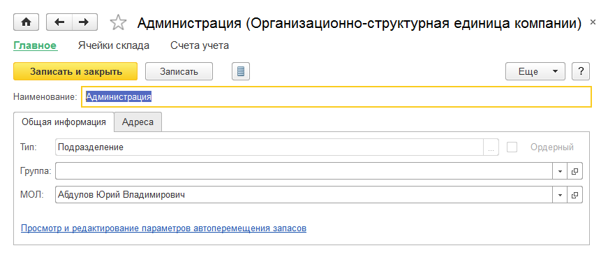

.. |C:UsersgpopovDocumentsТестЯзыковунф_1-5_manual_ru-v001_для_картинок_v2_170891170_resursyi_predpriyatiyaimage046.png| image:: media/image20.png
   :width: 3.9375in
   :height: 1.42708in
.. |C:UsersgpopovDocumentsТестЯзыковунф_1-5_manual_ru-v001_для_картинок_v2_2808238750_razdel_nastroek__prodazhi_image048.png| image:: media/image21.png
   :width: 3.9375in
   :height: 4.15625in
.. |C:UsersgpopovDocumentsТестЯзыковунф_1-5_manual_ru-v001_для_картинок_v2_3179623413_kassyi_kkmimage050.png| image:: media/image22.png
   :width: 3.9375in
   :height: 1.42708in

.. |C:UsersgpopovDocumentsТестЯзыковунф_1-5_manual_ru-v001_для_картинок_v2_3421438739_skladyiimage056.png| image:: media/image25.png
   :width: 3.9375in
   :height: 1.39583in
.. |C:UsersgpopovDocumentsТестЯзыковунф_1-5_manual_ru-v001_для_картинок_v2_3421438739_skladyiimage058.png| image:: media/image26.png
   :width: 3.9375in
   :height: 2.10417in
.. |C:UsersgpopovDocumentsТестЯзыковунф_1-5_manual_ru-v001_для_картинок_v2_3421438739_skladyiimage060.png| image:: media/image27.png
   :width: 3.9375in
   :height: 2.5in
.. |C:UsersgpopovDocumentsТестЯзыковунф_1-5_manual_ru-v001_для_картинок_v2_3421438739_skladyiimage062.png| image:: media/image28.png
   :width: 3.9375in
   :height: 1.40625in
.. |C:UsersgpopovDocumentsТестЯзыковунф_1-5_manual_ru-v001_для_картинок_v2_3421438739_sostoyaniya_zakazov_postavschikamimage064.png| image:: media/image29.png
   :width: 3.9375in
   :height: 1.44792in
.. |C:UsersgpopovDocumentsТестЯзыковунф_1-5_manual_ru-v001_для_картинок_v2_2808238750_razdel_nastroek__servis_image066.png| image:: media/image30.png
   :width: 3.9375in
   :height: 1.96875in

.. |C:UsersgpopovDocumentsТестЯзыковунф_1-5_manual_ru-v001_для_картинок_v2_1801298459_sostoyaniya_zakazov_na_proizvodstvoimage070.png| image:: media/image32.png
   :width: 3.9375in
   :height: 1.47917in
.. |C:UsersgpopovDocumentsТестЯзыковунф_1-5_manual_ru-v001_для_картинок_v2_2808238750_razdel_nastroek__dengi_image072.png| image:: media/image33.png
   :width: 3.9375in
   :height: 3.0625in

.. |C:UsersgpopovDocumentsТестЯзыковунф_1-5_manual_ru-v001_для_картинок_v2_2654660430_kassyiimage076.png| image:: media/image35.png
   :width: 3.79167in
   :height: 1.10417in

.. |C:UsersgpopovDocumentsТестЯзыковунф_1-5_manual_ru-v001_для_картинок_v2_3270027021_vidyi_dokumentov_fizicheskikh_litsimage084.png| image:: media/image39.png
   :width: 3.5625in
   :height: 4.08333in
.. |C:UsersgpopovDocumentsТестЯзыковунф_1-5_manual_ru-v001_для_картинок_v2_1558639461_kontragentyiimage086.png| image:: media/image40.png
   :width: 3.9375in
   :height: 3.35417in
.. |C:UsersgpopovDocumentsТестЯзыковунф_1-5_manual_ru-v001_для_картинок_v2_1558639461_kontragentyiimage088.png| image:: media/image41.png
   :width: 3.9375in
   :height: 2.71875in
.. |C:UsersgpopovDocumentsТестЯзыковунф_1-5_manual_ru-v001_для_картинок_v2_1558639461_kontragentyiimage092.png| image:: media/image42.png
   :width: 3.9375in
   :height: 4.82292in

.. |C:UsersgpopovDocumentsТестЯзыковунф_1-5_manual_ru-v001_для_картинок_v2_1558639461_kontaktnyie_litsa_kontragentovimage098.png| image:: media/image45.png
   :width: 3.9375in
   :height: 1.47917in
.. |C:UsersgpopovDocumentsТестЯзыковунф_1-5_manual_ru-v001_для_картинок_v2_1558639461_kontaktnyie_litsa_kontragentovimage100.png| image:: media/image46.png
   :width: 3.9375in
   :height: 2.44792in

.. |C:UsersgpopovDocumentsТестЯзыковунф_1-5_manual_ru-v001_для_картинок_v2_1558639461_kontaktnyie_litsa_kontragentovimage104.png| image:: media/image48.png
   :width: 3.9375in
   :height: 3.16667in

.. |C:UsersgpopovDocumentsТестЯзыковунф_1-5_manual_ru-v001_для_картинок_v2_1558639461_kontaktnyie_litsa_kontragentovimage108.png| image:: media/image50.png
   :width: 3.9375in
   :height: 3.16667in
.. |C:UsersgpopovDocumentsТестЯзыковунф_1-5_manual_ru-v001_для_картинок_v2_1558639461_otpravka_yelektronnyikh_pisemimage110.png| image:: media/image51.png
   :width: 3.9375in
   :height: 2.39583in

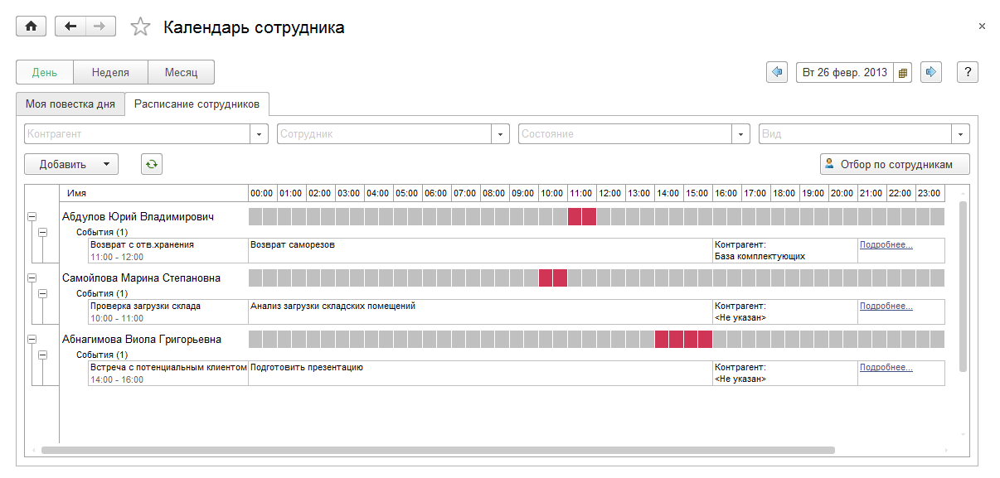
.. |C:UsersgpopovDocumentsТестЯзыковунф_1-5_manual_ru-v001_для_картинок_v2_1558639461_kalendar_sotrudnikaimage120.png| image:: media/image56.png
   :width: 3.9375in
   :height: 3.3125in

.. |C:UsersgpopovDocumentsТестЯзыковунф_1-5_manual_ru-v001_для_картинок_v2_2311648529_prays_list_kompaniiimage124.png| image:: media/image58.png
   :width: 4.05208in
   :height: 2.23958in
.. |C:UsersgpopovDocumentsТестЯзыковунф_1-5_manual_ru-v001_для_картинок_v2_2311648529_prays_list_kompaniiimage126.png| image:: media/image59.png
   :width: 3.16667in
   :height: 2.84375in
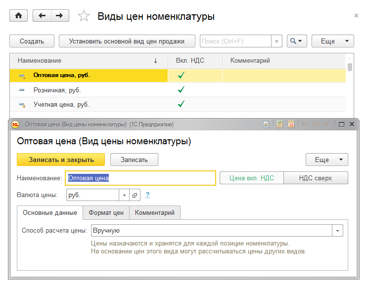
.. |C:UsersgpopovDocumentsТестЯзыковунф_1-5_manual_ru-v001_для_картинок_v2_2311648529_vidyi_tsenimage130.png| image:: media/image61.png
   :width: 3.9375in
   :height: 2.09375in
.. |C:UsersgpopovDocumentsТестЯзыковунф_1-5_manual_ru-v001_для_картинок_v2_2311648529_vidyi_tsenimage132.png| image:: media/image62.png
   :width: 3.67708in
   :height: 3.14583in
.. |C:UsersgpopovDocumentsТестЯзыковунф_1-5_manual_ru-v001_для_картинок_v2_2311648529_tsenovyie_gruppyiimage134.png| image:: media/image63.png
   :width: 3.9375in
   :height: 2.89583in
.. |C:UsersgpopovDocumentsТестЯзыковунф_1-5_manual_ru-v001_для_картинок_v2_2311648529_skidki_i_natsenkiimage136.png| image:: media/image64.png
   :width: 3.9375in
   :height: 2.52083in
.. |C:UsersgpopovDocumentsТестЯзыковунф_1-5_manual_ru-v001_для_картинок_v2_2311648529_ispolzovanie_vidov_tsen__skidok_i_natsenokimage138.png| image:: media/image65.png
   :width: 3.9375in
   :height: 2.64583in
.. |C:UsersgpopovDocumentsТестЯзыковунф_1-5_manual_ru-v001_для_картинок_v2_2311648529_ispolzovanie_vidov_tsen__skidok_i_natsenokimage140.png| image:: media/image66.png
   :width: 2.3125in
   :height: 2.22917in
.. |C:UsersgpopovDocumentsТестЯзыковунф_1-5_manual_ru-v001_для_картинок_v2_2311648529_formirovanie_tsenimage142.png| image:: media/image67.png
   :width: 3.9375in
   :height: 2.98958in

.. |C:UsersgpopovDocumentsТестЯзыковунф_1-5_manual_ru-v001_для_картинок_v2_1417697458_zakaz_pokupatelyaimage148.png| image:: media/image70.png
   :width: 2.3125in
   :height: 2.22917in
.. |C:UsersgpopovDocumentsТестЯзыковунф_1-5_manual_ru-v001_для_картинок_v2_1417697458_zakaz_pokupatelyaimage150.png| image:: media/image71.png
   :width: 3.9375in
   :height: 1.3125in

.. |C:UsersgpopovDocumentsТестЯзыковунф_1-5_manual_ru-v001_для_картинок_v2_1417697458_zakaz_pokupatelyaimage154.png| image:: media/image73.png
   :width: 3.9375in
   :height: 2.40625in

.. |C:UsersgpopovDocumentsТестЯзыковунф_1-5_manual_ru-v001_для_картинок_v2_1417697458_dogovor_s_pokupatelemimage158.png| image:: media/image75.png
   :width: 3.9375in
   :height: 1.33333in

.. |C:UsersgpopovDocumentsТестЯзыковунф_1-5_manual_ru-v001_для_картинок_v2_1417697458_scheta_na_oplatuimage166.png| image:: media/image79.png
   :width: 3.9375in
   :height: 3.04167in
.. |C:UsersgpopovDocumentsТестЯзыковунф_1-5_manual_ru-v001_для_картинок_v2_1417697458_rezervirovanie_zapasovimage168.png| image:: media/image80.png
   :width: 3.9375in
   :height: 2.20833in

.. |C:UsersgpopovDocumentsТестЯзыковунф_1-5_manual_ru-v001_для_картинок_v2_1417697458_raskhodnaya_nakladnayaimage172.png| image:: media/image82.png
   :width: 3.9375in
   :height: 1.32292in
.. |C:UsersgpopovDocumentsТестЯзыковунф_1-5_manual_ru-v001_для_картинок_v2_1417697458_raskhodnaya_nakladnayaimage174.png| image:: media/image83.png
   :width: 3.9375in
   :height: 2.375in

.. |C:UsersgpopovDocumentsТестЯзыковунф_1-5_manual_ru-v001_для_картинок_v2_1417697458_akt_vyipolnennyikh_rabotimage182.png| image:: media/image87.png
   :width: 3.9375in
   :height: 1.48958in
.. |C:UsersgpopovDocumentsТестЯзыковунф_1-5_manual_ru-v001_для_картинок_v2_3008668044_peredacha_tovarov_na_komissiyuimage184.png| image:: media/image88.png
   :width: 3.9375in
   :height: 2.40625in
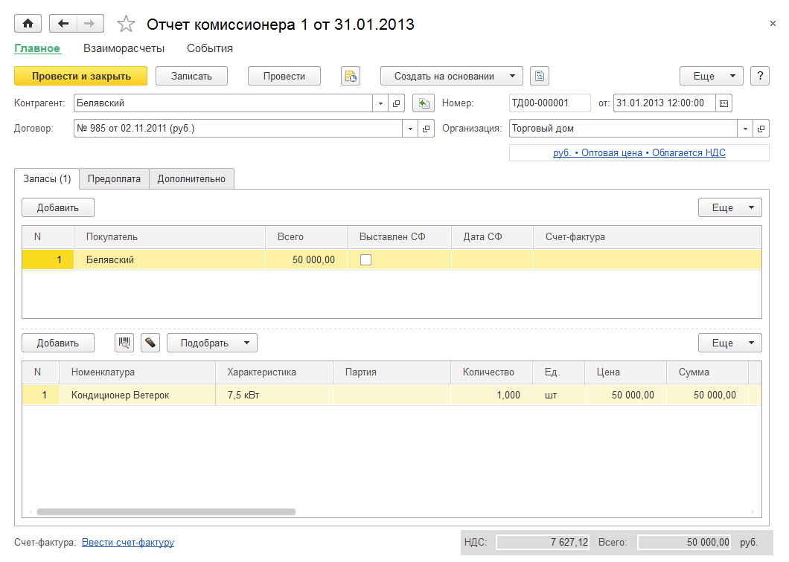

.. |C:UsersgpopovDocumentsТестЯзыковунф_1-5_manual_ru-v001_для_картинок_v2_3008668044_priem_tovarov_na_komissiyuimage190.png| image:: media/image91.png
   :width: 3.9375in
   :height: 2.40625in

.. |C:UsersgpopovDocumentsТестЯзыковунф_1-5_manual_ru-v001_для_картинок_v2_2072992492_peremeschenie_zapasov_v_roznichnuyu_tochkuimage195.png| image:: media/image93.png
   :width: 3.9375in
   :height: 2.39583in
.. |C:UsersgpopovDocumentsТестЯзыковунф_1-5_manual_ru-v001_для_картинок_v2_2072992492_peremeschenie_zapasov_v_roznichnuyu_tochkuimage197.png| image:: media/image94.png
   :width: 3.9375in
   :height: 2.39583in
.. |C:UsersgpopovDocumentsТестЯзыковунф_1-5_manual_ru-v001_для_картинок_v2_2072992492_peremeschenie_zapasov_v_roznichnuyu_tochkuimage199.png| image:: media/image95.png
   :width: 3.9375in
   :height: 2.20833in
.. |C:UsersgpopovDocumentsТестЯзыковунф_1-5_manual_ru-v001_для_картинок_v2_2072992492_peremeschenie_zapasov_v_roznichnuyu_tochkuimage201.png| image:: media/image96.png
   :width: 3.9375in
   :height: 2.375in
.. |C:UsersgpopovDocumentsТестЯзыковунф_1-5_manual_ru-v001_для_картинок_v2_2072992492_postuplenie_tovara_v_roznitsuimage203.png| image:: media/image97.png
   :width: 3.9375in
   :height: 2.80208in
.. |C:UsersgpopovDocumentsТестЯзыковунф_1-5_manual_ru-v001_для_картинок_v2_713584678_torgovaya_tochka_s_fiskalnyim_registratorom__podklyuchennyim_k_uchetnoy_sistemeimage205.png| image:: media/image98.png
   :width: 3.90625in
   :height: 1.94792in
.. |C:UsersgpopovDocumentsТестЯзыковунф_1-5_manual_ru-v001_для_картинок_v2_713584678_torgovaya_tochka_s_fiskalnyim_registratorom__podklyuchennyim_k_uchetnoy_sistemeimage207.png| image:: media/image99.png
   :width: 3.9375in
   :height: 1.44792in
.. |C:UsersgpopovDocumentsТестЯзыковунф_1-5_manual_ru-v001_для_картинок_v2_713584678_torgovaya_tochka_s_fiskalnyim_registratorom__podklyuchennyim_k_uchetnoy_sistemeimage209.png| image:: media/image100.png
   :width: 3.9375in
   :height: 2.60417in
.. |C:UsersgpopovDocumentsТестЯзыковунф_1-5_manual_ru-v001_для_картинок_v2_713584678_torgovaya_tochka_s_fiskalnyim_registratorom__podklyuchennyim_k_uchetnoy_sistemeimage211.png| image:: media/image101.png
   :width: 3.9375in
   :height: 1.94792in
.. |C:UsersgpopovDocumentsТестЯзыковунф_1-5_manual_ru-v001_для_картинок_v2_713584678_torgovaya_tochka_s_fiskalnyim_registratorom__podklyuchennyim_k_uchetnoy_sistemeimage213.png| image:: media/image102.png
   :width: 3.9375in
   :height: 2.19792in
.. |C:UsersgpopovDocumentsТестЯзыковунф_1-5_manual_ru-v001_для_картинок_v2_713584678_torgovaya_tochka_s_fiskalnyim_registratorom__podklyuchennyim_k_uchetnoy_sistemeimage215.png| image:: media/image103.png
   :width: 3.9375in
   :height: 2.39583in
.. |C:UsersgpopovDocumentsТестЯзыковунф_1-5_manual_ru-v001_для_картинок_v2_3502864441_uchet_v__tetradi_image217.png| image:: media/image104.png
   :width: 3.9375in
   :height: 2.53125in
.. |C:UsersgpopovDocumentsТестЯзыковунф_1-5_manual_ru-v001_для_картинок_v2_3502864441_uchet_s_periodicheskoy_inventarizatsieyimage219.png| image:: media/image105.png
   :width: 3.9375in
   :height: 2.53125in
.. |C:UsersgpopovDocumentsТестЯзыковунф_1-5_manual_ru-v001_для_картинок_v2_2072992492_torgovyie_tochki_s_summovyim_uchetomimage221.png| image:: media/image106.png
   :width: 3.9375in
   :height: 2.1875in
.. |C:UsersgpopovDocumentsТестЯзыковунф_1-5_manual_ru-v001_для_картинок_v2_2072992492_torgovyie_tochki_s_summovyim_uchetomimage223.png| image:: media/image107.png
   :width: 3.9375in
   :height: 2.33333in
.. |C:UsersgpopovDocumentsТестЯзыковунф_1-5_manual_ru-v001_для_картинок_v2_2072992492_torgovyie_tochki_s_summovyim_uchetomimage225.png| image:: media/image108.png
   :width: 3.9375in
   :height: 2.33333in
.. |C:UsersgpopovDocumentsТестЯзыковунф_1-5_manual_ru-v001_для_картинок_v2_2072992492_paneli_upravleniya_vneshnim_oborudovaniemimage227.png| image:: media/image109.png
   :width: 3.59375in
   :height: 1.75in
.. |C:UsersgpopovDocumentsТестЯзыковунф_1-5_manual_ru-v001_для_картинок_v2_2072992492_paneli_upravleniya_vneshnim_oborudovaniemimage229.png| image:: media/image110.png
   :width: 3.59375in
   :height: 0.95833in
.. |C:UsersgpopovDocumentsТестЯзыковунф_1-5_manual_ru-v001_для_картинок_v2_1558639461_otchetyi_razdela__prodazhi_image231.png| image:: media/image111.png
   :width: 3.9375in
   :height: 2.65625in
.. |C:UsersgpopovDocumentsТестЯзыковунф_1-5_manual_ru-v001_для_картинок_v2_1558639461_otchetyi_razdela__prodazhi_image233.png| image:: media/image112.png
   :width: 3.9375in
   :height: 3.17708in
.. |C:UsersgpopovDocumentsТестЯзыковунф_1-5_manual_ru-v001_для_картинок_v2_585350365_vyipolnenie_zakazov_pokupateleyimage235.png| image:: media/image113.png
   :width: 3.90625in
   :height: 2.83333in

.. |C:UsersgpopovDocumentsТестЯзыковунф_1-5_manual_ru-v001_для_картинок_v2_585350365_oplata_zakazov_pokupateleyimage239.png| image:: media/image115.png
   :width: 3.9375in
   :height: 2.86458in
.. |C:UsersgpopovDocumentsТестЯзыковунф_1-5_manual_ru-v001_для_картинок_v2_585350365_oplata_schetovimage241.png| image:: media/image116.png
   :width: 3.9375in
   :height: 2.23958in
.. |C:UsersgpopovDocumentsТестЯзыковунф_1-5_manual_ru-v001_для_картинок_v2_585350365_debitorskaya_zadolzhennost_po_srokamimage243.png| image:: media/image117.png
   :width: 3.9375in
   :height: 1.95833in
.. |C:UsersgpopovDocumentsТестЯзыковунф_1-5_manual_ru-v001_для_картинок_v2_585350365_otgruzka_i_oplata_po_zakazam_pokupateleyimage245.png| image:: media/image118.png
   :width: 3.9375in
   :height: 4.27083in

.. |C:UsersgpopovDocumentsТестЯзыковунф_1-5_manual_ru-v001_для_картинок_v2_585350365_vzaimoraschetyiimage249.png| image:: media/image120.png
   :width: 3.9375in
   :height: 3.375in
.. |C:UsersgpopovDocumentsТестЯзыковунф_1-5_manual_ru-v001_для_картинок_v2_585350365_denezhnyie_sredstva_v_kassakh_kkmimage251.png| image:: media/image121.png
   :width: 3.9375in
   :height: 1.85417in
.. |C:UsersgpopovDocumentsТестЯзыковунф_1-5_manual_ru-v001_для_картинок_v2_585350365_summovoy_uchet_v_roznichnoy_tochkeimage253.png| image:: media/image122.png
   :width: 3.9375in
   :height: 1.36458in

.. |C:UsersgpopovDocumentsТестЯзыковунф_1-5_manual_ru-v001_для_картинок_v2_3156616309_vvod_osnovnoy_informatsii_o_nomenklatureimage261.png| image:: media/image125.png
   :width: 3.9375in
   :height: 2.85417in
.. |C:UsersgpopovDocumentsТестЯзыковунф_1-5_manual_ru-v001_для_картинок_v2_268535395_zapasimage263.png| image:: media/image126.png
   :width: 3.9375in
   :height: 2.14583in

.. |C:UsersgpopovDocumentsТестЯзыковунф_1-5_manual_ru-v001_для_картинок_v2_268535395_uslugaimage267.png| image:: media/image128.png
   :width: 3.9375in
   :height: 2.10417in
.. |C:UsersgpopovDocumentsТестЯзыковунф_1-5_manual_ru-v001_для_картинок_v2_268535395_rabotaimage269.png| image:: media/image129.png
   :width: 3.9375in
   :height: 2.10417in
.. |C:UsersgpopovDocumentsТестЯзыковунф_1-5_manual_ru-v001_для_картинок_v2_268535395_operatsiyaimage271.png| image:: media/image130.png
   :width: 3.9375in
   :height: 2.10417in

.. |C:UsersgpopovDocumentsТестЯзыковунф_1-5_manual_ru-v001_для_картинок_v2_1022853550_klassifikator_edinits_izmereniyaimage275.png| image:: media/image132.png
   :width: 3.9375in
   :height: 1.875in

.. |image133| image:: media/image134.png
   :width: 6.5in
   :height: 2.98611in
.. |image134| image:: media/image135.png
   :width: 6.5in
   :height: 2.94583in

.. |image136| image:: media/image137.png
   :width: 6.49236in
   :height: 4.30764in
.. |image137| image:: media/image138.png
   :width: 6.49236in
   :height: 1.27708in
.. |image138| image:: media/image139.png
   :width: 6.5in
   :height: 1.31528in
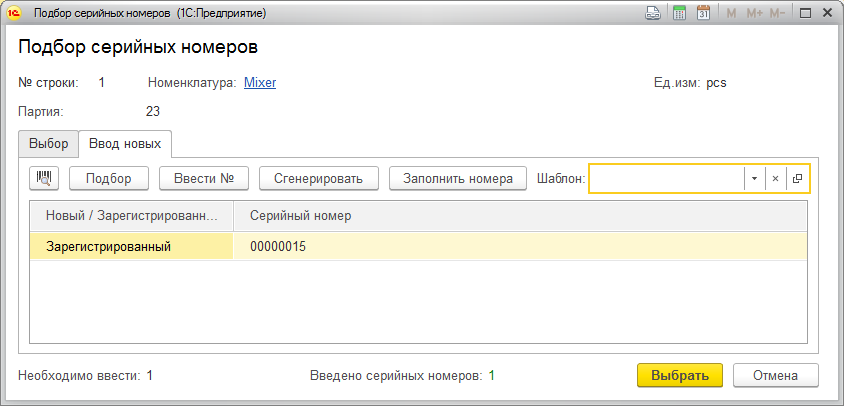
.. |image140| image:: media/image141.png
   :width: 6.49236in
   :height: 3.61528in

.. |image142| image:: media/image143.png
   :width: 0.87708in
   :height: 0.3in
.. |https://its.1c.ru/db/content/updinfo/src/smallbusiness/1.6.6/41.png?_=1496991668| image:: media/image144.png
   :width: 0.87708in
   :height: 0.29236in
.. |image144| image:: media/image145.png
   :width: 0.96944in
   :height: 0.29236in

.. |image146| image:: media/image147.png
   :width: 1.28472in
   :height: 0.28472in
.. |https://its.1c.ru/db/content/updinfo/src/smallbusiness/1.6.6/43.png?_=1496991668| image:: media/image148.png
   :width: 1.36181in
   :height: 0.35417in

.. |image150| image:: media/image151.png
   :width: 6.49236in
   :height: 5.4in
.. |image151| image:: media/image152.png
   :width: 6.5in
   :height: 5.47708in
.. |image152| image:: media/image153.png
   :width: 6.5in
   :height: 2.90764in
.. |image153| image:: media/image154.png
   :width: 6.49236in
   :height: 3.06944in
.. |image154| image:: media/image155.png
   :width: 6.5in
   :height: 3.09236in
.. |image155| image:: media/image156.png
   :width: 6.5in
   :height: 3.37708in

.. |C:UsersgpopovDocumentsТестЯзыковунф_1-5_manual_ru-v001_для_картинок_v2_1022853550_zakaz_postavschikuimage283.png| image:: media/image159.png
   :width: 3.9375in
   :height: 1.61458in

.. |C:UsersgpopovDocumentsТестЯзыковунф_1-5_manual_ru-v001_для_картинок_v2_1022853550_postuplenie_tovarovimage289.png| image:: media/image162.png
   :width: 3.9375in
   :height: 3.07292in
.. |C:UsersgpopovDocumentsТестЯзыковунф_1-5_manual_ru-v001_для_картинок_v2_1022853550_postuplenie_tovarovimage291.png| image:: media/image163.png
   :width: 3.9375in
   :height: 1.57292in

.. |C:UsersgpopovDocumentsТестЯзыковунф_1-5_manual_ru-v001_для_картинок_v2_56874444_peremeschenie_po_yacheykamimage299.png| image:: media/image167.png
   :width: 3.9375in
   :height: 2.42708in

.. |C:UsersgpopovDocumentsТестЯзыковунф_1-5_manual_ru-v001_для_картинок_v2_1022853550_dopolnitelnyie_raskhodyiimage303.png| image:: media/image169.png
   :width: 3.9375in
   :height: 2.84375in

.. |C:UsersgpopovDocumentsТестЯзыковунф_1-5_manual_ru-v001_для_картинок_v2_1022853550_izlishki_i_nedostachiimage307.png| image:: media/image171.png
   :width: 3.9375in
   :height: 1.625in
.. |C:UsersgpopovDocumentsТестЯзыковунф_1-5_manual_ru-v001_для_картинок_v2_297758461_inventarizatsiya_zapasovimage309.png| image:: media/image172.png
   :width: 3.9375in
   :height: 2.84375in

.. |C:UsersgpopovDocumentsТестЯзыковунф_1-5_manual_ru-v001_для_картинок_v2_1022853550_peredacha_v_pererabotku_i_na_otvetstvennoe_khranenieimage319.png| image:: media/image177.png
   :width: 3.9375in
   :height: 2.66667in
.. |C:UsersgpopovDocumentsТестЯзыковунф_1-5_manual_ru-v001_для_картинок_v2_1022853550_peredacha_v_pererabotku_i_na_otvetstvennoe_khranenieimage321.png| image:: media/image178.png
   :width: 3.9375in
   :height: 1.39583in
.. |C:UsersgpopovDocumentsТестЯзыковунф_1-5_manual_ru-v001_для_картинок_v2_1022853550_peredacha_v_pererabotku_i_na_otvetstvennoe_khranenieimage323.png| image:: media/image179.png
   :width: 3.9375in
   :height: 1.39583in
.. |C:UsersgpopovDocumentsТестЯзыковунф_1-5_manual_ru-v001_для_картинок_v2_1022853550_realizatsiya_tovarov_s_ordernogo_skladaimage325.png| image:: media/image180.png
   :width: 3.9375in
   :height: 2.38542in
.. |C:UsersgpopovDocumentsТестЯзыковунф_1-5_manual_ru-v001_для_картинок_v2_57109892_zachet_predoplatyiimage327.png| image:: media/image181.png
   :width: 3.9375in
   :height: 1.21875in

.. |C:UsersgpopovDocumentsТестЯзыковунф_1-5_manual_ru-v001_для_картинок_v2_57109892_raskhodnyiy_orderimage331.png| image:: media/image183.png
   :width: 3.9375in
   :height: 1.96875in
.. |C:UsersgpopovDocumentsТестЯзыковунф_1-5_manual_ru-v001_для_картинок_v2_1022853550_postuplenie_tovarov_na_ordernyiy_skladimage333.png| image:: media/image184.png
   :width: 3.9375in
   :height: 2.63542in

.. |C:UsersgpopovDocumentsТестЯзыковунф_1-5_manual_ru-v001_для_картинок_v2_1022853550_raschet_potrebnostey_v_zapasakhimage337.png| image:: media/image186.png
   :width: 3.9375in
   :height: 2.11458in

.. |C:UsersgpopovDocumentsТестЯзыковунф_1-5_manual_ru-v001_для_картинок_v2_1022853550_raschet_potrebnostey_v_zapasakhimage343.png| image:: media/image189.png
   :width: 0.27083in
   :height: 0.125in

.. |C:UsersgpopovDocumentsТестЯзыковунф_1-5_manual_ru-v001_для_картинок_v2_1022853550_otchetyi_razdela__zakupki_image349.png| image:: media/image192.png
   :width: 3.9375in
   :height: 3.51042in
.. |C:UsersgpopovDocumentsТестЯзыковунф_1-5_manual_ru-v001_для_картинок_v2_3010645395_potrebnost_v_zapasakhimage351.png| image:: media/image193.png
   :width: 3.9375in
   :height: 2.84375in
.. |C:UsersgpopovDocumentsТестЯзыковунф_1-5_manual_ru-v001_для_картинок_v2_3010645395_grafik_dvizheniya_zapasovimage353.png| image:: media/image194.png
   :width: 3.9375in
   :height: 2.84375in

.. |C:UsersgpopovDocumentsТестЯзыковунф_1-5_manual_ru-v001_для_картинок_v2_3010645395_oborachivaemost_zapasovimage357.png| image:: media/image196.png
   :width: 3.9375in
   :height: 3.55208in
.. |C:UsersgpopovDocumentsТестЯзыковунф_1-5_manual_ru-v001_для_картинок_v2_3010645395_kreditorskaya_zadolzhennost_po_srokamimage359.png| image:: media/image197.png
   :width: 3.9375in
   :height: 1.71875in
.. |C:UsersgpopovDocumentsТестЯзыковунф_1-5_manual_ru-v001_для_картинок_v2_3010645395_zakazyi_postavschikamimage361.png| image:: media/image198.png
   :width: 3.9375in
   :height: 3.3125in

.. |C:UsersgpopovDocumentsТестЯзыковунф_1-5_manual_ru-v001_для_картинок_v2_3010645395_zakupkiimage369.png| image:: media/image202.png
   :width: 3.66667in
   :height: 4.8125in
.. |C:UsersgpopovDocumentsТестЯзыковунф_1-5_manual_ru-v001_для_картинок_v2_3010645395_raschetyi_s_postavschikamiimage371.png| image:: media/image203.png
   :width: 4.25in
   :height: 1.5625in
.. |C:UsersgpopovDocumentsТестЯзыковунф_1-5_manual_ru-v001_для_картинок_v2_3010645395_zapasyiimage373.png| image:: media/image204.png
   :width: 3.9375in
   :height: 3.53125in
.. |C:UsersgpopovDocumentsТестЯзыковунф_1-5_manual_ru-v001_для_картинок_v2_3010645395_zapasyiimage375.png| image:: media/image205.png
   :width: 3.9375in
   :height: 4.75in

.. |C:UsersgpopovDocumentsТестЯзыковунф_1-5_manual_ru-v001_для_картинок_v2_3010645395_zapasyi_v_razreze_gtdimage379.png| image:: media/image207.png
   :width: 3.9375in
   :height: 2.1875in

.. |C:UsersgpopovDocumentsТестЯзыковунф_1-5_manual_ru-v001_для_картинок_v2_3010645395_zapasyi_peredannyieimage385.png| image:: media/image210.png
   :width: 3.9375in
   :height: 1.97917in
.. |C:UsersgpopovDocumentsТестЯзыковунф_1-5_manual_ru-v001_для_картинок_v2_3010645395_ostatki_po_skladuimage387.png| image:: media/image211.png
   :width: 4.21875in
   :height: 2.39583in

.. |C:UsersgpopovDocumentsТестЯзыковунф_1-5_manual_ru-v001_для_картинок_v2_4046111054_zakaz_naryadimage395.png| image:: media/image215.png
   :width: 3.9375in
   :height: 2.82292in
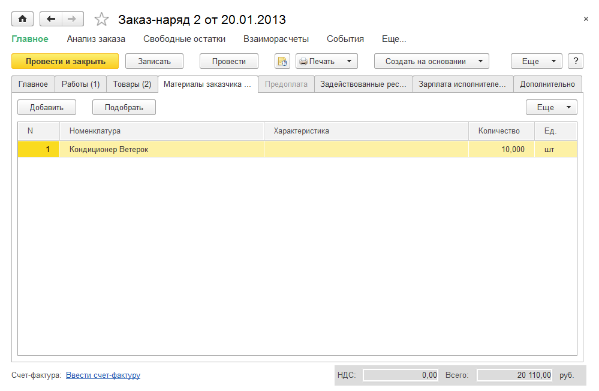
.. |C:UsersgpopovDocumentsТестЯзыковунф_1-5_manual_ru-v001_для_картинок_v2_4046111054_resursyi_predpriyatiyaimage399.png| image:: media/image217.png
   :width: 3.9375in
   :height: 1.84375in

.. |C:UsersgpopovDocumentsТестЯзыковунф_1-5_manual_ru-v001_для_картинок_v2_4046111054_plan_grafik_rabot__uslugimage403.png| image:: media/image219.png
   :width: 3.94792in
   :height: 1.58333in
.. |C:UsersgpopovDocumentsТестЯзыковунф_1-5_manual_ru-v001_для_картинок_v2_4046111054_zagruzka_resursov_predpriyatiyaimage405.png| image:: media/image220.png
   :width: 4.25in
   :height: 2.97917in
.. |C:UsersgpopovDocumentsТестЯзыковунф_1-5_manual_ru-v001_для_картинок_v2_4046111054_planirovanie_rabot_s_ispolzovaniem_zakazovimage407.png| image:: media/image221.png
   :width: 3.9375in
   :height: 2.48958in
.. |C:UsersgpopovDocumentsТестЯзыковунф_1-5_manual_ru-v001_для_картинок_v2_4046111054_planirovanie_rabot_s_ispolzovaniem_zakazovimage409.png| image:: media/image222.png
   :width: 3.9375in
   :height: 2.51042in

.. |C:UsersgpopovDocumentsТестЯзыковунф_1-5_manual_ru-v001_для_картинок_v2_2267718557_zadaniya_na_rabotuimage413.png| image:: media/image224.png
   :width: 3.9375in
   :height: 2.0625in

.. |C:UsersgpopovDocumentsТестЯзыковунф_1-5_manual_ru-v001_для_картинок_v2_2267718557_oplata_zakazovimage417.png| image:: media/image226.png
   :width: 3.9375in
   :height: 2.80208in
.. |C:UsersgpopovDocumentsТестЯзыковунф_1-5_manual_ru-v001_для_картинок_v2_2267718557_otchet_zakazchikuimage419.png| image:: media/image227.png
   :width: 3.9375in
   :height: 2.875in

.. |C:UsersgpopovDocumentsТестЯзыковунф_1-5_manual_ru-v001_для_картинок_v2_2731615108_sostav_produktsii_i_tekhnologiya_ee_vyipuskaimage423.png| image:: media/image229.png
   :width: 3.9375in
   :height: 1.63542in
.. |C:UsersgpopovDocumentsТестЯзыковунф_1-5_manual_ru-v001_для_картинок_v2_2731615108_sostav_produktsii_i_tekhnologiya_ee_vyipuskaimage425.png| image:: media/image230.png
   :width: 3.9375in
   :height: 1.71875in
.. |C:UsersgpopovDocumentsТестЯзыковунф_1-5_manual_ru-v001_для_картинок_v2_2731615108_sostav_produktsii_i_tekhnologiya_ee_vyipuskaimage427.png| image:: media/image231.png
   :width: 3.9375in
   :height: 1.92708in

.. |C:UsersgpopovDocumentsТестЯзыковунф_1-5_manual_ru-v001_для_картинок_v2_2485438006_resursyi_predpriyatiyaimage433.png| image:: media/image233.png
   :width: 4.26042in
   :height: 1.6875in

.. |C:UsersgpopovDocumentsТестЯзыковунф_1-5_manual_ru-v001_для_картинок_v2_2485438006_plan_grafik_proizvodstvaimage437.png| image:: media/image235.png
   :width: 4.33333in
   :height: 2.4375in

.. |C:UsersgpopovDocumentsТестЯзыковунф_1-5_manual_ru-v001_для_картинок_v2_2485438006_planirovanie_proizvodstva_s_ispolzovaniem_zakazovimage441.png| image:: media/image237.png
   :width: 4.33333in
   :height: 2.57292in

.. |C:UsersgpopovDocumentsТестЯзыковунф_1-5_manual_ru-v001_для_картинок_v2_2118895435_sdelnyiy_naryad_na_vyipolnennyie_rabotyiimage445.png| image:: media/image239.png
   :width: 4.33333in
   :height: 2.40625in
.. |C:UsersgpopovDocumentsТестЯзыковунф_1-5_manual_ru-v001_для_картинок_v2_2118895435_sdelnyiy_naryad_na_vyipolnennyie_rabotyiimage447.png| image:: media/image240.png
   :width: 4.27083in
   :height: 1.66667in

.. |C:UsersgpopovDocumentsТестЯзыковунф_1-5_manual_ru-v001_для_картинок_v2_3479701569_vnutrennee_zadanieimage451.png| image:: media/image242.png
   :width: 4.33333in
   :height: 2.59375in

.. |C:UsersgpopovDocumentsТестЯзыковунф_1-5_manual_ru-v001_для_картинок_v2_2731615108_uchet_vyipuska_produktsiiimage455.png| image:: media/image244.png
   :width: 4.33333in
   :height: 2.83333in

.. |C:UsersgpopovDocumentsТестЯзыковунф_1-5_manual_ru-v001_для_картинок_v2_2731615108_uchet_vyipuska_produktsiiimage457.png| image:: media/image246.png
   :width: 4.33333in
   :height: 2.83333in
.. |C:UsersgpopovDocumentsТестЯзыковунф_1-5_manual_ru-v001_для_картинок_v2_617281922__prostaya__skhema_otrazheniya_vyipuska_produktsiiimage459.png| image:: media/image247.png
   :width: 4.33333in
   :height: 2.83333in
.. |C:UsersgpopovDocumentsТестЯзыковунф_1-5_manual_ru-v001_для_картинок_v2_617281922__prostaya__skhema_otrazheniya_vyipuska_produktsiiimage461.png| image:: media/image248.png
   :width: 4.33333in
   :height: 2.76042in
.. |C:UsersgpopovDocumentsТестЯзыковунф_1-5_manual_ru-v001_для_картинок_v2_3780443897_zakladka__produktsiya_image463.png| image:: media/image249.png
   :width: 4.33333in
   :height: 2.70833in

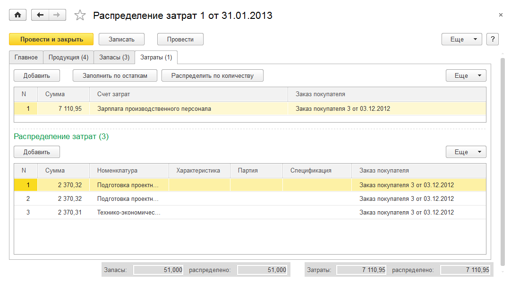

.. |C:UsersgpopovDocumentsТестЯзыковунф_1-5_manual_ru-v001_для_картинок_v2_2731615108_otchetyi_razdela__proizvodstvo_image475.png| image:: media/image255.png
   :width: 4.33333in
   :height: 3.14583in
.. |C:UsersgpopovDocumentsТестЯзыковунф_1-5_manual_ru-v001_для_картинок_v2_3647657549_vyipolnenie_rabot__vyipusk_produktsiiimage477.png| image:: media/image256.png
   :width: 4.33333in
   :height: 4.09375in
.. |C:UsersgpopovDocumentsТестЯзыковунф_1-5_manual_ru-v001_для_картинок_v2_3647657549_zakazyi_na_proizvodstvoimage479.png| image:: media/image257.png
   :width: 4.33333in
   :height: 3.33333in

.. |C:UsersgpopovDocumentsТестЯзыковунф_1-5_manual_ru-v001_для_картинок_v2_3647657549_sdelnyie_naryadyiimage485.png| image:: media/image260.png
   :width: 4.33333in
   :height: 2.32292in
.. |C:UsersgpopovDocumentsТестЯзыковунф_1-5_manual_ru-v001_для_картинок_v2_dengiimage487.png| image:: media/image261.png
   :width: 4.33333in
   :height: 2.95833in
.. |C:UsersgpopovDocumentsТестЯзыковунф_1-5_manual_ru-v001_для_картинок_v2_2527283824_valyutyiimage489.png| image:: media/image262.png
   :width: 4.33333in
   :height: 1.30208in
.. |C:UsersgpopovDocumentsТестЯзыковунф_1-5_manual_ru-v001_для_картинок_v2_2527283824_valyutyiimage491.png| image:: media/image263.png
   :width: 4.22917in
   :height: 2.85417in

.. |C:UsersgpopovDocumentsТестЯзыковунф_1-5_manual_ru-v001_для_картинок_v2_2527283824_stati_dvizheniya_denezhnyikh_sredstvimage499.png| image:: media/image266.png
   :width: 4.25in
   :height: 3.21875in
.. |C:UsersgpopovDocumentsТестЯзыковунф_1-5_manual_ru-v001_для_картинок_v2_1434331145_ot_pokupatelyaimage501.png| image:: media/image267.png
   :width: 4.33333in
   :height: 2.53125in

.. |C:UsersgpopovDocumentsТестЯзыковунф_1-5_manual_ru-v001_для_картинок_v2_1434331145_procheeimage505.png| image:: media/image269.png
   :width: 4.33333in
   :height: 2.65625in
.. |C:UsersgpopovDocumentsТестЯзыковунф_1-5_manual_ru-v001_для_картинок_v2_762700623_postavschikuimage507.png| image:: media/image270.png
   :width: 4.33333in
   :height: 2.90625in
.. |C:UsersgpopovDocumentsТестЯзыковунф_1-5_manual_ru-v001_для_картинок_v2_762700623_postavschikuimage509.png| image:: media/image271.png
   :width: 4.33333in
   :height: 2.44792in

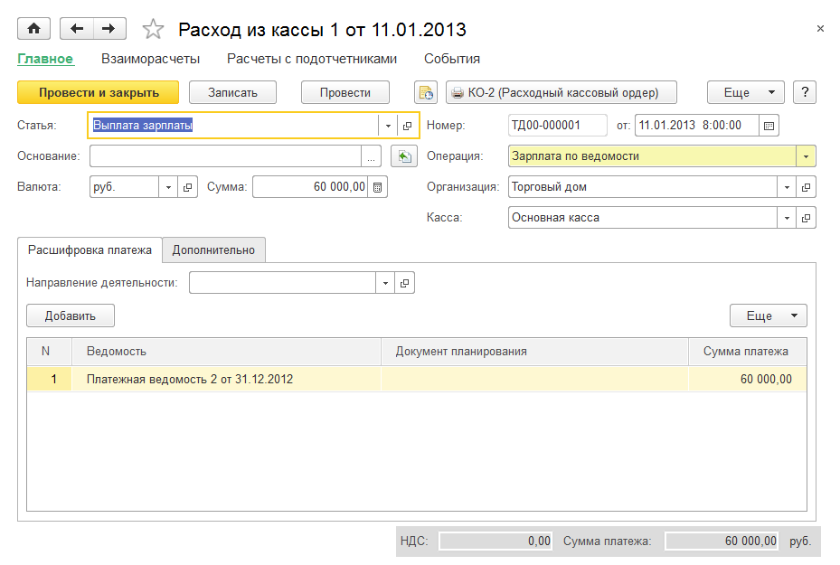

.. |C:UsersgpopovDocumentsТестЯзыковунф_1-5_manual_ru-v001_для_картинок_v2_2527283824_peremeschenie_denezhnyikh_sredstvimage521.png| image:: media/image277.png
   :width: 4.33333in
   :height: 2.09375in
.. |C:UsersgpopovDocumentsТестЯзыковунф_1-5_manual_ru-v001_для_картинок_v2_4143743452_postuplenie_na_schetimage523.png| image:: media/image278.png
   :width: 4.33333in
   :height: 2.98958in
.. |C:UsersgpopovDocumentsТестЯзыковунф_1-5_manual_ru-v001_для_картинок_v2_4143743452_raskhod_so_schetaimage529.png| image:: media/image279.png
   :width: 4.33333in
   :height: 2.8125in

.. |C:UsersgpopovDocumentsТестЯзыковунф_1-5_manual_ru-v001_для_картинок_v2_4143743452_avansovyiy_otchetimage533.png| image:: media/image281.png
   :width: 4.33333in
   :height: 2.05208in
.. |C:UsersgpopovDocumentsТестЯзыковунф_1-5_manual_ru-v001_для_картинок_v2_4143743452_avansovyiy_otchetimage535.png| image:: media/image282.png
   :width: 4.33333in
   :height: 2.54167in

.. |C:UsersgpopovDocumentsТестЯзыковунф_1-5_manual_ru-v001_для_картинок_v2_3651895756_postuplenie_deneg__plan_image541.png| image:: media/image285.png
   :width: 4.33333in
   :height: 2.38542in

.. |C:UsersgpopovDocumentsТестЯзыковунф_1-5_manual_ru-v001_для_картинок_v2_3651895756_dokumentyi_planirovaniya_denegimage545.png| image:: media/image287.png
   :width: 4.33333in
   :height: 2.38542in
.. |C:UsersgpopovDocumentsТестЯзыковунф_1-5_manual_ru-v001_для_картинок_v2_2527283824_otchetyi_razdela__dengi_image547.png| image:: media/image288.png
   :width: 3.95833in
   :height: 3.76042in

.. |C:UsersgpopovDocumentsТестЯзыковунф_1-5_manual_ru-v001_для_картинок_v2_402781231_vidyi_nachisleniy_i_uderzhaniyimage557.png| image:: media/image293.png
   :width: 3.88542in
   :height: 1.89583in

.. |C:UsersgpopovDocumentsТестЯзыковунф_1-5_manual_ru-v001_для_картинок_v2_402781231_vidyi_nachisleniy_i_uderzhaniyimage561.png| image:: media/image295.png
   :width: 3.10417in
   :height: 2.44792in
.. |C:UsersgpopovDocumentsТестЯзыковунф_1-5_manual_ru-v001_для_картинок_v2_402781231_shtatnoe_raspisanieimage563.png| image:: media/image296.png
   :width: 4.33333in
   :height: 3.04167in
.. |C:UsersgpopovDocumentsТестЯзыковунф_1-5_manual_ru-v001_для_картинок_v2_402781231_shtatnoe_raspisanieimage565.png| image:: media/image297.png
   :width: 4.19792in
   :height: 4.27083in

.. |C:UsersgpopovDocumentsТестЯзыковунф_1-5_manual_ru-v001_для_картинок_v2_2002997309_priem_na_rabotuimage569.png| image:: media/image299.png
   :width: 4.33333in
   :height: 2.20833in

.. |C:UsersgpopovDocumentsТестЯзыковунф_1-5_manual_ru-v001_для_картинок_v2_402781231_raschet_i_nachislenie_zarabotnoy_platyiimage577.png| image:: media/image303.png
   :width: 3.44792in
   :height: 3.02083in

.. |C:UsersgpopovDocumentsТестЯзыковунф_1-5_manual_ru-v001_для_картинок_v2_331584693_parametryi_raschetovimage585.png| image:: media/image307.png
   :width: 4.33333in
   :height: 1.25in

.. |C:UsersgpopovDocumentsТестЯзыковунф_1-5_manual_ru-v001_для_картинок_v2_331584693_parametryi_raschetovimage589.png| image:: media/image309.png
   :width: 4.33333in
   :height: 1.40625in

.. |C:UsersgpopovDocumentsТестЯзыковунф_1-5_manual_ru-v001_для_картинок_v2_402781231_otchetyi_razdela__zarplata_image595.png| image:: media/image312.png
   :width: 4.33333in
   :height: 1.94792in
.. |C:UsersgpopovDocumentsТестЯзыковунф_1-5_manual_ru-v001_для_картинок_v2_3022240991_spisok_sotrudnikovimage597.png| image:: media/image313.png
   :width: 4.33333in
   :height: 3.76042in

.. |C:UsersgpopovDocumentsТестЯзыковунф_1-5_manual_ru-v001_для_картинок_v2_3022240991_otrabotannoe_vremyaimage603.png| image:: media/image316.png
   :width: 4.33333in
   :height: 3.75in

.. |C:UsersgpopovDocumentsТестЯзыковунф_1-5_manual_ru-v001_для_картинок_v2_3139127642_neposredstvennyiy_vvod_provodokimage609.png| image:: media/image319.png
   :width: 4.33333in
   :height: 3.21875in
.. |C:UsersgpopovDocumentsТестЯзыковунф_1-5_manual_ru-v001_для_картинок_v2_3139127642_plan_schetovimage611.png| image:: media/image320.png
   :width: 4.33333in
   :height: 3.75in
.. |C:UsersgpopovDocumentsТестЯзыковунф_1-5_manual_ru-v001_для_картинок_v2_3139127642_dokument__sverka_vzaimoraschetov_image613.png| image:: media/image321.png
   :width: 4.33333in
   :height: 3.10417in

.. |C:UsersgpopovDocumentsТестЯзыковунф_1-5_manual_ru-v001_для_картинок_v2_3139127642_prochie_zatratyi__raskhodyi_image617.png| image:: media/image323.png
   :width: 4.33333in
   :height: 2.5625in
.. |C:UsersgpopovDocumentsТестЯзыковунф_1-5_manual_ru-v001_для_картинок_v2_3139127642_uchet_nalogovimage619.png| image:: media/image324.png
   :width: 4.33333in
   :height: 2.5625in
.. |C:UsersgpopovDocumentsТестЯзыковунф_1-5_manual_ru-v001_для_картинок_v2_3139127642_uchet_nalogovimage621.png| image:: media/image325.png
   :width: 4.25in
   :height: 2.20833in

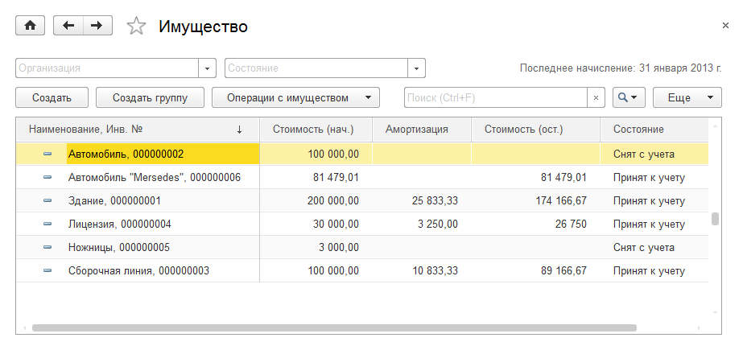
.. |C:UsersgpopovDocumentsТестЯзыковунф_1-5_manual_ru-v001_для_картинок_v2_4112364289_svedeniya_ob_imuschestveimage629.png| image:: media/image329.png
   :width: 4.33333in
   :height: 2.02083in

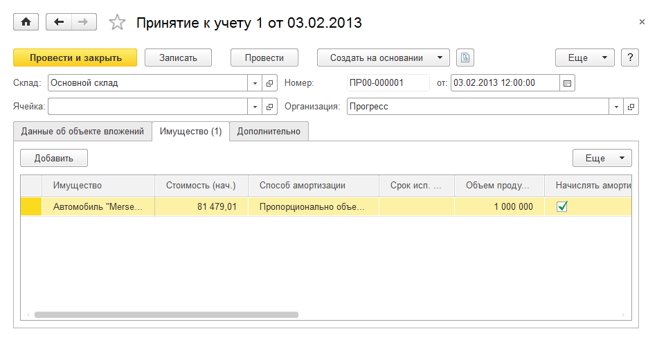
.. |C:UsersgpopovDocumentsТестЯзыковунф_1-5_manual_ru-v001_для_картинок_v2_4112364289_izmenenie_parametrovimage639.png| image:: media/image334.png
   :width: 4.33333in
   :height: 2.21875in

.. |C:UsersgpopovDocumentsТестЯзыковунф_1-5_manual_ru-v001_для_картинок_v2_4112364289_amortizatsiyaimage643.png| image:: media/image336.png
   :width: 4.33333in
   :height: 2.07292in
.. |C:UsersgpopovDocumentsТестЯзыковунф_1-5_manual_ru-v001_для_картинок_v2_4184338358_prodazha_imuschestvaimage645.png| image:: media/image337.png
   :width: 4.33333in
   :height: 2.66667in

.. |C:UsersgpopovDocumentsТестЯзыковунф_1-5_manual_ru-v001_для_картинок_v2_4241701554_nachalnyie_ostatkiimage649.png| image:: media/image339.png
   :width: 4.33333in
   :height: 4.21875in
.. |C:UsersgpopovDocumentsТестЯзыковунф_1-5_manual_ru-v001_для_картинок_v2_4241701554_zatratyiimage651.png| image:: media/image340.png
   :width: 4.33333in
   :height: 2.47917in

.. |C:UsersgpopovDocumentsТестЯзыковунф_1-5_manual_ru-v001_для_картинок_v2_943187146_neraspredelennyie_zatratyiimage661.png| image:: media/image345.png
   :width: 4.20833in
   :height: 5.29167in
.. |C:UsersgpopovDocumentsТестЯзыковунф_1-5_manual_ru-v001_для_картинок_v2_943187146_neraspredelennyie_zatratyiimage663.png| image:: media/image346.png
   :width: 4.04167in
   :height: 2.60417in
.. |C:UsersgpopovDocumentsТестЯзыковунф_1-5_manual_ru-v001_для_картинок_v2_943187146_oborotno_saldovaya_vedomostimage665.png| image:: media/image347.png
   :width: 4.33333in
   :height: 4.10417in
.. |C:UsersgpopovDocumentsТестЯзыковунф_1-5_manual_ru-v001_для_картинок_v2_943187146_vyirabotka_imuschestvaimage667.png| image:: media/image348.png
   :width: 3.76042in
   :height: 2.15625in

.. |C:UsersgpopovDocumentsТестЯзыковунф_1-5_manual_ru-v001_для_картинок_v2_1839274723_kreditoryiimage671.png| image:: media/image350.png
   :width: 4.33333in
   :height: 3.76042in
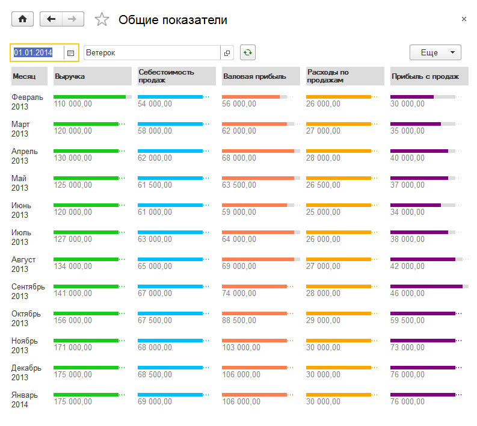

.. |C:UsersgpopovDocumentsТестЯзыковунф_1-5_manual_ru-v001_для_картинок_v2_1143992319_dinamika_zadolzhennosti_i_debitoryi_s_prosrochkoyimage677.png| image:: media/image353.png
   :width: 4.33333in
   :height: 4.33333in
.. |C:UsersgpopovDocumentsТестЯзыковунф_1-5_manual_ru-v001_для_картинок_v2_2140434732_dinamika_zadolzhennosti_i_kreditoryi_s_prosrochkoyimage679.png| image:: media/image354.png
   :width: 4.33333in
   :height: 4.33333in

.. |C:UsersgpopovDocumentsТестЯзыковунф_1-5_manual_ru-v001_для_картинок_v2_2808776488_plan_faktnyiy_analiz_prodazhimage683.png| image:: media/image356.png
   :width: 4.33333in
   :height: 2.52083in
.. |C:UsersgpopovDocumentsТестЯзыковунф_1-5_manual_ru-v001_для_картинок_v2_2808776488_sebestoimostimage685.png| image:: media/image357.png
   :width: 3.9375in
   :height: 3.21875in
.. |C:UsersgpopovDocumentsТестЯзыковунф_1-5_manual_ru-v001_для_картинок_v2_2808776488_prodazhiimage687.png| image:: media/image358.png
   :width: 4.14583in
   :height: 3.86458in

.. |C:UsersgpopovDocumentsТестЯзыковунф_1-5_manual_ru-v001_для_картинок_v2_2808776488_balansimage693.png| image:: media/image361.png
   :width: 3.9375in
   :height: 3.52083in
.. |C:UsersgpopovDocumentsТестЯзыковунф_1-5_manual_ru-v001_для_картинок_v2_2808776488_finansovyiy_rezultatimage695.png| image:: media/image362.png
   :width: 4.33333in
   :height: 3.33333in
.. |C:UsersgpopovDocumentsТестЯзыковунф_1-5_manual_ru-v001_для_картинок_v2_2808776488_finansovyiy_rezultat__prognoz_image697.png| image:: media/image363.png
   :width: 4.27083in
   :height: 2.83333in

.. |C:UsersgpopovDocumentsТестЯзыковунф_1-5_manual_ru-v001_для_картинок_v2_2808776488_pribyili_i_ubyitkiimage701.png| image:: media/image365.png
   :width: 4.33333in
   :height: 3.28125in
.. |C:UsersgpopovDocumentsТестЯзыковунф_1-5_manual_ru-v001_для_картинок_v2_2808776488_dvizhenie_denezhnyikh_sredstvimage703.png| image:: media/image366.png
   :width: 3.9375in
   :height: 3.58333in
.. |C:UsersgpopovDocumentsТестЯзыковунф_1-5_manual_ru-v001_для_картинок_v2_2808776488_dokhodyi_i_raskhodyi_kassovyim_metodomimage705.png| image:: media/image367.png
   :width: 4.30208in
   :height: 3.38542in

.. |C:UsersgpopovDocumentsТестЯзыковунф_1-5_manual_ru-v001_для_картинок_v2_2808776488_byudzhet_dvizheniya_denezhnyikh_sredstvimage709.png| image:: media/image369.png
   :width: 4.33333in
   :height: 3.9375in
.. |C:UsersgpopovDocumentsТестЯзыковунф_1-5_manual_ru-v001_для_картинок_v2_2808776488_byudzhet_dvizheniya_denezhnyikh_sredstvimage711.png| image:: media/image370.png
   :width: 4.33333in
   :height: 4.15625in

.. |C:UsersgpopovDocumentsТестЯзыковунф_1-5_manual_ru-v001_для_картинок_v2_2808776488_byudzhet_pribyiley_i_ubyitkovimage715.png| image:: media/image372.png
   :width: 4.33333in
   :height: 2.33333in
.. |C:UsersgpopovDocumentsТестЯзыковунф_1-5_manual_ru-v001_для_картинок_v2_2808776488_prognoznyiy_balansimage717.png| image:: media/image373.png
   :width: 4.33333in
   :height: 4.64583in

.. |C:UsersgpopovDocumentsТестЯзыковунф_1-5_manual_ru-v001_для_картинок_v2_3751951237_prosmotr_spiska_aktivnyikh_polzovateleyimage721.png| image:: media/image375.png
   :width: 3.17708in
   :height: 1.94792in
.. |C:UsersgpopovDocumentsТестЯзыковунф_1-5_manual_ru-v001_для_картинок_v2_3751951237_blokirovka_rabotyi_polzovateleyimage723.png| image:: media/image376.png
   :width: 3.05208in
   :height: 1.79167in

.. |C:UsersgpopovDocumentsТестЯзыковунф_1-5_manual_ru-v001_для_картинок_v2_3751951237_ustanovka_datyi_zapreta_izmeneniy_v_razreze_polzovateleyimage731.png| image:: media/image379.png
   :width: 3.39583in
   :height: 1.47917in
.. |C:UsersgpopovDocumentsТестЯзыковунф_1-5_manual_ru-v001_для_картинок_v2_3751951237_ustanovka_datyi_zapreta_izmeneniy_v_razreze_polzovateleyimage733.png| image:: media/image380.png
   :width: 3.40625in
   :height: 2.1875in
.. |C:UsersgpopovDocumentsТестЯзыковунф_1-5_manual_ru-v001_для_картинок_v2_3751951237_ustanovka_datyi_zapreta_izmeneniy_v_razreze_polzovateleyimage735.png| image:: media/image381.png
   :width: 3.40625in
   :height: 3.54167in
.. |C:UsersgpopovDocumentsТестЯзыковунф_1-5_manual_ru-v001_для_картинок_v2_3751951237_sposobyi_ukazaniya_datyi_zapreta_izmeneniyimage737.png| image:: media/image382.png
   :width: 3.40625in
   :height: 4.09375in
.. |C:UsersgpopovDocumentsТестЯзыковунф_1-5_manual_ru-v001_для_картинок_v2_3751951237_nastroyka_avtomaticheskogo_rezervnogo_kopirovaniyaimage739.png| image:: media/image383.png
   :width: 3.46875in
   :height: 2.47917in
.. |C:UsersgpopovDocumentsТестЯзыковунф_1-5_manual_ru-v001_для_картинок_v2_826652919_vidyi_kontaktnoy_informatsiiimage741.png| image:: media/image384.png
   :width: 3.40625in
   :height: 4.83333in

.. |C:UsersgpopovDocumentsТестЯзыковунф_1-5_manual_ru-v001_для_картинок_v2_826652919_dopolnitelnyie_rekvizityi_i_svedeniyaimage745.png| image:: media/image386.png
   :width: 4.33333in
   :height: 3.95833in
.. |C:UsersgpopovDocumentsТестЯзыковунф_1-5_manual_ru-v001_для_картинок_v2_826652919_primer_naznacheniya_i_ispolzovaniya_dopolnitelnyikh_rekvizitov_i_svedeniyimage747.png| image:: media/image387.png
   :width: 4.33333in
   :height: 3.28125in
.. |C:UsersgpopovDocumentsТестЯзыковунф_1-5_manual_ru-v001_для_картинок_v2_826652919_primer_naznacheniya_i_ispolzovaniya_dopolnitelnyikh_rekvizitov_i_svedeniyimage749.png| image:: media/image388.png
   :width: 4.33333in
   :height: 2.86458in
.. |C:UsersgpopovDocumentsТестЯзыковунф_1-5_manual_ru-v001_для_картинок_v2_826652919_primer_naznacheniya_i_ispolzovaniya_dopolnitelnyikh_rekvizitov_i_svedeniyimage751.png| image:: media/image389.png
   :width: 4.33333in
   :height: 1.90625in
.. |C:UsersgpopovDocumentsТестЯзыковунф_1-5_manual_ru-v001_для_картинок_v2_826652919_primer_naznacheniya_i_ispolzovaniya_dopolnitelnyikh_rekvizitov_i_svedeniyimage753.png| image:: media/image390.png
   :width: 4.33333in
   :height: 2.94792in
.. |C:UsersgpopovDocumentsТестЯзыковунф_1-5_manual_ru-v001_для_картинок_v2_2285745015_registratsiya_polzovatelyaimage755.png| image:: media/image391.png
   :width: 4.33333in
   :height: 4.01042in

.. |C:UsersgpopovDocumentsТестЯзыковунф_1-5_manual_ru-v001_для_картинок_v2_2285745015_pravaimage759.png| image:: media/image393.png
   :width: 4.33333in
   :height: 4.41667in
.. |C:UsersgpopovDocumentsТестЯзыковунф_1-5_manual_ru-v001_для_картинок_v2_2285745015_ogranichenie_dostupa_po_gruppam_kontragentovimage761.png| image:: media/image394.png
   :width: 4.33333in
   :height: 2.94792in
.. |C:UsersgpopovDocumentsТестЯзыковунф_1-5_manual_ru-v001_для_картинок_v2_2285745015_ogranichenie_dostupa_po_gruppam_kontragentovimage763.png| image:: media/image395.png
   :width: 4.33333in
   :height: 2.94792in
.. |C:UsersgpopovDocumentsТестЯзыковунф_1-5_manual_ru-v001_для_картинок_v2_2285745015_ogranichenie_dostupa_po_gruppam_kontragentovimage765.png| image:: media/image396.png
   :width: 4.33333in
   :height: 3.10417in
.. |C:UsersgpopovDocumentsТестЯзыковунф_1-5_manual_ru-v001_для_картинок_v2_2285745015_ogranichenie_dostupa_po_gruppam_kontragentovimage767.png| image:: media/image397.png
   :width: 4.32292in
   :height: 4.0625in
.. |C:UsersgpopovDocumentsТестЯзыковунф_1-5_manual_ru-v001_для_картинок_v2_2285745015_ogranichenie_dostupa_k_kassamimage769.png| image:: media/image398.png
   :width: 4.32292in
   :height: 3.63542in
.. |C:UsersgpopovDocumentsТестЯзыковунф_1-5_manual_ru-v001_для_картинок_v2_2285745015_nastroyki_polzovatelyaimage771.png| image:: media/image399.png
   :width: 4.33333in
   :height: 3.48958in
.. |C:UsersgpopovDocumentsТестЯзыковунф_1-5_manual_ru-v001_для_картинок_v2_3686875335_reglamentnyie_i_fonovyie_zadaniyaimage774.png| image:: media/image400.png
   :width: 4.33333in
   :height: 3.14583in

.. |C:UsersgpopovDocumentsТестЯзыковунф_1-5_manual_ru-v001_для_картинок_v2_3686875335_poisk_i_udalenie_dubleyimage778.png| image:: media/image402.png
   :width: 4.33333in
   :height: 2.67708in
.. |C:UsersgpopovDocumentsТестЯзыковунф_1-5_manual_ru-v001_для_картинок_v2_2057013087_nastroyki_sinkhronizatsii_dannyikhimage780.png| image:: media/image403.png
   :width: 4.33333in
   :height: 2.97917in

.. |C:UsersgpopovDocumentsТестЯзыковунф_1-5_manual_ru-v001_для_картинок_v2_3111027094_nastroyka_obmena_s_saytomimage784.png| image:: media/image405.png
   :width: 4.33333in
   :height: 3.20833in
.. |C:UsersgpopovDocumentsТестЯзыковунф_1-5_manual_ru-v001_для_картинок_v2_3111027094_nastroyka_obmena_s_saytomimage786.png| image:: media/image406.png
   :width: 4.33333in
   :height: 3.5in

.. |C:UsersgpopovDocumentsТестЯзыковунф_1-5_manual_ru-v001_для_картинок_v2_519374254_personalnyie_nastroykiimage798.png| image:: media/image411.png
   :width: 4.33333in
   :height: 2.94792in
.. |C:UsersgpopovDocumentsТестЯзыковунф_1-5_manual_ru-v001_для_картинок_v2_519374254_personalnyie_nastroykiimage800.png| image:: media/image412.png
   :width: 4.13542in
   :height: 4.02083in

.. |C:UsersgpopovDocumentsТестЯзыковунф_1-5_manual_ru-v001_для_картинок_v2_1594988825_interfeys_rabotyi_s_faylamiimage804.png| image:: media/image414.png
   :width: 4.33333in
   :height: 1.42708in
.. |C:UsersgpopovDocumentsТестЯзыковунф_1-5_manual_ru-v001_для_картинок_v2_3335415884_interfeys_programmyiimage806.png| image:: media/image415.png
   :width: 4.33333in
   :height: 2.88542in
.. |C:UsersgpopovDocumentsТестЯзыковунф_1-5_manual_ru-v001_для_картинок_v2_307726112_konstruirovanie_rabochego_prostranstvaimage808.png| image:: media/image416.png
   :width: 0.10417in
   :height: 0.125in
.. |C:UsersgpopovDocumentsТестЯзыковунф_1-5_manual_ru-v001_для_картинок_v2_307726112_konstruirovanie_rabochego_prostranstvaimage810.png| image:: media/image417.png
   :width: 3.46875in
   :height: 2.44792in
.. |C:UsersgpopovDocumentsТестЯзыковунф_1-5_manual_ru-v001_для_картинок_v2_307726112_nachalnaya_stranitsaimage812.png| image:: media/image418.png
   :width: 4.25in
   :height: 2.75in
.. |C:UsersgpopovDocumentsТестЯзыковунф_1-5_manual_ru-v001_для_картинок_v2_307726112_nachalnaya_stranitsaimage814.png| image:: media/image419.png
   :width: 4.33333in
   :height: 2.8125in

.. |C:UsersgpopovDocumentsТестЯзыковунф_1-5_manual_ru-v001_для_картинок_v2_307726112_nastroyka_otobrazheniya_paneleyimage818.png| image:: media/image421.png
   :width: 3.08333in
   :height: 1.26042in

.. |C:UsersgpopovDocumentsТестЯзыковунф_1-5_manual_ru-v001_для_картинок_v2_307726112_oblast_sistemnyikh_komand_osnovnogo_i_vspomogatelnogo_oknaimage822.png| image:: media/image423.png
   :height: 0.11458in
.. |C:UsersgpopovDocumentsТестЯзыковунф_1-5_manual_ru-v001_для_картинок_v2_307726112_oblast_sistemnyikh_komand_osnovnogo_i_vspomogatelnogo_oknaimage824.png| image:: media/image424.png
   :width: 3.14583in
   :height: 2.32292in

.. |C:UsersgpopovDocumentsТестЯзыковунф_1-5_manual_ru-v001_для_картинок_v2_307726112_sistemnyie_parametryiimage828.png| image:: media/image426.png
   :width: 2.66667in
   :height: 3.01042in
.. |C:UsersgpopovDocumentsТестЯзыковунф_1-5_manual_ru-v001_для_картинок_v2_1665602234_registratsiya_novogo_klientaimage830.png| image:: media/image427.png
   :width: 4.33333in
   :height: 3.02083in
.. |C:UsersgpopovDocumentsТестЯзыковунф_1-5_manual_ru-v001_для_картинок_v2_1665602234_registratsiya_zakaza_pokupatelya_i_dogovoraimage832.png| image:: media/image428.png
   :width: 4.33333in
   :height: 2.66667in
.. |C:UsersgpopovDocumentsТестЯзыковунф_1-5_manual_ru-v001_для_картинок_v2_1665602234_registratsiya_zakaza_pokupatelya_i_dogovoraimage834.png| image:: media/image429.png
   :width: 4.33333in
   :height: 2.17708in
.. |C:UsersgpopovDocumentsТестЯзыковунф_1-5_manual_ru-v001_для_картинок_v2_1665602234_registratsiya_vyipuska_konditsioneraimage836.png| image:: media/image430.png
   :width: 4.33333in
   :height: 3.32292in
.. |C:UsersgpopovDocumentsТестЯзыковунф_1-5_manual_ru-v001_для_картинок_v2_1665602234_registratsiya_vyipuska_konditsioneraimage838.png| image:: media/image431.png
   :width: 4.33333in
   :height: 3.05208in
.. |C:UsersgpopovDocumentsТестЯзыковунф_1-5_manual_ru-v001_для_картинок_v2_1665602234_registratsiya_vyipuska_konditsioneraimage841.png| image:: media/image432.png
   :width: 4.33333in
   :height: 2.53125in

.. |C:UsersgpopovDocumentsТестЯзыковунф_1-5_manual_ru-v001_для_картинок_v2_1665602234_registratsiya_vyipolneniya_montazhaimage845.png| image:: media/image434.png
   :width: 4.33333in
   :height: 2.59375in
.. |C:UsersgpopovDocumentsТестЯзыковунф_1-5_manual_ru-v001_для_картинок_v2_1665602234_registratsiya_vyipolneniya_montazhaimage847.png| image:: media/image435.png
   :width: 4.33333in
   :height: 2.88542in
.. |C:UsersgpopovDocumentsТестЯзыковунф_1-5_manual_ru-v001_для_картинок_v2_1665602234_poluchenie_oplatyiimage849.png| image:: media/image436.png
   :width: 4.33333in
   :height: 2.88542in

.. |image437| image:: media/image438.png
   :width: 4.04722in
   :height: 1.88542in
.. |image438| image:: media/image439.png
   :width: 3.59225in
   :height: 1.14215in
.. |image439| image:: media/image440.png
   :width: 3.6566in
   :height: 1.0282in
.. |image440| image:: media/image441.png
   :width: 1.92188in
   :height: 1.23149in
.. |image441| image:: media/image442.png
   :width: 3.60406in
   :height: 1.848in
.. |image442| image:: media/image443.png
   :width: 3.69695in
   :height: 1.88174in

.. |image445| image:: media/image446.png
   :width: 0.30417in
   :height: 0.31181in

.. |image448| image:: media/image449.png
   :width: 4in
   :height: 2.5in
.. |image449| image:: media/image450.png
   :width: 4.05208in
   :height: 2.26944in
.. |image450| image:: media/image446.png
   :width: 0.30417in
   :height: 0.31181in

.. |image452| image:: media/image452.png
   :width: 4.05208in
   :height: 1.93056in
.. |image453| image:: media/image453.png
   :width: 4.05208in
   :height: 1.74792in

.. |image461| image:: media/image461.png
   :width: 4.04792in
   :height: 2.16806in
